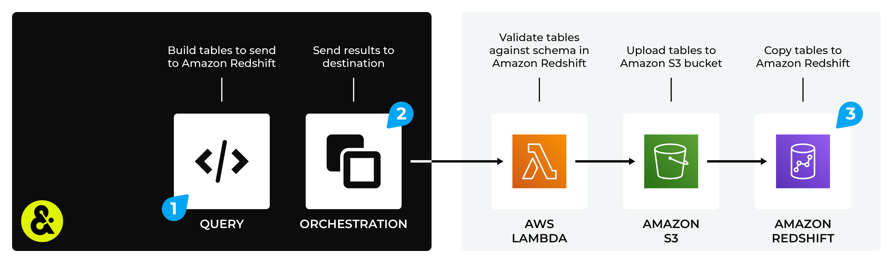

.. 
.. https://docs.amperity.com/amp360/
.. 

.. |destination-name| replace:: Amazon Redshift
.. |what-send| replace:: table rows that match a table schema
.. |lambda-validate| replace:: validates that rows match the table schema

.. meta::
    :description lang=en:
        Use orchestrations to send query results from Amperity to Amazon Redshift.

.. meta::
    :content class=swiftype name=body data-type=text:
        Use orchestrations to send query results from Amperity to Amazon Redshift.

.. meta::
    :content class=swiftype name=title data-type=string:
        Send query results to Amazon Redshift

==================================================
Send query results to Amazon Redshift
==================================================

.. destination-amazon-redshift-howitworks-start

You can send data from Amperity to |destination-name|. First build a query that outputs a table with rows that match the schema of a table in |destination-name|. Then use an orchestration to send that data from Amperity to |destination-name|.

   .. note:: A Lambda function running in AWS Lambda validates that rows in your table output match the table schema in |destination-name|. Only validated rows are copied to your table in |destination-name|.

.. destination-amazon-redshift-howitworks-end

.. sendto-amazon-redshift-steps-to-send-start

.. include:: ../../shared/destinations.rst
   :start-after: .. destinations-overview-list-intro-start
   :end-before: .. destinations-overview-list-intro-end

#. :ref:`Build a query <sendto-amazon-redshift-build-query>`
#. :ref:`Add orchestration <sendto-amazon-redshift-add-orchestration>`
#. :ref:`Run orchestration <sendto-amazon-redshift-run-orchestration>`

.. sendto-amazon-redshift-steps-to-send-end

.. include:: ../../shared/sendtos.rst
   :start-after: .. sendtos-ask-to-configure-webhook-start
   :end-before: .. sendtos-ask-to-configure-webhook-end

.. _sendto-amazon-redshift-build-query:

Build query
==================================================

.. sendto-amazon-redshift-build-query-start

Build a query that returns rows that match the schema of a table in |destination-name|. For example, to send customer addresses for use with a downstream direct mail campaign use a query similar to:

.. code-block:: sql

   SELECT
     amperity_id AS amperity_id
     ,given_name AS given_name
     ,surname AS surname
     ,generational_suffix AS suffix
     ,address AS address
     ,address2 AS address_line_2
     ,city AS city
     ,CASE
       WHEN LENGTH(state) = 2
       THEN state
       ELSE NULL
     END AS state
     ,postal AS postal
   FROM Merged_Customers

.. sendto-amazon-redshift-build-query-end

.. include:: ../../shared/sendtos.rst
   :start-after: .. sendtos-build-query-webhook-lambda-note-start
   :end-before: .. sendtos-build-query-webhook-lambda-note-end

.. _sendto-amazon-redshift-add-orchestration:

Add orchestration
==================================================

.. include:: ../../shared/terms.rst
   :start-after: .. term-orchestration-start
   :end-before: .. term-orchestration-end

**To add an orchestration**

.. include:: ../../shared/sendtos.rst
   :start-after: .. sendtos-add-orchestration-generic-start
   :end-before: .. sendtos-add-orchestration-generic-end

.. _sendto-amazon-redshift-run-orchestration:

Run orchestration
==================================================

.. include:: ../../shared/sendtos.rst
   :start-after: .. sendtos-run-orchestration-start
   :end-before: .. sendtos-run-orchestration-end

**To run the orchestration**

.. include:: ../../shared/sendtos.rst
   :start-after: .. sendtos-run-orchestration-steps-start
   :end-before: .. sendtos-run-orchestration-steps-end
