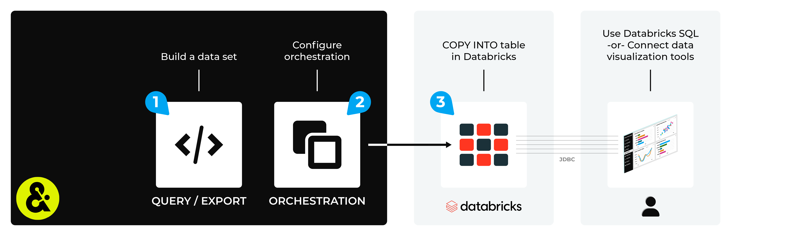

.. 
.. https://docs.amperity.com/amp360/
.. 

.. |destination-name| replace:: Databricks
.. |what-send| replace::  the results of a query or the database export

.. meta::
    :description lang=en:
        Use orchestrations to send query results from Amperity to Databricks.

.. meta::
    :content class=swiftype name=body data-type=text:
        Use orchestrations to send query results from Amperity to Databricks.

.. meta::
    :content class=swiftype name=title data-type=string:
        Send query results to Databricks

==================================================
Send query results to Databricks
==================================================

.. sendto-databricks-about-start

Amperity can send |what-send| to |destination-name|. The |what-send| is uploaded to |destination-name| using a COPY INTO command, after which the |what-send| is added into your |destination-name| data warehouse.

.. sendto-databricks-about-end

.. sendto-databricks-steps-to-send-start

.. include:: ../../shared/destinations.rst
   :start-after: .. destinations-overview-list-intro-start
   :end-before: .. destinations-overview-list-intro-end

#. :ref:`Build a query <sendto-databricks-build-query>`
#. :ref:`Add orchestration <sendto-databricks-add-orchestration>`
#. :ref:`Run orchestration <sendto-databricks-run-orchestration>`
#. :ref:`Access tables in Databricks <sendto-databricks-access-tables>`

.. sendto-databricks-steps-to-send-end

.. include:: ../../shared/sendtos.rst
   :start-after: .. sendtos-ask-to-configure-start
   :end-before: .. sendtos-ask-to-configure-end

.. _sendto-databricks-build-query:

Build query or database export
==================================================

.. sendto-databricks-build-query-start

You will need to build a query that outputs the data that you want to make available in |destination-name| or configure a database export that has one (or more) tables.

|destination-name| does not have specific schema requirements, other than requiring that the data sent from Amperity matches the schema that is defined in |destination-name|.

.. sendto-databricks-build-query-end

.. sendto-databricks-build-query-match-start

Amperity will create the table in |destination-name| if it does not exist.

When a table does exist, Amperity will verify the schema in |destination-name|, compare that to the schema in the NDJSON file that was sent from Amperity to cloud storage, and then will run a COPY INTO operation for columns that have matching column names **and** matching data types. Columns that do not match exactly will be ignored.

.. sendto-databricks-build-query-match-end

.. sendto-databricks-build-query-data-types-start

Amperity maps to the following data types in |destination-name|:

.. list-table::
   :widths: 300 300
   :header-rows: 1

   * - Amperity data type
     - Databricks data type
   * - Boolean
     - BOOLEAN
   * - Date
     - DATE
   * - Datetime
     - TIMESTAMP
   * - Decimal
     - DECIMAL(38,3)
   * - Float
     - FLOAT
   * - Integer
     - INT
   * - String
     - STRING

.. sendto-databricks-build-query-data-types-end

.. _sendto-databricks-add-orchestration:

Add orchestration
==================================================

.. include:: ../../shared/terms.rst
   :start-after: .. term-orchestration-start
   :end-before: .. term-orchestration-end

**To add an orchestration**

.. include:: ../../shared/sendtos.rst
   :start-after: .. sendtos-add-orchestration-generic-start
   :end-before: .. sendtos-add-orchestration-generic-end

.. _sendto-databricks-run-orchestration:

Run orchestration
==================================================

.. include:: ../../shared/sendtos.rst
   :start-after: .. sendtos-run-orchestration-start
   :end-before: .. sendtos-run-orchestration-end

**To run the orchestration**

.. include:: ../../shared/sendtos.rst
   :start-after: .. sendtos-run-orchestration-steps-start
   :end-before: .. sendtos-run-orchestration-steps-end

.. _sendto-databricks-access-tables:

Access tables
==================================================

.. sendto-databricks-access-tables-start

After your data has been loaded to |destination-name|, you can access it and use it for with your workflows and use cases. For example:

#. Use |ext_databricks_sql_reference| to run ad-hoc queries and create dashboards on data stored in your table from within |destination-name|.
#. Use a JDBC connection to access this data from external data visualization tools, such as Tableau, Domo, and Looker.

.. sendto-databricks-access-tables-end
