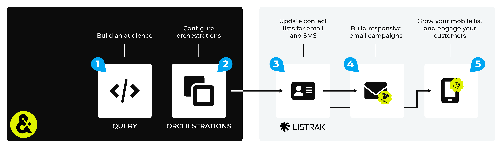

.. https://docs.amperity.com/amp360/

.. |destination-name| replace:: Listrak
.. |what-send| replace:: email address
.. |credential-typex| replace:: **listrak**
.. |credential-detailsx| replace:: the Listrak client ID and secret

.. meta::
    :description lang=en:
        Use orchestrations to send query results from Amperity to Listrak.

.. meta::
    :content class=swiftype name=body data-type=text:
        Use orchestrations to send query results from Amperity to Listrak.

.. meta::
    :content class=swiftype name=title data-type=string:
        Send query results to Listrak

==================================================
Send query results to Listrak
==================================================

.. sendto-listrak-start

You can build queries that return |what-send|, along with returning additional profile attributes, and then use orchestrations to send those results to |destination-name|.

.. sendto-listrak-end

.. include:: ../../amperity_datagrid/source/destination_listrak.rst
   :start-after: .. destination-listrak-howitworks-note-start
   :end-before: .. destination-listrak-howitworks-note-end

.. sendto-listrak-steps-to-send-start

.. include:: ../../shared/destinations.rst
   :start-after: .. destinations-overview-list-intro-start
   :end-before: .. destinations-overview-list-intro-end

#. :ref:`Build a query <sendto-listrak-build-query>`
#. :ref:`Add orchestration <sendto-listrak-add-orchestration>`
#. :ref:`Run orchestration <sendto-listrak-run-orchestration>`

.. sendto-listrak-steps-to-send-end

.. include:: ../../shared/sendtos.rst
   :start-after: .. sendtos-ask-to-configure-start
   :end-before: .. sendtos-ask-to-configure-end

.. _sendto-listrak-build-query:

Build query
==================================================

.. include:: ../../shared/sendtos.rst
   :start-after: .. sendtos-build-query-email-only-start
   :end-before: .. sendtos-build-query-email-only-end

.. sendto-listrak-build-query-start

.. tip:: |destination-name| requires an email address; you may include additional customer profile attributes, including the non-required email address.

.. sendto-listrak-build-query-end

.. _sendto-listrak-add-orchestration:

Add orchestration
==================================================

.. include:: ../../shared/terms.rst
   :start-after: .. term-orchestration-start
   :end-before: .. term-orchestration-end

**To add an orchestration**

.. include:: ../../shared/sendtos.rst
   :start-after: .. sendtos-add-orchestration-generic-start
   :end-before: .. sendtos-add-orchestration-generic-end

.. _sendto-listrak-run-orchestration:

Run orchestration
==================================================

.. include:: ../../shared/sendtos.rst
   :start-after: .. sendtos-run-orchestration-start
   :end-before: .. sendtos-run-orchestration-end

**To run the orchestration**

.. include:: ../../shared/sendtos.rst
   :start-after: .. sendtos-run-orchestration-steps-start
   :end-before: .. sendtos-run-orchestration-steps-end
