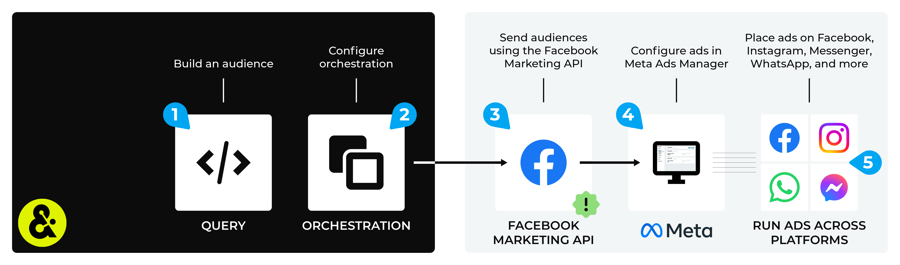

.. https://docs.amperity.com/amp360/

.. |destination-name| replace:: Meta Ads Manager
.. |what-send| replace:: customer data
.. |allow-for-what| replace:: audiences
.. |allow-for-duration| replace:: up to 24 hours

.. meta::
    :description lang=en:
        Use orchestrations to send custom audiences and offline events from Amperity to Meta Ads Manager.

.. meta::
    :content class=swiftype name=body data-type=text:
        Use orchestrations to send custom audiences and offline events from Amperity to Meta Ads Manager.

.. meta::
    :content class=swiftype name=title data-type=string:
        Send query results to Meta Ads Manager

==================================================
Send query results to Meta Ads Manager
==================================================

.. sendto-meta-ads-manager-howitworks-start

You can use queries and orchestrations to build custom audiences in |destination-name|. Send customer information, such as email addresses, phone numbers, names, birthdates, gender, city, state, postal code, and mobile advertising IDs, from Amperity to find customer matches.

Use |destination_meta_ads_manager_custom_audiences| in |destination-name| to advertise to customers on Facebook, Instagram, and Messenger, along with using the Meta Audience Network to extend your advertising beyond Facebook and reach new audiences on apps and mobile devices, such as WhatsApp.

You may configure Amperity to send |destination_meta_ads_manager_offline_events| to |destination-name|. Offline events should be a set of transaction events that occurred within the previous 7 days. Offline events sent to |destination-name| using the |ext_facebook_conversions_api_offline_events| are matched with audiences in Facebook, Facebook Messenger, Instagram, and WhatsApp and ca help your brand track offline conversions for your marketing campaigns.

.. sendto-meta-ads-manager-howitworks-end

.. sendto-meta-ads-manager-howitworks-callouts-start

A |destination-name| destination works like this:

#. :ref:`Build a custom audience using a query <sendto-meta-ads-manager-build-query>`
#. :ref:`Add orchestration <sendto-meta-ads-manager-add-orchestration>`
#. :ref:`Run orchestration <sendto-meta-ads-manager-run-orchestration>`

   .. important::

      .. include:: ../../amperity_datagrid/source/destination_meta_ads_manager.rst
         :start-after: .. destination-meta-ads-manager-terms-of-service-start
         :end-before: .. destination-meta-ads-manager-terms-of-service-end

      |destination-name| uses OAuth to grant access to Amperity. You will need to reauthorize OAuth if the token expires or is removed.

   .. note::

      .. include:: ../../shared/destinations.rst
         :start-after: .. destinations-add-destinations-intro-allow-for-start
         :end-before: .. destinations-add-destinations-intro-allow-for-end

#. Build ads in Meta Ads Manager.

   .. admonition:: What is Meta Ads Manager?

      .. include:: ../../amperity_datagrid/source/destination_meta_ads_manager.rst
         :start-after: .. destination-meta-ads-manager-meta-ads-manager-start
         :end-before: .. destination-meta-ads-manager-meta-ads-manager-end

#. Place ads on Facebook, Instagram, and Messenger; use Audience Network to extend advertising beyond Facebook to reach audiences on apps and mobile devices, such as WhatsApp.

.. sendto-meta-ads-manager-howitworks-callouts-end

.. _sendto-meta-ads-manager-build-query:

Build audience
==================================================

.. sendto-meta-ads-manager-build-query-start

You will need to build an audience using a query that shapes the data so that fields in the output are mapped to the :ref:`Facebook Marketing API keys <destination-meta-ads-manager-api-keys>`.

.. sendto-meta-ads-manager-build-query-end

.. sendto-meta-ads-manager-build-query-tip-start

Data mapping for Meta Ads Manager is only required one time. You can do this in the following ways:

#. Add :ref:`a Facebook table <sendto-meta-ads-manager-build-query-use-table>` to the customer 360 database that selects PII fields in the **Customer 360** table, and then outputs them to a table with columns that map to the |destination-name| naming patterns.
#. Add :ref:`a SQL query <sendto-meta-ads-manager-build-query-use-query>` that does the filtering within the query, and then outputs results that do not require a data template.

The correct approach here depends on the data and the desired use case (or cases) for downstream workflows.

.. sendto-meta-ads-manager-build-query-tip-end

.. _sendto-meta-ads-manager-build-query-use-table:

Use a Facebook table
--------------------------------------------------

.. sendto-meta-ads-manager-build-query-use-table-start

A Facebook table collects PII data from the **Customer 360** table, and then creates a table with columns that match the naming pattern for fields in the Facebook Marketing API. This approach allows the **Query Editor** to use the Facebook table to filter by matching records. In the customer 360 database, add a SQL table with a **SELECT** statement similar to:

.. code-block:: sql

   SELECT 
     amperity_id AS EXTERN_ID
     ,LOWER(email) AS EMAIL
     ,CONCAT('+1','',REGEXP_REPLACE(phone,'[$\D\s]','')) AS PHONE
     ,REGEXP_REPLACE(given_name, '[^\w\s]', '') AS FN
     ,REGEXP_REPLACE(surname, '[*@/.,-_]', '') AS LN
     ,REGEXP_EXTRACT(postal,'^(\d{5})') AS ZIP
     ,LOWER(REPLACE(city, ' ', '')) AS CT
     ,UPPER(state) AS ST
     ,country AS COUNTRY
     ,birthdate AS BIRTH
     ,SUBSTR(LOWER(gender),1,1) AS GEN
   FROM Merged_Customers
   WHERE email IS NOT NULL
   OR phone IS NOT NULL
   OR (given_name IS NOT NULL
       AND surname IS NOT NULL
       AND postal IS NOT NULL
   )

and then run the customer 360 database to update that table. After the table has run, you can use a visual query to define a query that filters by matching records in the Facebook table. This will return any record in the Facebook table that matches the query and will return the results with *all* of the fields in the Facebook table.

For example, you could define a query that finds all transactions in the past week for all email addresses, and then match records against the Facebook table. The results will contain the columns in the Facebook table for all emails associated with a transaction in the past week.

.. sendto-meta-ads-manager-build-query-use-table-end

.. _sendto-meta-ads-manager-build-query-use-query:

Use a SQL query
--------------------------------------------------

.. sendto-meta-ads-manager-build-query-use-query-start

A SQL query can output results that map to fields in the Facebook Marketing API. This process is similar to building a table, but instead of the output to a table, it is to a query. This approach does not require a data template, but may not be reusable for multiple downstream workflows.

Add a SQL table with a **SELECT** statement similar to:

.. code-block:: sql

   SELECT
     amperity_id
     ,LOWER(email) AS EMAIL
     ,CONCAT('+1','',REGEXP_REPLACE(Phone,'[$\D\s]','')) AS PHONE
     ,REGEXP_REPLACE(FirstName, '[^\w\s]', '') AS FN
     ,REGEXP_REPLACE(LastName, '[*@/.,-_]', '') AS LN
     ,REGEXP_EXTRACT(PostalCode,'^(\d{5})') AS ZIP
     ,LOWER(REPLACE(City, ' ', '')) AS CT
     ,UPPER(State) AS ST
     ,'US' AS COUNTRY
     ,Birthdate AS BIRTH
     ,SUBSTR(LOWER(Gender),1,1) AS GEN
   FROM customer360
   WHERE DATE_DIFF('day', LastPurchase, Now()) = 1
   LIMIT 2000

and then assign this query to a destination that sends results to |destination-name|.

.. sendto-meta-ads-manager-build-query-use-query-end

.. _sendto-meta-ads-manager-build-query-offline-events:

Send offline events
--------------------------------------------------

.. include:: ../../amperity_ampiq/source/events_meta_ads_manager.rst
   :start-after: .. events-meta-ads-manager-overview-start
   :end-before: .. events-meta-ads-manager-overview-end

.. include:: ../../amperity_ampiq/source/events_meta_ads_manager.rst
   :start-after: .. events-meta-ads-manager-allowfor-start
   :end-before: .. events-meta-ads-manager-allowfor-end

.. include:: ../../amperity_ampiq/source/events_meta_ads_manager.rst
   :start-after: .. events-meta-ads-manager-offline-events-build-query-start
   :end-before: .. events-meta-ads-manager-offline-events-build-query-end

.. destination-meta-ads-manager-offline-events-parameters-start

Review the :ref:`Conversions API parameters <destination-meta-ads-manager-conversion-api-parameters>` section for detailed information about the columns that must be (or may be) returned by your query.

.. destination-meta-ads-manager-offline-events-parameters-end

.. _sendto-meta-ads-manager-add-orchestration:

Add orchestration
==================================================

.. include:: ../../shared/terms.rst
   :start-after: .. term-orchestration-start
   :end-before: .. term-orchestration-end

.. include:: ../../shared/sendtos.rst
   :start-after: .. sendtos-ask-to-configure-start
   :end-before: .. sendtos-ask-to-configure-end

**To add an orchestration**

.. include:: ../../shared/sendtos.rst
   :start-after: .. sendtos-add-orchestration-generic-start
   :end-before: .. sendtos-add-orchestration-generic-end

.. _sendto-meta-ads-manager-run-orchestration:

Run orchestration
==================================================

.. include:: ../../shared/sendtos.rst
   :start-after: .. sendtos-run-orchestration-start
   :end-before: .. sendtos-run-orchestration-end

.. include:: ../../shared/destinations.rst
   :start-after: .. destinations-oauth-warning-about-reauthorize-start
   :end-before: .. destinations-oauth-warning-about-reauthorize-end

**To add an orchestration**

.. include:: ../../shared/sendtos.rst
   :start-after: .. sendtos-add-orchestration-generic-start
   :end-before: .. sendtos-add-orchestration-generic-end

.. sendto-meta-ads-manager-run-orchestration-warning-start

.. warning:: If the Terms of Service (ToS) for Custom Audiences have not been accepted you will get a permissions error with a link to the ToS. Someone with access to the Facebook account will need to accept the ToS before Custom Audiences will be sent.

.. sendto-meta-ads-manager-run-orchestration-warning-end

.. _destination-meta-ads-manager-api-keys:

Facebook Marketing API keys
==================================================

.. include:: ../../amperity_datagrid/source/destination_meta_ads_manager.rst
   :start-after: .. destination-meta-ads-manager-api-keys-start
   :end-before: .. destination-meta-ads-manager-api-keys-end

.. _destination-meta-ads-manager-conversion-api-parameters:

Conversions API parameters
==================================================

.. include:: ../../amperity_datagrid/source/events_meta_ads_manager.rst
   :start-after: .. events-meta-ads-manager-conversion-api-parameters-start
   :end-before: .. events-meta-ads-manager-conversion-api-parameters-end
