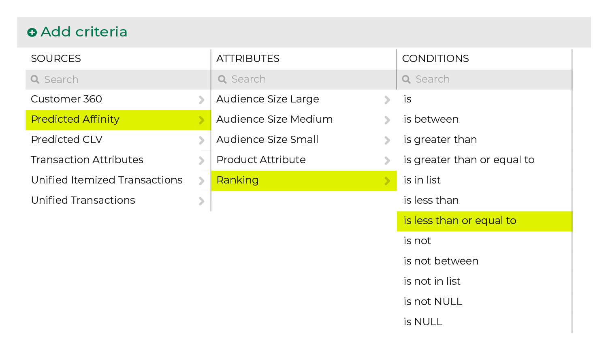
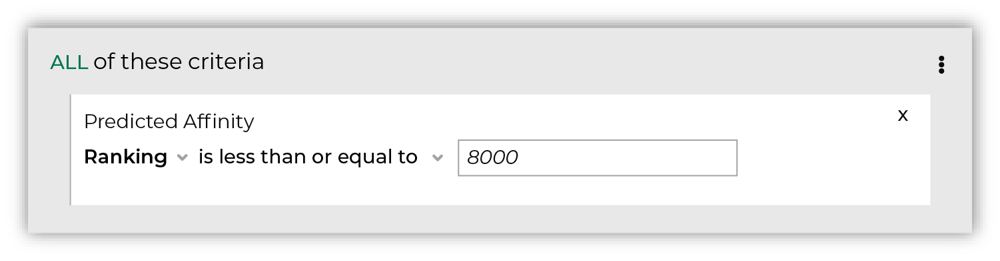

.. 
.. https://docs.amperity.com/ampiq/
.. 

.. meta::
    :description lang=en:
        Who are the top N customers who are most likely to purchase?

.. meta::
    :content class=swiftype name=body data-type=text:
        Who are the top N customers who are most likely to purchase?

.. meta::
    :content class=swiftype name=title data-type=string:
        Customer ranking

==================================================
Customer ranking
==================================================

.. include:: ../../amperity_reference/source/model_product_affinity.rst
   :start-after: .. model-product-affinity-use-cases-customer-ranking-topn-start
   :end-before: .. model-product-affinity-use-cases-customer-ranking-topn-end

.. include:: ../../amperity_reference/source/model_product_affinity.rst
   :start-after: .. model-product-affinity-use-cases-customer-ranking-start
   :end-before: .. model-product-affinity-use-cases-customer-ranking-end

.. include:: ../../amperity_reference/source/model_product_affinity.rst
   :start-after: .. model-product-affinity-use-cases-customer-ranking-attribute-start
   :end-before: .. model-product-affinity-use-cases-customer-ranking-attribute-end

.. attribute-customer-ranking-segments-start

To find customer rankings by product, start with the **Ranking** attribute in the **Predicted Affinity** table, and then set its condition to **is less than or equal to**. After the attribute appears in your segment, specify the number of customers you want to include in the ranking.

.. attribute-customer-ranking-segments-end

.. attribute-customer-ranking-segments-filters-start

After the attribute appears in your segment specify a value or range that matches the operator. For example, to use product affinity ranking to find your top 8000 customers:

.. attribute-customer-ranking-segments-filters-end

.. attribute-customer-ranking-combine-with-product-start

.. important:: Combine the **Ranking** attribute with the **Product Attribute** attribute to build a customer ranking specific to the selected product attribute.

.. attribute-customer-ranking-combine-with-product-end

.. _attribute-customer-ranking-conditions:

Available conditions
==================================================

.. include:: ../../amperity_reference/source/attribute_customer_ranking.rst
   :start-after: .. attribute-customer-ranking-conditions-start
   :end-before: .. attribute-customer-ranking-conditions-end
