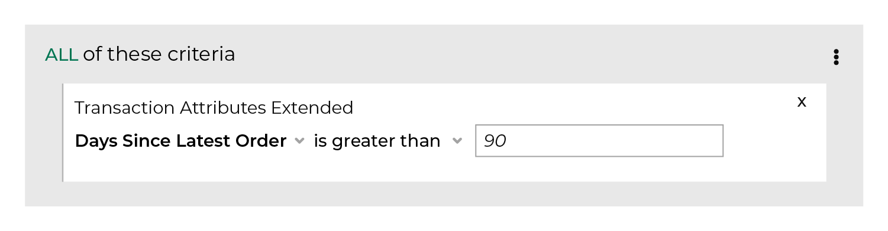

.. 
.. https://docs.amperity.com/ampiq/
.. 

.. meta::
    :description lang=en:
        How many days have elapsed since a customer's most recent order?

.. meta::
    :content class=swiftype name=body data-type=text:
        How many days have elapsed since a customer's most recent order?

.. meta::
    :content class=swiftype name=title data-type=string:
        Days since latest order

==================================================
Days since latest order
==================================================

.. include:: ../../shared/terms.rst
   :start-after: .. term-days-since-last-order-start
   :end-before: .. term-days-since-last-order-end

.. include:: ../../amperity_reference/source/attribute_days_between_orders.rst
   :start-after: .. attribute-days-between-orders-start
   :end-before: .. attribute-days-between-orders-end

.. image:: ../../images/attribute-days-since-latest-order.png
   :width: 600 px
   :alt: Choose the days since latest order attribute from the Segment Editor.
   :align: left
   :class: no-scaled-link

.. include:: ../../amperity_reference/source/attribute_days_between_orders.rst
   :start-after: .. attribute-days-between-orders-filters-start
   :end-before: .. attribute-days-between-orders-filters-end

.. _attribute-days-between-orders-conditions:

Available conditions
==================================================

.. include:: ../../amperity_reference/source/attribute_days_between_orders.rst
   :start-after: .. attribute-days-between-orders-conditions-start
   :end-before: .. attribute-days-between-orders-conditions-end
