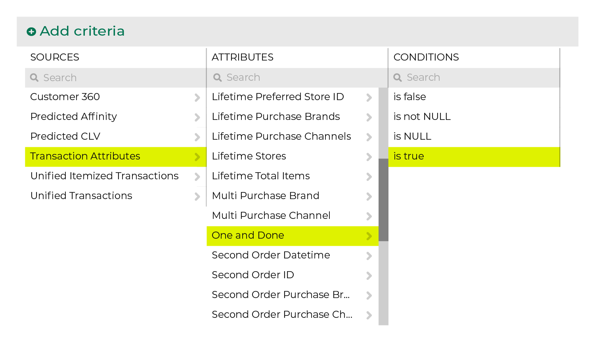
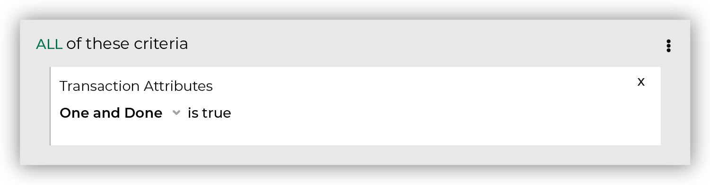

.. 
.. https://docs.amperity.com/ampiq/
.. 

.. meta::
    :description lang=en:
        Is a customer a one-time buyer?

.. meta::
    :content class=swiftype name=body data-type=text:
        Is a customer a one-time buyer?

.. meta::
    :content class=swiftype name=title data-type=string:
        One and done?

==================================================
One and done?
==================================================

.. include:: ../../amperity_ampiq/source/onetime_buyers.rst
   :start-after: .. onetime-buyers-about-start
   :end-before: .. onetime-buyers-about-end

.. include:: ../../amperity_reference/source/attribute_one_and_done.rst
   :start-after: .. attribute-one-and-done-start
   :end-before: .. attribute-one-and-done-end

.. include:: ../../amperity_reference/source/attribute_one_and_done.rst
   :start-after: .. attribute-one-and-done-find-start
   :end-before: .. attribute-one-and-done-find-end

.. include:: ../../amperity_reference/source/attribute_one_and_done.rst
   :start-after: .. attribute-one-and-done-filters-start
   :end-before: .. attribute-one-and-done-filters-end

.. _attribute-one-and-done-conditions:

Available conditions
==================================================

.. include:: ../../amperity_reference/source/attribute_one_and_done.rst
   :start-after: .. attribute-one-and-done-conditions-start
   :end-before: .. attribute-one-and-done-conditions-end
