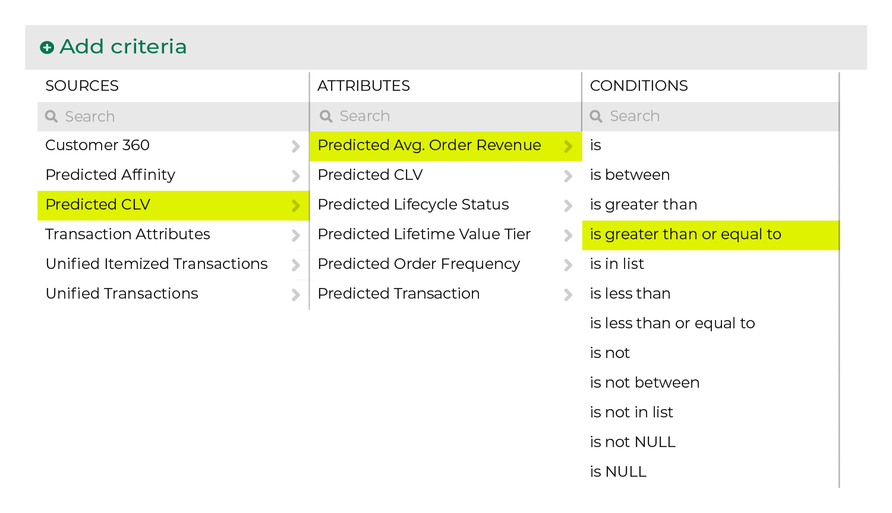
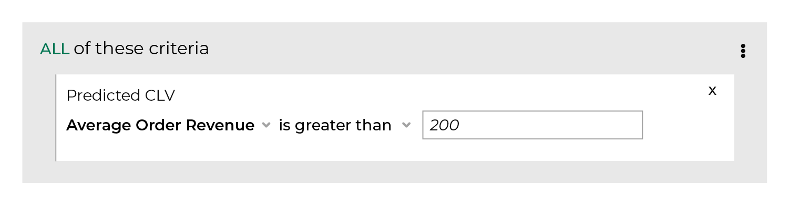

.. 
.. https://docs.amperity.com/ampiq/
.. 

.. meta::
    :description lang=en:
        The average value of each order a customer is predicted to make if they return to make another purchase during the next 365 days.

.. meta::
    :content class=swiftype name=body data-type=text:
        The average value of each order a customer is predicted to make if they return to make another purchase during the next 365 days.

.. meta::
    :content class=swiftype name=title data-type=string:
        Predicted average order revenue

==================================================
Predicted AOR
==================================================

.. include:: ../../shared/terms.rst
   :start-after: .. term-predicted-average-order-revenue-start
   :end-before: .. term-predicted-average-order-revenue-end

.. include:: ../../amperity_reference/source/attribute_predicted_average_order_revenue.rst
   :start-after: .. attribute-predicted-average-order-revenue-start
   :end-before: .. attribute-predicted-average-order-revenue-end

.. _attribute-predicted-average-order-revenue-about-clv:

About predicted CLV attributes
==================================================

.. include:: ../../amperity_reference/source/attribute_predicted_average_order_revenue.rst
   :start-after: .. attribute-predicted-average-order-revenue-about-clv-start
   :end-before: .. attribute-predicted-average-order-revenue-about-clv-end

.. include:: ../../amperity_reference/source/attribute_predicted_average_order_revenue.rst
   :start-after: .. attribute-predicted-average-order-revenue-about-clv-example-start
   :end-before: .. attribute-predicted-average-order-revenue-about-clv-example-end

.. _attribute-predicted-average-order-revenue-segment:

Use in segments
==================================================

.. include:: ../../amperity_reference/source/attribute_predicted_average_order_revenue.rst
   :start-after: .. attribute-predicted-average-order-revenue-segment-start
   :end-before: .. attribute-predicted-average-order-revenue-segment-end

.. include:: ../../amperity_reference/source/attribute_predicted_average_order_revenue.rst
   :start-after: .. attribute-predicted-average-order-revenue-filters-start
   :end-before: .. attribute-predicted-average-order-revenue-filters-end

.. include:: ../../amperity_reference/source/attribute_predicted_average_order_revenue.rst
   :start-after: .. attribute-predicted-average-order-revenue-modeling-enabled-note-start
   :end-before: .. attribute-predicted-average-order-revenue-modeling-enabled-note-end

.. _attribute-predicted-average-order-revenue-conditions:

Available conditions
==================================================

.. include:: ../../amperity_reference/source/attribute_predicted_average_order_revenue.rst
   :start-after: .. attribute-predicted-average-order-revenue-conditions-start
   :end-before: .. attribute-average-order-revenue-conditions-end
