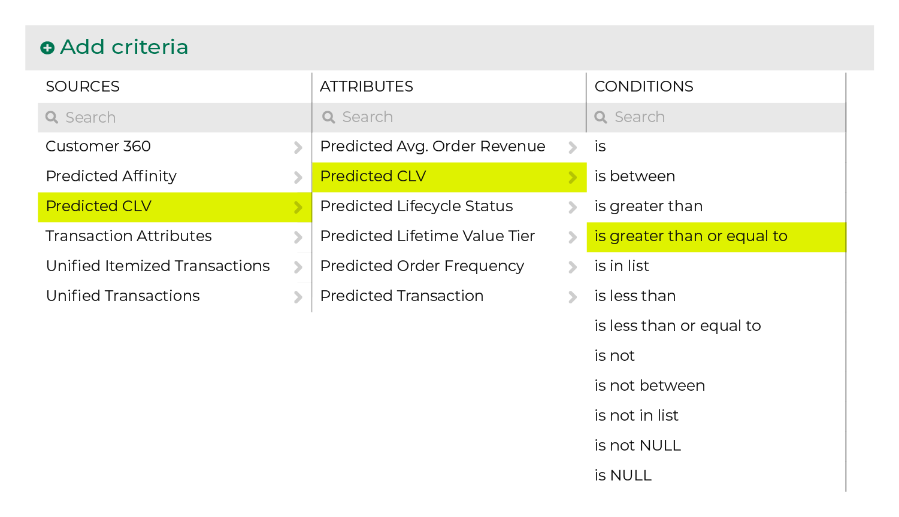
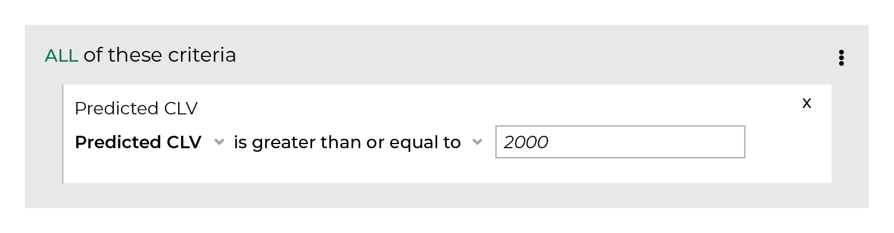

.. 
.. https://docs.amperity.com/ampiq/
.. 

.. meta::
    :description lang=en:
        The total value of all orders a customer is predicted to make if they return to make another purchase during the next 365 days.

.. meta::
    :content class=swiftype name=body data-type=text:
        The total value of all orders a customer is predicted to make if they return to make another purchase during the next 365 days.

.. meta::
    :content class=swiftype name=title data-type=string:
        Predicted CLV

==================================================
Predicted CLV
==================================================

.. include:: ../../shared/terms.rst
   :start-after: .. term-pclv-start
   :end-before: .. term-pclv-end

.. include:: ../../amperity_reference/source/attribute_predicted_clv.rst
   :start-after: .. attribute-predicted-clv-start
   :end-before: .. attribute-predicted-clv-end

.. _attribute-predicted-clv-about-clv:

About predicted CLV attributes
==================================================

.. include:: ../../amperity_reference/source/attribute_predicted_clv.rst
   :start-after: .. attribute-predicted-clv-about-clv-start
   :end-before: .. attribute-predicted-clv-about-clv-end

.. include:: ../../amperity_reference/source/attribute_predicted_clv.rst
   :start-after: .. attribute-predicted-clv-about-clv-example-start
   :end-before: .. attribute-predicted-clv-about-clv-example-end

.. _attribute-predicted-clv-examples:

Examples
==================================================

.. include:: ../../amperity_reference/source/attribute_predicted_clv.rst
   :start-after: .. attribute-predicted-clv-examples-start
   :end-before: .. attribute-predicted-clv-examples-end

.. _attribute-predicted-clv-segment:

Use in segments
==================================================

.. include:: ../../amperity_reference/source/attribute_predicted_clv.rst
   :start-after: .. attribute-predicted-clv-segment-start
   :end-before: .. attribute-predicted-clv-segment-end

.. include:: ../../amperity_reference/source/attribute_predicted_clv.rst
   :start-after: .. attribute-predicted-clv-filters-start
   :end-before: .. attribute-predicted-clv-filters-end

.. include:: ../../amperity_reference/source/attribute_predicted_clv.rst
   :start-after: .. attribute-predicted-clv-modeling-enabled-note-start
   :end-before: .. attribute-predicted-clv-modeling-enabled-note-end

.. _attribute-predicted-clv-conditions:

Available conditions
==================================================

.. include:: ../../amperity_reference/source/attribute_predicted_clv.rst
   :start-after: .. attribute-predicted-clv-conditions-start
   :end-before: .. attribute-predicted-clv-conditions-end
