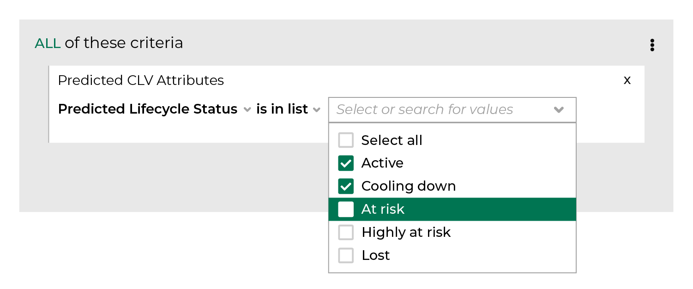

.. 
.. https://docs.amperity.com/ampiq/
.. 

.. meta::
    :description lang=en:
        The likelihood repeat customers and/or one-time buyers will purchase again, grouped by tiers including “active”, “cooling down”, “at risk”, “highly at risk”, and “lost”.

.. meta::
    :content class=swiftype name=body data-type=text:
        The likelihood repeat customers and/or one-time buyers will purchase again, grouped by tiers including “active”, “cooling down”, “at risk”, “highly at risk”, and “lost”.

.. meta::
    :content class=swiftype name=title data-type=string:
        Predicted lifecycle status

==================================================
Predicted lifecycle status
==================================================

.. include:: ../../amperity_reference/source/attribute_predicted_lifecycle_status.rst
   :start-after: .. attribute-predicted-lifecycle-status-start
   :end-before: .. attribute-predicted-lifecycle-status-end

**Repeat customers**

.. include:: ../../amperity_reference/source/attribute_predicted_lifecycle_status.rst
   :start-after: .. attribute-predicted-lifecycle-status-repeat-start
   :end-before: .. attribute-predicted-lifecycle-status-repeat-end

**One-time buyers**

.. include:: ../../amperity_reference/source/attribute_predicted_lifecycle_status.rst
   :start-after: .. attribute-predicted-lifecycle-status-onetime-start
   :end-before: .. attribute-predicted-lifecycle-status-onetime-end

.. _attribute-predicted-lifecycle-status-segment:

Use in segments
==================================================

.. include:: ../../amperity_reference/source/attribute_predicted_lifecycle_status.rst
   :start-after: .. attribute-predicted-lifecycle-status-segment-start
   :end-before: .. attribute-predicted-lifecycle-status-segment-end

.. image:: ../../images/attribute-predicted-lifecycle-status.png
   :width: 600 px
   :alt: Choose the predicted lifecycle status attribute from the Segment Editor.
   :align: left
   :class: no-scaled-link

.. include:: ../../amperity_reference/source/attribute_predicted_lifecycle_status.rst
   :start-after: .. attribute-predicted-lifecycle-status-segment-list-options-start
   :end-before: .. attribute-predicted-lifecycle-status-segment-list-options-end

.. include:: ../../amperity_reference/source/attribute_predicted_lifecycle_status.rst
   :start-after: .. attribute-predicted-lifecycle-status-modeling-enabled-note-start
   :end-before: .. attribute-predicted-lifecycle-status-modeling-enabled-note-end

.. _attribute-predicted-lifecycle-status-conditions:

Available conditions
==================================================

.. include:: ../../amperity_reference/source/attribute_predicted_lifecycle_status.rst
   :start-after: .. attribute-predicted-lifecycle-status-conditions-start
   :end-before: .. attribute-predicted-lifecycle-status-conditions-end
