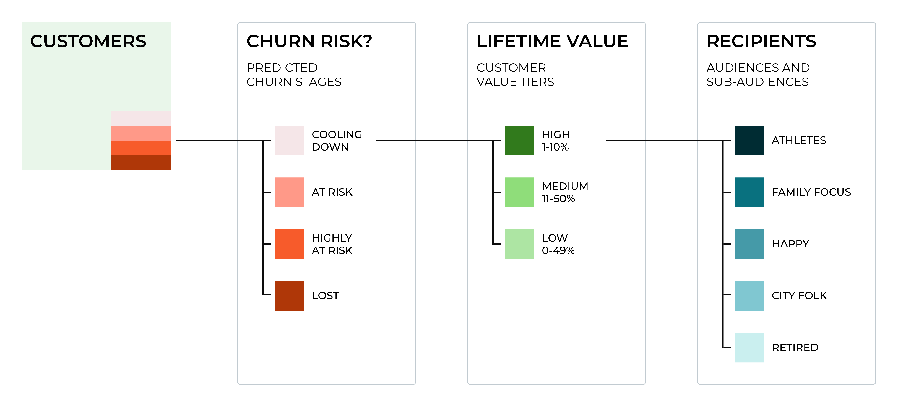
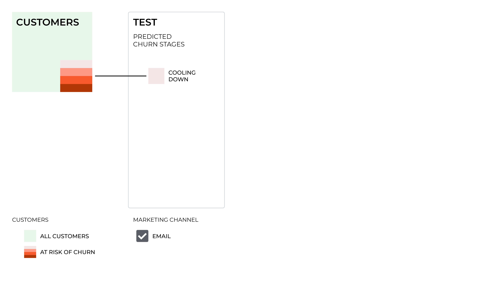
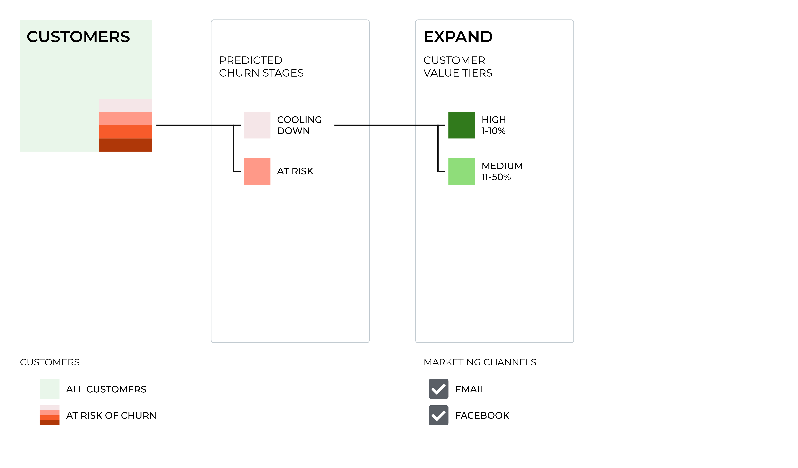
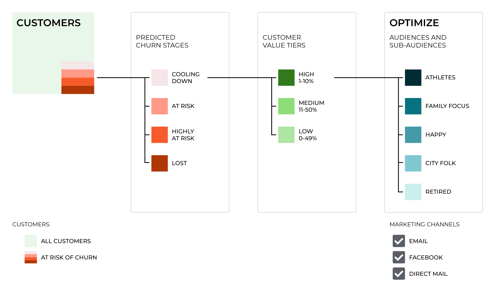

.. 
.. https://docs.amperity.com/ampiq/
.. 

.. meta::
    :description lang=en:
        Build a churn prevention campaign that helps your brand win back customers who have not purchased within a defined time window.

.. meta::
    :content class=swiftype name=body data-type=text:
        Build a churn prevention campaign that helps your brand win back customers who have not purchased within a defined time window.

.. meta::
    :content class=swiftype name=title data-type=string:
        Churn prevention

==================================================
Churn prevention campaigns
==================================================

.. churn-prevention-about-start

Brands use churn prevention campaigns to win back customers who have not purchased within defined time windows, such as 90 days, 120 days, or even up to 2 years. The length of the defined time window and the types of promotions and offers you will send depends on your goals for each audience within the churn prevention campaign.

.. churn-prevention-about-about-end

.. churn-prevention-custora-start

.. admonition:: It's Not You, It's My Data: A short book about churn prevention campaigns

   .. list-table::
      :widths: 150 450
      :header-rows: 0

      * - .. image:: ../../images/custora-its-not-you-its-my-data.svg
             :width: 140 px
             :alt: It's not you, it's my data
             :align: left
             :class: no-scaled-link
        - Brands that don't adapt—and marketers that don't adopt new technological skills—will not last.

          One of those primary skills is systematically leveraging data to grow customer loyalty and improve customer retention.

          This book focuses on retention, and how to build a churn prevention machine that keeps your customers engaged for the long run.

          |ext_custora_its_not_you|

.. churn-prevention-custora-end

.. _churn-prevention-whatis:

What is a churn prevention campaign?
==================================================

.. churn-prevention-whatis-start

A churn prevention campaign seeks to engage high-value customers as their likelihood of making a transaction diminishes. This type of campaign uses a series of messages based on thresholds to apply a variety of offers, discounts, and messages as probability of purchasing declines.

An established churn prevention campaign, as the following diagram represents, may have many thousands of customers spread across four churn thresholds, each ranked by lifetime and predicted customer value, and then each divided into specific categories that align to your typical marketing campaigns and strategies.

This can create a large number of specific types of campaign messages, offers, promotions, marketing channels, etc. that are all associated to a single churn prevention campaign!

The following sections describe the process of setting up an effective churn prevention campaign, including how to define your audience, test the campaign, extend the campaign by adding additional parameters and tools, and then optimize the campaign for all audiences and automation.

.. churn-prevention-whatis-end

.. churn-prevention-whatis-important-start

.. tip:: The probability of churn, as defined by a customer's lifecycle status, is not monotonic. In other words, the probability of churn is not "always increasing or always decreasing" over time. Some customers who are *at risk* of churn may move to *highly at risk*, and then move back to *at risk*. Some customers who are *highly at risk* may move to *lost*. Some customers who are *highly at risk* may remain *highly at risk*.

   Use the **Campaign Recipients** table to ensure that customers are not sent repetitive churn prevention messages. For example, if you want to send a message to customers who are moving from *at risk* to *highly at risk*, use the **Campaign Recipients** table to look back and identify customers who have already been sent that message, and then exclude customers who have not purchased within the past year from that segment.

.. churn-prevention-whatis-important-end

.. _churn-prevention-howto:

How to build a churn prevention campaign
==================================================

.. churn-prevention-howto-start

Building an effective churn prevention campaign starts with defining audiences that can be mapped to a series of churn thresholds. Experiment by sending an increasing number of promotions and offers to an increasing number of audiences (and sub-audiences) and marketing channels as you test, expand, and then optimize your churn prevention campaign.

.. churn-prevention-howto-end

.. churn-prevention-howto-strategies-start

Plan a series of promotions and offers that can be tied to each audience or sub-audience within your campaign. For example:

* Modest discounts (10% off)
* Substantial discount (25% off)
* Free shipping
* Exclusive offers
* Buy one and get one free
* and so on

.. churn-prevention-howto-strategies-end

.. _churn-prevention-howto-define:

Define an audience
--------------------------------------------------

.. churn-prevention-howto-define-start

Churn prevention campaigns focus on customers that fall into specific categories. To find these customers, start by building a segment that uses a combination of attributes that describe customer details, including purchase history, purchase recency, average order value, product channels, and loyalty status.

Then use the predicted customer lifetime value (pCLV) attributes to group them by customer lifecycle status: *active*, *cooling down*, *at risk*, *highly at risk*, and *lost*.

Churn prevention segments are often focused on smaller groups of customers. Use specific criteria to identify which customers belong in the segment, but remember that customers are likely to respond to a promotion or offer in different ways:

#. A segment for newly *at risk* customers who have not purchased in the previous 60 days.
#. A segment for customers who have not purchased in the last 90 days, but have an average order value of more than $200, who are members of your loyalty program, and with an *cooling down* lifecycle status.
#. A segment for newly *highly at risk* customers who have not purchased in the previous 120 days.

.. include:: ../../shared/terms.rst
   :start-after: .. term-customer-lifecycle-status-start
   :end-before: .. term-customer-lifecycle-status-end

.. include:: ../../shared/terms.rst
   :start-after: .. term-customer-lifecycle-status-tier-start
   :end-before: .. term-customer-lifecycle-status-tier-end

A customer is more likely to churn when they have been assigned a *cooling down*, *at risk*, *highly at risk*, or *lost* p(return) score, with increasing likelihood of churn as they move toward *lost*. A customer who is more likely to churn is the type of customer that should be the primary focus of a churn prevention campaign.

.. churn-prevention-howto-define-end

.. _churn-prevention-howto-test:

Test the campaign
--------------------------------------------------

.. churn-prevention-howto-test-start

Testing and measuring the performance of a churn prevention campaign can be a challenge. A sophisticated marketing campaign is run across multiple channels: email, direct mail, display advertising, Facebook, etc. and likely identifies many types of sub-audiences within a larger group of customers.

To get there, start with a simple campaign using only customers that are *cooling down*, and then divide them randomly into three groups:

#. A control group at 10%. This group will not receive a promotion or offer.
#. A treatment group at 45% that receives promotion or offer A.
#. A treatment group at 45% that receives promotion or offer B.

Send this campaign to a single marketing tool, such as your email service provider. This is the location from which you will run the initial churn prevention campaign.

The most important measurement is identifying how many customers do not churn. This is done by comparing revenue per user, profit per user, and overall conversion between the control group and all treatment groups. If one of the test outperforms the other, consider testing that promotion or offer again, but with a new set of control and treatment groups, to help identify ways to improve it.

.. churn-prevention-howto-test-end

.. _churn-prevention-howto-expand:

Expand the campaign
--------------------------------------------------

.. churn-prevention-howto-expand-start

After you have established a rhythm with testing and measuring churn prevention campaigns for a small, targeted audience, it's time to start expanding the campaign to add more customers, more value tiers, and more marketing tools.

Update the initial test campaign to include customers who are *at risk*. For both *cooling down* and *at risk* customers, apply predicted customer lifetime value (pCLV) to identify customers who fall into the high and medium value tiers, and then, for each value tier, divide them randomly into three groups:

#. A control group at 10%. This group will not receive a promotion or offer.
#. A treatment group at 45% that receives promotion or offer A.
#. A treatment group at 45% that receives promotion or offer B.

Send these campaigns to your email service provider *and* another marketing tool, such as Facebook. These are the locations from which you will run the next phase of your churn prevention campaign.

Continue comparing revenue per user, profit per user, and overall conversion, but this time for each set of control and treatment groups.

Start to tailor your promotions and offers to the customer lifecycle status *and* to the value tier. Continue to test a variety of messages across a greater number of audiences and sub-audiences and keep using the control and treatment groups pattern for each audience and sub-audience.

.. churn-prevention-howto-expand-end

.. _churn-prevention-howto-optimize:

Optimize the campaign
--------------------------------------------------

.. churn-prevention-howto-optimize-start

Update the expanded campaign to include customers who are *highly at risk* and *lost*. Apply predicted customer lifetime value (pCLV) to all stages and expand to include all value tiers. For each combination, continue to divide them randomly into three groups:

#. A control group at 10%. This group will not receive a promotion or offer.
#. A treatment group at 45% that receives promotion or offer A.
#. A treatment group at 45% that receives promotion or offer B.

Send these campaigns to your email service provider, Facebook, and then continue adding additional marketing channels, such as direct mail.

Continue comparing revenue per user, profit per user, and overall conversion across each set of control and treatment groups. Continue to tailor your promotions and offers to specific combinations of customer lifecycle status and value tier.

Continue to test a variety of messages across a greater number of audiences and sub-audiences and keep using the control group and don't stop using the control and treatment groups pattern with each audience and sub-audience. Get more creative with the campaigns that are sent to your most valuable customers.

Consider using additional treatment groups (along with a control group) to allow for testing additional messages. Continue reusing promotions and offers that perform well. Look for ways to reuse creative assets and messages across your churn prevention campaign.

Start to automate elements within your churn prevention campaign with a goal of eventually automating the entire workflow. For example, start by configuring Amperity to automatically rerun the segments that power your churn prevention campaign, and then send those results automatically to your email service provider and Facebook.

.. churn-prevention-howto-optimize-end

.. _churn-prevention-start-building:

Start building your campaign
==================================================

.. churn-prevention-start-building-start

Amperity provides a series of predictive attributes for predicted customer lifetime value (pCLV) that you can use to understand how your customers fit within the various stages of your churn prevention campaigns.

A churn prevention campaign starts with predicted customer lifetime value, the value tiers customers are predicted to fall into, and their lifecycle status.

Use the individual components of pCLV -- predicted average order revenue, predicted order frequency, and probability of transaction -- to fine-tune your understanding of your customers, and then get more precise about where they fit within the various stages of your churn prevention campaigns.

Use non-predictive attributes to find historical measurements, such as the number of days since a customer has last ordered.

Talk with your Amperity representative about the best attributes to use within your tenant to enable an effective churn prevention campaign.

.. churn-prevention-start-building-end
