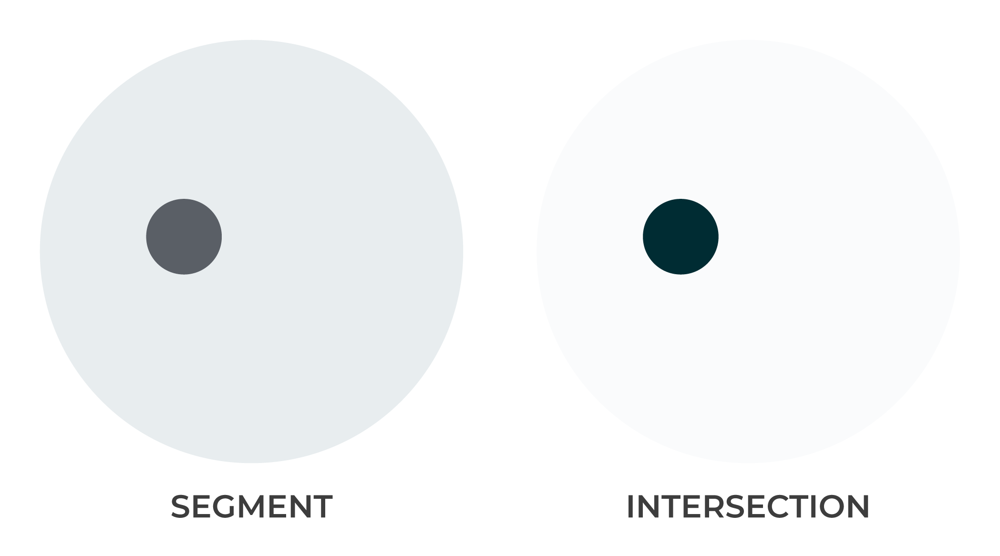
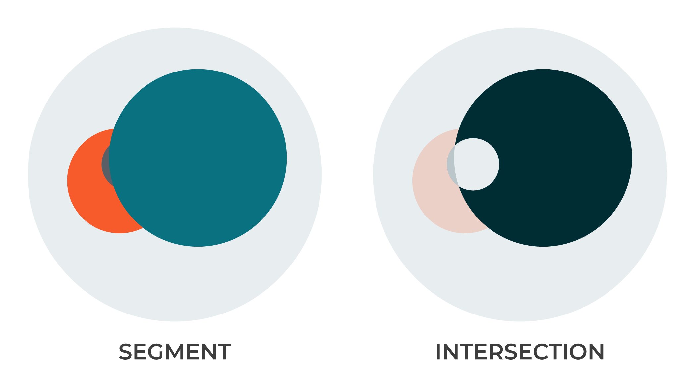

.. 
.. https://docs.amperity.com/ampiq/
.. 

.. meta::
    :description lang=en:
        Understand how combinations of conditions (inclusions and exclusions) and operators (AND and OR).

.. meta::
    :content class=swiftype name=body data-type=text:
        Understand how combinations of conditions (inclusions and exclusions) and operators (AND and OR).

.. meta::
    :content class=swiftype name=title data-type=string:
        About segment conditions and operators

==================================================
Conditions and operators
==================================================

.. segments-and-vs-or-start

This topic uses visuals to describe various combinations of conditions (inclusions and exclusions) and operators (**AND** and **OR**). Each example shows how inclusions, exclusions, and operators work together to determine the size of an audience that is returned by a segment.

.. segments-and-vs-or-end

.. _segments-and-vs-or-all-customers:

Start with ALL customers
==================================================

.. segments-and-vs-or-all-customers-start

Every segment starts with all of the customers in your customer 360 database. Every segment returns a subset of customers that matches the conditions that you define within the segment.

.. segments-and-vs-or-all-customers-end

.. _segments-and-vs-or-city:

City
==================================================

.. segments-and-vs-or-city-start

A segment with just one condition will return all of the customers that match that condition. For example, including the **City** attribute in a segment, and then setting the value of that attribute to match exactly "Chicago".

.. image:: ../../images/segments-and-or-example-city-conditions.png
   :width: 340 px
   :alt: EXAMPLE
   :align: left
   :class: no-scaled-link

Because this segment has only one condition and returns a list of customers who live in a city named "Chicago".

There is only one city in the United States named "Chicago", which means the results of this segment won't include customers who live in multiple states.

.. note:: There are attributes in your customer 360 database that can work well in segments when they are the only condition, such as **One and Done** (set it to "true") and **Early Repeat Purchaser** (also set it to "true").

.. segments-and-vs-or-city-end

.. _segments-and-vs-or-city-and-state:

City AND State
==================================================

.. segments-and-vs-or-city-and-state-start

When the **City** attrbute is used in a segment you *should* associate the state in which that city is located by choosing the **AND** operator, and then adding the **State** attribute.

This segment returns a list of customers who live in a city named "Chicago" that is located in the state of "Illinois".

.. segments-and-vs-or-city-and-state-end

.. segments-and-vs-or-city-and-state-dual-start

.. admonition:: Expected behaviors

   Attributes can belong to the same inclusion block or to multiple inclusion blocks and in many cases the list of customers that are returned will be identical when the operators in the inclusion blocks are the same.

   .. image:: ../../images/segments-and-or-example-city-and-state-dual-conditions.png
      :width: 340 px
      :alt: EXAMPLE
      :align: left
      :class: no-scaled-link

   This segment returns a list of customers who live in a city named "Chicago" that is located in the state of "Illinois".

   .. image:: ../../images/segments-and-or-example-city-and-state-dual-segment.png
      :width: 580 px
      :alt: EXAMPLE
      :align: left
      :class: no-scaled-link

.. segments-and-vs-or-city-and-state-dual-end

.. _segments-and-vs-or-city-or-state:

City OR State
==================================================

.. segments-and-vs-or-city-or-state-start

When the **City** attrbute is used in a segment you should associate the state in which that city is located. Choosing the **OR** operator instead of the **AND** opertor will return very different results.

This segment returns a list of customers who live in a city named "Chicago" and who live in the the state of "Illinois", which includes the city of Chicago.

.. segments-and-vs-or-city-or-state-end

.. segments-and-vs-or-city-or-state-dual-start

.. admonition:: Expected behaviors

   Attributes can belong to the same inclusion block or to multiple inclusion blocks and in many cases the list of customers that are returned will be identical when the operators in the inclusion blocks are the same.

   .. image:: ../../images/segments-and-or-example-city-or-state-dual-conditions.png
      :width: 340 px
      :alt: EXAMPLE
      :align: left
      :class: no-scaled-link

   This segment returns a list of customers who live in a city named "Chicago" and who live in the the state of "Illinois", which includes the city of Chicago.

   .. image:: ../../images/segments-and-or-example-city-or-state-dual-segment.png
      :width: 580 px
      :alt: EXAMPLE
      :align: left
      :class: no-scaled-link

.. segments-and-vs-or-city-or-state-dual-end

.. _segments-and-vs-or-state-exclude-city:

State EXCLUDE City
==================================================

.. segments-and-vs-or-state-exclude-city-start

You can use exclusions to remove customers who match the excluded attributes from the list of customers returned by the segment.

For example, return all customers who live in the **State** of "Illinois", and then **Exclude** from that list all customers who live in the **City** of "Chicago".

This segment returns a list of customers who live in the state of Illinois, excluding customers who live in Chicago.

.. segments-and-vs-or-state-exclude-city-end

.. _segments-and-vs-or-city-and-state-and-city-and-state:

City, state AND City, state
==================================================

.. segments-and-vs-or-city-and-state-and-city-and-state-start

You can use multiple inclusion blocks, but be careful to avoid creating mutually exclusive sets of inclusions. For example, defining two **Include** blocks, each with its own **City** and **State** attributes and using the **AND** operator.

This segment returns a list of customers who live in both cities, which (because it is unlikely that a customer lives in both cities) is zero.

There are use cases for segments that use multiple sets of inclusion blocks to return a list of customers that may be zero. A segment that typically returns zero, but sometimes does not return zero can be interesting.

.. segments-and-vs-or-city-and-state-and-city-and-state-end

.. _segments-and-vs-or-city-and-state-or-city-and-state:

City, state OR City, state
==================================================

.. segments-and-vs-or-city-and-state-or-city-and-state-start

A more likely scenario is using multiple inclusion blocks to return a list of customers that matches either set of conditions. For example, defining two **Include** blocks, each with its own **City** and **State** attributes and using the **OR** operator.

This segment returns a list of customers who live in a city named "Seattle" and a state named "Washington" **OR** customers who live in a city named "Portland" and a state named "Oregon".

.. segments-and-vs-or-city-and-state-or-city-and-state-end

.. _segments-and-vs-or-city-and-state-and-orders:

City, state AND Order details
==================================================

.. segments-and-vs-or-city-and-state-and-orders-start

Many segments combine locations, such as large cities, states, or regions, with purchasing patterns to return customers that match both location and pattern.

For example, a list of customers for a **City** and **State** **AND** who have ordered frequently **AND** spent more than $100.00.

This segment returns a list of customers who live in a city named "Chicago" and a state named "Illinois" **AND** customers who at least 5 orders and who have spent at least $100.00.

This segment returns a much smaller list of customers than the starting point ("all customers") and is closer to the type of segment that can help define an audience that can be used in marketing campaigns.

.. segments-and-vs-or-city-and-state-and-orders-end

.. _segments-and-vs-or-city-and-state-and-high-value:

Loyalty, region AND High value
==================================================

.. segments-and-vs-or-city-and-state-and-high-value-start

Many brands have loyalty programs. Combine loyalty programs with locations, and then apply purchasing patterns to return customers that belong to your brand's loyalty program and match both location and pattern.

For example, a list of customers who belong to your brand's **Loyalty** program, live along the west coast of the United States, **AND** who average more than 4 items **OR** average more than $225 over time.

This segment returns a list of customers who live in California, Oregon, or Washington, belong to your brand's loyalty program **AND** have a spending pattern that matches one of the following: an average order value greater than $225 **OR** orders that average 4 or more items.

This segment also returns a much smaller list of customers and is similar to the types of segments that can help define audiences that can be used in marketing campaigns.

.. segments-and-vs-or-city-and-state-and-high-value-end

.. _segments-and-vs-or-exclude-one-time-online-purchasers:

Exclude one-time purchasers
==================================================

.. segments-and-vs-or-exclude-one-time-online-purchasers-start

Repeat customers are your brand's most valuable customers. Excluding one-time buyers can be an effective approach for identifying more valuable segments.

For example, a list of customers who live in a **City** and **State**, but then excludes customers who only purchased a single time from your brand's website.

This segment returns a list of customers who live in Seattle, Washington, and then excludes all customers who only purchased one time from your brand's website.

.. segments-and-vs-or-exclude-one-time-online-purchasers-end

.. _segments-and-vs-or-one-and-done-store-shoppers:

One-and-done shoppers
==================================================

.. segments-and-vs-or-one-and-done-store-shoppers-start

Marketing to one-time shoppers is often different than marketing to repeat customers. It can be useful to build segments that identify who your brand's one-time buyers are.

For example, a list of customers who live in a **State** and have purchased only a single time from any of your brand's physical stores.

This segment returns a list of customers who live in Illinois and who have purchased only a single time.

.. note:: This type of segment should be extended to include order IDs and date ranges and to exclude items that were returned.

.. segments-and-vs-or-one-and-done-store-shoppers-end

.. _segments-and-vs-or-recent-customers-plus-exclusions:

Recent shoppers w/exclusions
==================================================

.. segments-and-vs-or-recent-customers-plus-exclusions-start

New customers can become repeat customers. Identifying new customers, and then associating them to product categories and a variety of order behaviors can give your brand a series of useful segments.

This segment returns a list of customers whose first purchase was within the previous year and whose favorite product category is socks. Exclude from this segment all customers who are flagged as one-time buyers, and then also exclude customers whose average order value is less than $50.

.. note:: This type of segment should be extended to include order IDs and date ranges, maybe include some type of demographics, and should exclude items that were returned or cancelled.

.. segments-and-vs-or-recent-customers-plus-exclusions-end

.. _segments-and-vs-or-include-exclude-segments:

Customer lists
==================================================

.. segments-and-vs-or-include-exclude-segments-start

This section uses previous examples *as if they are a segment* and then shows how using customer lists can affect the lists of customers that are returned by a segment.

.. segments-and-vs-or-include-exclude-segments-end

.. _segments-and-vs-or-recent-purchases-exclude-chicago:

Purchases EXCLUDE City
--------------------------------------------------

.. segments-and-vs-or-recent-purchases-exclude-chicago-start

The following conditions show how exclusions *remove* customers the list of customers that can be returned by a segment.

.. image:: ../../images/segments-and-vs-or-recent-purchases-exclude-chicago-conditions.png
   :width: 340 px
   :alt: EXAMPLE
   :align: left
   :class: no-scaled-link

This segment returns a list of customers who have purchased in the previous calendar year, but *excludes* all customers who live in Chicago, Illinois.

(See :ref:`this segment <segments-and-vs-or-city-and-state>` for an example of the customer list that is used to extend this segment.)

.. segments-and-vs-or-recent-purchases-exclude-chicago-end

.. _segments-and-vs-or-city-and-state-include-cities:

City, state INCLUDE Cities
--------------------------------------------------

.. segments-and-vs-or-city-and-state-include-cities-start

The following conditions show how a customer list can be used to add to the list of customers that are returned by a segment.

This segment returns a list of customers who live in Minneapolis, Minnesota *and* also customers who live in Seattle, Washington **AND** Portland, Oregon.

(See :ref:`this segment <segments-and-vs-or-city-and-state-and-city-and-state>` for an example of the customer list that is used to extend this segment.)

.. segments-and-vs-or-city-and-state-include-cities-end

.. _segments-and-vs-or-cities-and-states-include-high-value:

Purchases INCLUDE High value
--------------------------------------------------

.. segments-and-vs-or-cities-and-states-include-high-value-start

The following conditions show how a customer list can be used to include a high value list of customers.

This segment returns a list of customers who frequently purchase blue socks *and* belong to your brand's loyalty program *and* live in the states of California, Oregon, or Washington.

(See :ref:`this segment <segments-and-vs-or-city-and-state-and-high-value>` for an example of the customer list that is used to extend this segment.)

.. segments-and-vs-or-cities-and-states-include-high-value-end

.. _segments-and-vs-or-common-values:

Common values
==================================================

.. segments-and-vs-or-common-values-start

Madison is a name that is shared by more than 20 cities in the United States. A segment that returns customers who live in a city named "Madison" may reside in more than 20 states.

This can be true for many of the attributes that are available to your brand. For example, within product catalogs a segment can return a product category, such as "socks". This segment may benefit from also returning one or more product subcategories, such as fabric type, color, or size.

The following sections show situations where adding attributes is neccessary for returning the types of results your brand expects to see in a segment.

.. segments-and-vs-or-common-values-end

.. _segments-and-vs-or-common-values-may-mislead:

May be misleading
--------------------------------------------------

.. segments-and-vs-or-common-values-may-mislead-start

A common value used with **OR** may return a list of customers that includes more than you expected.

.. image:: ../../images/segments-and-or-example-city-and-state-conditions-common.png
   :width: 340 px
   :alt: EXAMPLE
   :align: left
   :class: no-scaled-link

This segment returns customers who live in a city named "Madison" (which exists in more than 20 states) *and* a customers who live in the state of Indiana.

.. segments-and-vs-or-common-values-may-mislead-end

.. _segments-and-vs-or-common-values-should-often-be-qualified:

Should be qualified
--------------------------------------------------

.. segments-and-vs-or-common-values-should-often-be-qualified-start

This segment doesn't qualify the city of "Madison" to a specific state.

This segment returns customers who live in a city named "Madison" in one of the following states: Indiana and Wisconsin.

(See :ref:`this segment <segments-and-vs-or-city-and-state-and-city-and-state>` for a combination of **AND** and inclusion blocks that returns similar results.)

.. segments-and-vs-or-common-values-should-often-be-qualified-end
