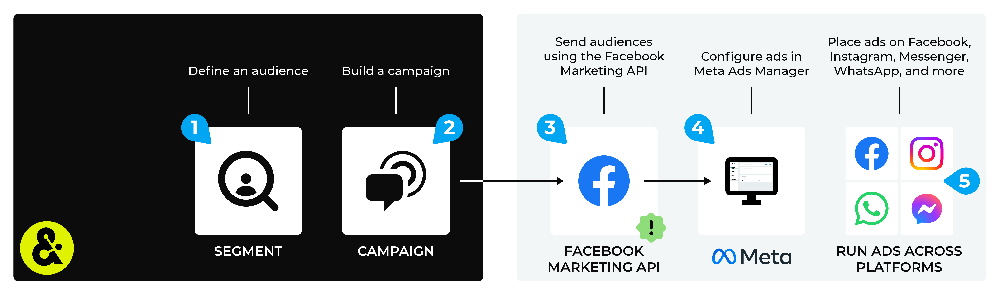

.. https://docs.amperity.com/ampiq/

.. |destination-name| replace:: Meta Ads Manager
.. |what-send| replace:: customer profiles
.. |what-enable| replace:: **EXTERN_ID**, **EMAIL**, **FN**, **LN**, **ST**, **CT**, **ZIP**, **COUNTRY**, **BIRTH**, **GEN**, **MADID**, and **PHONE**
.. |allow-for-what| replace:: audiences
.. |allow-for-duration| replace:: up to 24 hours
.. |attributes-sent| replace:: |destination-name| requires the **EXTERN_ID**, **EMAIL**, **FN**, **LN**, **ST**, **CT**, **ZIP**, **COUNTRY**, **BIRTH**, **GEN**, **MADID**, and **PHONE** attributes. The **MADID** (mobile advertising ID) attribute is optional.

.. meta::
    :description lang=en:
        Use segments and campaigns to send custom audiences from Amperity to Meta Ads Manager.

.. meta::
    :content class=swiftype name=body data-type=text:
        Use segments and campaigns to send custom audiences from Amperity to Meta Ads Manager.

.. meta::
    :content class=swiftype name=title data-type=string:
        Send audiences to Meta Ads Manager

==================================================
Send audiences to Meta Ads Manager
==================================================

.. channel-meta-ads-manager-start

You can use segments and campaigns to build custom audiences in |destination-name|. Send customer information, such as email addresses, phone numbers, names, birthdates, gender, city, state, postal code, and mobile advertising IDs, from Amperity to find customer matches.

Use |destination_meta_ads_manager_custom_audiences| in |destination-name| to advertise to customers on Facebook, Instagram, and Messenger, along with using the Meta Audience Network to extend your advertising beyond Facebook and reach new audiences on apps and mobile devices, such as WhatsApp.

.. channel-meta-ads-manager-end

.. sendto-meta-ads-manager-howitworks-callouts-start

A |destination-name| destination works like this:

#. Build a custom audience using a segment.

   .. note:: You can |sendto_meta_ads_manager_offline_events| to |destination-name| using the |ext_facebook_conversions_api_offline_events|.

      Offline events are sent as a collection of transaction details that occurred within the previous seven days, after which Amperity can be configured to maintain a 7-day rolling window of those events.

#. :ref:`Add that segment to a campaign <channel-meta-ads-manager-build-campaign>`, select Meta Ads Manager as a destination for at least one treatment group, and then configure the schedule for your campaign.
#. Send that audience to Meta Ads Manager.

   .. important::

      .. include:: ../../amperity_datagrid/source/destination_meta_ads_manager.rst
         :start-after: .. destination-meta-ads-manager-terms-of-service-start
         :end-before: .. destination-meta-ads-manager-terms-of-service-end

      |destination-name| uses OAuth to grant access to Amperity. You will need to reauthorize OAuth if the token expires or is removed.

   .. note::

      .. include:: ../../shared/destinations.rst
         :start-after: .. destinations-add-destinations-intro-allow-for-start
         :end-before: .. destinations-add-destinations-intro-allow-for-end

#. Build ads in Meta Ads Manager.

   .. admonition:: What is Meta Ads Manager?

      .. include:: ../../amperity_datagrid/source/destination_meta_ads_manager.rst
         :start-after: .. destination-meta-ads-manager-meta-ads-manager-start
         :end-before: .. destination-meta-ads-manager-meta-ads-manager-end

#. Place ads on Facebook, Instagram, and Messenger; use Audience Network to extend advertising beyond Facebook to reach audiences on apps and mobile devices, such as WhatsApp.

.. sendto-meta-ads-manager-howitworks-callouts-end

.. include:: ../../shared/channels.rst
   :start-after: .. channels-overview-note-start
   :end-before: .. channels-overview-note-end

.. _channel-meta-ads-manager-build-segment:

Build a segment
==================================================

.. include:: ../../shared/channels.rst
   :start-after: .. channels-build-segment-start
   :end-before: .. channels-build-segment-end

.. _attributes:

.. admonition:: Which attributes should you use?

   .. include:: ../../shared/channels.rst
      :start-after: .. channels-build-segment-context-start
      :end-before: .. channels-build-segment-context-end

.. _channel-meta-ads-manager-build-campaign:

Build a campaign
==================================================

.. include:: ../../shared/channels.rst
   :start-after: .. channels-build-campaign-start
   :end-before: .. channels-build-campaign-end

.. include:: ../../shared/destinations.rst
   :start-after: .. destinations-oauth-warning-about-reauthorize-start
   :end-before: .. destinations-oauth-warning-about-reauthorize-end

**To build a campaign**

.. list-table::
   :widths: 10 90
   :header-rows: 0

   * - .. image:: ../../images/steps-01.png
          :width: 60 px
          :alt: Step 1.
          :align: left
          :class: no-scaled-link
     - .. include:: ../../shared/channels.rst
          :start-after: .. channels-build-campaign-steps-open-page-start
          :end-before: .. channels-build-campaign-steps-open-page-end

       .. image:: ../../images/mockup-campaigns-name-generic.png
          :width: 250 px
          :alt: Open the campaign builder and give your campaign a name.
          :align: left
          :class: no-scaled-link

       .. include:: ../../shared/channels.rst
          :start-after: .. channels-build-campaign-steps-good-names-start
          :end-before: .. channels-build-campaign-steps-good-names-end

   * - .. image:: ../../images/steps-02.png
          :width: 60 px
          :alt: Step 2.
          :align: left
          :class: no-scaled-link
     - .. include:: ../../shared/channels.rst
          :start-after: .. channels-build-campaign-steps-audience-start
          :end-before: .. channels-build-campaign-steps-audience-end

       .. image:: ../../images/mockup-campaigns-select-audience-from-segment-generic.png
          :width: 500 px
          :alt: Choose the audience to use with your campaign.
          :align: left
          :class: no-scaled-link

       .. include:: ../../shared/channels.rst
          :start-after: .. channels-build-campaign-steps-audience-tip-start
          :end-before: .. channels-build-campaign-steps-audience-tip-end

   * - .. image:: ../../images/steps-03.png
          :width: 60 px
          :alt: Step 3.
          :align: left
          :class: no-scaled-link
     - .. include:: ../../shared/channels.rst
          :start-after: .. channels-build-campaign-steps-exclusions-start
          :end-before: .. channels-build-campaign-steps-exclusions-end

       .. image:: ../../images/mockup-campaigns-select-exclusions-from-segment-generic.png
          :width: 500 px
          :alt: Exclude some customers from this campaign.
          :align: left
          :class: no-scaled-link

   * - .. image:: ../../images/steps-04.png
          :width: 60 px
          :alt: Step 4.
          :align: left
          :class: no-scaled-link
     - .. include:: ../../shared/channels.rst
          :start-after: .. channels-build-campaign-steps-subaudiences-start
          :end-before: .. channels-build-campaign-steps-subaudiences-end

   * - .. image:: ../../images/steps-05.png
          :width: 60 px
          :alt: Step 4.
          :align: left
          :class: no-scaled-link
     - .. include:: ../../shared/channels.rst
          :start-after: .. channels-build-campaign-steps-destinations-start
          :end-before: .. channels-build-campaign-steps-destinations-end

   * - .. image:: ../../images/steps-06.png
          :width: 60 px
          :alt: Step 4.
          :align: left
          :class: no-scaled-link
     - .. include:: ../../shared/channels.rst
          :start-after: .. channels-build-campaign-steps-edit-attributes-start
          :end-before: .. channels-build-campaign-steps-edit-attributes-end

       .. image:: ../../images/mockup-campaigns-attributes-facebook.png
          :width: 500 px
          :alt: Edit the attributes for Meta Ads Manager.
          :align: left
          :class: no-scaled-link

       .. include:: ../../shared/channels.rst
          :start-after: .. channels-build-campaign-steps-edit-attributes-note-start
          :end-before: .. channels-build-campaign-steps-edit-attributes-note-end

   * - .. image:: ../../images/steps-07.png
          :width: 60 px
          :alt: Step 7.
          :align: left
          :class: no-scaled-link
     - .. include:: ../../shared/channels.rst
          :start-after: .. channels-build-campaign-steps-timing-start
          :end-before: .. channels-build-campaign-steps-timing-end

   * - .. image:: ../../images/steps-08.png
          :width: 60 px
          :alt: Step 8.
          :align: left
          :class: no-scaled-link
     - .. include:: ../../shared/channels.rst
          :start-after: .. channels-build-campaign-steps-launch-date-start
          :end-before: .. channels-build-campaign-steps-launch-date-end

   * - .. image:: ../../images/steps-09.png
          :width: 60 px
          :alt: Step 9.
          :align: left
          :class: no-scaled-link
     - .. include:: ../../shared/channels.rst
          :start-after: .. channels-build-campaign-steps-schedule-start
          :end-before: .. channels-build-campaign-steps-schedule-end

.. _channel-meta-ads-manager-configure-default-attributes:

Configure default attributes
==================================================

.. include:: ../../shared/channels.rst
   :start-after: .. channels-configure-default-attributes-start
   :end-before: .. channels-configure-default-attributes-end

.. channel-meta-ads-manager-configure-default-attributes-start

|destination-name| has the following requirements for attributes.

.. list-table::
   :widths: 50 50
   :header-rows: 1

   * - **Source attribute**
     - **Destination attribute**

   * - amperity_id
     - EXTERN_ID

   * - email
     - EMAIL

   * - given_name
     - FN

   * - surname
     - LN

   * - state
     - ST

   * - city
     - CT

   * - postal
     - ZIP

   * - country
     - COUNTRY

   * - birthdate
     - BIRTH

   * - gender
     - GEN

   * - phone
     - PHONE

.. channel-meta-ads-manager-configure-default-attributes-end

.. _channel-meta-ads-manager-api-keys:

Facebook Marketing API keys
==================================================

.. include:: ../../amperity_datagrid/source/destination_meta_ads_manager.rst
   :start-after: .. destination-meta-ads-manager-api-keys-start
   :end-before: .. destination-meta-ads-manager-api-keys-end
