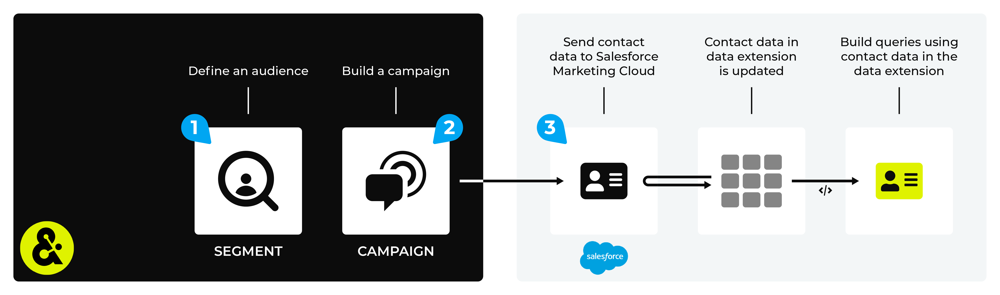

.. https://docs.amperity.com/ampiq/

.. |destination-name| replace:: Salesforce Marketing Cloud
.. |what-send| replace:: contact data
.. |what-enable| replace:: **amperity_id**, **email**, **first_name**, and **last_name**
.. |attributes-sent| replace:: |destination-name| allows a long list of (optional) attributes.

.. meta::
    :description lang=en:
        Use segments and campaigns to send audiences from Amperity to Salesforce Marketing Cloud.

.. meta::
    :content class=swiftype name=body data-type=text:
        Use segments and campaigns to send audiences from Amperity to Salesforce Marketing Cloud.

.. meta::
    :content class=swiftype name=title data-type=string:
        Send audiences to Salesforce Marketing Cloud

==================================================
Send audiences to Salesforce Marketing Cloud
==================================================

.. channel-salesforce-marketing-cloud-start

You can build queries that return |what-send|, and then use orchestrations to send those results to business units in |destination-name|. The |what-send| is uploaded to |destination-name| using SFTP, after which the Marketing Cloud SOAP API will manage your data extensions and will move the |what-send| into the correct data extension automatically.

.. channel-salesforce-marketing-cloud-end

.. include:: ../../shared/channels.rst
   :start-after: .. channels-overview-list-intro-start
   :end-before: .. channels-overview-list-intro-end

.. include:: ../../shared/channels.rst
   :start-after: .. channels-overview-note-start
   :end-before: .. channels-overview-note-end

.. _channel-sfmc-build-segment:

Build a segment
==================================================

.. include:: ../../shared/channels.rst
   :start-after: .. channels-build-segment-start
   :end-before: .. channels-build-segment-end

.. _attributes:

.. admonition:: Which attributes should you use?

   .. include:: ../../shared/channels.rst
      :start-after: .. channels-build-segment-context-start
      :end-before: .. channels-build-segment-context-end

.. _channel-sfmc-build-campaign:

Build a campaign
==================================================

.. include:: ../../shared/channels.rst
   :start-after: .. channels-build-campaign-start
   :end-before: .. channels-build-campaign-end

**To build a campaign**

.. list-table::
   :widths: 10 90
   :header-rows: 0

   * - .. image:: ../../images/steps-01.png
          :width: 60 px
          :alt: Step 1.
          :align: left
          :class: no-scaled-link
     - .. include:: ../../shared/channels.rst
          :start-after: .. channels-build-campaign-steps-open-page-start
          :end-before: .. channels-build-campaign-steps-open-page-end

       .. image:: ../../images/mockup-campaigns-name-generic.png
          :width: 250 px
          :alt: Open the campaign builder and give your campaign a name.
          :align: left
          :class: no-scaled-link

       .. include:: ../../shared/channels.rst
          :start-after: .. channels-build-campaign-steps-good-names-start
          :end-before: .. channels-build-campaign-steps-good-names-end

   * - .. image:: ../../images/steps-02.png
          :width: 60 px
          :alt: Step 2.
          :align: left
          :class: no-scaled-link
     - .. include:: ../../shared/channels.rst
          :start-after: .. channels-build-campaign-steps-audience-start
          :end-before: .. channels-build-campaign-steps-audience-end

       .. image:: ../../images/mockup-campaigns-select-audience-from-segment-generic.png
          :width: 500 px
          :alt: Choose the audience to use with your campaign.
          :align: left
          :class: no-scaled-link

       .. include:: ../../shared/channels.rst
          :start-after: .. channels-build-campaign-steps-audience-tip-start
          :end-before: .. channels-build-campaign-steps-audience-tip-end

   * - .. image:: ../../images/steps-03.png
          :width: 60 px
          :alt: Step 3.
          :align: left
          :class: no-scaled-link
     - .. include:: ../../shared/channels.rst
          :start-after: .. channels-build-campaign-steps-exclusions-start
          :end-before: .. channels-build-campaign-steps-exclusions-end

       .. image:: ../../images/mockup-campaigns-select-exclusions-from-segment-generic.png
          :width: 500 px
          :alt: Exclude some customers from this campaign.
          :align: left
          :class: no-scaled-link

   * - .. image:: ../../images/steps-04.png
          :width: 60 px
          :alt: Step 4.
          :align: left
          :class: no-scaled-link
     - .. include:: ../../shared/channels.rst
          :start-after: .. channels-build-campaign-steps-subaudiences-start
          :end-before: .. channels-build-campaign-steps-subaudiences-end

   * - .. image:: ../../images/steps-05.png
          :width: 60 px
          :alt: Step 4.
          :align: left
          :class: no-scaled-link
     - .. include:: ../../shared/channels.rst
          :start-after: .. channels-build-campaign-steps-destinations-start
          :end-before: .. channels-build-campaign-steps-destinations-end

   * - .. image:: ../../images/steps-06.png
          :width: 60 px
          :alt: Step 4.
          :align: left
          :class: no-scaled-link
     - .. include:: ../../shared/channels.rst
          :start-after: .. channels-build-campaign-steps-edit-attributes-start
          :end-before: .. channels-build-campaign-steps-edit-attributes-end

       .. image:: ../../images/mockup-campaigns-attributes-sfmc.png
          :width: 500 px
          :alt: Edit the attributes for Salesforce Marketing Cloud.
          :align: left
          :class: no-scaled-link

       .. include:: ../../shared/channels.rst
          :start-after: .. channels-build-campaign-steps-edit-attributes-note-start
          :end-before: .. channels-build-campaign-steps-edit-attributes-note-end

   * - .. image:: ../../images/steps-07.png
          :width: 60 px
          :alt: Step 7.
          :align: left
          :class: no-scaled-link
     - .. include:: ../../shared/channels.rst
          :start-after: .. channels-build-campaign-steps-timing-start
          :end-before: .. channels-build-campaign-steps-timing-end

   * - .. image:: ../../images/steps-08.png
          :width: 60 px
          :alt: Step 8.
          :align: left
          :class: no-scaled-link
     - .. include:: ../../shared/channels.rst
          :start-after: .. channels-build-campaign-steps-launch-date-start
          :end-before: .. channels-build-campaign-steps-launch-date-end

   * - .. image:: ../../images/steps-09.png
          :width: 60 px
          :alt: Step 9.
          :align: left
          :class: no-scaled-link
     - .. include:: ../../shared/channels.rst
          :start-after: .. channels-build-campaign-steps-schedule-start
          :end-before: .. channels-build-campaign-steps-schedule-end
