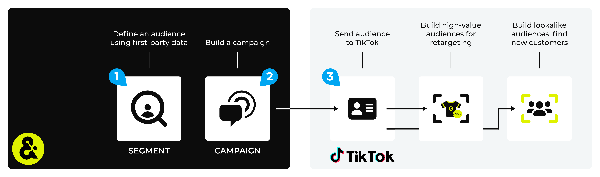

.. 
.. https://docs.amperity.com/ampiq/
.. 

.. |destination-name| replace:: TikTok Ads
.. |what-send| replace:: email addresses, phone numbers, and advertising IDs (IDFAs for iOS devices or AAIDs for Android devices)
.. |what-enable| replace:: **EMAIL** and **PHONE**
.. |allow-for-what| replace:: audience mapping
.. |allow-for-duration| replace:: up to 10 hours
.. |attributes-sent| replace:: |destination-name| requires email addresses and phone numbers. You may also associate fields to advertising IDs (IDFAs for iOS devices or AAIDs for Android devices).

.. meta::
    :description lang=en:
        Use segments and campaigns to send audiences from Amperity to TikTok Ads Manager.

.. meta::
    :content class=swiftype name=body data-type=text:
        Use segments and campaigns to send audiences from Amperity to TikTok Ads Manager.

.. meta::
    :content class=swiftype name=title data-type=string:
        Send audiences to TikTok Ads Manager

==================================================
Send audiences to TikTok Ads Manager
==================================================

.. channel-tiktok-ads-howitworks-start

Use segments to build high-value audiences for retargeting and lookalike modeling, and then use campaigns to send those audiences to |destination-name| from Amperity. Marketers can use their best customers as a seed set for acquisition, which leads to improved match rates, stronger ROI, reduced onboarding costs, and stronger net new customer conversion.

.. channel-tiktok-ads-howitworks-end

.. channel-tiktok-ads-important-learning-phase-start

.. tip:: Start with a balanced and stable audience. Allow that audience to complete its |ext_tiktok_ads_learning_phase|, which is a process |destination-name| uses to optimize ad delivery for your audience.

   Keep your audience stable during the learning phase and only make adjustments if your audience does not look like it will complete the learning phase, which typically ends after ~50 conversions.

.. channel-tiktok-ads-important-learning-phase-end

.. channel-tiktok-ads-important-one-time-delivery-start

.. caution:: To refresh audiences from Amperity, new one-time segment deliveries need to be created and uploaded to the client’s TikTok account.

.. channel-tiktok-ads-important-one-time-delivery-end

.. channel-tiktok-ads-where-are-my-audiences-start

You can access your audiences from within TikTok Ads Manager by clicking **Assets**, and then **Audiences**. From the **Audiences** page you can select an audience, click **Create Audience**, and then create a lookalike audience *or* you can select multiple audiences, and then click **Create Ad Group**, after which you can launch your TikTok campaign.

.. channel-tiktok-ads-where-are-my-audiences-end

.. include:: ../../amperity_datagrid/source/destination_tiktok_ads.rst
   :start-after: .. destination-tiktok-ads-api-note-start
   :end-before: .. destination-tiktok-ads-api-note-end

.. include:: ../../shared/destinations.rst
   :start-after: .. destinations-oauth-warning-about-reauthorize-start
   :end-before: .. destinations-oauth-warning-about-reauthorize-end

.. include:: ../../shared/channels.rst
   :start-after: .. channels-overview-note-start
   :end-before: .. channels-overview-note-end

.. _channel-tiktok-build-segment:

Build a segment
==================================================

.. include:: ../../shared/channels.rst
   :start-after: .. channels-build-segment-start
   :end-before: .. channels-build-segment-end

.. _attributes:

.. admonition:: Which attributes should you use?

   .. include:: ../../shared/channels.rst
      :start-after: .. channels-build-segment-context-start
      :end-before: .. channels-build-segment-context-end

.. _channel-tiktok-ads-build-campaign:

Build a campaign
==================================================

.. include:: ../../shared/channels.rst
   :start-after: .. channels-build-campaign-start
   :end-before: .. channels-build-campaign-end

.. include:: ../../amperity_amp360/source/destination_tiktok_ads.rst
   :start-after: .. sendto-tiktok-ads-build-query-options-start
   :end-before: .. sendto-tiktok-ads-build-query-options-end

**To build a campaign**

.. list-table::
   :widths: 10 90
   :header-rows: 0

   * - .. image:: ../../images/steps-01.png
          :width: 60 px
          :alt: Step 1.
          :align: left
          :class: no-scaled-link
     - .. include:: ../../shared/channels.rst
          :start-after: .. channels-build-campaign-steps-open-page-start
          :end-before: .. channels-build-campaign-steps-open-page-end

       .. image:: ../../images/mockup-campaigns-name-generic.png
          :width: 250 px
          :alt: Open the campaign builder and give your campaign a name.
          :align: left
          :class: no-scaled-link

       .. include:: ../../shared/channels.rst
          :start-after: .. channels-build-campaign-steps-good-names-start
          :end-before: .. channels-build-campaign-steps-good-names-end

   * - .. image:: ../../images/steps-02.png
          :width: 60 px
          :alt: Step 2.
          :align: left
          :class: no-scaled-link
     - .. include:: ../../shared/channels.rst
          :start-after: .. channels-build-campaign-steps-audience-start
          :end-before: .. channels-build-campaign-steps-audience-end

       .. image:: ../../images/mockup-campaigns-select-audience-from-segment-generic.png
          :width: 500 px
          :alt: Choose the audience to use with your campaign.
          :align: left
          :class: no-scaled-link

       .. include:: ../../shared/channels.rst
          :start-after: .. channels-build-campaign-steps-audience-tip-start
          :end-before: .. channels-build-campaign-steps-audience-tip-end

   * - .. image:: ../../images/steps-03.png
          :width: 60 px
          :alt: Step 3.
          :align: left
          :class: no-scaled-link
     - .. include:: ../../shared/channels.rst
          :start-after: .. channels-build-campaign-steps-exclusions-start
          :end-before: .. channels-build-campaign-steps-exclusions-end

       .. image:: ../../images/mockup-campaigns-select-exclusions-from-segment-generic.png
          :width: 500 px
          :alt: Exclude some customers from this campaign.
          :align: left
          :class: no-scaled-link

   * - .. image:: ../../images/steps-04.png
          :width: 60 px
          :alt: Step 4.
          :align: left
          :class: no-scaled-link
     - .. include:: ../../shared/channels.rst
          :start-after: .. channels-build-campaign-steps-subaudiences-start
          :end-before: .. channels-build-campaign-steps-subaudiences-end

   * - .. image:: ../../images/steps-05.png
          :width: 60 px
          :alt: Step 4.
          :align: left
          :class: no-scaled-link
     - .. include:: ../../shared/channels.rst
          :start-after: .. channels-build-campaign-steps-destinations-start
          :end-before: .. channels-build-campaign-steps-destinations-end

   * - .. image:: ../../images/steps-06.png
          :width: 60 px
          :alt: Step 4.
          :align: left
          :class: no-scaled-link
     - .. include:: ../../shared/channels.rst
          :start-after: .. channels-build-campaign-steps-edit-attributes-start
          :end-before: .. channels-build-campaign-steps-edit-attributes-end

       .. image:: ../../images/mockup-campaigns-attributes-tiktok-ads.png
          :width: 500 px
          :alt: Edit the attributes for TikTok Ads.
          :align: left
          :class: no-scaled-link

       .. include:: ../../shared/channels.rst
          :start-after: .. channels-build-campaign-steps-edit-attributes-note-start
          :end-before: .. channels-build-campaign-steps-edit-attributes-note-end

   * - .. image:: ../../images/steps-07.png
          :width: 60 px
          :alt: Step 7.
          :align: left
          :class: no-scaled-link
     - .. include:: ../../shared/channels.rst
          :start-after: .. channels-build-campaign-steps-timing-start
          :end-before: .. channels-build-campaign-steps-timing-end

   * - .. image:: ../../images/steps-08.png
          :width: 60 px
          :alt: Step 8.
          :align: left
          :class: no-scaled-link
     - .. include:: ../../shared/channels.rst
          :start-after: .. channels-build-campaign-steps-launch-date-start
          :end-before: .. channels-build-campaign-steps-launch-date-end

   * - .. image:: ../../images/steps-09.png
          :width: 60 px
          :alt: Step 9.
          :align: left
          :class: no-scaled-link
     - .. include:: ../../shared/channels.rst
          :start-after: .. channels-build-campaign-steps-schedule-start
          :end-before: .. channels-build-campaign-steps-schedule-end

.. _channel-tiktok-ads-configure-default-attributes:

Configure default attributes
==================================================

.. include:: ../../shared/channels.rst
   :start-after: .. channels-configure-default-attributes-start
   :end-before: .. channels-configure-default-attributes-end

.. channel-tiktok-ads-configure-default-attributes-start

|destination-name| has the following requirements for attributes.

.. list-table::
   :widths: 50 50
   :header-rows: 1

   * - **Source attribute**
     - **Destination attribute**

   * - email
     - EMAIL

   * - phone
     - PHONE

   * - Offline events parameters
     - Optional. :ref:`Review the list of offline events parameters <events-tiktok-ads-parameters>` your brand can send to |destination-name|. These may be configured as default attributes in Amperity.

.. channel-tiktok-ads-configure-default-attributes-end
