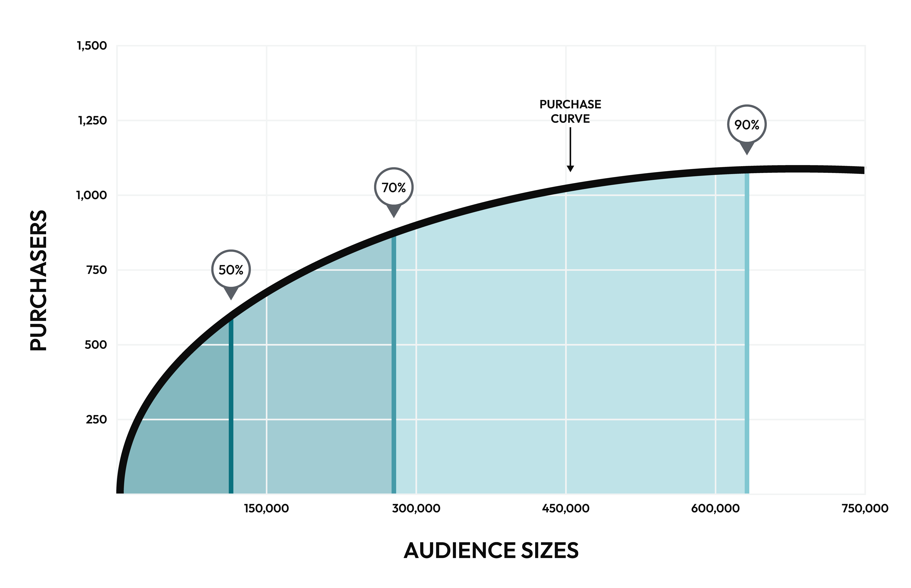

.. https://docs.amperity.com/ampiq/

.. meta::
    :description lang=en:
        Which customers are most likely to purchase?

.. meta::
    :content class=swiftype name=body data-type=text:
        Which customers are most likely to purchase?

.. meta::
    :content class=swiftype name=title data-type=string:
        Product affinity

==================================================
Product affinity
==================================================

.. include:: ../../shared/terms.rst
   :start-after: .. term-product-affinity-start
   :end-before: .. term-product-affinity-end

.. include:: ../../amperity_reference/source/model_product_affinity.rst
   :start-after: .. model-product-affinity-about-start
   :end-before: .. model-product-affinity-about-end

.. _models-product-affinity-use-cases:

Use cases
==================================================

.. models-product-affinity-use-cases-start

The product affinity model enables support for marketing campaigns that benefit from knowing a customer's preferences across product categories, including:

#. :ref:`Recommended audience sizes <models-product-affinity-use-cases-recommended-audiences>`
#. :ref:`Ranking customers by affinity <models-product-affinity-use-cases-customer-ranking>`

.. models-product-affinity-use-cases-end

.. _models-product-affinity-use-cases-recommended-audiences:

Recommended audience sizes
--------------------------------------------------

.. include:: ../../shared/terms.rst
   :start-after: .. term-recommended-audience-size-start
   :end-before: .. term-recommended-audience-size-end

.. include:: ../../amperity_reference/source/model_product_affinity.rst
   :start-after: .. model-product-affinity-use-cases-recommended-audiences-about-start
   :end-before: .. model-product-affinity-use-cases-recommended-audiences-about-end

.. include:: ../../amperity_reference/source/model_product_affinity.rst
   :start-after: .. model-product-affinity-recommended-audiences-usecase-start
   :end-before: .. model-product-affinity-recommended-audiences-usecase-end

.. include:: ../../amperity_reference/source/model_product_affinity.rst
   :start-after: .. model-product-affinity-use-cases-recommended-audiences-attributes-start
   :end-before: .. model-product-affinity-use-cases-recommended-audiences-attributes-end

.. _models-product-affinity-use-cases-customer-ranking:

Customer ranking
--------------------------------------------------

.. include:: ../../amperity_reference/source/model_product_affinity.rst
   :start-after: .. model-product-affinity-use-cases-customer-ranking-start
   :end-before: .. model-product-affinity-use-cases-customer-ranking-end

.. include:: ../../amperity_reference/source/model_product_affinity.rst
   :start-after: .. model-product-affinity-use-cases-customer-ranking-topn-start
   :end-before: .. model-product-affinity-use-cases-customer-ranking-topn-end

.. include:: ../../amperity_reference/source/model_product_affinity.rst
   :start-after: .. model-product-affinity-use-cases-customer-ranking-attribute-start
   :end-before: .. model-product-affinity-use-cases-customer-ranking-attribute-end
