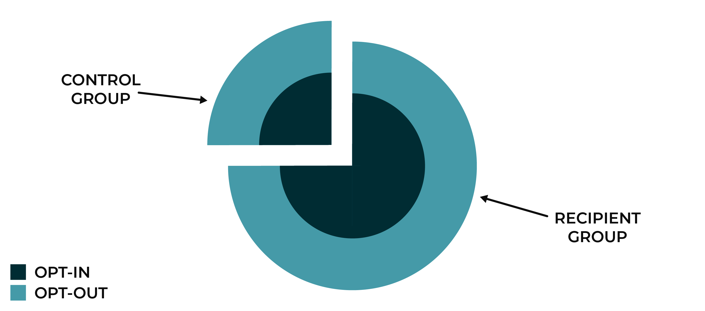

.. 
.. https://docs.amperity.com/ampiq/
.. 

.. meta::
    :description lang=en:
        How to use people-based measurement to assign customers to control and treatment groups, and then accurately measure the incremental effects these groups have on your campaigns.

.. meta::
    :content class=swiftype name=body data-type=text:
        How to use people-based measurement to assign customers to control and treatment groups, and then accurately measure the incremental effects these groups have on your campaigns.

.. meta::
    :content class=swiftype name=title data-type=string:
        People-based measurement

==================================================
People-based measurement
==================================================

.. include:: ../../shared/terms.rst
   :start-after: .. term-people-based-measurement-start
   :end-before: .. term-people-based-measurement-end

.. people-based-measurement-challenge-start

People-based measurement uses randomization to assign customers to control and treatment groups, which gives marketers the ability to accurately measure the incremental effects of a campaign.

.. people-based-measurement-challenge-end

.. _people-based-measurement-challenge:

The challenge of measuring opt-in data
==================================================

.. people-based-measurement-challenge-start

For example, how do you measure the effects of an email campaign without knowing which customers received that email and which did not, *even without knowing which customers have opted in to receiving email*?

It's a common assumption that having accurate opt-in and email response data is a requirement for measuring the incremental effects of an email campaign.

From the perspective of Amperity, accurate results tracking and access to opt-in details do not matter because Amperity uses people-based measurement to ensure accurate tracking as long as the experiment is set up with randomized control and treatment groups.

.. people-based-measurement-challenge-end

.. _people-based-measurement-whatis:

What is people-based measurement?
==================================================

.. people-based-measurement-whatis-start

People-based measurement tracks changes in behavior in a way that does not require knowing who received a campaign message by randomly assigning customers from a single homogeneous segment to the control and treatment groups for a campaign. That is all that is required to effectively measure behavioral changes.

This is a very different approach than channel-based measurement, which requires direct access to response metrics. For example, email campaign data typically includes opens, clicks, attributed revenue to links within the email, etc. The goal of channel-based measurement is to track which users received an email, and then for those users what actions were taken.

Whereas the goal of people-based measurement is to measure the revenue lift for your campaigns, regardless of the individual engagement actions each of your customers make.

.. people-based-measurement-whatis-end

.. people-based-measurement-whatis-admonition-start

.. admonition:: Why randomizing customers works

   Imagine that you are running a experiment to measure the effects of a cholesterol drug on patients. Randomly assign people to the control and treatment groups from a single segment of patients who share the same age range, demographics, and health profile.

   Some subset of these patients have a special gene that predisposes them to respond positively to this drug. How would this change the experiment?

   You could screen patients beforehand to ensure that only patients with this gene were included in the control and treatment groups. This approach could be costly and take a long time.

   You could accept that control and treatment groups have some mathematically equivalent ratio of patients with (and without) the special gene and that this ratio effectively represents the whole population.

   A customer's opt-in preference is similar to this special gene. Some customers are predisposed to be receptive to your message. When you add customers to your control and treatment groups randomly, you will get a mathematically equivalent ratio of customers who have opted in to receiving emails in both groups.

.. people-based-measurement-whatis-admonition-end

.. _people-based-measurement-example:

An example campaign
==================================================

.. people-based-measurement-example-start

A campaign is run for a segment of customers. A percentage of the customers in that segment have opted in to receiving email communications, but you do not know the percentage and you do not know which customers.

Assign these users to the control and treatment groups in your campaign randomly to ensure that the percentage of users in both groups is mathematically equivalent. This ensures that the customers in both groups share the same preferences, demographics, and opt-in status.

Amperity uses people-based measurement, which measures the changes in behavior between the control and treatment groups by comparing the customers in both groups to each other.

.. people-based-measurement-example-end

.. _people-based-measurement-whyitworks:

Why people-based measurement works
==================================================

.. people-based-measurement-whyitworks-start

Modern marketing tools increase the number of channels through which marketers can communicate with customers, provide access to highly-specific customer audiences, and make it possible to onboard previously unreachable sets of customers.

However, many of these modern marketing tools do not release contactability data, which makes it harder to measure the results of a channel-based campaign. For example, Facebook and Google provide the percentage of customers who were reachable, but do not provide data about which customers were served ad impressions or enhanced searches.

.. people-based-measurement-whyitworks-end

.. people-based-measurement-whyitworks-admonition-start

.. admonition:: People-based measurement is not new

   There are many forms of using people-based measurement to run a successful campaign.

   For example, catalog mailers do not know all of the users who saw a given piece of direct mail. Maybe the recipient threw the catalog out without looking at it? Maybe a neighbor picked the catalog up? Maybe the catalog was delivered to an address at which the intended recipient no longer resides?

   In these situations, people-based measurement compares the population of people to which the mailer was sent to people with valid addresses that did not receive the mailer, knowing that contactability is randomly distributed across both groups.

.. people-based-measurement-whyitworks-admonition-end

.. _people-based-measurement-another-example:

Another example campaign
==================================================

.. people-based-measurement-another-example-start

Socktown wants to run a new arrivals campaign that is focused on customers who have an affinity for athletic socks. Socktown does not have accurate opt-in data available to this campaign.

Socktown builds a relevant segment of customers without using opt-in filters, and then they run the campaign. The campaign might look like this:

.. list-table::
   :widths: 120 120 120 120 120
   :header-rows: 1

   * - Group
     - Size
     - Revenue
     - Increase
     - Total
   * - Control
     - 25,000
     - $0.068
     - 
     - 
   * - Recipient
     - 75,000
     - $0.11
     - $0.042
     - $3150

where the total revenue is equal to the number of customers times the difference in increased revenue between the control and treatment groups:

::

   75,000 * ($0.11 - $0.068) = $3150

How can this work when the campaign does not have visibility into who opted in? Is $3150 accurate? An analyst from Socktown pulls data from their email service provider. The analyst compares the lists of who, from each group, had opted in and opted out, and then compares that to the results for the campaign:

.. list-table::
   :widths: 120 120 120 120 120
   :header-rows: 1

   * - Group
     - Size
     - Revenue
     - Increase
     - Total
   * - Control, opt-out
     - 10,000
     - $0.05
     - 
     - 
   * - Control, opt-in
     - 15,000
     - $0.08
     - 
     - 
   * - Recipient, opt-out
     - 30,000
     - $0.05
     - 
     - 
   * - Recipient, opt-in
     - 45,000
     - $0.15
     - $0.07
     - $3150

where the total revenue is equal to the number of customers in each subset of the treatment group times the difference in increased revenue between those groups and the control group with opted in customers:

::

   30,000 * ($0.05 - $0.05) + 45,000 * ($0.15 - $0.08) = $3150

Comparing the entire control group (opted out *and* opted in) to both treatment groups (opted out *and* opted in) shows the same results as comparing only the groups who had opted in.

.. people-based-measurement-another-example-end
