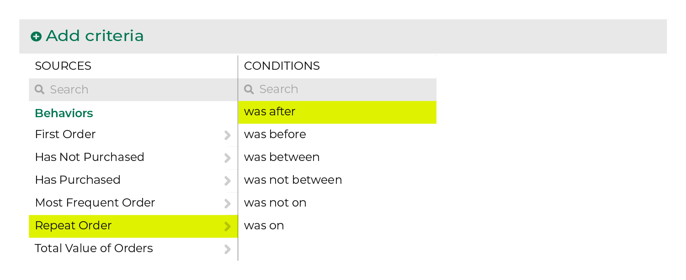

.. 
.. https://docs.amperity.com/ampiq/
.. 

.. meta::
    :description lang=en:
        Who made a repeat purchase during the specified date range?

.. meta::
    :content class=swiftype name=body data-type=text:
        Who made a repeat purchase during the specified date range?

.. meta::
    :content class=swiftype name=title data-type=string:
        Repeat order

==================================================
Repeat order
==================================================

.. include:: ../../amperity_reference/source/attribute_compound_repeat_order.rst
   :start-after: .. attribute-compound-repeat-order-start
   :end-before: .. attribute-compound-repeat-order-end

.. include:: ../../amperity_ampiq/source/purchase_behavior_first_order.rst
   :start-after: .. purchase-behavior-first-order-common-admonition-start
   :end-before: .. purchase-behavior-first-order-common-admonition-end

.. _purchase-behavior-repeat-order-howitworks:

How repeat order works
==================================================

.. include:: ../../amperity_reference/source/attribute_compound_repeat_order.rst
   :start-after: .. attribute-compound-repeat-order-howitworks-start
   :end-before: .. attribute-compound-repeat-order-howitworks-end

.. segments-behaviors-repeat-order-tip-start

.. tip:: For more information about how **Repeat Order** works, including an explanation of the SQL that runs behind the **Segment Editor**, review the |attribute_compound_repeat_order| topic in the Amperity A-Z reference.

.. segments-behaviors-repeat-order-tip-end

.. _purchase-behavior-repeat-order-useinsegment:

Use repeat order in a segment
==================================================

.. include:: ../../amperity_reference/source/attribute_compound_repeat_order.rst
   :start-after: .. attribute-compound-repeat-order-segments-start
   :end-before: .. attribute-compound-repeat-order-segments-end

.. include:: ../../amperity_reference/source/attribute_compound_repeat_order.rst
   :start-after: .. attribute-compound-repeat-order-segments-filters-start
   :end-before: .. attribute-compound-repeat-order-segments-filters-end
