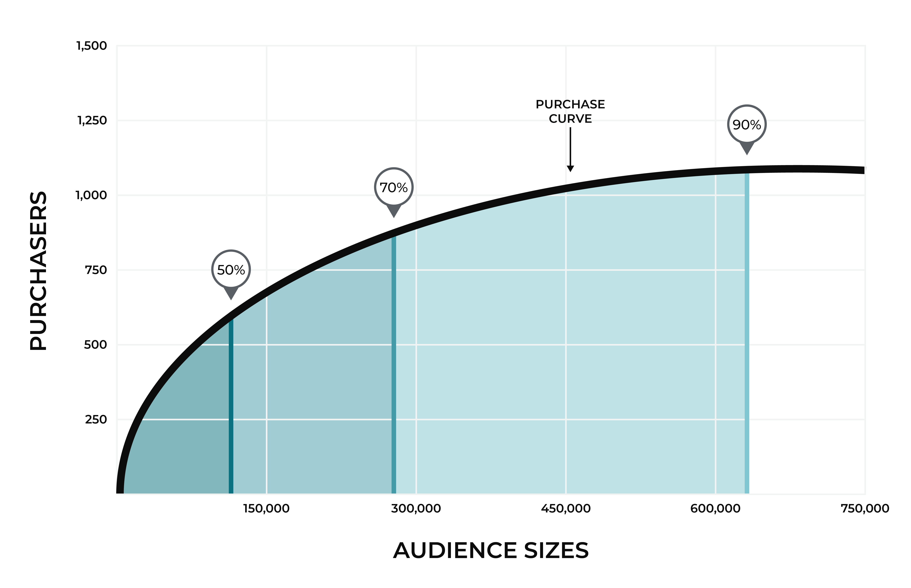
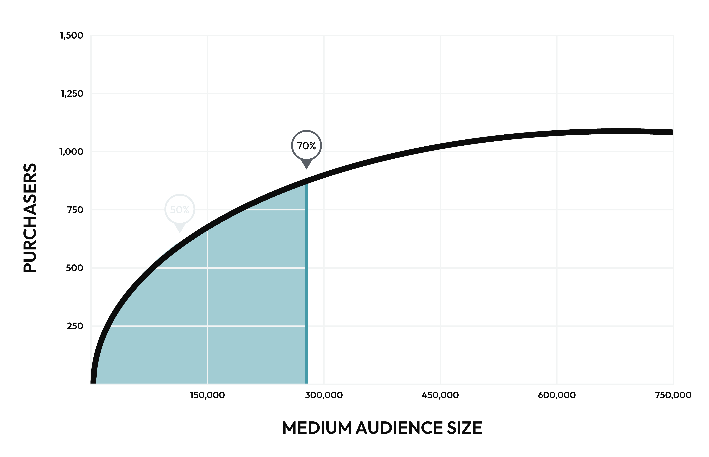

.. 
.. https://docs.amperity.com/ampiq/
.. 

.. meta::
    :description lang=en:
        How large of an audience is required to grow revenue over the next 30 days?

.. meta::
    :content class=swiftype name=body data-type=text:
        How large of an audience is required to grow revenue over the next 30 days?

.. meta::
    :content class=swiftype name=title data-type=string:
        Recommended audiences

==================================================
Recommended audiences
==================================================

.. include:: ../../shared/terms.rst
   :start-after: .. term-audience-start
   :end-before: .. term-audience-end

.. recommended-audiences-about-start

An audience may also represent the number of customers that are required to capture a certain number of purchases. For example, you may need an audience of 5000 customers to capture 200 purchases. The size of an audience will vary by brand, by product, by your marketing goals, and by trends in transaction histories.

.. recommended-audiences-about-end

.. include:: ../../shared/terms.rst
   :start-after: .. term-recommended-audience-size-start
   :end-before: .. term-recommended-audience-size-end

.. include:: ../../amperity_reference/source/model_product_affinity.rst
   :start-after: .. model-product-affinity-recommended-audiences-usecase-start
   :end-before: .. model-product-affinity-recommended-audiences-usecase-end

.. _recommended-audiences-purchase-curve:

About the purchase curve
==================================================

.. include:: ../../shared/terms.rst
   :start-after: .. term-purchase-curve-start
   :end-before: .. term-purchase-curve-end

.. recommended-audiences-purchase-curve-about-start

The following diagram highlights the purchase curve. The audience size is on the x-axis (horizontal) and the number of purchases is on the y-axis (vertical).

.. recommended-audiences-purchase-curve-about-end

.. recommended-audiences-purchase-curve-context-start

The first 20% of customers in an audience have a high degree of certainty and a strong signal. The last 20% have a much lower degree of certainty and a weak signal.

#. The 0-50% range quickly adds customers as the audience size grows. In this example, the purchase curve is steep for the first 100,000 customers because purchasers are being identified at a relatively fast rate.

#. The 50%-70% range starts to flatten out. A 70% rate requires almost 300,000 customers. At the lower end, there is still a strong signal, but at the higher end the signal has grown weaker.

#. The 70%-90% range requires a much larger audience size. In this example, more than 600,000 customers are required to get to a 90% audience size. This represents the degree of uncertainty when trying to reach customers in large audience sizes.

Use audience sizes to help determine the ideal number of customers to include in a segment. Compare the number of customers in the segment against the recommended audience sizes to help keep your segment at the most efficient point along the purchase curve for your use case and expected outcome.

.. recommended-audiences-purchase-curve-context-end

.. _recommended-audience-sizes:

About recommended audience sizes
==================================================

.. include:: ../../amperity_reference/source/model_product_affinity.rst
   :start-after: .. model-product-affinity-use-cases-recommended-audiences-about-start
   :end-before: .. model-product-affinity-use-cases-recommended-audiences-about-end

.. recommended-audience-sizes-example-start

For example, the following diagram shows a medium audience size, which also includes the small audience size:

.. recommended-audience-sizes-example-end

.. _recommended-audience-sizes-low-purchase-frequencies:

About low purchase frequencies
--------------------------------------------------

.. recommended-audience-sizes-low-purchase-frequencies-start

Recommended audiences are not generated for products with low purchase frequencies. A product with a low purchase frequency may require a very large number of potential customers to reach the small audience size (50%).

If you need to run a campaign for a product with a low purchase frequency, consider:

* Using your brand's minimum circulation size
* Defining a segment with an audience size that is 5x-20x larger than the number of customers who have purchased that product during the previous year

.. recommended-audience-sizes-low-purchase-frequencies-end

.. _recommended-audiences-howto:

How to use recommended audiences
==================================================

.. include:: ../../shared/terms.rst
   :start-after: .. term-product-affinity-start
   :end-before: .. term-product-affinity-end

.. recommended-audiences-howto-start

Use fields in the product affinity table to build segments that contain the right list of customers for your campaigns and are aligned to recommended audience sizes.

#. Start by associating product affinity to a smaller audience size, and then, depending on the goals of your campaign, increase the audience size until you have reached your campaign's circulation size and/or revenue goals.
#. For further refinement you can compare the audience size to customer ranking. Increase or decrease the audience size by small amounts until the list of customers that fall within the desired ranking also matches the circulation size and/or revenue goals.

You may also use audience size and customer ranking independently of each other, depending on what types of segments you want to build and what types of campaigns those segments will be associated with. For example, you can build a segment that uses ranking *or* audience size and not both.

.. recommended-audiences-howto-end

.. include:: ../../amperity_datagrid/source/table_predicted_affinity.rst
   :start-after: .. table-affinity-refresh-frequency-note-start
   :end-before: .. table-affinity-refresh-frequency-note-start

.. _recommended-audiences-howto-examples:

Use with segments
--------------------------------------------------

.. recommended-audiences-howto-examples-important-start

The best ways to use product affinity modeling within your tenant depends on what your campaign goals are, the type of product catalog you have defined, and the amount of historical transaction data that are provided to product affinity modeling. No segment and campaign is alike, though there are often patterns that can be reused.

.. recommended-audiences-howto-examples-important-end

.. recommended-audiences-howto-examples-start

Use the **Segments** page to build segments that use product affinity. Start by associating product affinity to a smaller audience size, and then, depending on the goals of your campaign, increase this size closer to the medium audience size. Combine audience sizes with rankings to identify the best customers within an audience.

The small and medium audience sizes capture the most enthusiastic customers. A large audience size represents the upper bound for any reasonable level of engagement. It is recommended to never message an audience larger than a large audience size.

.. recommended-audiences-howto-examples-end

.. _recommended-audiences-howto-validate-campaigns:

Validate campaigns
--------------------------------------------------

.. recommended-audiences-howto-validate-campaigns-start

The best approach to validate the successful use of product affinity modeling in a campaign is to use two segment and campaign pairs. The first pair is based on product affinity and the other pair is not. Configure each campaign for a 30% hold-out, and then send the same campaign message to both lists.

You should expect to see more revenue from a campaign that is based on product affinity.

You may observe a lower unsubscribe rate with a campaign that is based on product affinity (if you have access to a data source that can provide email response statistics). A lower unsubscribe rate on a more targeted section of your customer base can reduce the overall unsubscribe rate among your larger set of customers.

For example:

* Unsubscribe rates without product affinity is ~5%. If you send 120k emails at a 5% unsubscribe rate, that's 6k unsubscribes.
* Unsubscribe rates with product affinity is ~3%. If you send 60k emails at a 3% unsubscribe rate, that's 1800 unsubscribes and 4200 fewer than the list without product affinity.

.. recommended-audiences-howto-validate-campaigns-end
