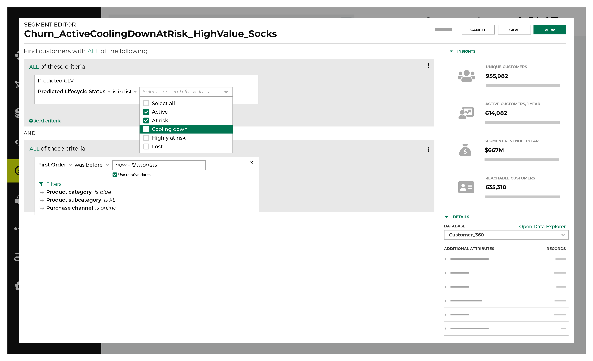
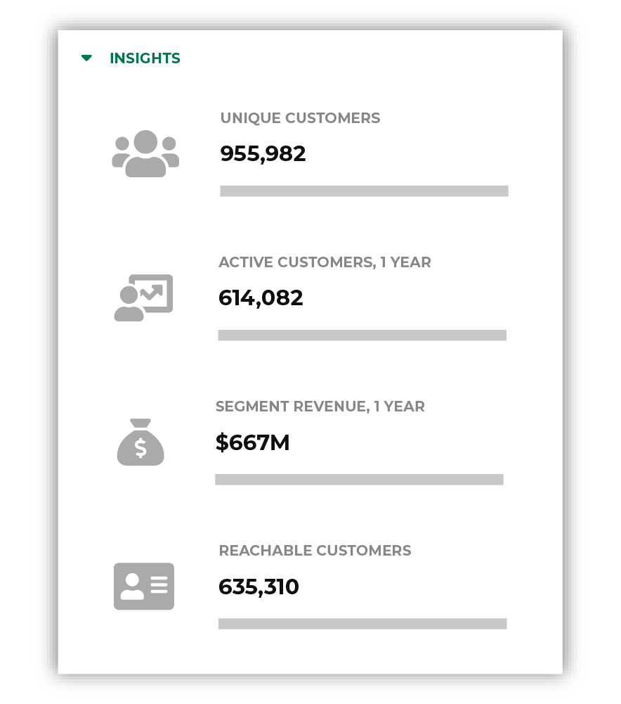

.. 
.. https://docs.amperity.com/ampiq/
.. 

.. meta::
    :description lang=en:
        Build audiences using the Segment Editor, view segment summaries and statistics, and then use those audiences within your campaigns.

.. meta::
    :content class=swiftype name=body data-type=text:
        Build audiences using the Segment Editor, view segment summaries and statistics, and then use those audiences within your campaigns.

.. meta::
    :content class=swiftype name=title data-type=string:
        About segments

==================================================
About segments
==================================================

.. include:: ../../shared/terms.rst
   :start-after: .. term-segment-start
   :end-before: .. term-segment-end

.. include:: ../../shared/channels.rst
   :start-after: .. channels-build-segment-start
   :end-before: .. channels-build-segment-end

.. _segments-reference-page:

About the Segments page
==================================================

.. include:: ../../shared/terms.rst
   :start-after: .. term-segments-tab-start
   :end-before: .. term-segments-tab-end

.. image:: ../../images/mockup-segments-tab.png
   :width: 600 px
   :alt: The Segments page.
   :align: left
   :class: no-scaled-link

.. include:: ../../amperity_reference/source/segments.rst
   :start-after: .. segments-page-start
   :end-before: .. segments-page-end

.. _segments-reference-tabs:

Segment tabs
==================================================

.. include:: ../../amperity_reference/source/segments.rst
   :start-after: .. segments-tabs-start
   :end-before: .. segments-tabs-end

.. _segments-howitworks-segment-summary:

Summary tab
--------------------------------------------------

.. include:: ../../amperity_reference/source/segments.rst
   :start-after: .. segments-summary-start
   :end-before: .. segments-summary-end

.. image:: ../../images/mockup-segments-summary.png
   :width: 600 px
   :alt: A summary page available after a segment is activated.
   :align: left
   :class: no-scaled-link

.. include:: ../../amperity_reference/source/segments.rst
   :start-after: .. segments-summary-details-start
   :end-before: .. segments-overview-details-end

.. _segments-howitworks-segment-breakdown:

Breakdown tab
--------------------------------------------------

.. include:: ../../amperity_reference/source/segments.rst
   :start-after: .. segments-breakdown-details-start
   :end-before: .. segments-breakdown-details-end

.. image:: ../../images/mockup-segments-breakdown.png
   :width: 600 px
   :alt: The Breakdown tab for a segment.
   :align: left
   :class: no-scaled-link

.. _segments-howitworks-segment-compare:

Compare tab
--------------------------------------------------

.. include:: ../../amperity_reference/source/segments.rst
   :start-after: .. segments-compare-details-start
   :end-before: .. segments-compare-details-end

.. image:: ../../images/mockup-segments-compare-metrics.png
   :width: 600 px
   :alt: The Compare tab for a segment.
   :align: left
   :class: no-scaled-link

.. include:: ../../amperity_reference/source/segments.rst
   :start-after: .. segments-compare-overlap-start
   :end-before: .. segments-compare-overlap-end

.. image:: ../../images/mockup-segments-compare-overlap.png
   :width: 600 px
   :alt: The Compare tab for a segment, showing segment overlap.
   :align: left
   :class: no-scaled-link

.. _segments-howitworks-segment-customers:

Customers tab
--------------------------------------------------

.. include:: ../../amperity_reference/source/segments.rst
   :start-after: .. segments-customers-start
   :end-before: .. segments-customers-end

.. image:: ../../images/mockup-segments-customers.png
   :width: 600 px
   :alt: The Customers tab for a segment.
   :align: left
   :class: no-scaled-link

.. _segments-reference-howitworks:

How segments work
==================================================

.. include:: ../../shared/terms.rst
   :start-after: .. term-visual-segment-editor-start
   :end-before: .. term-visual-segment-editor-end

.. segments-howitworks-start

The **Segment Editor** is available from the **Segments** page. Click **Create Segment** from the **Segments** page to open the editor, and then start building your segment.

.. segments-howitworks-end

.. segments-howitworks-steps-start

Follow this sequence when building a segment:

.. segments-howitworks-steps-end

.. include:: ../../amperity_ampiq/source/segments.rst
   :start-after: .. segments-howitworks-callouts-start
   :end-before: .. segments-howitworks-callouts-end

.. _segments-reference-names:

Segment names
==================================================

.. include:: ../../amperity_reference/source/segments_editor.rst
   :start-after: .. segments-editor-names-start
   :end-before: .. segments-editor-names-end

.. include:: ../../amperity_reference/source/segments_editor.rst
   :start-after: .. segments-editor-names-important-start
   :end-before: .. segments-editor-names-important-end

.. _segments-reference-inclusions-exclusions:

Inclusions and exclusions
==================================================

.. include:: ../../amperity_reference/source/segments_editor.rst
   :start-after: .. segments-editor-inclusions-start
   :end-before: .. segments-editor-inclusions-end

.. include:: ../../amperity_reference/source/segments_editor.rst
   :start-after: .. segments-editor-exclusions-start
   :end-before: .. segments-editor-exclusions-end

.. _segments-reference-attributes:

Attributes
==================================================

.. include:: ../../amperity_reference/source/segments_editor.rst
   :start-after: .. segments-editor-condition-attributes-start
   :end-before: .. segments-editor-condition-attributes-end

.. tip:: Amperity makes attributes available as :doc:`standard output <standard_output>`.

   .. include:: ../../amperity_ampiq/source/standard_output.rst
      :start-after: .. standard-output-overview-start
      :end-before: .. standard-output-overview-end

.. _segments-reference-customer-lists:

Customer lists
==================================================

.. include:: ../../amperity_reference/source/segments_editor.rst
   :start-after: .. segments-editor-customer-lists-start
   :end-before: .. segments-editor-customer-lists-end

.. _segments-reference-purchase-behaviors:

Purchase behaviors
==================================================

.. include:: ../../shared/terms.rst
   :start-after: .. term-transactional-behavior-start
   :end-before: .. term-transactional-behavior-end

.. segments-purchase-behaviors-start

You can use any of the following purchase behaviors in your segments:

* :doc:`First order <purchase_behavior_first_order>`
* :doc:`Has not purchased <purchase_behavior_has_not_purchased>`
* :doc:`Has purchased <purchase_behavior_has_purchased>`
* :doc:`Most frequent order <purchase_behavior_most_frequent_order>`
* :doc:`Repeat order <purchase_behavior_repeat_order>`
* :doc:`Total value of orders <purchase_behavior_total_value_of_orders>`

.. note:: Your tenant must use Amperity standard field names, including for your product catalog, to use purchase behaviors in your segments.

.. segments-add-transactional-behaviors-end

.. _segments-reference-segment-insights:

Segment insights
==================================================

.. TODO: This section is included into the segments 1-2-3 topic.

.. segments-reference-segment-insights-start

Segment insights show you answers to the following questions:

* How many customers are in your segment?
* How many of these customers have been active in the past year?
* How much did these customers spend in the past year?
* How many of these customers have a contactable email address, phone number, or physical address?

When you start building a segment, the values for segment insights represent 100% of your customers and revenue across all categories.

As you refine your segment by adding more attributes you can use the **Refresh** button to update the answers to those four questions.

For example:

.. segments-reference-segment-insights-end

.. include:: ../../amperity_reference/source/segments_editor.rst
   :start-after: .. segments-editor-insights-categories-start
   :end-before: .. segments-editor-insights-categories-end

.. include:: ../../amperity_reference/source/segments_editor.rst
   :start-after: .. segments-editor-insights-note-start
   :end-before: .. segments-editor-insights-note-end

.. _segments-reference-and-vs-or:

AND vs. OR
==================================================

.. include:: ../../amperity_reference/source/segments_editor.rst
   :start-after: .. segments-editor-and-vs-or-intro-start
   :end-before: .. segments-editor-and-vs-or-intro-end

.. _segments-reference-and-vs-or-context:

How AND and OR work
--------------------------------------------------

.. include:: ../../amperity_reference/source/segments_editor.rst
   :start-after: .. segments-editor-and-vs-or-start
   :end-before: .. segments-editor-and-vs-or-end

.. _segments-reference-database-tables:

Databases and tables
==================================================

.. include:: ../../amperity_reference/source/segments_editor.rst
   :start-after: .. segments-editor-databases-and-tables-start
   :end-before: .. segments-editor-databases-and-tables-end

.. _segments-reference-sql-editor:

SQL editor
==================================================

.. include:: ../../amperity_reference/source/segments_editor.rst
   :start-after: .. segments-editor-sql-start
   :end-before: .. segments-editor-sql-end

.. include:: ../../amperity_reference/source/segments_editor.rst
   :start-after: .. segments-editor-sql-requirements-start
   :end-before: .. segments-editor-sql-requirements-end

**Example SQL segment**

.. include:: ../../amperity_reference/source/segments_editor.rst
   :start-after: .. segments-editor-sql-example-start
   :end-before: .. segments-editor-sql-example-end
