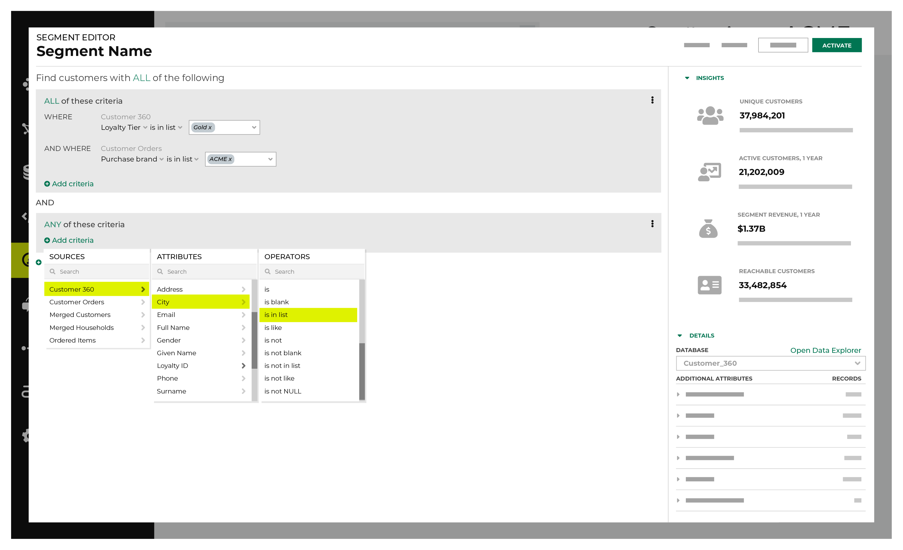

.. 
.. https://docs.amperity.com/ampiq/
.. 

.. meta::
    :description lang=en:
        Build audiences using the Segment Editor, view segment summaries and statistics, and then use those audiences within your campaigns.

.. meta::
    :content class=swiftype name=body data-type=text:
        Build audiences using the Segment Editor, view segment summaries and statistics, and then use those audiences within your campaigns.

.. meta::
    :content class=swiftype name=title data-type=string:
        About segments

==================================================
About segments
==================================================

.. include:: ../../shared/terms.rst
   :start-after: .. term-segment-start
   :end-before: .. term-segment-end

.. include:: ../../shared/channels.rst
   :start-after: .. channels-build-segment-start
   :end-before: .. channels-build-segment-end

.. _segments-reference-page:

About the Segments page
==================================================

.. include:: ../../amperity_reference/source/segments.rst
   :start-after: .. segments-tab-start
   :end-before: .. segments-tab-end

.. image:: ../../images/mockup-segments-tab.png
   :width: 600 px
   :alt: The Segments page.
   :align: left
   :class: no-scaled-link

.. _segments-reference-page-summary:

Summary page
--------------------------------------------------

.. include:: ../../amperity_reference/source/segments.rst
   :start-after: .. segments-howitworks-segment-summary-start
   :end-before: .. segments-howitworks-segment-summary-end

.. image:: ../../images/mockup-segments-insights.png
   :width: 600 px
   :alt: A summary page available after a segment is activated.
   :align: left
   :class: no-scaled-link

.. include:: ../../amperity_reference/source/segments.rst
   :start-after: .. segments-howitworks-segment-summary-details-start
   :end-before: .. segments-howitworks-segment-overview-details-end

.. _segments-reference-howitworks:

How segments work
==================================================

.. include:: ../../shared/terms.rst
   :start-after: .. term-visual-segment-editor-start
   :end-before: .. term-visual-segment-editor-end

.. include:: ../../amperity_reference/source/segments.rst
   :start-after: .. segments-howitworks-start
   :end-before: .. segments-howitworks-end

.. include:: ../../amperity_reference/source/segments.rst
   :start-after: .. segments-howitworks-steps-start
   :end-before: .. segments-howitworks-steps-end

.. include:: ../../amperity_ampiq/source/segments.rst
   :start-after: .. segments-howitworks-callouts-start
   :end-before: .. segments-howitworks-callouts-end

.. _segments-reference-names:

Segment names
==================================================

.. include:: ../../amperity_reference/source/segments.rst
   :start-after: .. segments-howitworks-segment-names-start
   :end-before: .. segments-howitworks-segment-names-end

.. include:: ../../amperity_reference/source/segments.rst
   :start-after: .. segments-names-important-message-about-segment-names-start
   :end-before: .. segments-names-important-message-about-segment-names-end

.. _segments-reference-attributes:

Attributes
==================================================

.. include:: ../../amperity_reference/source/segments.rst
   :start-after: .. segments-add-attribute-start
   :end-before: .. segments-add-attribute-end

.. tip:: Amperity makes attributes available to you as part of :doc:`standard output <standard_output>`.

   .. include:: ../../amperity_ampiq/source/standard_output.rst
      :start-after: .. standard-output-overview-start
      :end-before: .. standard-output-overview-end

.. _segments-reference-purchase-behaviors:

Purchase behaviors
==================================================

.. include:: ../../shared/terms.rst
   :start-after: .. term-transactional-behavior-start
   :end-before: .. term-transactional-behavior-end

.. segments-purchase-behaviors-start

You can use any of the following purchase behaviors in your segments:

* :doc:`First order <purchase_behavior_first_order>`
* :doc:`Has not purchased <purchase_behavior_has_not_purchased>`
* :doc:`Has purchased <purchase_behavior_has_purchased>`
* :doc:`Most frequent order <purchase_behavior_most_frequent_order>`
* :doc:`Repeat order <purchase_behavior_repeat_order>`
* :doc:`Total value of orders <purchase_behavior_total_value_of_orders>`

.. note:: Your tenant must use Amperity standard field names, including for your product catalog, to use purchase behaviors in your segments.

.. segments-add-transactional-behaviors-end

.. _segments-reference-segment-insights:

Segment insights
==================================================

.. TODO: This section is included into the segments 1-2-3 topic.

.. segments-reference-segment-insights-start

Segment insights show you answers to the following questions:

* How many customers are in your segment?
* How many of these customers have been active in the past year?
* How much did these customers spend in the past year?
* How many of these customers have a contactable email address, phone number, or physical address?

When you start building a segment, the values for segment insights represent 100% of your customers and revenue across all categories.

As you refine your segment by adding more attributes you can use the **Refresh** button to update the answers to those four questions.

For example:

.. image:: ../../images/mockup-segments-tab-segment-insights.png
   :width: 360 px
   :alt: Use segment insights to understand the value of your segment.
   :align: left
   :class: no-scaled-link

.. segments-reference-segment-insights-end

.. include:: ../../amperity_reference/source/segments.rst
   :start-after: .. segments-insights-categories-start
   :end-before: .. segments-insights-categories-end

.. include:: ../../amperity_reference/source/segments.rst
   :start-after: .. segments-insights-note-start
   :end-before: .. segments-insights-note-end

.. _segments-reference-revenue-tree:

Revenue tree
==================================================

.. include:: ../../amperity_reference/source/segments.rst
   :start-after: .. segments-insights-revenue-tree-start
   :end-before: .. segments-insights-revenue-tree-end

.. _segments-reference-database-tables:

Databases and tables
==================================================

.. include:: ../../amperity_reference/source/segments.rst
   :start-after: .. segments-howitworks-database-tables-start
   :end-before: .. segments-howitworks-database-tables-end

.. _segments-reference-and-vs-or:

AND vs. OR
==================================================

.. include:: ../../amperity_reference/source/segments.rst
   :start-after: .. segments-howitworks-and-vs-or-start
   :end-before: .. segments-howitworks-and-vs-or-end

.. _segments-reference-and-vs-or-context:

How AND and OR work
--------------------------------------------------

.. include:: ../../amperity_reference/source/segments.rst
   :start-after: .. segments-howitworks-and-vs-or-context-start
   :end-before: .. segments-howitworks-and-vs-or-context-end

.. _segments-reference-sql-editor:

SQL editor
==================================================

.. include:: ../../shared/terms.rst
   :start-after: .. term-sql-segment-editor-start
   :end-before: .. term-sql-segment-editor-end

.. note::

   .. include:: ../../amperity_reference/source/segments.rst
      :start-after: .. segments-howitworks-sql-editor-start
      :end-before: .. segments-howitworks-sql-editor-end

.. include:: ../../amperity_reference/source/segments.rst
   :start-after: .. segments-howitworks-sql-editor-requirements-start
   :end-before: .. segments-howitworks-sql-editor-requirements-end

**Example segments**

.. include:: ../../amperity_reference/source/segments.rst
   :start-after: .. segments-howitworks-sql-editor-examples-start
   :end-before: .. segments-howitworks-sql-editor-examples-end

.. _segments-reference-overview:

Segment overview
==================================================

.. include:: ../../amperity_reference/source/segments.rst
   :start-after: .. segments-overview-start
   :end-before: .. segments-overview-end

.. image:: ../../images/mockup-segments-insights.png
   :width: 600 px
   :alt: A segment overview available after a segment is activated.
   :align: left
   :class: no-scaled-link

.. _segments-reference-overview-summary:

Summary
--------------------------------------------------

.. include:: ../../amperity_reference/source/segments.rst
   :start-after: .. segments-overview-summary-start
   :end-before: .. segments-overview-summary-end

.. _segments-reference-overview-customer-details:

Customer details
--------------------------------------------------

.. include:: ../../amperity_reference/source/segments.rst
   :start-after: .. segments-overview-customer-details-start
   :end-before: .. segments-overview-customer-details-end
