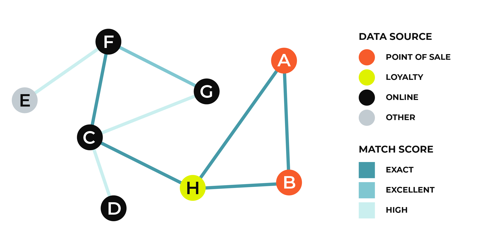

.. 
.. https://docs.amperity.com/
.. 

.. meta::
    :description lang=en:
        The Amperity ID is a multi-patented identifier that is built on a daily basis and assigns a unique identifier---the Amperity ID---to each unique individual.

.. meta::
    :content class=swiftype name=body data-type=text:
        The Amperity ID is a multi-patented identifier that is built on a daily basis and assigns a unique identifier---the Amperity ID---to each unique individual.

.. meta::
    :content class=swiftype name=title data-type=string:
        About AmpID

==================================================
About AmpID
==================================================

.. include:: ../../shared/terms.rst
   :start-after: .. term-ampid-start
   :end-before: .. term-ampid-end

.. ampid-about-start

Every system has its own way of identifying customers. The longer a person interacts with your brand, the more fragmented their identity becomes. This leads to inaccurate insights, misattributed segments, and personalization that isn't personal. AmpID correctly identifies each of your unique individual customers, allowing you to drive the customer experiences you want.

* AmpID is a multi-patented process that runs on a daily basis, unifying records that other approaches to identity resolution routinely over- and under-connect.
* AmpID can do this across massive amounts of data sources, including from online and offline transactions, clickstream, loyalty, email, and more.
* AmpID assigns a unique identifier to each unique individual: the Amperity ID. This ID is a stable, universal identifier that spans loyalty programs, email, transactions and all other systems.
* The Amperity ID remains stable over time, even as new data is provided to Amperity as customers engage and provide new PII.

.. ampid-about-end

.. _ampid-about-identity-resolution:

Identity resolution
==================================================

.. include:: ../../shared/terms.rst
   :start-after: .. term-identity-resolution-start
   :end-before: .. term-identity-resolution-end

.. ampid-about-identity-resolution-goal-start

The goal of identity resolution is to identify the same individual within and across all data sources that contain customer information.

.. ampid-about-identity-resolution-goal-end

.. ampid-about-identity-resolution-view-start

A complete view of your customers must combine each individual's transactions from multiple sources, including point-of-sale, e-commerce, email interactions, loyalty programs, and mobile app engagement. It must include historical data as well as current data that’s produced as customers interact with your brand.

.. ampid-about-identity-resolution-view-end

.. _ampid-about-transitive-connections:

Transitive connections
==================================================

.. include:: ../../shared/terms.rst
   :start-after: .. term-transitive-connection-start
   :end-before: .. term-transitive-connection-end

.. ampid-about-transitive-connections-start

Amperity identifies transitive connections using a patented clustering algorithm that eliminates record-pairs with genuine conflicts while preserving record-pairs that do not match, but also do not have genuine conflicts.

.. ampid-about-transitive-connections-end

.. ampid-about-transitive-connections-example-start

The following example shows transitive connections within a cluster graph as it might appear from the **Cluster Graph** tab in the **Data Explorer**. Although the PII for this customer’s transactions from a store's point of sale (A and B) do not match online purchases (C, D, G, and F), they have a transitive connection from the shared relationships with the loyalty program (H).

.. ampid-about-transitive-connections-example-end

.. _ampid-common-workflows:

Common workflows
==================================================

.. ampid-common-workflows-start

The most common workflows for AmpID focus on interacting with ID graphs for the purpose of associating the Amperity ID to your customer data. AmpID uses AI-powered probabilistic identity resolution to assign the Amperity ID to all customers in the data, which enables the following workflows:

* First-party customer ID graphs
* Householding customer ID graphs
* Third-party customer ID graphs
* Exploring Stitch results across all of your customer data

Use SQL segment editors to query ID graphs and QA data for the purpose of:

* Linking the Amperity ID (first-party) to third-party provider person IDs
* Building a true count of a brand's customers
* Exporting ID graphs to downstream workflows
* Using data hygiene to verify accuracy of PII with third-party data providers
* Standardizing data for certain PII details
* Linking unknown IDs to known customers
* Mapping anonymous users to known customers

.. ampid-common-workflows-end

.. _ampid-about-stitch:

About Stitch
==================================================

.. include:: ../../shared/terms.rst
   :start-after: .. term-stitch-start
   :end-before: .. term-stitch-end

.. include:: ../../shared/terms.rst
   :start-after: .. term-stitch-tab-start
   :end-before: .. term-stitch-tab-end

.. image:: ../../images/mockup-stitch-tab.png
   :width: 600 px
   :alt: The Stitch page in Amperity.
   :align: left
   :class: no-scaled-link

.. _ampid-stitch-explore-amperity-ids:

Explore Amperity IDs
==================================================

.. include:: ../../shared/terms.rst
   :start-after: .. term-amperity-id-start
   :end-before: .. term-amperity-id-end

.. include:: ../../amperity_reference/source/stitch_results.rst
   :start-after: .. stitch-explore-by-amperity-id-start
   :end-before: .. stitch-explore-by-amperity-id-end

.. _ampid-stitch-explore-data-sources:

Explore data sources
==================================================

.. include:: ../../amperity_reference/source/stitch_results.rst
   :start-after: .. stitch-explore-by-data-source-start
   :end-before: .. stitch-explore-by-data-source-end

.. include:: ../../amperity_reference/source/stitch_results.rst
   :start-after: .. stitch-explore-by-data-source-upset-plot-start
   :end-before: .. stitch-explore-by-data-source-upset-plot-end

.. image:: ../../images/mockup-stitch-tab-upset-plot.png
   :width: 450 px
   :alt: An UpSet plot chart, located within the Stitch page in Amperity.
   :align: left
   :class: no-scaled-link

.. include:: ../../amperity_reference/source/stitch_results.rst
   :start-after: .. stitch-explore-by-data-source-upset-plot-explanation-start
   :end-before: .. stitch-explore-by-data-source-upset-plot-explanation-end

.. _ampid-stitch-explore-semantics:

Explore semantics
==================================================

.. include:: ../../shared/terms.rst
   :start-after: .. term-semantic-start
   :end-before: .. term-semantic-end

.. include:: ../../amperity_reference/source/stitch_results.rst
   :start-after: .. stitch-explore-semantics-start
   :end-before: .. stitch-explore-semantics-end

.. _ampid-stitch-explore-data:

Explore stitched data
==================================================

.. ampid-stitch-explore-data-start

The **Stitch** page shows the outcome of the Stitch process, including the number of unique Amperity IDs in customer data and a series of charts that highlight the connectivity between data sources.

.. ampid-stitch-explore-data-end

.. _ampid-stitch-cluster-graphs:

Cluster graphs
--------------------------------------------------

.. include:: ../../shared/terms.rst
   :start-after: .. term-clustering-start
   :end-before: .. term-clustering-end

.. include:: ../../shared/terms.rst
   :start-after: .. term-cluster-graph-start
   :end-before: .. term-cluster-graph-end

.. include:: ../../amperity_reference/source/stitch_results.rst
   :start-after: .. stitch-explore-cluster-graph-start
   :end-before: .. stitch-explore-cluster-graph-end

.. image:: ../../images/mockup-stitch-tab-cluster-graph.png
   :width: 600 px
   :alt: The data explorer, showing the cluster graph.
   :align: left
   :class: no-scaled-link

.. _ampid-stitch-deduplication-rates:

Deduplication rates
--------------------------------------------------

.. include:: ../../shared/terms.rst
   :start-after: .. term-deduplication-rate-start
   :end-before: .. term-deduplication-rate-end

**Example**

.. include:: ../../amperity_reference/source/stitch_results.rst
   :start-after: .. stitch-explore-deduplication-rate-example-start
   :end-before: .. stitch-explore-deduplication-rate-example-end

.. _ampid-stitch-pairwise-connections:

Pairwise connections
--------------------------------------------------

.. include:: ../../shared/terms.rst
   :start-after: .. term-pairwise-connection-start
   :end-before: .. term-pairwise-connection-end

.. include:: ../../amperity_reference/source/stitch_results.rst
   :start-after: .. stitch-explore-pairwise-connections-start
   :end-before: .. stitch-explore-pairwise-connections-end

.. image:: ../../images/mockup-stitch-tab-pairwise-connection.png
   :width: 600 px
   :alt: The data explorer, showing pairwise connections.
   :align: left
   :class: no-scaled-link

.. include:: ../../shared/terms.rst
   :start-after: .. term-pairwise-connection-score-start
   :end-before: .. term-pairwise-connection-score-end

.. _ampid-stitch-records:

Stitched records
--------------------------------------------------

.. include:: ../../shared/terms.rst
   :start-after: .. term-stitched-record-start
   :end-before: .. term-stitched-record-end

.. include:: ../../amperity_reference/source/stitch_results.rst
   :start-after: .. stitch-explore-stitched-records-start
   :end-before: .. stitch-explore-stitched-records-end

.. image:: ../../images/mockup-stitch-tab-stitched-records.png
   :width: 600 px
   :alt: The data explorer, showing stitched records.
   :align: left
   :class: no-scaled-link

.. _ampid-stitch-configure:

Configure Stitch
==================================================

.. ampid-stitch-configure-start

Stitch is pre-configured to:

* Perform ID resolution against customer records that are tagged with profile semantics
* Apply blocking strategies
* Apply clustering algorithms
* Apply common email address patterns
* Apply thresholds for trivial duplicates
* Identify supersized clusters
* Prioritize foreign keys over separation keys
* Apply matching thresholds

.. caution:: Stitch configuration does not require modification for most situations. In some cases, after consultation with your Amperity representative and closely investigating the results of Stitch output against your customer data, adjusting Stitch configuration settings may be helpful.

Common scenarios for additional tuning of Stitch outcomes include workflows that:

* Block certain profile values from Stitch
* Ensure certain values are included for Stitch, but blocked from the customer 360 database
* Apply labels to Stitch output that resolve situations where overclustering and/or underclustering of records occurred
* Include or exclude specific Amperity IDs

.. note:: Your Amperity administrator will use tools that are part of DataGrid to perform Stitch QA, which is a workflow that verifies the end-to-end quality of Stitch results. Stitch QA is a series of SQL queries that are run against tables in the customer 360 database. Depending on the results of these queries, additional human effort is sometimes necessary to understand how and why Stitch created certain outcomes, after which next steps can be identified.

.. ampid-stitch-configure-end
