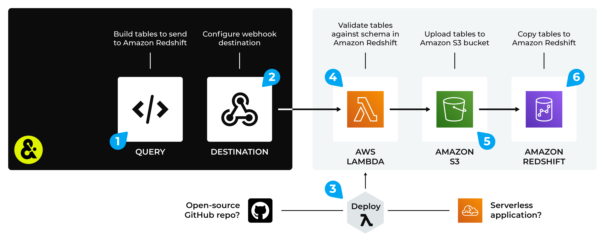

.. 
.. https://docs.amperity.com/datagrid/
.. 

.. |destination-name| replace:: Amazon Redshift
.. |plugin-namex| replace:: Amazon Redshift
.. |what-send| replace:: table rows that match a table schema
.. |filter-the-list| replace:: "ama"
.. |data-template-name| replace:: |destination-name|
.. |data-template-description| replace:: Send |what-send| to |destination-name|.
.. |data-template-config-settings-list| replace:: settings required by |destination-name| were
.. |data-template-config-settings-list-them-vs-it| replace:: them
.. |sendto-link| replace:: |sendto_amazon_redshift|

.. meta::
    :description lang=en:
        Configure Amperity to send data to Amazon Redshift.

.. meta::
    :content class=swiftype name=body data-type=text:
        Configure Amperity to send data to Amazon Redshift.

.. meta::
    :content class=swiftype name=title data-type=string:
        Send data to Amazon Redshift

==================================================
Send data to Amazon Redshift
==================================================

.. include:: ../../shared/terms.rst
   :start-after: .. term-amazon-redshift-start
   :end-before: .. term-amazon-redshift-end

.. destination-amazon-redshift-steps-to-send-start

.. include:: ../../shared/destinations.rst
   :start-after: .. destinations-overview-list-intro-start
   :end-before: .. destinations-overview-list-intro-end

#. :ref:`Get details <destination-amazon-redshift-get-details>`
#. :ref:`Configure Amazon Redshift <destination-amazon-redshift-configure>`
#. :ref:`Add webhook destination <destination-amazon-redshift-add-destination>`
#. :ref:`Add data template <destination-amazon-redshift-add-data-template>`

.. destination-amazon-redshift-steps-to-send-end

.. _destination-amazon-redshift-howitworks:

How this destination works
==================================================

.. destination-amazon-redshift-howitworks-start

Use |destination-name| to send data from Amperity to a Lambda function that automates uploading that file to an Amazon S3 bucket, after which that data is copied directly to a table in |destination-name|.

.. destination-amazon-redshift-howitworks-end

.. destination-amazon-redshift-howitworks-callouts-start

An |destination-name| destination works like this:

#. Use a query to build a table with rows that match the schema of a table in |destination-name|.
#. Configure a webhook destination to send data to a Lambda function that is running in AWS Lambda.
#. Deploy a Lambda function to AWS Lambda. The Lambda function may be deployed as a serverless application (recommended) or it may be a custom Lambda function that you have built using the open source toolkit provided by Amperity, and then uploaded to AWS Lambda.
#. Configure the Lambda function to run against the data that is sent from Amperity. The Lambda function will ensure that the data sent from Amperity matches the schema of the table in |destination-name|.
#. The Lambda function uploads validated data to an Amazon S3 bucket.
#. Data is copied to a table in |destination-name| from that Amazon S3 bucket.

.. destination-amazon-redshift-howitworks-callouts-end

.. _destination-amazon-redshift-get-details:

Get details
==================================================

.. destination-amazon-redshift-get-details-start

|destination-name| requires the following configuration details:

.. list-table::
   :widths: 10 90
   :header-rows: 0

   * - .. image:: ../../images/steps-check-off-black.png
          :width: 60 px
          :alt: Detail one.
          :align: left
          :class: no-scaled-link
     - A Lambda function must be uploaded to AWS Lambda that is running in your Amazon AWS account, and then configured to be available to Amperity.

   * - .. image:: ../../images/steps-check-off-black.png
          :width: 60 px
          :alt: Detail one.
          :align: left
          :class: no-scaled-link
     - An Amazon S3 bucket must be created. The Lambda function will send data to the Amazon S3 bucket, after which that data will be loaded to |destination-name|.

   * - .. image:: ../../images/steps-check-off-black.png
          :width: 60 px
          :alt: Detail one.
          :align: left
          :class: no-scaled-link
     - |destination-name| must be enabled in your Amazon AWS account.

   * - .. image:: ../../images/steps-check-off-black.png
          :width: 60 px
          :alt: Detail one.
          :align: left
          :class: no-scaled-link
     - A webhook destination that is configured in your Amperity tenant that sends query results to a Lambda function running in AWS Lambda.

.. destination-amazon-redshift-get-details-end

.. _destination-amazon-redshift-configure:

Configure Amazon Redshift
==================================================

.. destination-amazon-redshift-configure-start

To configure |destination-name|, you must complete one of the following series of steps:

#. :ref:`Use the pre-built serverless application <destination-amazon-redshift-serverless>`
#. :ref:`Manual configuration <destination-amazon-redshift-manual>`

.. destination-amazon-redshift-configure-end

.. _destination-amazon-redshift-serverless:

Serverless application
--------------------------------------------------

.. term-amazon-serverless-repository-start

The |ext_aws_serverless_repository| is a managed repository for pre-built serverless applications. Find an application, configure it, and then deploy it to your Amazon AWS account.

.. term-amazon-serverless-repository-end

.. destination-amazon-redshift-configure-serverless-start

Amperity manages a pre-built serverless application for |destination-name|. Use this application to send valid phone numbers and messages from Amperity to |destination-name|.

.. destination-amazon-redshift-configure-serverless-end

**To deploy a serverless application**

.. destination-amazon-redshift-configure-serverless-steps-start

#. Log in to your Amazon AWS account.
#. Open the |ext_aws_serverless_repository|.
#. Search for the |ext_aws_lambda_serverless_repository_redshift|, and then open it. On the "amperity-amazon-redshift-runner" page, click **Deploy** to deploy the application to your Amazon AWS account.
#. Open the AWS Lambda console, and then open the "amperity-amazon-redshift-runner" Lambda function, and then click **Configure**.
#. On the **Configuration** page, click **Environment variables**, and then click **Edit**.
#. Add the following values for each key-pair:

   .. list-table::
      :widths: 200 400
      :header-rows: 1

      * - Key
        - Description
      * - REDSHIFT_CLUSTER_ID
        - The |destination-name| cluster ID. For example: "redshift-cluster-1".
      * - REDSHIFT_DB_NAME
        - The name of the database in |destination-name|. For example: "acme".
      * - REDSHIFT_DB_USER
        - The name of the database user for |destination-name|. For example: "awsuser".
      * - REDSHIFT_IAM_ROLE
        - The name of the Identity and Access Management (IAM) role with permission to access |destination-name|. For example: "arn:aws:iam::123456:role/service-role/AmazonRedshift-CommandsAccessRole-20220101123123".
      * - REDSHIFT_TABLE_NAME
        - The name of the table in |destination-name|. For example: "Acme_Customers".
      * - S3_BUCKET
        - The name of the Amazon S3 bucket to which the Lambda function will write data. For example: "acme-s3-bucket".

#. Click **Save**.

.. destination-amazon-redshift-configure-serverless-steps-end

.. _destination-amazon-redshift-manual:

Manual configuration
--------------------------------------------------

.. destination-amazon-redshift-configure-manual-start

A manual configuration requires more steps than deploying a serverless application, but enables the use of a custom Lambda function and the ability to define inline policies.

.. destination-amazon-redshift-configure-manual-end

.. destination-amazon-redshift-configure-manual-steps-start

To manually configure |destination-name|, do each of the following steps:

#. :ref:`Add basic function to your AWS Lambda console <destination-amazon-redshift-manual-add-function>`
#. :ref:`Get Lambda function template <destination-amazon-redshift-manual-get-template>`
#. :ref:`Upload function to AWS Lambda <destination-amazon-redshift-manual-upload-function>`
#. :ref:`Configure function in AWS Lambda <destination-amazon-redshift-manual-configure-function>`
#. :ref:`Add the API gateway <destination-amazon-redshift-manual-add-gateway>`
#. :ref:`Set AWS Lambda environment variables <destination-amazon-redshift-manual-set-variables>`
#. :ref:`Attach policies <destination-amazon-redshift-manual-attach-policy>`

.. destination-amazon-redshift-configure-manual-steps-end

.. _destination-amazon-redshift-manual-add-function:

Add function to AWS Lambda
++++++++++++++++++++++++++++++++++++++++++++++++++

.. destination-amazon-redshift-manual-add-function-start

Add a basic function to your AWS Lambda console using only the default function without any customization.

**To add a function to AWS Lambda**

#. Log in to your Amazon AWS account.
#. Open the AWS Lambda console, and then click **Create function**.
#. Select **Author from scratch**.
#. Under **Basic information**, specify the function name, runtime, and architecture. For example:

   **Function name** "Amperity function for |destination-name|"

   **Runtime** "Python 3.9"

   **Architecture** "x86_64"

#. Click **Save**.

.. destination-amazon-redshift-manual-add-function-end

.. _destination-amazon-redshift-manual-get-template:

Get Lambda function template
++++++++++++++++++++++++++++++++++++++++++++++++++

.. destination-amazon-redshift-manual-get-template-start

Amperity provides a pre-built collection of Lambda functions that is available from an open-source repository on GitHub.

.. note:: Lambda functions are built using Python. Amazon AWS provides runtimes for Python that include an SDK, along with credentials from an AWS Identity and Access Management (IAM) role that you manage.

**To get the Lambda function template**

#. Clone the open source **amperity-lambda-runner** repository or download it as a ZIP file.
#. In the repo, navigate to "/src/lambdas/lambda_handlers/", and then open "amazon_redshift.py".
#. You may use this file directly (requiring only configuration updates) or you may customize it to support your desired workflow.

.. destination-amazon-redshift-manual-get-template-end

.. _destination-amazon-redshift-manual-upload-function:

Upload function to AWS Lambda
++++++++++++++++++++++++++++++++++++++++++++++++++

.. destination-amazon-redshift-manual-upload-function-start

You must upload the application code (and any dependencies) to AWS Lambda as a ZIP file archive.

**To upload a Lambda function to AWS Lambda**

#. Add the application code and dependencies to a ZIP file archive.

   .. tip:: To build the ZIP file for |destination-name|, run the following command from your **amperity-lambda-runner** directory:

      .. code-block:: python

         sh util/lambda-build.sh filename=amazon_redshift.py

      This will create a ZIP file that contains the following files: **amazon_redshift.py**, **amperity_runner.py**, and **helpers.py**.

#. Open the AWS Lambda console, and then open the **Code** tab.
#. Click **Upload from**, and then click **ZIP file**.
#. Find the ZIP file archive that contains the application code (and any dependencies), and then click **Upload**.
#. Click **Save**.

.. destination-amazon-redshift-manual-upload-function-end

.. _destination-amazon-redshift-manual-configure-function:

Configure function in AWS Lambda
++++++++++++++++++++++++++++++++++++++++++++++++++

.. destination-amazon-redshift-manual-configure-function-start

AWS Lambda must be updated for the name of the |destination-name| application and to specify a timeout value.

**To configure the Lambda function in AWS Lambda**

#. Open the AWS Lambda console, and then open the **Code** tab.
#. Under **Runtime settings**, select **Edit**.
#. Under **Handler**, add "app.amazon_redshift", and then click **Save**.
#. In the AWS Lambda console, open the **Configuration** tab.
#. Under **General configuration**, select **Edit**.
#. Set the **Timeout** value to "15 min 0 sec", and then click **Save**.

.. destination-amazon-redshift-manual-configure-function-end

.. _destination-amazon-redshift-manual-add-gateway:

Add the API gateway
++++++++++++++++++++++++++++++++++++++++++++++++++

.. destination-amazon-redshift-manual-add-gateway-start

|ext_aws_api_gateway| provides tools for creating and documenting web APIs that route HTTP requests to AWS Lambda functions. An API gateway is required to use webhook destinations.

**To add an API gateway**

#. Open the AWS Lambda console.
#. Open the Lambda function for |destination-name|.
#. Click **Add trigger**.
#. From the drop-down menu, select "API Gateway", and then select the following:

   .. list-table::
      :widths: 200 400
      :header-rows: 1

      * - Setting
        - Value
      * - Intent
        - Create a new API
      * - API type
        - REST API
      * - Security
        - API Key

#. Click **Add**.

   You will need these values when configuring the webhook destination in Amperity.

.. destination-amazon-redshift-manual-add-gateway-end

.. _destination-amazon-redshift-manual-set-variables:

Set AWS Lambda environment variables
++++++++++++++++++++++++++++++++++++++++++++++++++

.. destination-amazon-redshift-manual-set-variables-start

Use AWS Lambda environment variables provide to the Lambda function details about |destination-name|, how the tables can be accessed, and from which Amazon S3 bucket table updates will be loaded.

**To set environment variables**

#. Open the AWS Lambda console.
#. Open the Lambda function for |destination-name|.
#. Click **Configuration**.
#. On the **Configuration** page, click **Environment variables**, and then click **Edit**.
#. Click **Add environment variable**, and then set the following key-value pairs:

   .. list-table::
      :widths: 200 400
      :header-rows: 1

      * - Key
        - Description
      * - Key
        - Description
      * - REDSHIFT_CLUSTER_ID
        - The |destination-name| cluster ID. For example: "redshift-cluster-1".
      * - REDSHIFT_DB_NAME
        - The name of the database in |destination-name|. For example: "acme".
      * - REDSHIFT_DB_USER
        - The name of the database user for |destination-name|. For example: "awsuser".
      * - REDSHIFT_IAM_ROLE
        - The name of the Identity and Access Management (IAM) role with permission to access |destination-name|. For example: "arn:aws:iam::123456:role/service-role/AmazonRedshift-CommandsAccessRole-20220101123123".
      * - REDSHIFT_TABLE_NAME
        - The name of the table in |destination-name|. For example: "Acme_Customers".
      * - S3_BUCKET
        - The name of the Amazon S3 bucket to which the Lambda function will write data. For example: "acme-s3-bucket".

#. Click **Save**.

.. destination-amazon-redshift-manual-set-variables-end

.. _destination-amazon-redshift-manual-attach-policy:

Attach policies
++++++++++++++++++++++++++++++++++++++++++++++++++

.. destination-amazon-redshift-manual-attach-policy-start

You can |ext_aws_lambda_policies| to manage access to the Lambda function in AWS Lambda.

**To attach policies**

#. Open the AWS Lambda console.
#. Open the Lambda function for |destination-name|.
#. Click **Configuration**.
#. On the **Configuration** page, under **Execution role**, and then click the name of the role to be used with this Lambda function.
#. Click **Add permissions**, and then click **Attach policies**. Set the following values:

   **AmazonRedshiftFullAccess**

   **AWSLambdaExecute**

   **AWSLambdaRole**

   **AmazonS3ReadOnlyAccess**

#. Click **Attach policies**.

.. destination-amazon-redshift-manual-attach-policy-end

.. _destination-amazon-redshift-add-destination:

Add webhook destination
==================================================

.. include:: ../../shared/destinations.rst
   :start-after: .. destinations-add-destinations-webhook-intro-start
   :end-before: .. destinations-add-destinations-webhook-intro-end

**To add a destination**

.. include:: ../../shared/destinations.rst
   :start-after: .. destinations-add-destinations-webhook-start
   :end-before: .. destinations-add-destinations-webhook-end

.. _destination-amazon-redshift-add-data-template:

Add data template
==================================================

.. include:: ../../shared/terms.rst
   :start-after: .. term-data-template-start
   :end-before: .. term-data-template-end

**To add a data template**

.. destination-amazon-redshift-add-data-template-steps-start

.. list-table::
   :widths: 10 90
   :header-rows: 0

   * - .. image:: ../../images/steps-01.png
          :width: 60 px
          :alt: Step 1.
          :align: left
          :class: no-scaled-link
     - .. include:: ../../shared/destinations.rst
          :start-after: .. destinations-data-template-open-template-start
          :end-before: .. destinations-data-template-open-template-end

       .. image:: ../../images/mockup-data-template-tab-add-01-details.png
          :width: 500 px
          :alt: Step 1
          :align: left
          :class: no-scaled-link

       .. include:: ../../shared/destinations.rst
          :start-after: .. destinations-data-template-open-template-name-start
          :end-before: .. destinations-data-template-open-template-name-end

   * - .. image:: ../../images/steps-02.png
          :width: 60 px
          :alt: Step 2.
          :align: left
          :class: no-scaled-link
     - .. include:: ../../shared/destinations.rst
          :start-after: .. destinations-data-template-business-users-start
          :end-before: .. destinations-data-template-business-users-end

       .. image:: ../../images/mockup-data-template-tab-add-02-allow-access.png
          :width: 500 px
          :alt: Step 2.
          :align: left
          :class: no-scaled-link

       .. include:: ../../shared/destinations.rst
          :start-after: .. destinations-data-template-business-users-access-not-configured-start
          :end-before: .. destinations-data-template-business-users-access-not-configured-end

   * - .. image:: ../../images/steps-03.png
          :width: 60 px
          :alt: Step 3.
          :align: left
          :class: no-scaled-link
     - .. include:: ../../shared/destinations.rst
          :start-after: .. destinations-data-template-verify-config-settings-start
          :end-before: .. destinations-data-template-verify-config-settings-end

       .. important:: Under **Webhook settings**, if **Webhook Settings** is empty, set it to empty curly braces: {}.

       .. image:: ../../images/mockup-data-template-tab-add-03-settings.png
          :width: 500 px
          :alt: Verify settings for the data template.
          :align: left
          :class: no-scaled-link

       .. include:: ../../shared/destinations.rst
          :start-after: .. destinations-data-template-verify-config-settings-note-start
          :end-before: .. destinations-data-template-verify-config-settings-note-end

   * - .. image:: ../../images/steps-04.png
          :width: 60 px
          :alt: Step 4.
          :align: left
          :class: no-scaled-link
     - .. include:: ../../shared/destinations.rst
          :start-after: .. destinations-data-template-save-start
          :end-before: .. destinations-data-template-save-end

       .. image:: ../../images/mockup-destinations-tab-add-05-save.png
          :width: 500 px
          :alt: Save the data template.
          :align: left
          :class: no-scaled-link

       .. include:: ../../shared/destinations.rst
          :start-after: .. destinations-data-template-save-after-queries-only-start
          :end-before: .. destinations-data-template-save-after-queries-only-end

.. destination-amazon-redshift-add-data-template-steps-end
