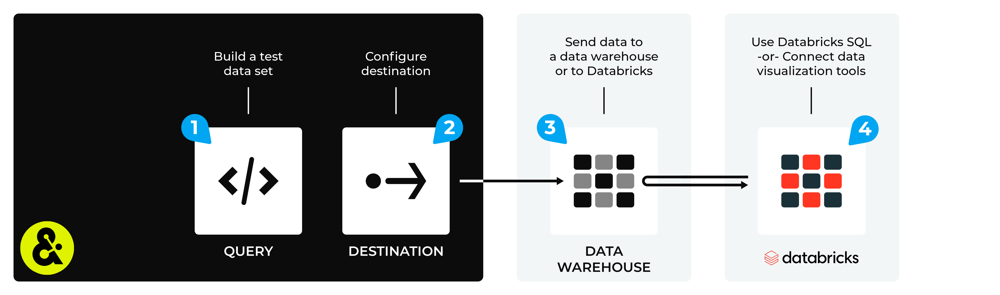

.. 
.. https://docs.amperity.com/datagrid/
.. 

.. |destination-name| replace:: Databricks
.. |what-send| replace:: data
.. |filter-the-list| replace:: "data"
.. |sendto-link| replace:: send query results to |destination-name|
.. |channel-link| replace:: send campaign results

.. meta::
    :description lang=en:
        Configure Amperity to send data to Databricks.

.. meta::
    :content class=swiftype name=body data-type=text:
        Configure Amperity to send data to Databricks.

.. meta::
    :content class=swiftype name=title data-type=string:
        Send data to Databricks

==================================================
Send data to Databricks
==================================================

.. include:: ../../shared/terms.rst
   :start-after: .. term-databricks-start
   :end-before: .. term-databricks-end

.. destination-databricks-intro-start

Many organizations use Databricks to enable data scientists, engineers, developers, and data analysts within their organization to use data, along with a combination of Databricks SQL, R, Scala, and/or Python, to build models and tools, and to consume data through the interface you're most comfortable with.

.. destination-databricks-intro-end

.. destination-databricks-links-start

You can make data available to Databricks using any of the following cloud-based workflows:

* :doc:`Amazon Redshift <destination_databricks_amazon_redshift>`
* :doc:`Amazon S3 <destination_databricks_amazon_s3>`
* |amperity_bridge|
* :doc:`Azure Blob Storage <destination_databricks_azure_blob_storage>`
* :doc:`Azure Synapse Analytics <destination_databricks_azure_synapse_analytics>`
* :doc:`Databricks Delta table <destination_databricks_delta_table>`
* :doc:`Google BigQuery <destination_databricks_google_big_query>`
* :doc:`Snowflake <destination_databricks_snowflake>`

after which you can connect Databricks to any of those external locations or use the data in a Databricks Delta table to build advanced round-trip SQL queries and to build models against your data.

.. destination-databricks-links-end

.. destination-databricks-after-start

Access this data using Databricks SQL or by connecting external data visualization tools like :doc:`Tableau <destination_tableau_databricks>`, :doc:`Domo <destination_domo>`, or Looker to Databricks using a JDBC connection.

All workflows that make data available to Databricks should be configured to update automatically on a daily (or weekly) schedule. This ensures that users in your organization who will work in Databricks always have access to the latest data.

.. destination-databricks-after-end
