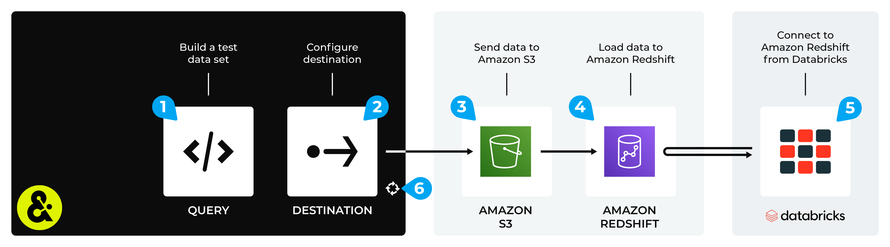

.. 
.. https://docs.amperity.com/datagrid/
.. 

.. |destination-name| replace:: Databricks
.. |middleman| replace:: Amazon Redshift
.. |what-send| replace:: an Apache Parquet, Apache Avro, CSV, or JSON file
.. |load-from| replace:: Amazon S3

.. meta::
    :description lang=en:
        Configure Amperity to send data to Amazon Redshift, and then connect to that data from Databricks.

.. meta::
    :content class=swiftype name=body data-type=text:
        Configure Amperity to send data to Amazon Redshift, and then connect to that data from Databricks.

.. meta::
    :content class=swiftype name=title data-type=string:
        Connect Databricks to Amazon Redshift

==================================================
Connect Databricks to Amazon Redshift
==================================================

.. destination-databricks-amazon-redshift-about-start

Some organizations choose to store their data in Amazon Redshift, but then use Databricks to enable data scientists, engineers, developers, and data analysts within their organization to use that data, along with a combination of Databricks SQL, R, Scala, and/or Python, to build models and tools that support external BI applications and domain-specific tools to help end-users consume that data through the interface they are most comfortable with.

You may send an Apache Parquet, Apache Avro, CSV, or JSON file from Amperity to Amazon S3, load that data to Amazom Redshift, and then connect to that data from Databricks.

.. destination-databricks-amazon-redshift-about-end

.. destination-databricks-amazon-redshift-admonition-start

.. admonition:: What is Amazon Redshift?

   .. include:: ../../shared/terms.rst
      :start-after: .. term-amazon-redshift-start
      :end-before: .. term-amazon-redshift-end

.. destination-databricks-amazon-redshift-admonition-end

.. _destination-databricks-amazon-redshift:

Add workflow
==================================================

.. destination-databricks-amazon-redshift-add-workflow-start

Amperity can be configured to send data to Amazon S3, after which Amazon Redshift is configured to load that data from Amazon S3. Databricks can be configured to connect to Amazon Redshift and use the Amperity output as a data source.

.. important:: You may use the Amazon S3 bucket that comes with your Amperity tenant for the intermediate step (if your Amperity tenant is running on Amazon AWS). Or you may configure Amperity to send data to an Amazon S3 bucket that your organization manages directly.

.. destination-databricks-amazon-redshift-add-workflow-end

**To connect Databricks to Amazon Redshift**

.. destination-databricks-amazon-redshift-steps-start

The steps required to configure Amperity to send data that is accessible to Databricks from Amazon Redshift requires completion of a series of short workflows, some of which must be done outside of Amperity.

.. list-table::
   :widths: 10 90
   :header-rows: 0

   * - .. image:: ../../images/steps-01.png
          :width: 60 px
          :alt: Step 1.
          :align: left
          :class: no-scaled-link
     - Use a query to return the data you want to send to Databricks.

   * - .. image:: ../../images/steps-02.png
          :width: 60 px
          :alt: Step 2.
          :align: left
          :class: no-scaled-link
     - Send an Apache Parquet, Apache Avro, CSV, or JSON file to :doc:`Amazon S3 <destination_amazon_s3>` from Amperity.

   * - .. image:: ../../images/steps-03.png
          :width: 60 px
          :alt: Step 3.
          :align: left
          :class: no-scaled-link
     - Load |ext_databricks_from_amazon_s3| to Amazon Redshift.

   * - .. image:: ../../images/steps-04.png
          :width: 60 px
          :alt: Step 4.
          :align: left
          :class: no-scaled-link
     - Connect |ext_databricks_from_amazon_redshift|, and then access the data sent from Amperity.

   * - .. image:: ../../images/steps-05.png
          :width: 60 px
          :alt: Step 5.
          :align: left
          :class: no-scaled-link
     - Validate the workflow within Amperity and the data within Databricks.

   * - .. image:: ../../images/steps-06.png
          :width: 60 px
          :alt: Step 6.
          :align: left
          :class: no-scaled-link
     - Configure Amperity to :doc:`automate this workflow <workflows>` for a regular (daily) refresh of data.

.. destination-databricks-amazon-redshift-steps-end
