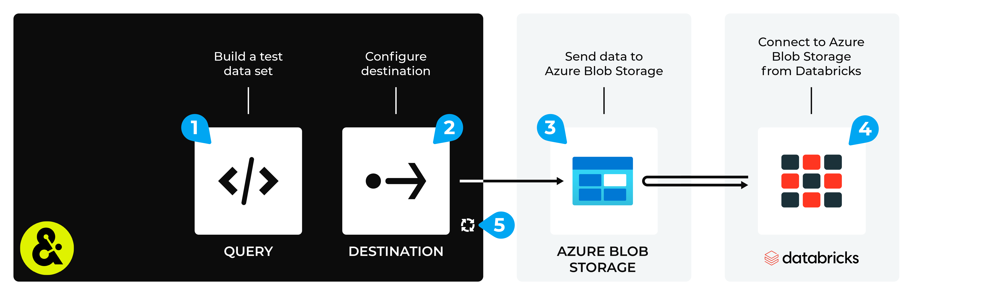

.. 
.. https://docs.amperity.com/datagrid/
.. 

.. meta::
    :description lang=en:
        Configure Amperity to send data to Azure Blob Storage, and then connect to that data from Databricks.

.. meta::
    :content class=swiftype name=body data-type=text:
        Configure Amperity to send data to Azure Blob Storage, and then connect to that data from Databricks.

.. meta::
    :content class=swiftype name=title data-type=string:
        Connect Databricks to Azure Blob Storage

==================================================
Connect Databricks to Azure Blob Storage
==================================================

.. destination-databricks-azure-blob-storage-about-start

Some organizations choose to store their data in Azure Blob Storage, but then use Databricks to enable data scientists, engineers, developers, and data analysts within their organization to use that data, along with a combination of Databricks SQL, R, Scala, and/or Python, to build models and tools that support external BI applications and domain-specific tools to help end-users consume that data through the interface they are most comfortable with.

You may send an Apache Parquet, Apache Avro, CSV, or JSON file from Amperity to Azure Blob Storage, and then connect to that data from Databricks.

.. destination-databricks-azure-blob-storage-about-end

.. destination-databricks-azure-blob-storage-admonition-start

.. admonition:: What is Azure Blob Storage?

   .. include:: ../../shared/terms.rst
      :start-after: .. term-azure-blob-storage-start
      :end-before: .. term-azure-blob-storage-end

.. destination-databricks-azure-blob-storage-admonition-end

.. _destination-databricks-azure-blob-storage:

Add workflow
==================================================

.. destination-databricks-azure-blob-storage-add-workflow-start

Amperity can be configured to send data to Azure Blob Storage, after which Databricks can be configured to connect to Azure Blob Storage and use the Amperity output as a data source.

.. important:: You must configure Amperity to send data to an Azure Blob Storage instance that your organization manages directly.

.. destination-databricks-azure-blob-storage-add-workflow-end

**To connect Databricks to Azure Blob Storage**

.. destination-databricks-azure-blob-storage-steps-start

The steps required to configure Amperity to send data that is accessible to Databricks from Azure Blob Storage requires completion of a series of short workflows, some of which must be done outside of Amperity.

.. list-table::
   :widths: 10 90
   :header-rows: 0

   * - .. image:: ../../images/steps-01.png
          :width: 60 px
          :alt: Step 1.
          :align: left
          :class: no-scaled-link
     - Use a query to return the data you want to send to Databricks.

   * - .. image:: ../../images/steps-02.png
          :width: 60 px
          :alt: Step 2.
          :align: left
          :class: no-scaled-link
     - Send an Apache Parquet, Apache Avro, CSV, or JSON file to an :doc:`Azure Blob Storage <destination_azure_blob_storage>` container from Amperity.

   * - .. image:: ../../images/steps-03.png
          :width: 60 px
          :alt: Step 3.
          :align: left
          :class: no-scaled-link
     - Connect |ext_databricks_from_azure_blob_storage|, and then access the data sent from Amperity.

   * - .. image:: ../../images/steps-04.png
          :width: 60 px
          :alt: Step 4.
          :align: left
          :class: no-scaled-link
     - Validate the workflow within Amperity and the data within Databricks.

   * - .. image:: ../../images/steps-05.png
          :width: 60 px
          :alt: Step 5.
          :align: left
          :class: no-scaled-link
     - Configure Amperity to :doc:`automate this workflow <workflows>` for a regular (daily) refresh of data.

.. destination-databricks-azure-blob-storage-steps-end
