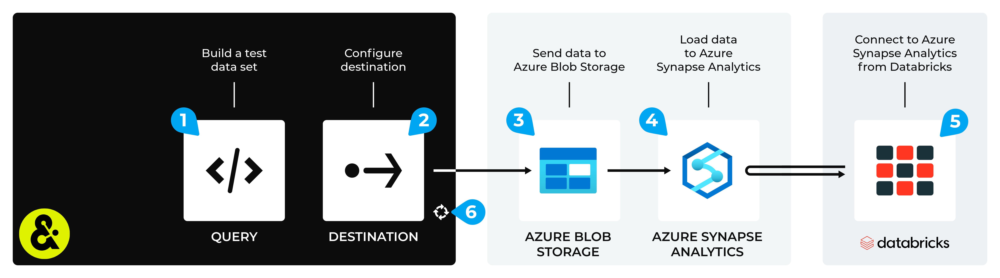

.. 
.. https://docs.amperity.com/datagrid/
.. 

.. meta::
    :description lang=en:
        Configure Amperity to send data to Azure Synapse Analytics, and then connect to that data from Databricks.

.. meta::
    :content class=swiftype name=body data-type=text:
        Configure Amperity to send data to Azure Synapse Analytics, and then connect to that data from Databricks.

.. meta::
    :content class=swiftype name=title data-type=string:
        Connect Databricks to Azure Synapse Analytics

==================================================
Connect Databricks to Azure Synapse Analytics
==================================================

.. destination-databricks-azure-synapse-analytics-about-start

Some organizations choose to store their data in Azure Synapse Analytics, but then use Databricks to enable data scientists, engineers, developers, and data analysts within their organization to use that data, along with a combination of Databricks SQL, R, Scala, and/or Python, to build models and tools that support external BI applications and domain-specific tools to help end-users consume that data through the interface they are most comfortable with.

You may send an Apache Parquet, Apache Avro, CSV, or JSON file from Amperity to Azure Synapse Analytics, and then connect to that data from Databricks.

.. destination-databricks-azure-synapse-analytics-about-end

.. destination-databricks-azure-synapse-analytics-admonition-start

.. admonition:: What is Azure Synapse Analytics?

   .. include:: ../../shared/terms.rst
      :start-after: .. term-azure-synapse-analytics-start
      :end-before: .. term-azure-synapse-analytics-end

.. destination-databricks-azure-synapse-analytics-admonition-end

.. _destination-databricks-azure-synapse-analytics:

Add workflow
==================================================

.. destination-databricks-azure-synapse-analytics-add-workflow-start

Amperity can be configured to send data to Azure Blob Storage, after which Azure Synapse Analytics is configured to load that data from Azure Blob Storage. Databricks can be configured to connect to Azure Synapse Analytics and use the Amperity output as a data source.

.. important:: You may use the Azure Blob Storage container that comes with your Amperity tenant for the intermediate step (if your Amperity tenant is running on Azure). Or you may configure Amperity to send data to an Azure container (Azure Blob Storage or Azure Data Lake Storage) that your organization manages directly.

.. destination-databricks-azure-synapse-analytics-add-workflow-end

**To connect Databricks to Azure Synapse Analytics**

.. destination-databricks-azure-synapse-analytics-steps-start

The steps required to configure Amperity to send data that is accessible to Databricks from Azure Synapse Analytics requires completion of a series of short workflows, some of which must be done outside of Amperity.

.. list-table::
   :widths: 10 90
   :header-rows: 0

   * - .. image:: ../../images/steps-01.png
          :width: 60 px
          :alt: Step 1.
          :align: left
          :class: no-scaled-link
     - Use a query to return the data you want to send to Databricks.

   * - .. image:: ../../images/steps-02.png
          :width: 60 px
          :alt: Step 2.
          :align: left
          :class: no-scaled-link
     - Send an Apache Parquet, Apache Avro, CSV, or JSON file to an Azure container: :doc:`Azure Blob Storage <destination_azure_blob_storage>`.

   * - .. image:: ../../images/steps-03.png
          :width: 60 px
          :alt: Step 3.
          :align: left
          :class: no-scaled-link
     - Load the file from the Azure container |ext_databricks_load_azure_container|.

   * - .. image:: ../../images/steps-04.png
          :width: 60 px
          :alt: Step 4.
          :align: left
          :class: no-scaled-link
     - Connect |ext_databricks_from_azure_synapse_analytics|, and then access the data sent from Amperity.

   * - .. image:: ../../images/steps-05.png
          :width: 60 px
          :alt: Step 5.
          :align: left
          :class: no-scaled-link
     - Validate the workflow within Amperity and the data within Databricks.

   * - .. image:: ../../images/steps-06.png
          :width: 60 px
          :alt: Step 6.
          :align: left
          :class: no-scaled-link
     - Configure Amperity to :doc:`automate this workflow <workflows>` for a regular (daily) refresh of data.

.. destination-databricks-azure-synapse-analytics-steps-end
