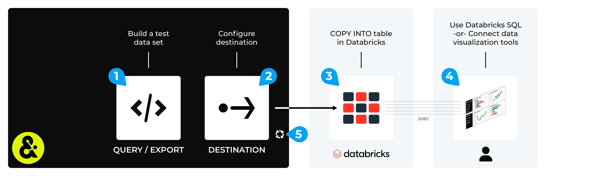

.. 
.. https://docs.amperity.com/datagrid/
.. 

.. |destination-name| replace:: Databricks Delta table
.. |plugin-name| replace:: Amazon S3
.. |what-send| replace:: the results of a query or the database export
.. |filter-the-list| replace:: "data"
.. |sendto-link| replace:: send query results or a database export to Databricks
.. |credential-type| replace:: **databricks**
.. |credential-details| replace:: server hostname, HTTP path, and personal access token
.. |destination-api| replace:: COPY INTO operation

.. meta::
    :description lang=en:
        Configure Amperity to send data to a Databricks Delta table.

.. meta::
    :content class=swiftype name=body data-type=text:
        Configure Amperity to send data to a Databricks Delta table.

.. meta::
    :content class=swiftype name=title data-type=string:
        Send data to Databricks Delta table

==================================================
Send data to Databricks Delta table
==================================================

.. include:: ../../shared/terms.rst
   :start-after: .. term-databricks-delta-table-start
   :end-before: .. term-databricks-delta-table-end

.. destination-databricks-delta-table-about-start

Use data in a |destination-name| Delta table to build advanced round-trip SQL queries and to build models against your data. Access this data using |destination-name| SQL or by connecting external data visualization tools such as :doc:`Tableau <destination_tableau>` and :doc:`Domo <destination_domo>` using a JDBC connection.

.. destination-databricks-delta-table-about-start

.. destination-databricks-delta-table-sendto-steps-to-send-start

.. include:: ../../shared/destinations.rst
   :start-after: .. destinations-overview-list-intro-start
   :end-before: .. destinations-overview-list-intro-end

#. :ref:`Get details <destination-databricks-delta-table-get-details>`
#. :ref:`Add destination <destination-databricks-delta-table-add-destination>`
#. :ref:`Add data template <destination-databricks-delta-table-add-data-template>`

.. destination-databricks-delta-table-sendto-steps-to-send-end

.. _destination-databricks-delta-table-howitworks:

How this destination works
==================================================

.. destination-databricks-delta-table-howitworks-start

Amperity can send the results of a query or a database export to |destination-name|. The results of a query or a database export are uploaded to cloud storage as NDJSON files, then are loaded to |destination-name| from cloud storage using a |destination-api|, after which that data is added into your |destination-name| data warehouse as a Delta table.

.. important:: COPY_OPTIONS is a parameter for the |destination-api|. Amperity sets the value for COPY_OPTIONS to ``'force' = 'true'``, which means that files are loaded regardless of whether they’ve been loaded before.

.. destination-databricks-delta-table-howitworks-end

.. destination-databricks-delta-table-howitworks-callouts-start

A |destination-name| destination works like this:

#. Use a query to return the data you want to send to |destination-name| *or* configure a database export.

   .. note:: 

      .. include:: ../../amperity_amp360/source/destination_databricks.rst
         :start-after: .. sendto-databricks-build-query-data-types-start
         :end-before: .. sendto-databricks-build-query-data-types-end

#. Configure the :ref:`Databricks destination <destination-databricks-delta-table-add-destination>` in Amperity.

   The results of a query or the contents of a database export are sent as NDJSON files to the cloud storage that is included with your tenant, either Amazon S3 or Azure Blob Storage. This step happens automatically and does not require any configuration.

   .. note:: 

      This destination uses token-based JDBC authentication to run a |ext_databricks_sql_reference_copy_into| operation that copies the contents of the NDJSON file to |destination-name|, after which that data is available from a Delta table in |destination-name|.

      COPY_OPTIONS is a parameter for the |destination-api|. Amperity sets the value for COPY_OPTIONS to ``'force' = 'true'``, which means that files are loaded regardless of whether they’ve been loaded before.

#. Send a test from Amperity, and then from within |destination-name| verify that data is available and that you can run SQL queries against it.

   .. important:: 

      .. include:: ../../amperity_amp360/source/destination_databricks.rst
         :start-after: .. sendto-databricks-build-query-match-start
         :end-before: .. sendto-databricks-build-query-match-end

#. Use |ext_databricks_sql_reference| to run ad-hoc queries and create dashboards on data stored in your table from within |destination-name|. Use a JDBC connection to access this data from external data visualization tools, such as Tableau, Domo, or Looker.
#. Configure Amperity to automate this workflow for a regular (daily or weekly) refresh of data.

.. destination-databricks-delta-table-howitworks-callouts-end

.. _destination-databricks-delta-table-get-details:

Get details
==================================================

.. destination-databricks-delta-table-get-details-start

|destination-name| requires the following configuration details:

#. The **Server Hostname** for your |destination-name| data warehouse. For example: "acme.cloud.databricks.com".
#. The **HTTP Path** to your data warehouse. For example: "/sql/1.0/warehouses/1abc2d3456e7f890a".
#. A **Personal Access Token** to allow access to |destination-name|. A personal access token is a generated string. For example: "dapi1234567890b2cd34ef5a67bc8de90fa12b".

   .. important:: |destination-name| recommends using a |ext_databricks_personal_access_token| that belongs to service principals instead of workspace users.

You can find your |ext_databricks_connection_details| from the |destination-name| workspace.

.. destination-databricks-delta-table-get-details-end

.. _destination-databricks-delta-table-add-destination:

Add destination
==================================================

.. include:: ../../shared/destinations.rst
   :start-after: .. destinations-add-destinations-intro-all-start
   :end-before: .. destinations-add-destinations-intro-all-end

**To add a destination**

.. destination-databricks-delta-table-add-destination-steps-start

.. list-table::
   :widths: 10 90
   :header-rows: 0

   * - .. image:: ../../images/steps-01.png
          :width: 60 px
          :alt: Step 1.
          :align: left
          :class: no-scaled-link
     - .. include:: ../../shared/destinations.rst
          :start-after: .. destinations-add-destination-start
          :end-before: .. destinations-add-destination-end

       .. image:: ../../images/mockup-destinations-tab-add-01-select-databricks.png
          :width: 500 px
          :alt: Name, description, choose plugin.
          :align: left
          :class: no-scaled-link

       .. include:: ../../shared/destinations.rst
          :start-after: .. destinations-add-name-and-description-start
          :end-before: .. destinations-add-name-and-description-end

   * - .. image:: ../../images/steps-02.png
          :width: 60 px
          :alt: Step 2.
          :align: left
          :class: no-scaled-link
     - .. include:: ../../shared/destinations.rst
          :start-after: .. destinations-add-credentials-start
          :end-before: .. destinations-add-credentials-end

       .. image:: ../../images/mockup-destinations-tab-add-02-credentials-databricks.png
          :width: 500 px
          :alt: Choose an existing credential or add credential.
          :align: left
          :class: no-scaled-link

       .. include:: ../../shared/destinations.rst
          :start-after: .. destinations-add-new-or-select-existing-start
          :end-before: .. destinations-add-new-or-select-existing-end

       .. image:: ../../images/mockup-destinations-tab-credentials-01-select-databricks.png
          :width: 500 px
          :alt: Add the settings that are required by Databricks.
          :align: left
          :class: no-scaled-link

       .. include:: ../../shared/destinations.rst
          :start-after: .. destinations-intro-for-additional-settings-start
          :end-before: .. destinations-intro-for-additional-settings-end

       |destination-name| has the following settings:

       * The **Server Hostname** for your |destination-name| data warehouse. For example: "acme.cloud.databricks.com".
       * The **HTTP Path** to your data warehouse. For example: "/sql/1.0/warehouses/1abc2d3456e7f890a".
       * A **Personal Access Token** to allow access to |destination-name|. A personal access token is a generated string. For example: "dapi1234567890b2cd34ef5a67bc8de90fa12b".

         .. important:: |destination-name| recommends using a |ext_databricks_personal_access_token| that belongs to service principals instead of workspace users.

       .. include:: ../../shared/destinations.rst
          :start-after: .. destinations-save-settings-start
          :end-before: .. destinations-save-settings-end

   * - .. image:: ../../images/steps-03.png
          :width: 60 px
          :alt: Step 3.
          :align: left
          :class: no-scaled-link
     - .. include:: ../../shared/destinations.rst
          :start-after: .. destinations-destination-settings-start
          :end-before: .. destinations-destination-settings-end

       .. image:: ../../images/mockup-destinations-tab-add-03-settings-databricks.png
          :width: 500 px
          :alt: Settings for Databricks Delta table.
          :align: left
          :class: no-scaled-link

       Enter the **Catalog name** that will be updated by Amperity. (This value may be specified from the data template.)

   * - .. image:: ../../images/steps-04.png
          :width: 60 px
          :alt: Step 4.
          :align: left
          :class: no-scaled-link
     - .. include:: ../../shared/destinations.rst
          :start-after: .. destinations-business-users-start
          :end-before: .. destinations-business-users-end

       .. include:: ../../shared/destinations.rst
          :start-after: .. destinations-business-users-admonition-start
          :end-before: .. destinations-business-users-admonition-end

       .. include:: ../../shared/destinations.rst
          :start-after: .. destinations-business-users-enable-start
          :end-before: .. destinations-business-users-enable-end

   * - .. image:: ../../images/steps-05.png
          :width: 60 px
          :alt: Step 5.
          :align: left
          :class: no-scaled-link
     - .. include:: ../../shared/destinations.rst
          :start-after: .. destinations-save-start
          :end-before: .. destinations-save-end

.. destination-databricks-delta-table-add-destination-steps-end

.. _destination-databricks-delta-table-add-data-template:

Add data template
==================================================

.. include:: ../../shared/terms.rst
   :start-after: .. term-data-template-start
   :end-before: .. term-data-template-end

**To add a data template**

.. destination-databricks-delta-table-add-data-template-steps-start

.. list-table::
   :widths: 10 90
   :header-rows: 0

   * - .. image:: ../../images/steps-01.png
          :width: 60 px
          :alt: Step 1.
          :align: left
          :class: no-scaled-link
     - .. include:: ../../shared/destinations.rst
          :start-after: .. destinations-data-template-open-template-start
          :end-before: .. destinations-data-template-open-template-end

       .. image:: ../../images/mockup-data-template-tab-add-01-details-databricks.png
          :width: 500 px
          :alt: Step 1
          :align: left
          :class: no-scaled-link

       .. include:: ../../shared/destinations.rst
          :start-after: .. destinations-data-template-open-template-start
          :end-before: .. destinations-data-template-open-template-end

   * - .. image:: ../../images/steps-02.png
          :width: 60 px
          :alt: Step 2.
          :align: left
          :class: no-scaled-link
     - .. include:: ../../shared/destinations.rst
          :start-after: .. destinations-data-template-business-users-start
          :end-before: .. destinations-data-template-business-users-end

       .. image:: ../../images/mockup-data-template-tab-add-02-allow-access-no-campaigns.png
          :width: 500 px
          :alt: Step 2.
          :align: left
          :class: no-scaled-link

       .. include:: ../../shared/destinations.rst
          :start-after: .. destinations-data-template-business-users-access-not-configured-start
          :end-before: .. destinations-data-template-business-users-access-not-configured-end

   * - .. image:: ../../images/steps-03.png
          :width: 60 px
          :alt: Step 3.
          :align: left
          :class: no-scaled-link
     - .. include:: ../../shared/destinations.rst
          :start-after: .. destinations-data-template-verify-config-settings-start
          :end-before: .. destinations-data-template-verify-config-settings-end

       .. image:: ../../images/mockup-destinations-tab-add-03-settings-databricks.png
          :width: 500 px
          :alt: Settings for Databricks Delta table.
          :align: left
          :class: no-scaled-link

       Enter the **Catalog name** that will be updated by Amperity. (This value may be specified from the destination.)

   * - .. image:: ../../images/steps-04.png
          :width: 60 px
          :alt: Step 4.
          :align: left
          :class: no-scaled-link
     - Under **Template Settings**, enter the catalog, database and table name.

       .. caution:: The database name **must** be a valid database. A table will be created if one does not exist. Catalog name is **optional**..

   * - .. image:: ../../images/steps-05.png
          :width: 60 px
          :alt: Step 5.
          :align: left
          :class: no-scaled-link
     - .. include:: ../../shared/destinations.rst
          :start-after: .. destinations-data-template-save-start
          :end-before: .. destinations-data-template-save-end

       .. image:: ../../images/mockup-destinations-tab-add-05-save.png
          :width: 500 px
          :alt: Save the data template.
          :align: left
          :class: no-scaled-link

       .. include:: ../../shared/destinations.rst
          :start-after: .. destinations-data-template-save-after-queries-only-start
          :end-before: .. destinations-data-template-save-after-queries-only-end

.. destination-databricks-delta-table-add-data-template-steps-end
