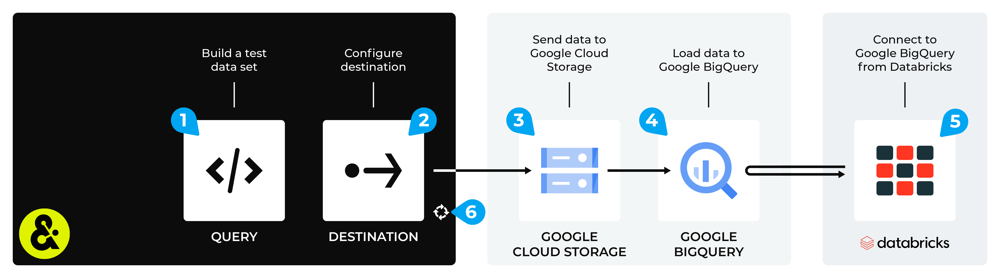

.. 
.. https://docs.amperity.com/datagrid/
.. 

.. meta::
    :description lang=en:
        Configure Amperity to send data to Google BigQuery, and then connect to that data from Databricks.

.. meta::
    :content class=swiftype name=body data-type=text:
        Configure Amperity to send data to Google BigQuery, and then connect to that data from Databricks.

.. meta::
    :content class=swiftype name=title data-type=string:
        Connect Databricks to Google BigQuery

==================================================
Connect Databricks to Google BigQuery
==================================================

.. destination-databricks-google-bigquery-about-start

Some organizations choose to store their data in Google BigQuery, but then use Databricks to enable data scientists, engineers, developers, and data analysts within their organization to use that data, along with a combination of Databricks SQL, R, Scala, and/or Python, to build models and tools that support external BI applications and domain-specific tools to help end-users consume that data through the interface they are most comfortable with.

You may send a CSV file from Amperity to Google BigQuery, and then connect to that data from Databricks.

.. destination-databricks-google-bigquery-about-end

.. destination-databricks-google-bigquery-admonition-start

.. admonition:: What is Google BigQuery?

   .. include:: ../../shared/terms.rst
      :start-after: .. term-google-bigquery-start
      :end-before: .. term-google-bigquery-end

.. destination-databricks-google-bigquery-admonition-end

.. _destination-databricks-google-bigquery:

Add workflow
==================================================

.. destination-databricks-google-bigquery-add-workflow-start

Amperity can be configured to send data to Google Cloud Storage, after which Google BigQuery is configured to load that data from Google Cloud Storage. Databricks can be configured to connect to Google BigQuery and use the Amperity output as a data source.

.. important:: You must configure Amperity to send data to a Google Cloud Storage bucket that your organization manages directly.

.. destination-databricks-google-bigquery-add-workflow-end

**To connect Databricks to Google BigQuery**

.. destination-databricks-google-bigquery-add-workflow-steps-start

The steps required to configure Amperity to send data that is accessible to Databricks from Google BigQuery requires completion of a series of steps, some of which must be done outside of Amperity.

.. list-table::
   :widths: 10 90
   :header-rows: 0

   * - .. image:: ../../images/steps-01.png
          :width: 60 px
          :alt: Step 1.
          :align: left
          :class: no-scaled-link
     - Use a query to return the data you want to send to Databricks.

   * - .. image:: ../../images/steps-02.png
          :width: 60 px
          :alt: Step 2.
          :align: left
          :class: no-scaled-link
     - Send a CSV file to :doc:`Google Cloud Storage <destination_google_cloud_storage>` from Amperity.

   * - .. image:: ../../images/steps-03.png
          :width: 60 px
          :alt: Step 3.
          :align: left
          :class: no-scaled-link
     - Load |ext_databricks_from_google_bigquery_load_csv| to Google BigQuery.

   * - .. image:: ../../images/steps-04.png
          :width: 60 px
          :alt: Step 4.
          :align: left
          :class: no-scaled-link
     - Connect |ext_databricks_from_google_bigquery|, and then access the data sent from Amperity.

   * - .. image:: ../../images/steps-05.png
          :width: 60 px
          :alt: Step 5.
          :align: left
          :class: no-scaled-link
     - Validate the workflow within Amperity and the data within Databricks.

   * - .. image:: ../../images/steps-06.png
          :width: 60 px
          :alt: Step 6.
          :align: left
          :class: no-scaled-link
     - Configure Amperity to :doc:`automate this workflow <workflows>` for a regular (daily or weekly) refresh of data.

.. destination-databricks-google-bigquery-add-workflow-steps-end
