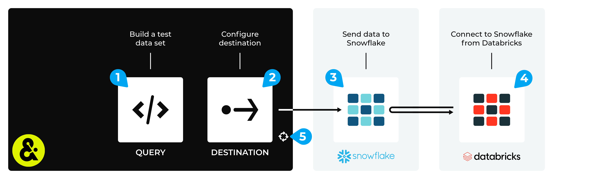

.. 
.. https://docs.amperity.com/datagrid/
.. 

.. |destination-name| replace:: Databricks
.. Snowflake replace:: Snowflake
.. |what-send| replace:: databases and/or tables

.. meta::
    :description lang=en:
        Configure Amperity to send data to Snowflake, and then connect to that data from Databricks.

.. meta::
    :content class=swiftype name=body data-type=text:
        Configure Amperity to send data to Snowflake, and then connect to that data from Databricks.

.. meta::
    :content class=swiftype name=title data-type=string:
        Connect Databricks to Snowflake

==================================================
Connect Databricks to Snowflake
==================================================

.. destination-databricks-snowflake-about-start

Some organizations choose to store their data in Snowflake, but then use Databricks to enable data scientists, engineers, developers, and data analysts within their organization to use that data, along with a combination of Databricks SQL, R, Scala, and/or Python, to build models and tools that support external BI applications and domain-specific tools to help end-users consume that data through the interface they are most comfortable with.

You may send data (tables and/or entire databases) from Amperity to Snowflake, and then connect to that data from Databricks.

.. destination-databricks-snowflake-about-end

.. destination-databricks-snowflake-admonition-start

.. admonition:: What is Snowflake?

   .. include:: ../../shared/terms.rst
      :start-after: .. term-snowflake-start
      :end-before: .. term-snowflake-end

.. destination-databricks-snowflake-admonition-end

.. _destination-databricks-snowflake:

Add workflow
==================================================

.. destination-databricks-snowflake-add-workflow-start

Amperity can be configured to share data (tables and/or entire databases) directly with Snowflake. Databricks can be configured to connect to a Snowflake data warehouse, and then use that data as a data source.

.. important:: You must configure Amperity to send data to an instance of Snowflake that your organization manages directly.

.. destination-databricks-snowflake-add-workflow-end

**To connect Databricks to Snowflake**

.. destination-databricks-snowflake-steps-start

The steps required to configure Amperity to send data that is accessible to Databricks from a Snowflake data warehouse requires completion of a series of short workflows, some of which must be done outside of Amperity.

.. list-table::
   :widths: 10 90
   :header-rows: 0

   * - .. image:: ../../images/steps-01.png
          :width: 60 px
          :alt: Step 1.
          :align: left
          :class: no-scaled-link
     - Configure Snowflake objects for the correct database, tables, roles, and users. (Refer to the `:ref:Amazon S3 <destination-snowflake-aws-configure-objects>` or :ref:`Azure <destination-snowflake-azure-configure-objects>` tutorial, as appropriate for your tenant.)

       .. note:: Snowflake can be configured to run in Amazon AWS or Azure. When using the Amazon Data Warehouse you will use the same cloud platform as your Amperity tenant. When using your own instance of Snowflake, you should use the same Amazon S3 bucket or Azure Blob Storage container that is included with your tenant when configuring Snowflake for data sharing, but then connect Databricks directly to your own instance of Snowflake.

   * - .. image:: ../../images/steps-02.png
          :width: 60 px
          :alt: Step 2.
          :align: left
          :class: no-scaled-link
     - Send data to Snowflake from Amperity. (Refer to the :doc:`Amazon S3 <destination_snowflake_aws>` or :doc:`Azure <destination_snowflake_azure>` tutorial, as appropriate for your tenant.)

   * - .. image:: ../../images/steps-03.png
          :width: 60 px
          :alt: Step 3.
          :align: left
          :class: no-scaled-link
     - Connect |ext_databricks_from_snowflake|, and then access the data sent from Amperity.

       .. note:: The URL for the Snowflake data warehouse, the Snowflake username, the password, and the name of the Snowflake data warehouse are sent to the Databricks user within a SnapPass link. Request this information from your Amperity representative prior to attempting to connect Databricks to Snowflake.

   * - .. image:: ../../images/steps-04.png
          :width: 60 px
          :alt: Step 4.
          :align: left
          :class: no-scaled-link
     - Validate the workflow within Amperity and the data within Databricks.

   * - .. image:: ../../images/steps-05.png
          :width: 60 px
          :alt: Step 5.
          :align: left
          :class: no-scaled-link
     - Configure Amperity to :doc:`automate this workflow <workflows>` for a regular (daily) refresh of data.

.. destination-databricks-snowflake-steps-end
