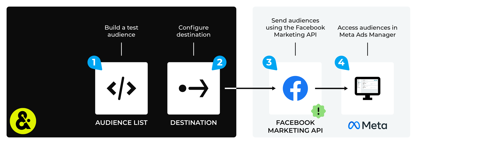

.. https://docs.amperity.com/datagrid/

.. |destination-name| replace:: Meta Ads Manager
.. |destination-api| replace:: Marketing API
.. |plugin-name| replace:: Facebook
.. |what-send| replace:: customer data
.. |email-plus-send| replace:: additional attributes
.. |filter-the-list| replace:: "face"
.. |credential-type| replace:: oauth-access-token
.. |oauth-type| replace:: the OAuth credential you created for your |destination-name| account
.. |settings-name| replace:: **Facebook Settings**
.. |what-settings| replace:: account ID, custom audience, and the customer file source
.. |data-template-name| replace:: |destination-name|
.. |data-template-description| replace:: Send |what-send| to |destination-name|.
.. |data-template-config-settings-list| replace:: account ID, custom audience, and the customer file source settings were
.. |data-template-config-settings-list-them-vs-it| replace:: them
.. |sendto-link| replace:: |sendto_meta_ads_manager|
.. |channel-link| replace:: |campaign_meta_ads_manager|
.. |allow-for-what| replace:: audiences
.. |allow-for-duration| replace:: up to 24 hours

.. meta::
    :description lang=en:
        Configure Amperity to send custom audiences and offline events to Meta Ads Manager.

.. meta::
    :content class=swiftype name=body data-type=text:
        Configure Amperity to send custom audiences and offline events to Meta Ads Manager.

.. meta::
    :content class=swiftype name=title data-type=string:
        Send data to Meta Ads Manager

==================================================
Send data to Meta Ads Manager
==================================================

.. include:: ../../shared/terms.rst
   :start-after: .. term-meta-ads-manager-start
   :end-before: .. term-meta-ads-manager-end

.. destination-meta-ads-manager-custom-audiences-and-offline-events-start

Your brand can send custom audiences and offline events to |destination-name|:

.. list-table::
   :widths: 10 90
   :header-rows: 0

   * - .. image:: ../../images/steps-arrow-off-black.png
          :width: 60 px
          :alt: Custom audiences
          :align: left
          :class: no-scaled-link
     - **Custom audiences**

       Send :ref:`custom audiences <destination-meta-ads-manager-custom-audiences>` to |destination-name| to help find people who already know about or have engaged with your brand. Use custom audiences for re-marketing, finding potential repeat customers, and finding lookalike audiences that can be activated from Facebook, Facebook Messenger, Instagram, and WhatsApp.

       The |ext_facebook_marketing_api|, specifically the |ext_facebook_marketing_api_replace_users|, is used to send custom audiences.

       This endpoint removes existing customers from an audience **without resetting your ad set's learning phase when an audience is part of active ad sets**, and then replaces those users with the list of customers that was sent to |destination-name| from Amperity.

       .. note::

          .. include:: ../../shared/destinations.rst
             :start-after: .. destinations-add-destinations-intro-allow-for-start
             :end-before: .. destinations-add-destinations-intro-allow-for-end

   * - .. image:: ../../images/steps-arrow-off-black.png
          :width: 60 px
          :alt: Offline events
          :align: left
          :class: no-scaled-link
     - **Offline events**

       .. include:: ../../amperity_ampiq/source/events_meta_ads_manager.rst
          :start-after: .. events-meta-ads-manager-overview-start
          :end-before: .. events-meta-ads-manager-overview-end

       .. include:: ../../amperity_ampiq/source/events_meta_ads_manager.rst
          :start-after: .. events-meta-ads-manager-allowfor-start
          :end-before: .. events-meta-ads-manager-allowfor-end

.. destination-meta-ads-manager-custom-audiences-and-offline-events-end

.. destination-meta-ads-manager-steps-to-send-start

.. include:: ../../shared/destinations.rst
   :start-after: .. destinations-overview-list-intro-start
   :end-before: .. destinations-overview-list-intro-end

#. :ref:`Get details <destination-meta-ads-manager-get-details>`
#. :ref:`Authorize Amperity access to the customer's account <destination-meta-ads-manager-configure-oauth>`
#. :ref:`Custom audiences <destination-meta-ads-manager-custom-audiences>`
#. :ref:`Offline events <destination-meta-ads-manager-offline-events>`

.. destination-meta-ads-manager-steps-to-send-end

.. _destination-meta-ads-manager-howitworks:

How this destination works
==================================================

.. destination-meta-ads-manager-howitworks-start

You can build custom audiences in |destination-name|. Send customer information, such as email addresses, phone numbers, names, birthdates, gender, city, state, postal code, and mobile advertising IDs, from Amperity to find customer matches on |destination-name|.

Use audiences in |destination-name| to advertise to customers on Facebook, Instagram, and Messenger, and to use Meta Audience Network to extend your advertising beyond Facebook to reach new audiences on apps and mobile devices, such as WhatsApp.

.. destination-meta-ads-manager-howitworks-end

.. destination-meta-ads-manager-howitworks-callouts-start

A |destination-name| destination works like this:

.. list-table::
   :widths: 10 90
   :header-rows: 0

   * - .. image:: ../../images/steps-01.png
          :width: 60 px
          :alt: Step one.
          :align: left
          :class: no-scaled-link
     - Use a query or segment to build a custom audience.

   * - .. image:: ../../images/steps-02.png
          :width: 60 px
          :alt: Step two.
          :align: left
          :class: no-scaled-link
     - Configure the |destination-name| :ref:`destination <destination-meta-ads-manager-custom-audiences-add-destination>` and :ref:`data template <destination-meta-ads-manager-custom-audiences-add-data-template>`.

   * - .. image:: ../../images/steps-03.png
          :width: 60 px
          :alt: Step three.
          :align: left
          :class: no-scaled-link
     - Send a test set of first-party data from Amperity, and then from within |destination-name| verify that this data is available from Meta Ads Manager.

       .. important:: The :ref:`custom audience terms of service <destination-meta-ads-manager-terms-of-service>` must be signed by *each business user* that is associated with your Facebook Ads account. If the terms of service are not signed, a permissions error will prevent Amperity from sending data to |destination-name|.

          |destination-name| uses OAuth to grant access to Amperity. You may need to :ref:`reauthorize OAuth <destination-meta-ads-manager-reauthorize-amperity>` if the token expires or is removed.

   * - .. image:: ../../images/steps-04.png
          :width: 60 px
          :alt: Step four.
          :align: left
          :class: no-scaled-link
     - Build ads for that audience in Meta Ads Manager.

.. destination-meta-ads-manager-howitworks-callouts-end

.. _destination-meta-ads-manager-meta-ads-manager:

About Meta Ads Manager
--------------------------------------------------

.. destination-meta-ads-manager-meta-ads-manager-start

Audiences sent to Meta Ads Manager have access to Facebook, Messenger, Instagram and the Meta Audience Network.

.. list-table::
   :widths: 30 70
   :header-rows: 0

   * - .. image:: ../../amperity_base/source/_static/connector-facebook-ads.svg
          :width: 140 px
          :alt: Facebook Ads
          :align: left
          :class: no-scaled-link
     - Use Meta Ads Manager to configure `a variety of ad placements across Facebook <https://www.facebook.com/business/help/407108559393196?id=369787570424415>`__ |ext_link|.

   * - .. image:: ../../amperity_base/source/_static/connector-instagram.svg
          :width: 140 px
          :alt: Instagram
          :align: left
          :class: no-scaled-link
     - Use Meta Ads Manager to configure objectives that `place ads on Instagram <https://www.facebook.com/business/help/1634705703469129?helpref=search&sr=2&query=create%20ads%20in%20instagram>`__ |ext_link|.

   * - .. image:: ../../amperity_base/source/_static/connector-facebook-messenger.svg
          :width: 140 px
          :alt: Facebook Messenger
          :align: left
          :class: no-scaled-link
     - Use Meta Ads Manager to configure objectives that `place ads on Messenger <https://www.facebook.com/business/help/1420905584664062?id=274377816589261>`__ |ext_link|.

   * - .. image:: ../../amperity_base/source/_static/connector-whatsapp.svg
          :width: 140 px
          :alt: WhatsApp
          :align: left
          :class: no-scaled-link
     - Use `Audience Manager <https://www.facebook.com/business/help/1409448922609084?id=571563249872422&ref=fbb_an>`__ |ext_link| to reach users who are not on Facebook or Instagram, but are on mobile apps that are within the audience network. For example, creating ads that `open conversation threads in WhatsApp <https://www.facebook.com/business/help/447934475640650?id=371525583593535>`__ |ext_link|.

.. destination-meta-ads-manager-meta-ads-manager-end

.. _destination-meta-ads-manager-get-details:

Get details
==================================================

.. destination-meta-ads-manager-get-details-start

|destination-name| requires the following configuration details:

.. list-table::
   :widths: 10 90
   :header-rows: 0

   * - .. image:: ../../images/steps-check-off-black.png
          :width: 60 px
          :alt: Detail one.
          :align: left
          :class: no-scaled-link
     - The account ID.

       .. admonition:: How do I find Facebook Ads account information?

          You can find all of this information and perform all of the required steps from within |ext_facebook_find_account_id|. Click **Business Settings**, then **Ad Accounts**, and then the Facebook Ads account name. The account ID is visible under **Details**.

       .. note:: You may use the same credentials to send offline events.

   * - .. image:: ../../images/steps-check-off-black.png
          :width: 60 px
          :alt: Detail two.
          :align: left
          :class: no-scaled-link
     - The custom audience name and customer file source settings.

       The custom audience name is visible from Meta Ads Manager. This name should be clear and understandable to users of Meta Ads Manager. The custom audience name will be created if it does not exist.

       The customer file source specifies if the data was provided by users, provided by partners, or provided from both users and partners.

       .. note:: The customer file source maps directly to the **customer_file_source** parameter in the Facebook Marketing API. This value describes how the customer information in the custom audience was originally collected:

          * **USER_PROVIDED_ONLY** Select this option when advertisers collected information directly from customers.
          * **PARTNER_PROVIDED_ONLY** Select this option when advertisers sourced information directly from partners, such as an agency or data provider.
          * **BOTH_USER_AND_PARTNER_PROVIDED** Select this option when advertisers collected information directly from customers and it was also sourced from partners.

   * - .. image:: ../../images/steps-check-off-black.png
          :width: 60 px
          :alt: Detail three.
          :align: left
          :class: no-scaled-link
     - Acccept the |ext_facebook_tos|.

       .. important:: :ref:`Terms of service <destination-meta-ads-manager-terms-of-service>` must be signed by each business user that is associated with your Facebook Ads account.

   * - .. image:: ../../images/steps-check-off-black.png
          :width: 60 px
          :alt: Detail four.
          :align: left
          :class: no-scaled-link
     - :ref:`Authorize Amperity to send data to the customer's Facebook Ads account <destination-meta-ads-manager-configure-oauth>`. This requires activation in the Amperity |destination-name| account and approval in the customer's |destination-name| account.

       .. note:: You may need to :ref:`reauthorize Amperity <destination-meta-ads-manager-reauthorize-amperity>` at various intervals.

   * - .. image:: ../../images/steps-check-off-black.png
          :width: 60 px
          :alt: Detail five.
          :align: left
          :class: no-scaled-link
     - **Meta Ads Manager offline events only**

       |ext_facebook_dataset| from different sources---such as from websites, mobile apps, physical store locations or business chats--–from one location.

       A |ext_facebook_dataset_create| in |destination-name| to support sending send offline events from Amperity.

       A :ref:`query that defines the set of offline events <destination-meta-ads-manager-offline-events-build-query>` to be sent to |destination-name|.

.. destination-meta-ads-manager-get-details-end

.. _destination-meta-ads-manager-terms-of-service:

Terms of service
--------------------------------------------------

.. destination-meta-ads-manager-terms-of-service-start

The |ext_facebook_tos| must be signed by *each business user* that is associated with your |destination-name| account. If the terms of service are not signed, a permissions error will prevent Amperity from sending data to |destination-name|.

.. destination-meta-ads-manager-terms-of-service-end

.. destination-meta-ads-manager-terms-of-service-error-start

The permissions error is similar to:

::

   Permissions error: To create or edit an audience with an uploaded
   customer list, please agree to the Custom Audience terms at
   https://business.facebook.com/ads/manage/customaudiences/tos/?act=123.

To resolve this error the terms of service must be signed by a business user who has a role in your |destination-name| account.

.. destination-meta-ads-manager-terms-of-service-error-end

.. _destination-meta-ads-manager-configure-oauth:

Configure OAuth
==================================================

.. include:: ../../shared/terms.rst
   :start-after: .. term-oauth-start
   :end-before: .. term-oauth-end

.. include:: ../../shared/destinations.rst
   :start-after: .. destinations-oauth-intro-start
   :end-before: .. destinations-oauth-intro-end

**To configure OAuth**

.. list-table::
   :widths: 10 90
   :header-rows: 0

   * - .. image:: ../../images/steps-01.png
          :width: 60 px
          :alt: Step 1.
          :align: left
          :class: no-scaled-link
     - .. include:: ../../shared/destinations.rst
          :start-after: .. destinations-oauth-configure-step-1-start
          :end-before: .. destinations-oauth-configure-step-1-end

   * - .. image:: ../../images/steps-02.png
          :width: 60 px
          :alt: Step 2.
          :align: left
          :class: no-scaled-link
     - .. include:: ../../shared/destinations.rst
          :start-after: .. destinations-oauth-configure-step-2-start
          :end-before: .. destinations-oauth-configure-step-2-end

   * - .. image:: ../../images/steps-03.png
          :width: 60 px
          :alt: Step 3.
          :align: left
          :class: no-scaled-link
     - .. include:: ../../shared/destinations.rst
          :start-after: .. destinations-oauth-configure-step-3-start
          :end-before: .. destinations-oauth-configure-step-3-end

.. _destination-meta-ads-manager-reauthorize-amperity:

Reauthorize Amperity
--------------------------------------------------

.. include:: ../../shared/destinations.rst
   :start-after: .. destinations-oauth-reauthorize-start
   :end-before: .. destinations-oauth-reauthorize-end

.. _destination-meta-ads-manager-custom-audiences:

Custom audiences
==================================================

.. destination-meta-ads-manager-custom-audiences-start

Send custom audiences to help find people who already know about or have engaged with your brand. Use custom audiences for re-marketing, finding potential repeat customers, and finding lookalike audiences that can be activated from Facebook, Facebook Messenger, Instagram, and WhatsApp.

The |ext_facebook_marketing_api|, specifically the |ext_facebook_marketing_api_replace_users|, is used to send custom audiences.

This endpoint removes existing customers from an audience **without resetting your ad set's learning phase when an audience is part of active ad sets**, and then replaces those users with the list of customers that was sent to |destination-name| from Amperity.

.. destination-meta-ads-manager-custom-audiences-end

.. _destination-meta-ads-manager-custom-audiences-add-destination:

Add destination
--------------------------------------------------

.. include:: ../../shared/destinations.rst
   :start-after: .. destinations-add-destinations-intro-all-start
   :end-before: .. destinations-add-destinations-intro-all-end

.. include:: ../../shared/destinations.rst
   :start-after: .. destinations-add-destinations-api-oauth-reminder-start
   :end-before: .. destinations-add-destinations-api-oauth-reminder-end

**To add a destination**

.. destination-meta-ads-manager-custom-audiences-add-destination-steps-start

.. list-table::
   :widths: 10 90
   :header-rows: 0

   * - .. image:: ../../images/steps-01.png
          :width: 60 px
          :alt: Step 1.
          :align: left
          :class: no-scaled-link
     - .. include:: ../../shared/destinations.rst
          :start-after: .. destinations-add-destination-start
          :end-before: .. destinations-add-destination-end

       .. image:: ../../images/mockup-destinations-tab-add-01-select.png
          :width: 500 px
          :alt: Name, description, choose plugin.
          :align: left
          :class: no-scaled-link

       .. include:: ../../shared/destinations.rst
          :start-after: .. destinations-add-name-and-description-start
          :end-before: .. destinations-add-name-and-description-end

   * - .. image:: ../../images/steps-02.png
          :width: 60 px
          :alt: Step 2.
          :align: left
          :class: no-scaled-link
     - .. include:: ../../shared/destinations.rst
          :start-after: .. destinations-add-credentials-start
          :end-before: .. destinations-add-credentials-end

       .. image:: ../../images/mockup-destinations-tab-add-02-credentials.png
          :width: 500 px
          :alt: Choose an existing credential or add credential.
          :align: left
          :class: no-scaled-link

       .. include:: ../../shared/destinations.rst
          :start-after: .. destinations-add-new-or-select-existing-start
          :end-before: .. destinations-add-new-or-select-existing-end

       .. image:: ../../images/mockup-destinations-tab-credentials-01-select.png
          :width: 500 px
          :alt: Choose an existing credential or add credential.
          :align: left
          :class: no-scaled-link

       .. include:: ../../shared/destinations.rst
          :start-after: .. destinations-intro-for-additional-settings-start
          :end-before: .. destinations-intro-for-additional-settings-end

       .. include:: ../../shared/destinations.rst
          :start-after: .. destinations-intro-for-additional-settings-oauth-start
          :end-before: .. destinations-intro-for-additional-settings-oauth-end

   * - .. image:: ../../images/steps-03.png
          :width: 60 px
          :alt: Step 3.
          :align: left
          :class: no-scaled-link
     - .. include:: ../../shared/destinations.rst
          :start-after: .. destinations-destination-settings-start
          :end-before: .. destinations-destination-settings-end

       .. image:: ../../images/mockup-destinations-tab-add-03-settings.png
          :width: 500 px
          :alt: Settings for Meta Ads Manager.
          :align: left
          :class: no-scaled-link

       The following settings are specific to |destination-name|:

       .. list-table::
          :widths: 180 320
          :header-rows: 1

          * - **Setting**
            - **Description**
          * - **Custom audience name**
            - The name of the custom audience in Meta Ads Manager.
          * - **Account ID**
            - The account ID for your Meta Ads Manager account.
          * - **Customer file source**
            - A setting that describes how the information in the custom audience was originally collected. Select one of the following settings:

              * **USER_PROVIDED_ONLY**
              * **PARTNER_PROVIDED_ONLY**
              * **BOTH_USER_AND_PARTNER_PROVIDED**

   * - .. image:: ../../images/steps-04.png
          :width: 60 px
          :alt: Step 4.
          :align: left
          :class: no-scaled-link
     - .. include:: ../../shared/destinations.rst
          :start-after: .. destinations-business-users-start
          :end-before: .. destinations-business-users-end

       .. include:: ../../shared/destinations.rst
          :start-after: .. destinations-business-users-admonition-start
          :end-before: .. destinations-business-users-admonition-end

   * - .. image:: ../../images/steps-05.png
          :width: 60 px
          :alt: Step 5.
          :align: left
          :class: no-scaled-link
     - .. include:: ../../shared/destinations.rst
          :start-after: .. destinations-save-start
          :end-before: .. destinations-save-end

.. destination-meta-ads-manager-custom-audiences-add-destination-steps-end

.. _destination-meta-ads-manager-custom-audiences-add-data-template:

Add data template
--------------------------------------------------

.. include:: ../../shared/terms.rst
   :start-after: .. term-data-template-start
   :end-before: .. term-data-template-end

.. admonition:: About paid media campaigns

   .. include:: ../../shared/paid-media.rst
      :start-after: .. paid-media-admonition-about-start
      :end-before: .. paid-media-admonition-about-end

**To add a data template**

.. destination-meta-ads-manager-custom-audiences-add-data-template-steps-start

.. list-table::
   :widths: 10 90
   :header-rows: 0

   * - .. image:: ../../images/steps-01.png
          :width: 60 px
          :alt: Step 1.
          :align: left
          :class: no-scaled-link
     - .. include:: ../../shared/destinations.rst
          :start-after: .. destinations-data-template-open-template-start
          :end-before: .. destinations-data-template-open-template-end

       .. image:: ../../images/mockup-data-template-tab-add-01-details.png
          :width: 500 px
          :alt: Step 1
          :align: left
          :class: no-scaled-link

       .. include:: ../../shared/destinations.rst
          :start-after: .. destinations-data-template-open-template-name-start
          :end-before: .. destinations-data-template-open-template-name-end

   * - .. image:: ../../images/steps-02.png
          :width: 60 px
          :alt: Step 2.
          :align: left
          :class: no-scaled-link
     - .. include:: ../../shared/destinations.rst
          :start-after: .. destinations-data-template-business-users-start
          :end-before: .. destinations-data-template-business-users-end

       .. image:: ../../images/mockup-data-template-tab-add-02-allow-access.png
          :width: 500 px
          :alt: Step 2.
          :align: left
          :class: no-scaled-link

       .. include:: ../../shared/destinations.rst
          :start-after: .. destinations-data-template-business-users-access-not-configured-start
          :end-before: .. destinations-data-template-business-users-access-not-configured-end

       .. include:: ../../shared/destinations.rst
          :start-after: .. destinations-data-template-business-users-allow-campaigns-start
          :end-before: .. destinations-data-template-business-users-allow-campaigns-end

   * - .. image:: ../../images/steps-03.png
          :width: 60 px
          :alt: Step 3.
          :align: left
          :class: no-scaled-link
     - .. include:: ../../shared/destinations.rst
          :start-after: .. destinations-data-template-verify-config-settings-start
          :end-before: .. destinations-data-template-verify-config-settings-end

       .. image:: ../../images/mockup-data-template-tab-add-03-settings.png
          :width: 500 px
          :alt: Verify settings for the data template.
          :align: left
          :class: no-scaled-link

       .. include:: ../../shared/destinations.rst
          :start-after: .. destinations-data-template-verify-config-settings-note-start
          :end-before: .. destinations-data-template-verify-config-settings-note-end

   * - .. image:: ../../images/steps-04.png
          :width: 60 px
          :alt: Step 4.
          :align: left
          :class: no-scaled-link
     - .. include:: ../../shared/destinations.rst
          :start-after: .. destinations-data-template-save-start
          :end-before: .. destinations-data-template-save-end

       .. image:: ../../images/mockup-destinations-tab-add-05-save.png
          :width: 500 px
          :alt: Save the data template.
          :align: left
          :class: no-scaled-link

       .. include:: ../../shared/destinations.rst
          :start-after: .. destinations-data-template-save-after-start
          :end-before: .. destinations-data-template-save-after-end

.. destination-meta-ads-manager-custom-audiences-add-data-template-steps-end

.. _destination-meta-ads-manager-offline-events:

Offline events
==================================================

.. include:: ../../amperity_ampiq/source/events_meta_ads_manager.rst
   :start-after: .. events-meta-ads-manager-overview-start
   :end-before: .. events-meta-ads-manager-overview-end

.. include:: ../../amperity_ampiq/source/events_meta_ads_manager.rst
   :start-after: .. events-meta-ads-manager-allowfor-start
   :end-before: .. events-meta-ads-manager-allowfor-end

.. _destination-meta-ads-manager-offline-events-build-query:

Build a query
--------------------------------------------------

.. include:: ../../amperity_ampiq/source/events_meta_ads_manager.rst
   :start-after: .. events-meta-ads-manager-offline-events-build-query-start
   :end-before: .. events-meta-ads-manager-offline-events-build-query-end

.. destination-meta-ads-manager-offline-events-parameters-start

Review the :ref:`Conversions API parameters <destination-meta-ads-manager-conversion-api-parameters>` section for detailed information about the columns that must be (or may be) returned by your query.

.. destination-meta-ads-manager-offline-events-parameters-end

.. _destination-meta-ads-manager-offline-events-add-destination:

Add destination
--------------------------------------------------

.. include:: ../../shared/destinations.rst
   :start-after: .. destinations-add-destinations-intro-all-start
   :end-before: .. destinations-add-destinations-intro-all-end

.. include:: ../../shared/destinations.rst
   :start-after: .. destinations-add-destinations-api-oauth-reminder-start
   :end-before: .. destinations-add-destinations-api-oauth-reminder-end

**To add a destination**

.. destination-meta-ads-manager-offline-events-add-destination-start

.. list-table::
   :widths: 10 90
   :header-rows: 0

   * - .. image:: ../../images/steps-01.png
          :width: 60 px
          :alt: Step 1.
          :align: left
          :class: no-scaled-link
     - .. include:: ../../shared/destinations.rst
          :start-after: .. destinations-add-destination-start
          :end-before: .. destinations-add-destination-end

       .. image:: ../../images/mockup-destinations-tab-add-01-select-meta-ads-offline.png
          :width: 500 px
          :alt: Name, description, choose plugin.
          :align: left
          :class: no-scaled-link

       Enter the name of the destination and a description. For example: "|destination-name| offline events" and "Send offline events to |destination-name|.".

   * - .. image:: ../../images/steps-02.png
          :width: 60 px
          :alt: Step 2.
          :align: left
          :class: no-scaled-link
     - .. include:: ../../shared/destinations.rst
          :start-after: .. destinations-add-credentials-start
          :end-before: .. destinations-add-credentials-end

       .. image:: ../../images/mockup-destinations-tab-add-02-credentials-meta-ads-offline.png
          :width: 500 px
          :alt: Choose an existing credential or add credential.
          :align: left
          :class: no-scaled-link

       .. include:: ../../shared/destinations.rst
          :start-after: .. destinations-add-new-or-select-existing-start
          :end-before: .. destinations-add-new-or-select-existing-end

       |destination-name| requires using OAuth to :ref:`authorize Amperity to send offline events to your Meta Ads Manager account <destination-meta-ads-manager-configure-oauth>`.

       .. note:: You may use the same credentials to send both custom audiences and offline events to |destination-name|.

   * - .. image:: ../../images/steps-03.png
          :width: 60 px
          :alt: Step 3.
          :align: left
          :class: no-scaled-link
     - .. include:: ../../shared/destinations.rst
          :start-after: .. destinations-destination-settings-start
          :end-before: .. destinations-destination-settings-end

       .. image:: ../../images/mockup-destinations-tab-add-03-settings-meta-ads-offline.png
          :width: 500 px
          :alt: Settings for Meta Ads Manager offline events.
          :align: left
          :class: no-scaled-link

       |ext_facebook_dataset| from different sources---such as from websites, mobile apps, physical store locations or business chats--–from one location.

       A |ext_facebook_dataset_create| in |destination-name| to support sending send offline events from Amperity.

   * - .. image:: ../../images/steps-04.png
          :width: 60 px
          :alt: Step 4.
          :align: left
          :class: no-scaled-link
     - .. include:: ../../shared/destinations.rst
          :start-after: .. destinations-business-users-start
          :end-before: .. destinations-business-users-end

       .. include:: ../../shared/destinations.rst
          :start-after: .. destinations-business-users-admonition-start
          :end-before: .. destinations-business-users-admonition-end

   * - .. image:: ../../images/steps-05.png
          :width: 60 px
          :alt: Step 5.
          :align: left
          :class: no-scaled-link
     - .. include:: ../../shared/destinations.rst
          :start-after: .. destinations-save-start
          :end-before: .. destinations-save-end

.. destination-meta-ads-manager-offline-events-add-destination-end

.. _destination-meta-ads-manager-offline-events-add-data-template:

Add data template
--------------------------------------------------

.. destination-meta-ads-manager-offline-events-add-data-template-start

Offline events must be sent using a query and orchestration. The data template associated with offline events should not be made available to the **Campaigns** editor.

.. destination-meta-ads-manager-offline-events-add-data-template-end

**To add a data template**

.. destination-meta-ads-manager-offline-events-add-data-template-steps-start

.. list-table::
   :widths: 10 90
   :header-rows: 0

   * - .. image:: ../../images/steps-01.png
          :width: 60 px
          :alt: Step 1.
          :align: left
          :class: no-scaled-link
     - .. include:: ../../shared/destinations.rst
          :start-after: .. destinations-data-template-open-template-start
          :end-before: .. destinations-data-template-open-template-end

       .. image:: ../../images/mockup-data-template-tab-add-01-details-meta-ads-offline.png
          :width: 500 px
          :alt: Step 1
          :align: left
          :class: no-scaled-link

       Enter the name of the data template and a description. For example: "|destination-name| offline events" and "Send offline events to |destination-name|.".

   * - .. image:: ../../images/steps-02.png
          :width: 60 px
          :alt: Step 2.
          :align: left
          :class: no-scaled-link
     - .. include:: ../../shared/destinations.rst
          :start-after: .. destinations-data-template-business-users-start
          :end-before: .. destinations-data-template-business-users-end

       .. image:: ../../images/mockup-data-template-tab-add-02-allow-access-no-campaigns.png
          :width: 500 px
          :alt: Step 2.
          :align: left
          :class: no-scaled-link

       .. include:: ../../shared/destinations.rst
          :start-after: .. destinations-data-template-business-users-access-not-configured-start
          :end-before: .. destinations-data-template-business-users-access-not-configured-end

   * - .. image:: ../../images/steps-03.png
          :width: 60 px
          :alt: Step 3.
          :align: left
          :class: no-scaled-link
     - .. include:: ../../shared/destinations.rst
          :start-after: .. destinations-data-template-verify-config-settings-start
          :end-before: .. destinations-data-template-verify-config-settings-end

       .. image:: ../../images/mockup-data-template-tab-add-03-settings-meta-ads-offline.png
          :width: 500 px
          :alt: Verify settings for the data template.
          :align: left
          :class: no-scaled-link

       .. note:: If the dataset ID is not specified in the data template it must be specified at orchestration.

   * - .. image:: ../../images/steps-04.png
          :width: 60 px
          :alt: Step 4.
          :align: left
          :class: no-scaled-link
     - .. include:: ../../shared/destinations.rst
          :start-after: .. destinations-data-template-save-start
          :end-before: .. destinations-data-template-save-end

       .. image:: ../../images/mockup-destinations-tab-add-05-save.png
          :width: 500 px
          :alt: Save the data template.
          :align: left
          :class: no-scaled-link

       .. include:: ../../shared/destinations.rst
          :start-after: .. destinations-data-template-save-after-start
          :end-before: .. destinations-data-template-save-after-end

.. destination-meta-ads-manager-offline-events-add-data-template-steps-end

.. _destination-meta-ads-manager-workflow-actions:

Workflow actions
==================================================

.. include:: ../../shared/workflow-actions.rst
   :start-after: .. workflow-actions-common-table-intro-start
   :end-before: .. workflow-actions-common-table-intro-end

.. destination-meta-ads-manager-workflow-actions-start

.. list-table::
   :widths: 10 90
   :header-rows: 0

   * - .. image:: ../../images/steps-01.png
          :width: 60 px
          :alt: Step one.
          :align: left
          :class: no-scaled-link
     - .. include:: ../../shared/workflow-actions.rst
          :start-after: .. workflow-actions-common-table-section-one-a-start
          :end-before: .. workflow-actions-common-table-section-one-a-end

       .. image:: ../../images/mockup-destinations-tab-workflow-error.png
          :width: 500 px
          :alt: Review a notifications error.
          :align: left
          :class: no-scaled-link

       .. include:: ../../shared/workflow-actions.rst
          :start-after: .. workflow-actions-common-table-section-one-b-start
          :end-before: .. workflow-actions-common-table-section-one-b-end

   * - .. image:: ../../images/steps-02.png
          :width: 60 px
          :alt: Step two.
          :align: left
          :class: no-scaled-link
     - .. include:: ../../shared/workflow-actions.rst
          :start-after: .. workflow-actions-common-table-section-two-start
          :end-before: .. workflow-actions-common-table-section-two-end

       .. image:: ../../images/mockups-workflow-failed.png
          :width: 500 px
          :alt: The workflow tab, showing a workflow with errors.
          :align: left
          :class: no-scaled-link

   * - .. image:: ../../images/steps-03.png
          :width: 60 px
          :alt: Step three.
          :align: left
          :class: no-scaled-link
     - .. include:: ../../shared/workflow-actions.rst
          :start-after: .. workflow-actions-common-table-section-three-a-start
          :end-before: .. workflow-actions-common-table-section-three-a-end

       .. image:: ../../images/workflow-actions-meta-ads-manager-missing-extern-id.png
          :width: 300 px
          :alt: Choose a workflow action from the list of actions.
          :align: left
          :class: no-scaled-link

       .. include:: ../../shared/workflow-actions.rst
          :start-after: .. workflow-actions-common-table-section-three-b-start
          :end-before: .. workflow-actions-common-table-section-three-b-end

       Amperity provides a series of workflow actions that can help resolve specific issues that may arise with |destination-name|, including:

       * :ref:`destination-meta-ads-manager-workflow-actions-authorization-error`
       * :ref:`destination-meta-ads-manager-workflow-actions-cannot-create-ads`
       * :ref:`destination-meta-ads-manager-workflow-actions-extern-id-missing`
       * :ref:`destination-meta-ads-manager-workflow-actions-invalid-credentials`
       * :ref:`destination-meta-ads-manager-workflow-actions-maximum-audiences`
       * :ref:`destination-meta-ads-manager-workflow-actions-facebook-terms`
       * :ref:`destination-meta-ads-manager-workflow-actions-business-account`
       * :ref:`destination-meta-ads-manager-workflow-actions-security-challenge`

   * - .. image:: ../../images/steps-04.png
          :width: 60 px
          :alt: Step four.
          :align: left
          :class: no-scaled-link
     - .. include:: ../../shared/workflow-actions.rst
          :start-after: .. workflow-actions-common-table-section-four-a-start
          :end-before: .. workflow-actions-common-table-section-four-a-end

       .. image:: ../../images/workflow-actions-meta-ads-manager-missing-extern-id-steps.png
          :width: 300 px
          :alt: Choose a workflow action from the list of actions.
          :align: left
          :class: no-scaled-link

       .. include:: ../../shared/workflow-actions.rst
          :start-after: .. workflow-actions-common-table-section-four-b-start
          :end-before: .. workflow-actions-common-table-section-four-b-end

.. destination-meta-ads-manager-workflow-actions-end

.. _destination-meta-ads-manager-workflow-actions-authorization-error:

Authorization error
--------------------------------------------------

.. include:: ../../shared/terms.rst
   :start-after: .. term-oauth-start
   :end-before: .. term-oauth-end

.. include:: ../../shared/destinations.rst
   :start-after: .. destinations-oauth-reauthorize-start
   :end-before: .. destinations-oauth-reauthorize-end

.. _destination-meta-ads-manager-workflow-actions-cannot-create-ads:

Cannot create ads
--------------------------------------------------

.. destination-meta-ads-manager-workflow-actions-cannot-create-ads-start

The advertising account that is used by this workflow must have permission to create ads.

.. destination-meta-ads-manager-workflow-actions-cannot-create-ads-end

.. destination-meta-ads-manager-workflow-actions-cannot-create-ads-steps-start

To resolve this error, update the user permissions in |destination-name| to ensure that the advertising account can create ads.

#. Log into |destination-name| and verify the user permissions for the account.
#. Update the user permissions to ensure that the **Create and edit ads** permission is assigned to the advertising account used by this workflow.
#. Return to the workflow action, and then click **Resolve** to retry this workflow.

.. destination-meta-ads-manager-workflow-actions-cannot-create-ads-steps-start

.. _destination-meta-ads-manager-workflow-actions-extern-id-missing:

EXTERN_ID is missing
--------------------------------------------------

.. destination-meta-ads-manager-workflow-actions-extern-id-missing-start

An **EXTERN_ID** is a unique ID used within |destination-name|, such as a loyalty ID, a customer ID, an external ID, or the Amperity ID.

Amperity will be unable to send orchestrations or campaigns when **EXTERN_ID** is not included within an audience that is sent to |destination-name|.

.. destination-meta-ads-manager-workflow-actions-extern-id-missing-end

**For campaigns**

.. destination-meta-ads-manager-workflow-actions-extern-id-missing-campaigns-steps-start

To resolve this error, verify that **EXTERN_ID** is included in the list of attributes that are being sent to |destination-name|.

#. Open the **Campaigns** page, and then open the segment used with this workflow.
#. Verify that **EXTERN_ID** is included in the list of attributes for each treatment group that sends audiences to |destination-name|. Update the list of attributes for each treatment group if required.
#. Return to the workflow action, and then click **Resolve** to retry this workflow.

.. destination-meta-ads-manager-workflow-actions-extern-id-missing-campaigns-steps-start

**For orchestrations**

.. destination-meta-ads-manager-workflow-actions-extern-id-missing-orchestrations-steps-start

To resolve this error, verify that **EXTERN_ID** is included in the query results.

#. Open the **Queries** page, and then open the query used with this workflow.
#. Verify that **EXTERN_ID** is included in the query results. Update the query if required.
#. Return to the workflow action, and then click **Resolve** to retry this workflow.

.. destination-meta-ads-manager-workflow-actions-extern-id-missing-orchestrations-steps-start

.. _destination-meta-ads-manager-workflow-actions-invalid-credentials:

Invalid credentials
--------------------------------------------------

.. include:: ../../shared/workflow-actions.rst
   :start-after: .. workflow-actions-generic-invalid-credentials-start
   :end-before: .. workflow-actions-generic-invalid-credentials-end

.. _destination-meta-ads-manager-workflow-actions-maximum-audiences:

Maximum custom audiences exceeded
--------------------------------------------------

.. destination-meta-ads-manager-workflow-actions-maximum-audiences-start

|destination-name| supports having up to 500 custom audiences in your account at any given time. Amperity will be unable to create custom audiences when this limit is exceeded.

.. destination-meta-ads-manager-workflow-actions-maximum-audiences-end

.. destination-meta-ads-manager-workflow-actions-maximum-audiences-steps-start

To resolve this error, verify the number of custom-audiences associated with your |destination-name| account.

#. Log into |destination-name| and verify the number of custom audiences that are associated with your |destination-name| account.
#. Remove custom audiences that are not in active use.
#. Return to the workflow action, and then click **Resolve** to retry this workflow.

.. destination-meta-ads-manager-workflow-actions-maximum-audiences-steps-start

.. _destination-meta-ads-manager-workflow-actions-facebook-terms:

Must agree to Facebook terms
--------------------------------------------------

.. destination-meta-ads-manager-workflow-actions-facebook-terms-start

The |ext_facebook_tos| must be signed by *each business user* that is associated with your Facebook Ads account. If the terms of service are not signed, a permissions error will prevent Amperity from sending data to Facebook Ads.

When the business user has not agreed to Facebook terms, an error similar to the following is shown:

::

   Permissions error: To create or edit an audience with an uploaded customer list,
   please agree to the Custom Audience terms at
   https://business.facebook.com/ads/manage/customaudiences/tos/?act=1234567890123456.

.. destination-meta-ads-manager-workflow-actions-facebook-terms-end

.. destination-meta-ads-manager-workflow-actions-facebook-terms-steps-start

To resolve this error, log into |destination-name| as the business user associated with this workflow and agree to the terms of service.

#. Follow the instructions in the error message, and then open the provided link in a new tab.
#. Log in as the business user associated with this workflow, and then agree to the Facebook terms of service.
#. Return to the workflow action, and then click **Resolve** to retry this workflow.

.. destination-meta-ads-manager-workflow-actions-facebook-terms-steps-start

.. _destination-meta-ads-manager-workflow-actions-business-account:

Must belong to business account
--------------------------------------------------

.. destination-meta-ads-manager-workflow-actions-business-account-start

The advertising account used to enable workflows to be sent to |destination-name| from Amperity requires the advertising account to *also* belong to a business account. When an advertising account does not also belong to a business account, Amperity workflows will be unable to create or edit a custom audience.

.. destination-meta-ads-manager-workflow-actions-business-account-end

.. destination-meta-ads-manager-workflow-actions-business-account-steps-start

To resolve this error, verify that the advertising account also belongs to a business account.

#. Log into |destination-name| and verify the configuration for the advertising account to ensure that it also belongs to a business account.
#. Return to the workflow action, and then click **Resolve** to retry this workflow.

.. destination-meta-ads-manager-workflow-actions-business-account-steps-start

.. _destination-meta-ads-manager-workflow-actions-security-challenge:

Security challenge
--------------------------------------------------

.. destination-meta-ads-manager-workflow-actions-security-challenge-start

Sometimes |destination-name| will issue a security challenge to the advertising account and/or business account associated with this workflow.

.. destination-meta-ads-manager-workflow-actions-security-challenge-end

.. destination-meta-ads-manager-workflow-actions-security-challenge-steps-start

To resolve this error, complete the steps that are required to resolve the security challenge.

#. Log into |destination-name| using the link provided in the workflow action, and then follow the instructions to resolve the security challenge.
#. Return to the workflow action, and then click **Resolve** to retry this workflow.

.. destination-meta-ads-manager-workflow-actions-security-challenge-steps-start

.. _destination-meta-ads-manager-api-keys:

Facebook Marketing API keys
==================================================

.. destination-meta-ads-manager-api-keys-start

The following Amperity columns should be mapped to the corresponding |ext_facebook_marketing_api| keys when they are present in query data:

.. list-table::
   :widths: 130 130 340
   :header-rows: 1

   * - Amperity Column
     - Facebook API Key
     - Description

   * - **Amperity ID**
     - **EXTERN_ID**
     - This value is a unique ID used by the advertiser, such as a loyalty ID, a customer ID, an external cookie ID, or the Amperity ID.

       For this key, the connector trims leading and trailing whitespace.

       .. tip:: A query can alias the Amperity ID directly in a query: **SELECT amperity_id AS EXTERN_ID from custom_table**. This approach can be helpful for queries that are dedicated to returning data to be sent only to Facebook Ads.

   * - **Email Addresses**
     - **EMAIL**
     - For this key, the connector:

       * Trims leading and trailing whitespace
       * Converts to lower-case
       * Hashes data as SHA-256

   * - **Phone Numbers**
     - **PHONE**
     - Converts each phone number to |ext_e164_format| which represents a phone number as a number up to fifteen digits in length (without spaces) that starts with a + symbol. For example: +12061234567.

       For this key, the connector:

       * Trims leading and trailing whitespace
       * Removes symbols, letters, and any leading zeros
       * Hashes data as SHA-256

   * - **Gender**
     - **GEN**
     - For this key, the connector:

       * Trims leading and trailing whitespace
       * Converts to lower-case
       * Converts to m and f
       * Hashes data as SHA-256

   * - **Birth Date**
     - **BIRTH**
     - The birth date in Amperity date format.

       For this key, the connector splits this value into three fields: birth year (DOBY), birth month (DOBM), and birth day (DOBD).

   * - **Birth Year**
     - **DOBY**
     - .. warning:: Do not pass this column. For this key, the connector will use birthdate to split out the value for DOBY with a format of **YYYY** and a range from 1900 to the current year.

   * - **Birth Month**
     - **DOBM**
     - .. warning:: Do not pass this column. For this key, the connector will use birthdate to split out the value for DOBM with a format of **01** to **12**.

   * - **Birth Day**
     - **DOBD**
     - .. warning:: Do not pass this column. For this key, the connector will use birthdate to split out the value for DOBD with a format of **01** to **31**.

   * - **Last Name**
     - **LN**
     - This key supports special characters and non-Roman alphabet characters. For this key, the connector:

       * Trims leading and trailing whitespace
       * Converts to lower-case
       * Removes punctuation
       * Updates special characters to `UTF-8 format <https://en.wikipedia.org/wiki/UTF-8>`__ |ext_link|
       * Hashes data as SHA-256
   * - **First Name**
     - **FN**
     - This key supports special characters and non-Roman alphabet characters. For this key, the connector:

       * Trims leading and trailing whitespace
       * Converts to lower-case
       * Removes punctuation
       * Updates special characters to `UTF-8 format <https://en.wikipedia.org/wiki/UTF-8>`__ |ext_link|
       * Hashes data as SHA-256
   * - **First Initial**
     - **FI**
     - .. warning:: Do not pass this column. The connector will use the first character of the normalized first name.
   * - **US States**
     - **ST**
     - A two-character |ext_ansi_abbreviation_code| for US states.

       For this key, the connector:

       * Trims leading and trailing whitespace
       * Converts to lower-case
       * Normalizes states located outside of the United States
       * Removes punctuation, special characters, and whitespace
       * Hashes data as SHA-256
   * - **City**
     - **CT**
     - For this key, the connector:

       * Trims leading and trailing whitespace
       * Converts to lower-case
       * Removes punctuation, special characters, and whitespace
       * Hashes data as SHA-256
   * - **Zip Code**
     - **ZIP**
     - Use only the first five digits for the United States. Use `postcodes (area, district, sector) format <https://en.wikipedia.org/wiki/Postcodes_in_the_United_Kingdom>`__ |ext_link| for United Kingdom.

       For this key, the connector:

       * Trims leading and trailing whitespace
       * Converts to lower-case
       * Removes whitespace from lower-case for United Kingdom
       * Trims to five digits for United States
       * Hashes data as SHA-256
   * - **Country Code**
     - **COUNTRY**
     - A two-letter country code in |ext_iso_31661alpha2| format.

       For this key, the connector:

       * Trims leading and trailing whitespace
       * Converts to lower-case
       * Hashes data as SHA-256
   * - **Mobile Advertiser ID**
     - **MADID**
     - For this key, the connector:

       * Trims leading and trailing whitespace
       * Converts to lower-case
       * Keeps hyphens
       * Hashes data as SHA-256

.. destination-meta-ads-manager-api-keys-end

.. _destination-meta-ads-manager-conversion-api-parameters:

Conversions API parameters
==================================================

.. destination-meta-ads-manager-conversion-api-parameters-start

The following table describes each of the parameters that are required by |destination-name| for offline events. The final row lists the optional fields your brand may include to extend the customer profile information that is associated with offline events that are returned by the query and sent to |destination-name|.

The fields are listed alphabetically, but may be returned by a query in any order.

.. list-table::
   :widths: 25 75
   :header-rows: 1

   * - Field name
     - Description

   * - **action_source**
     - **Optional**

       Action sources group offline events into categories and enable ad measurmeent and custom audience creation abilities from within the |destination-name| user interface. The default value for **action_source** is **physical_store**.

       Add **action_source** to your query and then set a value:

       ::

          ,'physical_store' AS action_source

       The value for **action_source** must be one of the following:

       **app**
         Use when the offline conversion was made from a mobile app.

       **business_messaging**
         Use when the offline conversion was made from ads associated with Facebook Messenger, Instagram, or WhatsApp.

       **chat**
         Use when the offline conversion was made over a messaging app, SMS, or online messaging feature.

       **email**
         Use when the offline conversion happened over email.

       **other**
         Use when the offline conversion occurred by some other workflow.

       **phone_call**
         Use when the offline conversion was made over a phone call.

       **physical_store**
         **Default** Use when the offline conversion was made in-person at a physical store location.

         .. note:: The first time transaction events are sent to |destination-name|, and when **action_source** is set to **physical_store**, up to 62 days of transactions data may be sent, after which Amperity should be configured to send updates that maintain a 7-day rolling window of transaction events.

            For example, the initial send:

            ::

               ,'physical_store' AS action_source
               ...
               WHERE uit.order_datetime > (CURRENT_DATE - interval '62' day)

            Update "62" to "7" before the next send to maintain a 7-day rolling window.

       **system_generated**
         Use when the offline conversion occurred automatically, such as from a subscription renewal or monthly auto-pay.

       **website**
         Use when the offline conversion was made on a website.

         When **action_source** is set to **website** the following fields are required: **client_user_agent**, **event_id**, and **event_source_url**. These fields must be in the results that are sent to |destination-name|; missing or empty values are filtered from the results.

         * The value for **client_user_agent** must be the user agent for the browser corresponding to the event.

         * The value for **event_id** is a unique string chosen by advertiser.

         * The value for **event_source_url** should be browser URL at which the event occurred.

         **event_id** and **event_source_url** are `server event parameters <https://developers.facebook.com/docs/marketing-api/conversions-api/parameters/server-event/>`__ |ext_link| for the Conversions API.

       The value for **action_source** is used by the Conversions API to categorize offline conversions within the |destination-name| user interface and may not be customized. Use the action source that best associates how your brand wants to use offline conversions within |destination-name|.

       When **action_source** is not specified the default value is "physical_store".

   * - **currency**
     - **Required**

       A value for **currency** is required by the Conversions API for offline events. Currency must be a valid |ext_iso_4217| three-digit currency code, such as "USD" (United States dollar), "AUD" (Australian dollar), "CAD" (Canadian dollar), "EUR" (Euro), "JPY" (Japanese yen) or "MXN" (Mexican peso).

       Add **currency** to your query, and then set a value:

       ::

          ,'USD' AS currency

       .. note:: When viewing parameters in the |destination-name| user interface, **price**, **quantity**, and **currency** are combined to be shown as **value**, which represents the sum of price times quantity, shown in the currency used for the transaction.

   * - **email** *and/or* **phone**
     - **Required**

       You must send an email address *or* a phone number to |destination-name|; you may configure the query to send both.

       Add at least one of **email** or **phone** to your query:

       ::

          ,c360.email AS email
          ,c360.phone AS phone

       .. note:: Amperity performs the same actions for email addresses and phone numbers when sending to the Conversions API as when sending to the Marketing API.

   * - **event_name**
     - **Optional**

       Identifies an offline event within |destination-name|.

       .. note:: The default value for **event_name** is "Purchase". 

          This value may be set to one of: "ViewContent", "Search", "AddToCart", "AddToWishlist", "InitiateCheckout", "AddPaymentInfo", "Purchase", "Lead", or "Other".

   * - **external_id**
     - **Recommended**

       The **amperity_id** field **MUST** be renamed to **external_id**.

       Add **external_id** to your query:

       ::

          ,c360.amperity_id AS external_id

       .. note:: Amperity performs the same actions for the external ID when sending to the Conversions API as when sending to the Marketing API.

   * - **order_id**
     - **Optional**

       The order ID that is associated with the offline event.

       **When transactions data is available**

       Use the **Order ID** field that is available from the **Unified Itemized Transactions** or **Unified Transactions** tables:

       ::

          ,uit.order_id AS order_id

       .. important:: The number of rows that results from the query will not be the same as the number of events that are uploaded to |destination-name|.

          This is because transactions within the query are grouped by **Order ID** as the data is sent to |destination-name|.

          Grouping by **Order ID** ensures that individual events are combined to describe a complete transaction.

          Amperity performs the **GROUP BY** action automatically if a **GROUP BY** clause is not set to "order_id".

   * - **phone**
     - See **email**.

   * - **price**
     - **Required**

       The price that is associated with the offline event.

       .. note:: When viewing parameters in the |destination-name| user interface, **price**, **quantity**, and **currency** are combined to be shown as **value**, which represents the sum of price times quantity, shown in the currency used for the transaction.

       **When transactions data is available**

       Calculate **price** by dividing item revenue by item quantity. These fields are available from the **Unified Itemized Transactions** or **Unified Transactions** tables:

       ::

          ,CAST(
            uit.item_revenue / uit.item_quantity AS DOUBLE
          ) AS price

   * - **product_id**
     - **Optional**

       A unique product identifier that can be associated with the offline event.

       **When transactions data is available**

       Use the **Product ID** field that is available from the **Unified Itemized Transactions** or **Unified Transactions** tables:

       ::

          ,uit.product_id AS product_id

   * - **quantity** *or* **value**
     - **Required**

       A field that describes a quantity or a value amount associated with the offline event.

       .. note:: When viewing parameters in the |destination-name| user interface, **price**, **quantity** (or **value**), and **currency** are combined to be shown as **value**, which represents the sum of price times quantity, shown in the currency used for the transaction.

       **When transactions data is available**

       Use the **Item Quantity** field from the **Unified Itemized Transactions** or **Unified Transactions** tables to define **quantity**:

       ::

          ,uit.item_quantity AS quantity

   * - **timestamp**
     - **Required**

       A Unix timestamp (in seconds) that indicates when the offline event occurred.

       .. note:: When viewing parameters in the |destination-name| user interface, **timestamp** is shown as **event_time**.

       **When transactions data is available**

       Use the **Order Datetime** field from the **Unified Itemized Transactions** or **Unified Transactions** tables to define **timestamp**:

       ::

          ,uit.order_datetime AS timestamp

       Use a **WHERE** clause to limit the number of days to a maximum of seven:

       ::

          WHERE uit.order_datetime > (
            CURRENT_DATE - interval '7' day
          )

   * - **value**
     - See **quantity**.

   * - Optional profile attributes
     - You may include any of the profile attributes that are supported by the Marketing API, including **Gender**, **Birthdate**, **First Name**, **Last Name**, **City**, **State**, **Zip Code**, and **Country Code**.

.. destination-meta-ads-manager-conversion-api-parameters-end
