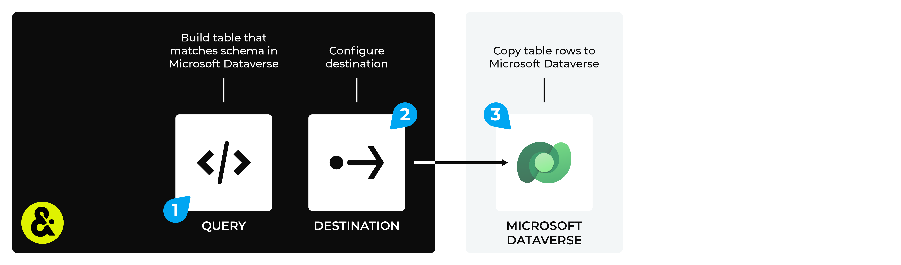

.. https://docs.amperity.com/datagrid/

.. |destination-name| replace:: Microsoft Dataverse
.. |plugin-namex| replace:: Microsoft Dataverse
.. |credential-type| replace:: microsoft-dataverse
.. |what-send| replace:: table rows that match a table schema
.. |filter-the-list| replace:: "micro"
.. |data-template-name| replace:: |destination-name|
.. |data-template-description| replace:: Send |what-send| to |destination-name|.
.. |data-template-config-settings-list| replace:: settings required by |destination-name| were
.. |data-template-config-settings-list-them-vs-it| replace:: them
.. |sendto-link| replace:: |sendto_microsoft_dataverse|

.. meta::
    :description lang=en:
        Configure Amperity to send data to Microsoft Dataverse.

.. meta::
    :content class=swiftype name=body data-type=text:
        Configure Amperity to send data to Microsoft Dataverse.

.. meta::
    :content class=swiftype name=title data-type=string:
        Send data to Microsoft Dataverse

==================================================
Send data to Microsoft Dataverse
==================================================

.. include:: ../../shared/terms.rst
   :start-after: .. term-microsoft-dataverse-start
   :end-before: .. term-microsoft-dataverse-end

.. destination-microsoft-dataverse-steps-to-send-start

.. include:: ../../shared/destinations.rst
   :start-after: .. destinations-overview-list-intro-start
   :end-before: .. destinations-overview-list-intro-end

#. :ref:`Get details <destination-microsoft-dataverse-get-details>`
#. :ref:`Configure your Microsoft application <destination-microsoft-dataverse-application>`
#. :ref:`Add webhook destination <destination-microsoft-dataverse-add-destination>`
#. :ref:`Add data template <destination-microsoft-dataverse-add-data-template>`

.. destination-microsoft-dataverse-steps-to-send-end

.. _destination-microsoft-dataverse-howitworks:

How this destination works
==================================================

.. destination-microsoft-dataverse-howitworks-start

Use |destination-name| to send rows of data from Amperity, and then add them to tables in |destination-name|. The connector will validate each row of data that is sent from Amperity against the table schema in |destination-name|. Only rows that validate against the table schema will be added to the table.

.. destination-microsoft-dataverse-howitworks-end

.. destination-microsoft-dataverse-howitworks-callouts-start

A |destination-name| destination works like this:

#. Use a query to build a table with rows of data that match the schema of a table in |destination-name|. The column names, data types, and column order must match the schema that is defined in |destination-name|.
#. Configure the :ref:`Microsoft Dataverse destination <destination-microsoft-dataverse-add-destination>` in Amperity.
#. Validated table rows are sent to |destination-name|.

.. destination-microsoft-dataverse-howitworks-callouts-end

.. _destination-microsoft-dataverse-get-details:

Get details
==================================================

.. destination-microsoft-dataverse-get-details-start

Amperity can be configured to send |what-send| to |destination-name|.

.. list-table::
   :widths: 10 90
   :header-rows: 0

   * - .. image:: ../../images/steps-check-off-black.png
          :width: 60 px
          :alt: Detail one.
          :align: left
          :class: no-scaled-link
     - Microsoft Azure must be configured for your Power Apps application, after which your Power Apps application must be :ref:`added to the Microsoft Power Platform <destination-microsoft-dataverse-application>`.

       You will need to provide your Azure tenant ID, Azure client ID, and your Azure client secret.

   * - .. image:: ../../images/steps-check-off-black.png
          :width: 60 px
          :alt: Detail one.
          :align: left
          :class: no-scaled-link
     - The environment region, environment name, and logical table name for your Power Apps application. For example: "crm" (region), "acme" (name), and "abc123_acme" (table name).

.. destination-microsoft-dataverse-get-details-end

.. _destination-microsoft-dataverse-application:

Configure your Microsoft application
==================================================

.. destination-microsoft-dataverse-application-start

To send data to |destination-name|, you need to configure an application in Microsoft Azure to create the application and directory IDs and a client secret, after which you must add your application to the Microsoft Power Platform.

.. destination-microsoft-dataverse-application-start

**To configure your application in Microsoft Azure**

.. destination-microsoft-dataverse-application-azure-steps-start

#. Log in to your Microsoft Azure account.
#. Open **Azure Active Directory**, and then **App Registrations**.
#. Click **New Registration**, and then enter the name for your application. Leave all other settings as the default, and then click **Register**.
#. The application overview page contains the following IDs:

   **Application (client) ID**

   **Directory (tenant) ID**

#. From the left-side navigation, click **Authentication**, then **Add a platform**, and then **Web**.
#. On the next page, in the **Redirect URI** field, enter: ``https://app.amperity.com``.
#. Under **Implicit grant and hybrid flows**, enable the **Access tokens (used for implicit flows)** option, and then click **Configure**.
#. From the left-side navigation, click **Certificates & Secrets**, select the **Client secrets** tab, and then click **New client secret**.

#. From the left-side navigation, click **API Permissions**, select **Add a permission**, select **Dynamics CRM**, select **user_impersonation**, and then click **Add permissions**.

.. destination-microsoft-dataverse-application-azure-steps-end

**To add your application to the Microsoft Power Platform**

.. destination-microsoft-dataverse-application-power-steps-start

#. Open the |ext_microsoft_power_platform_console|, click **Environments**, and then click on your environment.
#. Click **Settings**, then **Users and permissions**, and then **Application users**.
#. Click **New app user**, and then select the application you just created, your business unit, and then under **Security roles** click the **Edit** button.
#. Select the following settings:

   **Service Reader**

   **Service Writer**

   and then click **Save**.
#. Click **Create**.

.. destination-microsoft-dataverse-application-power-steps-end

.. _destination-microsoft-dataverse-add-destination:

Add destination
==================================================

.. include:: ../../shared/destinations.rst
   :start-after: .. destinations-add-destinations-intro-all-start
   :end-before: .. destinations-add-destinations-intro-all-end

**To add a destination**

.. destination-microsoft-dataverse-add-destination-steps-start

.. list-table::
   :widths: 10 90
   :header-rows: 0

   * - .. image:: ../../images/steps-01.png
          :width: 60 px
          :alt: Step 1.
          :align: left
          :class: no-scaled-link
     - .. include:: ../../shared/destinations.rst
          :start-after: .. destinations-add-destination-start
          :end-before: .. destinations-add-destination-end

       .. image:: ../../images/mockup-destinations-tab-add-01-select.png
          :width: 500 px
          :alt: Name, description, choose plugin.
          :align: left
          :class: no-scaled-link

       .. include:: ../../shared/destinations.rst
          :start-after: .. destinations-add-name-and-description-start
          :end-before: .. destinations-add-name-and-description-end

   * - .. image:: ../../images/steps-02.png
          :width: 60 px
          :alt: Step 2.
          :align: left
          :class: no-scaled-link
     - .. include:: ../../shared/destinations.rst
          :start-after: .. destinations-add-credentials-start
          :end-before: .. destinations-add-credentials-end

       .. image:: ../../images/mockup-destinations-tab-add-02-credentials.png
          :width: 500 px
          :alt: Choose an existing credential or add credential.
          :align: left
          :class: no-scaled-link

       .. include:: ../../shared/destinations.rst
          :start-after: .. destinations-add-new-or-select-existing-start
          :end-before: .. destinations-add-new-or-select-existing-end

       .. image:: ../../images/mockup-destinations-tab-credentials-01-select.png
          :width: 500 px
          :alt: Choose an existing credential or add credential.
          :align: left
          :class: no-scaled-link

       .. include:: ../../shared/destinations.rst
          :start-after: .. destinations-intro-for-additional-settings-start
          :end-before: .. destinations-intro-for-additional-settings-end

       |destination-name| has the following settings:

       * Azure Active Directory tenant ID
       * Azure client ID
       * Azure client secret

       .. include:: ../../shared/destinations.rst
          :start-after: .. destinations-save-settings-start
          :end-before: .. destinations-save-settings-end

   * - .. image:: ../../images/steps-03.png
          :width: 60 px
          :alt: Step 3.
          :align: left
          :class: no-scaled-link
     - .. include:: ../../shared/destinations.rst
          :start-after: .. destinations-destination-settings-start
          :end-before: .. destinations-destination-settings-end

       .. image:: ../../images/mockup-destinations-tab-add-03-settings.png
          :width: 500 px
          :alt: Settings for Microsoft Dataverse.
          :align: left
          :class: no-scaled-link

       The following settings are specific to |destination-name|:

       .. list-table::
          :widths: 180 320
          :header-rows: 1

          * - **Setting**
            - **Description**
          * - **Environment region**
            - The environment region for your Power Apps application. For example: "crm".

          * - **Environment name**
            - The environment name for your Power Apps application. For example: "acme".

   * - .. image:: ../../images/steps-04.png
          :width: 60 px
          :alt: Step 4.
          :align: left
          :class: no-scaled-link
     - .. include:: ../../shared/destinations.rst
          :start-after: .. destinations-business-users-start
          :end-before: .. destinations-business-users-end

       .. include:: ../../shared/destinations.rst
          :start-after: .. destinations-business-users-admonition-start
          :end-before: .. destinations-business-users-admonition-end

   * - .. image:: ../../images/steps-05.png
          :width: 60 px
          :alt: Step 5.
          :align: left
          :class: no-scaled-link
     - .. include:: ../../shared/destinations.rst
          :start-after: .. destinations-save-start
          :end-before: .. destinations-save-end

.. destination-microsoft-dataverse-add-destination-steps-end

.. _destination-microsoft-dataverse-add-data-template:

Add data template
==================================================

.. include:: ../../shared/terms.rst
   :start-after: .. term-data-template-start
   :end-before: .. term-data-template-end

**To add a data template**

.. destination-microsoft-dataverse-add-data-template-steps-start

.. list-table::
   :widths: 10 90
   :header-rows: 0

   * - .. image:: ../../images/steps-01.png
          :width: 60 px
          :alt: Step 1.
          :align: left
          :class: no-scaled-link
     - .. include:: ../../shared/destinations.rst
          :start-after: .. destinations-data-template-open-template-start
          :end-before: .. destinations-data-template-open-template-end

       .. image:: ../../images/mockup-data-template-tab-add-01-details.png
          :width: 500 px
          :alt: Step 1
          :align: left
          :class: no-scaled-link

       .. include:: ../../shared/destinations.rst
          :start-after: .. destinations-data-template-open-template-name-start
          :end-before: .. destinations-data-template-open-template-name-end

   * - .. image:: ../../images/steps-02.png
          :width: 60 px
          :alt: Step 2.
          :align: left
          :class: no-scaled-link
     - .. include:: ../../shared/destinations.rst
          :start-after: .. destinations-data-template-business-users-start
          :end-before: .. destinations-data-template-business-users-end

       .. image:: ../../images/mockup-data-template-tab-add-02-allow-access.png
          :width: 500 px
          :alt: Step 2.
          :align: left
          :class: no-scaled-link

       .. include:: ../../shared/destinations.rst
          :start-after: .. destinations-data-template-business-users-access-not-configured-start
          :end-before: .. destinations-data-template-business-users-access-not-configured-end

   * - .. image:: ../../images/steps-03.png
          :width: 60 px
          :alt: Step 3.
          :align: left
          :class: no-scaled-link
     - .. include:: ../../shared/destinations.rst
          :start-after: .. destinations-data-template-verify-config-settings-start
          :end-before: .. destinations-data-template-verify-config-settings-end

       .. image:: ../../images/mockup-data-template-tab-add-03-settings.png
          :width: 500 px
          :alt: Verify settings for the data template.
          :align: left
          :class: no-scaled-link

       .. include:: ../../shared/destinations.rst
          :start-after: .. destinations-data-template-verify-config-settings-note-start
          :end-before: .. destinations-data-template-verify-config-settings-note-end

   * - .. image:: ../../images/steps-04.png
          :width: 60 px
          :alt: Step 4.
          :align: left
          :class: no-scaled-link
     - Under **Template Settings**, verify all template settings and make any required updates.

       * **Dataverse Table Logical Name** The table name in Microsoft Dataverse. This is the table to which the connector will write data. For example: "abc123_customers".

       .. important:: Select **Truncate?** to truncate the table before loading data.

   * - .. image:: ../../images/steps-05.png
          :width: 60 px
          :alt: Step 5.
          :align: left
          :class: no-scaled-link
     - .. include:: ../../shared/destinations.rst
          :start-after: .. destinations-data-template-save-start
          :end-before: .. destinations-data-template-save-end

       .. image:: ../../images/mockup-destinations-tab-add-05-save.png
          :width: 500 px
          :alt: Save the data template.
          :align: left
          :class: no-scaled-link

       .. include:: ../../shared/destinations.rst
          :start-after: .. destinations-data-template-save-after-queries-only-start
          :end-before: .. destinations-data-template-save-after-queries-only-end

.. destination-microsoft-dataverse-add-data-template-steps-end
