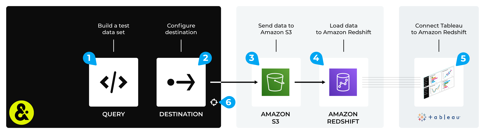

.. https://docs.amperity.com/datagrid/

.. meta::
    :description lang=en:
        Configure Amperity to send data to Amazon Redshift, and then connect to that data from Tableau.

.. meta::
    :content class=swiftype name=body data-type=text:
        Configure Amperity to send data to Amazon Redshift, and then connect to that data from Tableau.

.. meta::
    :content class=swiftype name=title data-type=string:
        Connect Tableau to Amazon Redshift

==================================================
Connect Tableau to Amazon Redshift
==================================================

.. destination-tableau-amazon-redshift-start

Some organizations choose to store their visualization source data in Amazon Redshift, and then connect to Amazon Redshift from Tableau.

You may send an Apache Parquet, Apache Avro, CSV, or JSON file from Amperity to Amazon S3, load that data to Amazom Redshift, and then connect to that data from Tableau.

.. destination-tableau-amazon-redshift-end

.. destination-tableau-amazon-redshift-admonition-start

.. admonition:: What is Amazon Redshift?

   .. include:: ../../shared/terms.rst
      :start-after: .. term-amazon-redshift-start
      :end-before: .. term-amazon-redshift-end

.. destination-tableau-amazon-redshift-admonition-end

.. _destination-tableau-amazon-redshift-workflow-start:

Add workflow
==================================================

.. destination-tableau-amazon-redshift-workflow-start

Amperity can be configured to send data to Amazon S3, after which Amazon Redshift is configured to load that data from Amazon S3. Tableau can be configured to connect to Amazon Redshift, and use Amperity as a source for data visualizations.

You may use the Amazon S3 bucket that comes with your Amperity tenant for the intermediate step (if your Amperity tenant is running on Amazon AWS). Or you may configure Amperity to send data to an Amazon S3 bucket that your organization manages directly.

.. destination-tableau-amazon-redshift-workflow-end

**To connect Tableau to Amazon Redshift**

.. destination-tableau-amazon-redshift-steps-start

The steps required to configure Amperity to send data that is accessible to Tableau from Amazon Redshift requires completion of a series of short workflows, some of which must be done outside of Amperity.

.. list-table::
   :widths: 10 90
   :header-rows: 0

   * - .. image:: ../../images/steps-01.png
          :width: 60 px
          :alt: Step 1.
          :align: left
          :class: no-scaled-link
     - Use a query return the data you want to make available to Tableau for use with data visualizations.

   * - .. image:: ../../images/steps-02.png
          :width: 60 px
          :alt: Step 2.
          :align: left
          :class: no-scaled-link
     - Send an Apache Parquet, Apache Avro, CSV, or JSON file to :doc:`Amazon S3 <destination_amazon_s3>` from Amperity.

   * - .. image:: ../../images/steps-03.png
          :width: 60 px
          :alt: Step 3.
          :align: left
          :class: no-scaled-link
     - |ext_aws_s3_to_redshift| to Amazon Redshift.

   * - .. image:: ../../images/steps-04.png
          :width: 60 px
          :alt: Step 4.
          :align: left
          :class: no-scaled-link
     - Connect Tableau to `Amazon Redshift <https://help.tableau.com/current/pro/desktop/en-us/examples_amazonredshift.htm>`__ |ext_link|, and then access the data sent from Amperity.

   * - .. image:: ../../images/steps-05.png
          :width: 60 px
          :alt: Step 5.
          :align: left
          :class: no-scaled-link
     - Validate the workflow within Amperity and the data within Databricks.

   * - .. image:: ../../images/steps-06.png
          :width: 60 px
          :alt: Step 6.
          :align: left
          :class: no-scaled-link
     - Configure Amperity to automate this workflow for a regular (daily) refresh of data.

.. destination-tableau-amazon-redshift-steps-end
