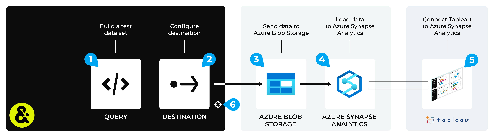

.. 
.. https://docs.amperity.com/datagrid/
.. 

.. meta::
    :description lang=en:
        Configure Amperity to send data to Azure Synapse Analytics, and then connect to that data from Tableau.

.. meta::
    :content class=swiftype name=body data-type=text:
        Configure Amperity to send data to Azure Synapse Analytics, and then connect to that data from Tableau.

.. meta::
    :content class=swiftype name=title data-type=string:
        Connect Tableau to Azure Synapse Analytics

==================================================
Connect Tableau to Azure Synapse Analytics
==================================================

.. destination-tableau-azure-synapse-analytics-start

Some organizations choose to store their visualization source data in Azure Synapse Analytics, and then connect to Azure Synapse Analytics from Tableau.

You may send an Apache Parquet, Apache Avro, CSV, or JSON file from Amperity to Azure Blob Storage, load that data to Azure Synapse Analytics, and then connect to that data from Tableau.

.. destination-tableau-azure-synapse-analytics-end

.. destination-tableau-azure-synapse-analytics-admonition-start

.. admonition:: What is Azure Synapse Analytics?

   .. include:: ../../shared/terms.rst
      :start-after: .. term-azure-synapse-analytics-start
      :end-before: .. term-azure-synapse-analytics-end

.. destination-tableau-azure-synapse-analytics-admonition-end

.. _destination-tableau-azure-synapse-analytics-workflow-start:

Add workflow
==================================================

.. destination-tableau-azure-synapse-analytics-workflow-start

Amperity can be configured to send data to an Azure Blob Storage container, after which Azure Synapse Analytics can be configured to load that data. Tableau can be configured to connect to Azure Synapse Analytics and use the Amperity output as a data source.

You may use the Azure Blob Storage container that comes with your Amperity tenant for the intermediate step (if your Amperity tenant is running on Azure). Or you may configure Amperity to send data to an Azure Blob Storage container that your organization manages directly.

.. destination-tableau-azure-synapse-analytics-workflow-end

**To connect Tableau to Azure Synapse Analytics**

.. destination-tableau-azure-synapse-analytics-steps-start

The steps required to configure Amperity to send data that is accessible to Tableau from Azure Synapse Analytics requires completion of a series of short workflows, some of which must be done outside of Amperity.

.. list-table::
   :widths: 10 90
   :header-rows: 0

   * - .. image:: ../../images/steps-01.png
          :width: 60 px
          :alt: Step 1.
          :align: left
          :class: no-scaled-link
     - Use a query return the data you want to make available to Tableau for use with data visualizations.

   * - .. image:: ../../images/steps-02.png
          :width: 60 px
          :alt: Step 2.
          :align: left
          :class: no-scaled-link
     - Send an Apache Parquet, Apache Avro, CSV, or JSON file to :doc:`Azure Blob Storage <destination_azure_blob_storage>` from Amperity.

   * - .. image:: ../../images/steps-03.png
          :width: 60 px
          :alt: Step 3.
          :align: left
          :class: no-scaled-link
     - |ext_azure_synapse_analytics_load_table_from_blob_storage| to Azure Synapse Analytics.

   * - .. image:: ../../images/steps-04.png
          :width: 60 px
          :alt: Step 4.
          :align: left
          :class: no-scaled-link
     - Connect Tableau to `Azure Synapse Analytics <https://help.tableau.com/current/pro/desktop/en-us/examples_azure_sql_dw.htm>`__ |ext_link|, and then access the data sent from Amperity.

   * - .. image:: ../../images/steps-05.png
          :width: 60 px
          :alt: Step 5.
          :align: left
          :class: no-scaled-link
     - Validate the workflow within Amperity and the data within Tableau.

   * - .. image:: ../../images/steps-06.png
          :width: 60 px
          :alt: Step 6.
          :align: left
          :class: no-scaled-link
     - Configure Amperity to automate this workflow for a regular (daily) refresh of data.

.. destination-tableau-azure-synapse-analytics-steps-end
