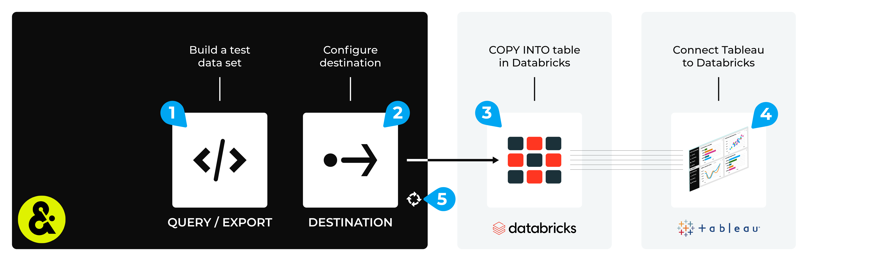

.. 
.. https://docs.amperity.com/datagrid/
.. 

.. meta::
    :description lang=en:
        Configure Amperity to send data to Databricks, and then connect to that data from Tableau.

.. meta::
    :content class=swiftype name=body data-type=text:
        Configure Amperity to send data to Databricks, and then connect to that data from Tableau.

.. meta::
    :content class=swiftype name=title data-type=string:
        Connect Tableau to Databricks

==================================================
Connect Tableau to Databricks
==================================================

.. destination-tableau-databricks-start

Some organizations choose to store their visualization source data in Databricks, and then connect to Databricks from Tableau.

You may send an Apache Parquet, Apache Avro, CSV, or JSON file from Amperity to Databricks, and then connect to that data from Tableau.

.. destination-tableau-databricks-end

.. destination-tableau-databricks-admonition-start

.. admonition:: What is Databricks?

   .. include:: ../../shared/terms.rst
      :start-after: .. term-databricks-start
      :end-before: .. term-databricks-end

   .. include:: ../../shared/terms.rst
      :start-after: .. term-databricks-delta-table-start
      :end-before: .. term-databricks-delta-table-end

.. destination-tableau-databricks-admonition-end

.. _destination-tableau-databricks-workflow-start:

Add workflow
==================================================

.. destination-tableau-databricks-workflow-start

Amperity can be configured to send data to Databricks. Tableau can be configured to connect to Databricks, and then use Amperity as a source for data visualizations.

.. destination-tableau-databricks-workflow-end

**To connect Tableau to Databricks**

.. destination-tableau-databricks-steps-start

The steps required to configure Amperity to send data that is accessible to Tableau from Databricks requires completion of a series of short workflows, some of which must be done outside of Amperity.

.. list-table::
   :widths: 10 90
   :header-rows: 0

   * - .. image:: ../../images/steps-01.png
          :width: 60 px
          :alt: Step 1.
          :align: left
          :class: no-scaled-link
     - Use a query return the data you want to make available to Tableau for use with data visualizations.

   * - .. image:: ../../images/steps-02.png
          :width: 60 px
          :alt: Step 2.
          :align: left
          :class: no-scaled-link
     - Send an Apache Parquet, Apache Avro, CSV, or JSON file to `Databricks <https://docs.amperity.com/datagrid/bridge_databricks.html>`__ |ext_link| as a Delta table from Amperity.

   * - .. image:: ../../images/steps-03.png
          :width: 60 px
          :alt: Step 3.
          :align: left
          :class: no-scaled-link
     - Validate the workflow within Amperity and the data within Databricks.

   * - .. image:: ../../images/steps-04.png
          :width: 60 px
          :alt: Step 4.
          :align: left
          :class: no-scaled-link
     - Connect Tableau to |ext_tableau_databricks|, and then access the data sent from Amperity.

   * - .. image:: ../../images/steps-05.png
          :width: 60 px
          :alt: Step 5.
          :align: left
          :class: no-scaled-link
     - Configure Amperity to automate this workflow for a regular (daily) refresh of data.

.. destination-tableau-databricks-steps-end
