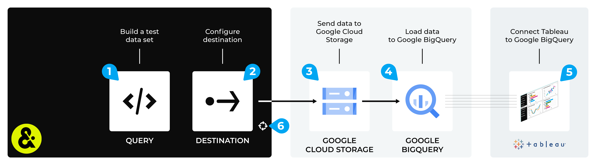

.. https://docs.amperity.com/datagrid/

.. meta::
    :description lang=en:
        Configure Amperity to send data to Google BigQuery, and then connect to that data from Tableau.

.. meta::
    :content class=swiftype name=body data-type=text:
        Configure Amperity to send data to Google BigQuery, and then connect to that data from Tableau.

.. meta::
    :content class=swiftype name=title data-type=string:
        Connect Tableau to Google BigQuery

==================================================
Connect Tableau to Google BigQuery
==================================================

.. destination-tableau-google-big-query-start

Some organizations choose to store their visualization source data in Google BigQuery, and then connect to Google BigQuery from Tableau.

You may send an Apache Parquet, Apache Avro, CSV, or JSON file from Amperity to Google Cloud Storage, load that data to Google BigQuery, and then connect to that data from Tableau.

.. destination-tableau-google-big-query-end

.. destination-tableau-google-big-query-admonition-start

.. admonition:: What is Google BigQuery?

   .. include:: ../../shared/terms.rst
      :start-after: .. term-google-bigquery-start
      :end-before: .. term-google-bigquery-end

.. destination-tableau-google-big-query-admonition-end

.. _destination-tableau-google-big-query-workflow-start:

Add workflow
==================================================

.. destination-tableau-google-big-query-workflow-start

Amperity can be configured to send data to Google Cloud Storage, after which the data can be transferred to Google BigQuery. Tableau can be configured to connect to Google BigQuery and use the Amperity output as a data source.

You must configure Amperity to send data to a Google Cloud Storage bucket that your organization manages directly.

.. destination-tableau-google-big-query-workflow-end

**To connect Tableau to Google BigQuery**

.. destination-tableau-google-big-query-steps-start

The steps required to configure Amperity to send data that is accessible to Tableau from Google BigQuery requires completion of a series of short workflows, some of which must be done outside of Amperity.

.. list-table::
   :widths: 10 90
   :header-rows: 0

   * - .. image:: ../../images/steps-01.png
          :width: 60 px
          :alt: Step 1.
          :align: left
          :class: no-scaled-link
     - Use a query return the data you want to make available to Tableau for use with data visualizations.

   * - .. image:: ../../images/steps-02.png
          :width: 60 px
          :alt: Step 2.
          :align: left
          :class: no-scaled-link
     - Send an Apache Parquet, Apache Avro, CSV, or JSON file to :doc:`Google Cloud Storage <destination_google_cloud_storage>` from Amperity.

   * - .. image:: ../../images/steps-03.png
          :width: 60 px
          :alt: Step 3.
          :align: left
          :class: no-scaled-link
     - |ext_google_bigquery_transfer_from_cloud_storage| to Google BigQuery.

   * - .. image:: ../../images/steps-04.png
          :width: 60 px
          :alt: Step 4.
          :align: left
          :class: no-scaled-link
     - Connect Tableau to `Google BigQuery <https://help.tableau.com/current/pro/desktop/en-us/examples_googlebigquery.htm>`__ |ext_link|, and then access the data sent from Amperity.

   * - .. image:: ../../images/steps-05.png
          :width: 60 px
          :alt: Step 5.
          :align: left
          :class: no-scaled-link
     - Validate the workflow within Amperity and the data within Tableau.

   * - .. image:: ../../images/steps-06.png
          :width: 60 px
          :alt: Step 6.
          :align: left
          :class: no-scaled-link
     - Configure Amperity to automate this workflow for a regular (daily) refresh of data.

.. destination-tableau-google-big-query-steps-end
