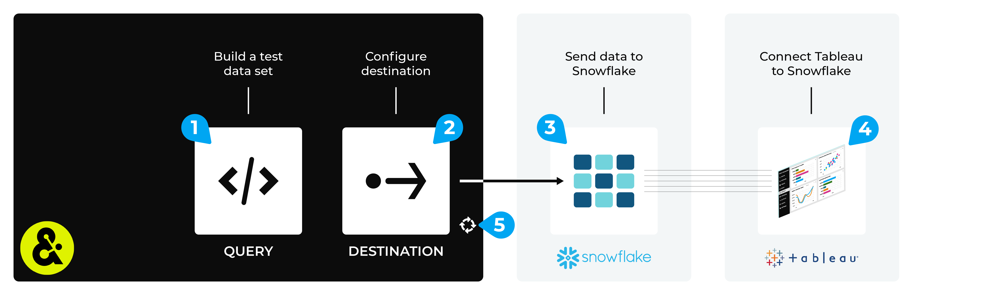

.. 
.. https://docs.amperity.com/datagrid/
.. 

.. meta::
    :description lang=en:
        Configure Amperity to send data to Snowflake, and then connect to that data from Tableau.

.. meta::
    :content class=swiftype name=body data-type=text:
        Configure Amperity to send data to Snowflake, and then connect to that data from Tableau.

.. meta::
    :content class=swiftype name=title data-type=string:
        Connect Tableau to Snowflake

==================================================
Connect Tableau to Snowflake
==================================================

.. destination-tableau-snowflake-start

Some organizations choose to store their visualization source data in Snowflake, and then connect to Snowflake from Tableau.

You may send an Apache Parquet, Apache Avro, CSV, or JSON file from Amperity to Snowflake, and then connect to that data from Tableau.

.. destination-tableau-snowflake-end

.. destination-tableau-snowflake-admonition-start

.. admonition:: What is Snowflake?

   .. include:: ../../shared/terms.rst
      :start-after: .. term-snowflake-start
      :end-before: .. term-snowflake-end

.. destination-tableau-snowflake-admonition-end

.. _destination-tableau-snowflake-workflow-start:

Add workflow
==================================================

.. destination-tableau-snowflake-workflow-start

Amperity can be configured to send data directly to Snowflake. Tableau can be configured to connect to Snowflake, and use Amperity as a source for data visualizations.

.. destination-tableau-snowflake-workflow-end

**To connect Tableau to Snowflake**

.. destination-tableau-snowflake-steps-start

The steps required to configure Amperity to send data that is accessible to Tableau from a Snowflake data warehouse requires completion of a series of short workflows, some of which must be done outside of Amperity.

.. list-table::
   :widths: 10 90
   :header-rows: 0

   * - .. image:: ../../images/steps-01.png
          :width: 60 px
          :alt: Step 1.
          :align: left
          :class: no-scaled-link
     - Configure Snowflake objects for the correct database, tables, roles, and users. (Refer to the :ref:`Amazon S3 <destination-snowflake-aws-configure-objects>` or :ref:`Azure <destination-snowflake-azure-configure-objects>` topic, as appropriate for your tenant.)

       .. note:: Snowflake can be configured to run in Amazon AWS or Azure. When using the Amazon Data Warehouse you will use the same cloud platform as your Amperity tenant. When using your own instance of Snowflake, you should use the same Amazon S3 bucket or Azure Blob Storage container that is included with your tenant when configuring Snowflake for data sharing, but then connect Tableau directly to your own instance of Snowflake.

   * - .. image:: ../../images/steps-02.png
          :width: 60 px
          :alt: Step 2.
          :align: left
          :class: no-scaled-link
     - Send data to Snowflake from Amperity. (Refer to the :doc:`Amazon S3 <destination_snowflake_aws>` or :doc:`Azure <destination_snowflake_azure>` topic, as appropriate for your tenant.)

   * - .. image:: ../../images/steps-03.png
          :width: 60 px
          :alt: Step 3.
          :align: left
          :class: no-scaled-link
     - Connect Tableau to |ext_tableau_snowflake|, and then access the data sent from Amperity.

       .. note:: The URL for the Snowflake data warehouse, the Snowflake username, the password, and the name of the Snowflake data warehouse are sent to the Tableau user within a SnapPass link. Request this information from your Amperity representative prior to attempting to connect Tableau to Snowflake.

   * - .. image:: ../../images/steps-04.png
          :width: 60 px
          :alt: Step 4.
          :align: left
          :class: no-scaled-link
     - Validate the workflow within Amperity and the data within Tableau.

   * - .. image:: ../../images/steps-05.png
          :width: 60 px
          :alt: Step 5.
          :align: left
          :class: no-scaled-link
     - Configure Amperity to automate this workflow for a regular (daily) refresh of data.

.. destination-tableau-snowflake-steps-end
