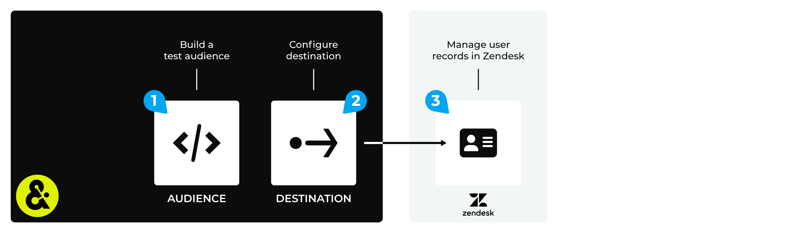

.. 
.. https://docs.amperity.com/datagrid/
.. 

.. |destination-name| replace:: Zendesk
.. |destination-api| replace:: Zendesk Users API
.. |plugin-name| replace:: Zendesk
.. |what-send| replace:: audience data
.. |email-plus-send| replace:: additional attributes
.. |filter-the-list| replace:: "zen"
.. |data-template-name| replace:: |destination-name|
.. |data-template-description| replace:: Send |what-send| to |destination-name|.
.. |credential-type| replace:: **zendesk-api-token**
.. |credential-details| replace:: the Zendesk User API token and the email address of the administrator who created the token
.. |sendto-link| replace:: |sendto_zendesk|
.. |channel-link| replace:: send campaign results

.. meta::
    :description lang=en:
        Configure Amperity to send data to Zendesk.

.. meta::
    :content class=swiftype name=body data-type=text:
        Configure Amperity to send data to Zendesk.

.. meta::
    :content class=swiftype name=title data-type=string:
        Send data to Zendesk

==================================================
Send data to Zendesk
==================================================

.. include:: ../../shared/terms.rst
   :start-after: .. term-zendesk-start
   :end-before: .. term-zendesk-end

.. destination-zendesk-start

Amperity may be configured to create or update user records in |destination-name| by using the |destination-api| to |ext_zendesk_rest_api_create_or_update_users|. Use this connector to deliver a better customer support experience by pre-populating |destination-name| user records with customer records from Amperity, including:

* Order history
* Loyalty status
* Satisfaction survey results
* Shopping preferences
* and more

Use this data to show customer support representatives information related to product recommendations, next best actions, and likelihood of churn.

.. destination-zendesk-end

.. destination-zendesk-note-start

.. note:: Creating or updating records are |ext_zendesk_rest_api_rate_limits| to a maximum of 100 users per second.

.. destination-zendesk-note-end

.. destination-zendesk-steps-to-send-start

.. include:: ../../shared/destinations.rst
   :start-after: .. destinations-overview-list-intro-start
   :end-before: .. destinations-overview-list-intro-end

#. :ref:`Get details <destination-zendesk-get-details>`
#. :ref:`Add destination <destination-zendesk-add-destination>`
#. :ref:`Add data template <destination-zendesk-add-data-template>`

.. destination-zendesk-steps-to-send-end

.. _destination-zendesk-howitworks:

How this destination works
==================================================

.. destination-zendesk-howitworks-start

Amperity can send |what-send| to update user records in |destination-name|. The |what-send| is uploaded to |destination-name| using the |destination-api|.

.. destination-zendesk-howitworks-end

.. destination-zendesk-howitworks-callouts-start

A |destination-name| destination works like this:

.. list-table::
   :widths: 10 90
   :header-rows: 0

   * - .. image:: ../../images/steps-01.png
          :width: 60 px
          :alt: Step one.
          :align: left
          :class: no-scaled-link
     - Use a query to build a list of customers to be updated in |destination-name|.

   * - .. image:: ../../images/steps-02.png
          :width: 60 px
          :alt: Step two.
          :align: left
          :class: no-scaled-link
     - Configure Amperity to send audience data to |destination-name|.

   * - .. image:: ../../images/steps-03.png
          :width: 60 px
          :alt: Step three.
          :align: left
          :class: no-scaled-link
     - Send a test from Amperity.

       .. important:: Be sure to send all fields from Amperity that will be required by |destination-name|. The **name**, **email** or **external_id** fields must be included.

       From within |destination-name| verify that audience data has been loaded and is usable by all of the use cases you want to use within |destination-name| to build better customer experiences.

.. destination-zendesk-howitworks-callouts-end

.. _destination-zendesk-get-details:

Get details
==================================================

.. destination-zendesk-get-details-start

|destination-name| requires the following configuration details:

.. list-table::
   :widths: 10 90
   :header-rows: 0

   * - .. image:: ../../images/steps-check-off-black.png
          :width: 60 px
          :alt: Detail one.
          :align: left
          :class: no-scaled-link
     - The |ext_zendesk_rest_api_token|, which may be generated via the |destination-name| user interface by an administrator with **Token Access** enabled.

   * - .. image:: ../../images/steps-check-off-black.png
          :width: 60 px
          :alt: Detail two.
          :align: left
          :class: no-scaled-link
     - The email address of the administrator who created the API token.

   * - .. image:: ../../images/steps-check-off-black.png
          :width: 60 px
          :alt: Detail three.
          :align: left
          :class: no-scaled-link
     - The subdomain of the |destination-name| instance.

   * - .. image:: ../../images/steps-check-off-black.png
          :width: 60 px
          :alt: Detail four.
          :align: left
          :class: no-scaled-link
     - A query that outputs fields that are mapped to data requirements for the |destination-api|.

.. destination-zendesk-get-details-end

.. _destination-zendesk-add-destination:

Add destination
==================================================

.. include:: ../../shared/destinations.rst
   :start-after: .. destinations-add-destinations-intro-all-start
   :end-before: .. destinations-add-destinations-intro-all-end

**To add a destination**

.. destination-zendesk-add-destination-steps-start

.. list-table::
   :widths: 10 90
   :header-rows: 0

   * - .. image:: ../../images/steps-01.png
          :width: 60 px
          :alt: Step 1.
          :align: left
          :class: no-scaled-link
     - .. include:: ../../shared/destinations.rst
          :start-after: .. destinations-add-destination-start
          :end-before: .. destinations-add-destination-end

       .. image:: ../../images/mockup-destinations-tab-add-01-select.png
          :width: 500 px
          :alt: Name, description, choose plugin.
          :align: left
          :class: no-scaled-link

       .. include:: ../../shared/destinations.rst
          :start-after: .. destinations-add-name-and-description-start
          :end-before: .. destinations-add-name-and-description-end

   * - .. image:: ../../images/steps-02.png
          :width: 60 px
          :alt: Step 2.
          :align: left
          :class: no-scaled-link
     - .. include:: ../../shared/destinations.rst
          :start-after: .. destinations-add-credentials-start
          :end-before: .. destinations-add-credentials-end

       .. image:: ../../images/mockup-destinations-tab-add-02-credentials.png
          :width: 500 px
          :alt: Choose an existing credential or add credential.
          :align: left
          :class: no-scaled-link

       .. include:: ../../shared/destinations.rst
          :start-after: .. destinations-add-new-or-select-existing-start
          :end-before: .. destinations-add-new-or-select-existing-end

       .. image:: ../../images/mockup-destinations-tab-credentials-01-select.png
          :width: 500 px
          :alt: Choose an existing credential or add credential.
          :align: left
          :class: no-scaled-link

       .. include:: ../../shared/destinations.rst
          :start-after: .. destinations-intro-for-additional-settings-start
          :end-before: .. destinations-intro-for-additional-settings-end

       |destination-name| has the following settings:

       * Credential name
       * Zendesk User API token
       * Email address of the administrator who created the token

       .. include:: ../../shared/destinations.rst
          :start-after: .. destinations-save-settings-start
          :end-before: .. destinations-save-settings-end

   * - .. image:: ../../images/steps-03.png
          :width: 60 px
          :alt: Step 3.
          :align: left
          :class: no-scaled-link
     - .. include:: ../../shared/destinations.rst
          :start-after: .. destinations-destination-settings-start
          :end-before: .. destinations-destination-settings-end

       .. image:: ../../images/mockup-destinations-tab-add-03-settings.png
          :width: 500 px
          :alt: Settings for Zendesk.
          :align: left
          :class: no-scaled-link

       The following settings are specific to |destination-name|:

       .. list-table::
          :widths: 180 320
          :header-rows: 1

          * - **Setting**
            - **Description**
          * - **Subdomain**
            - The subdomain is part of your |destination-name| URL. For example: "acme" is the subdomain for ``acme.zendesk.com``.

   * - .. image:: ../../images/steps-04.png
          :width: 60 px
          :alt: Step 4.
          :align: left
          :class: no-scaled-link
     - .. include:: ../../shared/destinations.rst
          :start-after: .. destinations-business-users-start
          :end-before: .. destinations-business-users-end

       .. include:: ../../shared/destinations.rst
          :start-after: .. destinations-business-users-admonition-start
          :end-before: .. destinations-business-users-admonition-end

       .. include:: ../../shared/destinations.rst
          :start-after: .. destinations-business-users-enable-start
          :end-before: .. destinations-business-users-enable-end

       .. include:: ../../shared/destinations.rst
          :start-after: .. destinations-business-users-allow-start
          :end-before: .. destinations-business-users-allow-end

   * - .. image:: ../../images/steps-05.png
          :width: 60 px
          :alt: Step 5.
          :align: left
          :class: no-scaled-link
     - .. include:: ../../shared/destinations.rst
          :start-after: .. destinations-save-start
          :end-before: .. destinations-save-end

.. destination-zendesk-add-destination-steps-end

.. _destination-zendesk-add-data-template:

Add data template
==================================================

.. include:: ../../shared/terms.rst
   :start-after: .. term-data-template-start
   :end-before: .. term-data-template-end

**To add a data template**

.. destination-zendesk-add-data-template-steps-start

.. list-table::
   :widths: 10 90
   :header-rows: 0

   * - .. image:: ../../images/steps-01.png
          :width: 60 px
          :alt: Step 1.
          :align: left
          :class: no-scaled-link
     - .. include:: ../../shared/destinations.rst
          :start-after: .. destinations-data-template-open-template-start
          :end-before: .. destinations-data-template-open-template-end

       .. image:: ../../images/mockup-data-template-tab-add-01-details.png
          :width: 500 px
          :alt: Step 1
          :align: left
          :class: no-scaled-link

       .. include:: ../../shared/destinations.rst
          :start-after: .. destinations-data-template-open-template-name-start
          :end-before: .. destinations-data-template-open-template-name-end

   * - .. image:: ../../images/steps-02.png
          :width: 60 px
          :alt: Step 2.
          :align: left
          :class: no-scaled-link
     - .. include:: ../../shared/destinations.rst
          :start-after: .. destinations-data-template-business-users-start
          :end-before: .. destinations-data-template-business-users-end

       .. image:: ../../images/mockup-data-template-tab-add-02-allow-access.png
          :width: 500 px
          :alt: Step 2.
          :align: left
          :class: no-scaled-link

       .. include:: ../../shared/destinations.rst
          :start-after: .. destinations-data-template-business-users-access-not-configured-start
          :end-before: .. destinations-data-template-business-users-access-not-configured-end

       .. include:: ../../shared/destinations.rst
          :start-after: .. destinations-data-template-business-users-allow-campaigns-start
          :end-before: .. destinations-data-template-business-users-allow-campaigns-end

   * - .. image:: ../../images/steps-03.png
          :width: 60 px
          :alt: Step 3.
          :align: left
          :class: no-scaled-link
     - .. include:: ../../shared/destinations.rst
          :start-after: .. destinations-data-template-verify-config-settings-start
          :end-before: .. destinations-data-template-verify-config-settings-end

   * - .. image:: ../../images/steps-04.png
          :width: 60 px
          :alt: Step 4.
          :align: left
          :class: no-scaled-link
     - .. include:: ../../shared/destinations.rst
          :start-after: .. destinations-data-template-save-start
          :end-before: .. destinations-data-template-save-end

       .. image:: ../../images/mockup-destinations-tab-add-05-save.png
          :width: 500 px
          :alt: Save the data template.
          :align: left
          :class: no-scaled-link

       .. include:: ../../shared/destinations.rst
          :start-after: .. destinations-data-template-save-after-start
          :end-before: .. destinations-data-template-save-after-end

.. destination-zendesk-add-data-template-steps-end

.. _destination-zendesk-workflow-actions:

Workflow actions
==================================================

.. include:: ../../shared/workflow-actions.rst
   :start-after: .. workflow-actions-common-table-intro-start
   :end-before: .. workflow-actions-common-table-intro-end

.. destination-zendesk-workflow-actions-start

.. list-table::
   :widths: 10 90
   :header-rows: 0

   * - .. image:: ../../images/steps-01.png
          :width: 60 px
          :alt: Step one.
          :align: left
          :class: no-scaled-link
     - .. include:: ../../shared/workflow-actions.rst
          :start-after: .. workflow-actions-common-table-section-one-a-start
          :end-before: .. workflow-actions-common-table-section-one-a-end

       .. image:: ../../images/mockup-destinations-tab-workflow-error.png
          :width: 500 px
          :alt: Review a notifications error.
          :align: left
          :class: no-scaled-link

       .. include:: ../../shared/workflow-actions.rst
          :start-after: .. workflow-actions-common-table-section-one-b-start
          :end-before: .. workflow-actions-common-table-section-one-b-end

   * - .. image:: ../../images/steps-02.png
          :width: 60 px
          :alt: Step two.
          :align: left
          :class: no-scaled-link
     - .. include:: ../../shared/workflow-actions.rst
          :start-after: .. workflow-actions-common-table-section-two-start
          :end-before: .. workflow-actions-common-table-section-two-end

       .. image:: ../../images/mockups-workflow-failed.png
          :width: 500 px
          :alt: The workflow tab, showing a workflow with errors.
          :align: left
          :class: no-scaled-link

   * - .. image:: ../../images/steps-03.png
          :width: 60 px
          :alt: Step three.
          :align: left
          :class: no-scaled-link
     - .. include:: ../../shared/workflow-actions.rst
          :start-after: .. workflow-actions-common-table-section-three-a-start
          :end-before: .. workflow-actions-common-table-section-three-a-end

       .. image:: ../../images/workflow-actions-zendesk-403.png
          :width: 300 px
          :alt: Choose a workflow action from the list of actions.
          :align: left
          :class: no-scaled-link

       .. include:: ../../shared/workflow-actions.rst
          :start-after: .. workflow-actions-common-table-section-three-b-start
          :end-before: .. workflow-actions-common-table-section-three-b-end

       Amperity provides a series of workflow actions that can help resolve specific issues that may arise with |destination-name|, including:

       * :ref:`destination-zendesk-workflow-actions-authorization-error`
       * :ref:`destination-zendesk-workflow-actions-invalid-credentials`

   * - .. image:: ../../images/steps-04.png
          :width: 60 px
          :alt: Step four.
          :align: left
          :class: no-scaled-link
     - .. include:: ../../shared/workflow-actions.rst
          :start-after: .. workflow-actions-common-table-section-four-a-start
          :end-before: .. workflow-actions-common-table-section-four-a-end

       .. image:: ../../images/workflow-actions-zendesk-403-steps.png
          :width: 300 px
          :alt: Choose a workflow action from the list of actions.
          :align: left
          :class: no-scaled-link

       .. include:: ../../shared/workflow-actions.rst
          :start-after: .. workflow-actions-common-table-section-four-b-start
          :end-before: .. workflow-actions-common-table-section-four-b-end

.. destination-zendesk-workflow-actions-end

.. _destination-zendesk-workflow-actions-authorization-error:

Authorization error
--------------------------------------------------

.. destination-zendesk-workflow-actions-authorization-error-start

A 403 response means that Amperity is not able to access the Zendesk Users API. When a 403 response is received from Zendesk, a workflow action named "Authorization Error" is generated.

Amperity uses two configuration settings -- |credential-details| -- to build a credentials string that is added to the request authorization header. The format for the credentials string is:

::

   {email_address}/token:{api_token}

A 403 response from Zendesk indicates that the credentials string does not have the correct information. This could be for a number of reasons, including:

* The wrong values for email address or API token are configured in Amperity.
* The API token was deleted in Zendesk.
* The email address for the user who generated the API token is no longer a valid email address within Zendesk or is not associated with a user who has permission to access the Zendesk Users API.

.. destination-zendesk-workflow-actions-authorization-error-end

.. destination-zendesk-workflow-actions-authorization-error-steps-start

To resolve this error, you must provide a combination of email address and Zendesk API token that allows Amperity access to Zendesk.

#. Open the Amperity **Credentials** page in a new tab.
#. Verify that the individual who authorized access to Zendesk has the correct permissions to allow Amperity to access Zendesk.
#. Update the values that build the credentials string as necessary.

   .. tip:: You may need to generate a new API token in Zendesk, and then reconfigure Amperity with the updated API token string *and* the email address for the user that generated the newly-generated API token.
#. Return to the workflow action, and then click **Resolve** to retry this workflow.

.. destination-zendesk-workflow-actions-authorization-error-steps-start

.. _destination-zendesk-workflow-actions-invalid-credentials:

Invalid credentials
--------------------------------------------------

.. include:: ../../shared/workflow-actions.rst
   :start-after: .. workflow-actions-generic-invalid-credentials-start
   :end-before: .. workflow-actions-generic-invalid-credentials-end
