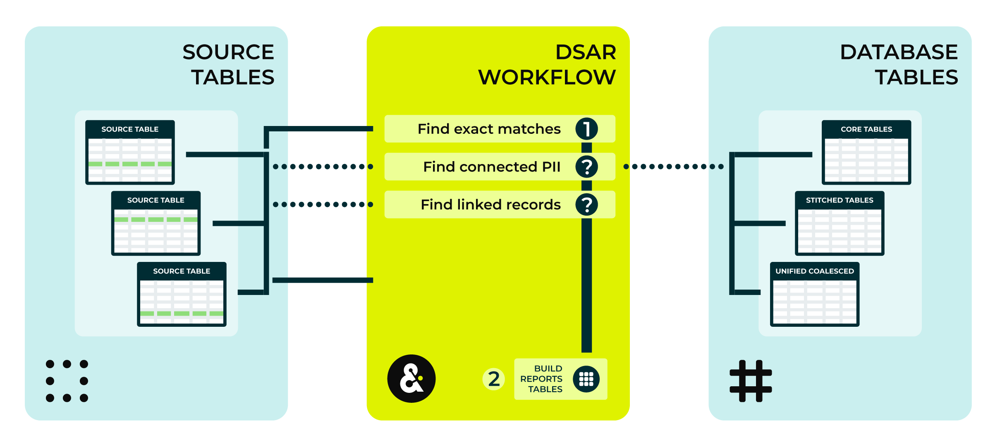

.. 
.. https://docs.amperity.com/datagrid/
.. 

.. meta::
    :description lang=en:
        Enable a privacy rights workflow to support CCPA and GDPR workflows.

.. meta::
    :content class=swiftype name=body data-type=text:
        Enable a privacy rights workflow to support CCPA and GDPR workflows.

.. meta::
    :content class=swiftype name=title data-type=string:
        Privacy rights

==================================================
Privacy rights
==================================================

.. privacy-rights-overview-start

A privacy rights workflow can help your organization stay in compliance with data protection and privacy regulations, such as those required by California Consumer Privacy Act (CCPA) or General Data Protection Regulation (GDPR).

* .. include:: ../../shared/terms.rst
     :start-after: .. term-ccpa-start
     :end-before: .. term-ccpa-end
* .. include:: ../../shared/terms.rst
     :start-after: .. term-gdpr-start
     :end-before: .. term-gdpr-end
* .. include:: ../../shared/terms.rst
     :start-after: .. term-australian-privacy-principles-start
     :end-before: .. term-australian-privacy-principles-end

This topic describes how to configure Amperity to support a self-service privacy rights workflow that deletes consumer profile data based on inbound delete requests and requested compliance actions.

.. privacy-rights-overview-end

.. privacy-rights-note-start

.. note:: General Data Protection Regulation (GDPR) and California Consumer Privacy Act (CCPA) compliance is the obligation of each customer, including interpreting and determining how to comply with each request made by a user. As such, each customer must define the process by which inbound requests for General Data Protection Regulation (GDPR) and California Consumer Privacy Act (CCPA) compliance are made available to Amperity.

   Each customer is encouraged to seek legal counsel regarding California Consumer Privacy Act (CCPA) compliance and should not rely solely on General Data Protection Regulation (GDPR) and California Consumer Privacy Act (CCPA) workflows within Amperity to ensure that compliance.

.. privacy-rights-note-end

.. privacy-rights-important-start

.. important:: This topic does not constitute legal advice to third parties regarding General Data Protection Regulation (GDPR) and California Consumer Privacy Act (CCPA) compliance, nor does it imply that steps taken by Amperity will satisfy these compliance requirements.

   Customers are encouraged to seek legal counsel regarding General Data Protection Regulation (GDPR) and California Consumer Privacy Act (CCPA) compliance and should not rely solely on Amperity for compliance.

.. privacy-rights-important-end

.. _privacy-rights-workflows:

About privacy rights workflows
==================================================

.. privacy-rights-workflows-start

The following sections describe the three types of privacy rights workflows:

* :ref:`DSAR <privacy-rights-workflows-dsar>`
* :ref:`Delete records <privacy-rights-workflows-delete-records>`
* :ref:`Delete PII <privacy-rights-workflows-delete-pii>`

The sections are repetitive when the workflows have shared behavior and are different when they have unique behavior. For example: the first step for all privacy rights workflows is to find all records with exact matches to the inbound request; however, the **Delete PII** privacy rights workflow is the only one that requires using the **compliance/pii** semantic tag.

.. privacy-rights-workflows-end

.. _privacy-rights-workflows-dsar:

DSAR
----------------------------------------------------------

.. include:: ../../shared/terms.rst
   :start-after: .. term-dsar-start
   :end-before: .. term-dsar-end

.. privacy-rights-workflows-dsar-start

The following diagram shows the workflow that occurs when a DSAR request is present in the inbound requests table.

The following sections describe the individual steps within the workflow that occurs when a DSAR request is present in the inbound requests table.

.. list-table::
   :widths: 10 90
   :header-rows: 0

   * - .. image:: ../../images/steps-01.png
          :width: 60 px
          :alt: Step 1.
          :align: left
          :class: no-scaled-link

     - **Find records**

       A DSAR request runs when **type** field in the inbound requests table is set to **dsar**.

       The **strategy** for an inbound request is set to **exact** by default. An exact matching strategy will find all records in all source tables that match the email address, phone number, or address group that is included in the inbound request.

       .. admonition:: About the connected_pii strategy

          Using the the **exact** strategy for DSAR requests is recommended.

          The **strategy** may be set to **connected_pii**. A connected PII matching strategy will find all records in source tables that match the email address, phone number, or address group that is included in the inbound request *and* will find all matching records in Stitch output (core tables, stitched tables, and the **Unified Coalesced** table).

          A Stitch cluster often contains variations of email addresses, phone numbers, and address groups that are all associated with a single unique individual, but only one email address, phone number, or address group will match exactly to the values in the inbound request.

          To avoid potentially exposing additional customer PII in the DSAR report (and possible DSAR response) it is recommended to use the **exact** strategy as often as possible.

       .. note:: Source keys or linkage tables can be used to trace records in a custom domain table back to a source table. When either of these are implemented, a direct or connected match on a custom domain table will find all corresponding records in source domain tables.

   * - .. image:: ../../images/steps-02.png
          :width: 60 px
          :alt: Step 2.
          :align: left
          :class: no-scaled-link

     - **Refresh reports**

       When the DSAR request workflow is finished the **Unified Compliance** and **Unified Compliance Overview** tables are updated.

.. privacy-rights-workflows-dsar-end

.. _privacy-rights-workflows-delete-records:

Delete records
----------------------------------------------------------

.. privacy-rights-workflows-delete-records-start

An inbound request may require deleting customer records.

The following diagram shows the workflow that occurs when a delete records request is present in the inbound requests table.

The following sections describe the individual steps within the workflow that occurs when a delete records request is present in the inbound requests table.

.. list-table::
   :widths: 10 90
   :header-rows: 0

   * - .. image:: ../../images/steps-01.png
          :width: 60 px
          :alt: Step 1.
          :align: left
          :class: no-scaled-link

     - **Find records**

       A delete records request runs when **type** field in the inbound requests table is set to **delete**.

       The **strategy** for an inbound request is set to **exact** by default. An exact matching strategy will find all records in all source tables that match the email address, phone number, or address group that is included in the inbound request. The request match category resulting from a match on PII will be **direct** and can be viewed from the **Unified_Compliance** table.

       The **strategy** may be set to **connected_pii**. A connected PII matching strategy will find all records in source tables that match the email address, phone number, or address group that is included in the inbound request *and* will find all records with the same Amperity ID as those direct matches. The request match category resulting from a match on Amperity ID will be **connected** and can be viewed from the **Unified_Compliance** table.

       .. note:: The request match category resulting from a match due to source keys will be **source_key** and the request match category resulting from a match due to linkage tables will be **linkage_table**.

   * - .. image:: ../../images/steps-02.png
          :width: 60 px
          :alt: Step 2.
          :align: left
          :class: no-scaled-link

     - **Suppress records**

       Data in Stitch output (core tables, stitched tables, and the **Unified Coalesced** table) that matches the inbound request is suppressed. All records that match values in the inbound request are set to **NULL**.

   * - .. image:: ../../images/steps-03.png
          :width: 60 px
          :alt: Step 3.
          :align: left
          :class: no-scaled-link

     - **Delete records**

       Data in source tables that matches the inbound request is deleted.

       .. note:: Data that is deleted *today* is removed from the next refresh of Stitch output (core tables, stitched tables, and the **Unified Coalesced** table).

   * - .. image:: ../../images/steps-04.png
          :width: 60 px
          :alt: Step 4.
          :align: left
          :class: no-scaled-link

     - **Refresh reports**

       When the delete request workflow is finished the **Unified Compliance** and **Unified Compliance Overview** tables are updated.

       .. important:: Be sure to use the compliance reports tables to identify data that must be deleted from systems that provide data to Amperity. If data is not deleted from these systems in a timely manner, it is possible for customer data that was previously deleted by Amperity to be re-added to Amperity because the data is still present in the data that is provided to Amperity.

.. privacy-rights-workflows-delete-records-end

.. _privacy-rights-workflows-delete-pii:

Delete PII
----------------------------------------------------------

.. privacy-rights-workflows-delete-pii-start

An inbound request may require deleting specific PII fields within customer records.

.. important:: The delete PII workflow requires requires using the **compliance/pii** semantic tag to specify which fields within records may be deleted.

The following diagram shows the workflow that occurs when a delete PII request is present in the inbound requests table.

The following sections describe the individual steps within the workflow that occurs when a delete PII request is present in the inbound requests table.

.. list-table::
   :widths: 10 90
   :header-rows: 0

   * - .. image:: ../../images/steps-01.png
          :width: 60 px
          :alt: Step 1.
          :align: left
          :class: no-scaled-link

     - **Find records**

       A delete PII request runs runs when **type** field in the inbound requests table is set to **delete_pii**.

       The **strategy** for an inbound request is set to **exact** by default. An exact matching strategy will find all records in all source tables that match the email address, phone number, or address group that is included in the inbound request.

       The **strategy** may be set to **connected_pii**. A connected PII matching strategy will find all records in source tables that match the email address, phone number, or address group that is included in the inbound request *and* will find all matching records in Stitch output (core tables, stitched tables, and the **Unified Coalesced** table).

       .. note:: Source keys or linkage tables can be used to trace records in a custom domain table back to a source table. When either of these are implemented, a direct or connected match on a CDT will find all corresponding records in source domain tables.

   * - .. image:: ../../images/steps-02.png
          :width: 60 px
          :alt: Step 2.
          :align: left
          :class: no-scaled-link

     - **Suppress records**

       Data in Stitch output (core tables, stitched tables, and the **Unified Coalesced** table) that matches the inbound request is suppressed. All values in all columns that match the inbound request are set to **NULL**.

   * - .. image:: ../../images/steps-03.png
          :width: 60 px
          :alt: Step 3.
          :align: left
          :class: no-scaled-link

     - **Delete PII**

       Column values in source tables that match the inbound request are deleted.

       .. note:: Data that is deleted *today* is removed from the next refresh of Stitch output (core tables, stitched tables, and the **Unified Coalesced** table).

       .. important:: This step requires applying the **compliance/pii** semantic tag to all fields in all source tables that contain data that should be deleted when an inbound request asks Amperity to delete data.

   * - .. image:: ../../images/steps-04.png
          :width: 60 px
          :alt: Step 4.
          :align: left
          :class: no-scaled-link

     - **Refresh reports**

       When the delete PII request workflow is finished the **Unified Compliance** and **Unified Compliance Overview** tables are updated.

       .. important:: Be sure to use the compliance reports tables to identify data that must be deleted from systems that provide data to Amperity. If data is not deleted from these systems in a timely manner, it is possible for customer data that was previously deleted by Amperity to be re-added to Amperity because the data is still present in the data that is provided to Amperity.

.. privacy-rights-workflows-delete-pii-end

.. _privacy-rights-request-types:

Request types
==================================================

.. privacy-rights-request-types-start

You can configure Amperity to support the following compliance actions:

#. Respond to a data subject access request (DSAR)

    .. note::

      .. include:: ../../shared/terms.rst
          :start-after: .. term-dsar-start
          :end-before: .. term-dsar-end

#. Delete rows of records
#. Delete personally identifiable information (PII) from rows of records

.. privacy-rights-request-types-end

.. privacy-rights-request-types-tip-start

.. important:: Amperity deletes data when requested, but does not maintain a list of prior delete actions. Amperity is unaware when previously deleted customer records re-enter the system.

   Your brand should take steps to ensure that your upstream processes have completed their own delete actions before allowing those sources to provide updated data to Amperity.
  
.. privacy-rights-request-types-tip-end

.. _privacy-rights-request-strategies:

Request strategies
==================================================

.. privacy-rights-request-strategies-start

You can configure compliance actions to support the following request strategies:

#. Find all rows that exactly match the compliance request.
#. Find all rows that exactly match the compliance request *along with* any row in a stitched table that shares an Amperity ID with those records.

.. important:: You may wish to use Amperity to identify which records belong to a customer. If the strategy field is set to **connected_pii**, records are connected by the Amperity ID using probabilistic Stitch. The detailed report contains those records. Send these results to your downstream workflows to locate data that should be deleted from other systems.

.. privacy-rights-request-strategies-end

.. _privacy-rights-enable:

Enable workflows
==================================================

.. privacy-rights-enable-start

A privacy rights workflow requires the following steps:

#. :ref:`Configure inbound requests table <privacy-rights-inbound-requests-table>`.
#. :ref:`Apply semantic tags to tables with desired deletes <privacy-rights-apply-semantic-tags>`.
#. :ref:`Configure source keys <privacy-rights-configure-source-keys>`.

.. privacy-rights-enable-end

.. _privacy-rights-inbound-requests-table:

Inbound requests table
----------------------------------------------------------

.. privacy-rights-inbound-requests-table-start

An inbound request table contains information about compliance requests. It must contain at least one field that is used to identify matching records: this is most commonly email address, but phone number, address, and custom fields such as a customer key or loyalty ID can also be used.

If multiple identification fields exist, they are treated as though they are separate requests, identifying source domain records that can be matched to ANY of the identification fields.

.. note:: An address group is a single entity. A compliance action must match all fields within the address group: address, address2, city, state, postal, and country. It is important for addresses in incoming data to be standardized before they can be used for matching in compliance requests.

It also contains information about the request type and request strategy.

.. tip:: You may use a custom domain table to transform an inbound request table into the needed format. If you intend to use only a single **request_type** or **request_strategy**, those can be hard-coded in the custom domain table, rather than be included as part of the inbound request.

.. privacy-rights-inbound-requests-table-end

**Inbound request table name**

.. privacy-rights-inbound-requests-table-name-start

Give the inbound requests table a name that makes sense for your brand and your workflow. The presence of **compliance/request** semantic tags identifies this table as a compliance request table within Amperity.

.. privacy-rights-inbound-requests-table-name-end

**Inbound request table columns**

.. privacy-rights-inbound-requests-table-columns-start

An inbound requests table may have the following columns. **compliance/request-** semantics are used to identify the fields.

.. include:: ../../amperity_reference/source/semantics.rst
   :start-after: .. semantics-compliance-request-table-start
   :end-before: .. semantics-compliance-request-table-end

.. privacy-rights-inbound-requests-table-columns-end

.. _privacy-rights-apply-semantic-tags:

Apply semantic tags
-------------------------------------------------------------------

.. privacy-rights-apply-semantic-tags-start

Semantic tags are used to identify records and fields eligible for compliance actions.

.. privacy-rights-apply-semantic-tags-end

.. _privacy-rights-semantic-tag-find-records:

Identify eligible records
^^^^^^^^^^^^^^^^^^^^^^^^^^^^^^^^^^^^^^^^^^^^^^^^^^

.. privacy-rights-semantic-tag-find-records-start

Inbound requests must include at least one field that can be used to identify records belonging to a person, such as email. If this field is tagged with the **compliance/request-email** semantic, it will be checked against any source table that has a field tagged with the **email** semantic.

In addition to email, phone number and physical address can be used to identify records belonging to a person.

.. note:: An address group contains multiple fields, but is a single entity for a compliance action. In order to match to records in source tables, ALL values must match. Address standardization should be applied upstream of Amperity so that address can be reliably used to identify source records.

Custom fields can also be used to identify records. If the inbound request table is tagged with the **compliance/request-custom-key** semantic, the values in there will be checked against any source table that has a field tagged with the **compliance/custom-field** semantic.

.. privacy-rights-semantic-tag-find-records-end

.. _privacy-rights-semantic-tag-find-fields:

Identify fields to delete
^^^^^^^^^^^^^^^^^^^^^^^^^^^^^^^^^^^^^^^^^^^^^^^^^^

.. note:: This section only applies if the **delete_pii** request type is used.
  
The **delete** request type acts on entire rows of source tables, but it is possible to only delete PII from a record, while leaving the rest of the data intact.

Any field that is tagged with the **compliance/pii** semantic will be replaced with **NULL** if its record is eligible for compliance actions and an inbound request with the **delete_pii** request type is ingested.

.. _privacy-rights-configure-source-keys:

Configure source keys
----------------------------------------------------------

.. include:: ../../shared/terms.rst
   :start-after: .. term-source-keys-start
   :end-before: .. term-source-keys-end

In some cases a compliance request cannot directly match to source table rows. This includes an untagged table for the **exact** strategy, and a non-stitched source table for the **connected_pii** strategy. In these cases source rows should be linked to upstream custom domain tables which can be matched on.

**To configure source keys**

For each CDT with PII data on the **Sources** page do the following:

#. Pick a column to tag with your source key. In most cases you want this value to be unique to a given record in a custom domain table and its upstream source table record. **pk** columns are often a good option if they are selected from the upstream source table.
#. Pick a source key semantic, these follow the pattern **source/<source key name>**. For example: when tagging the primary key value from **Table_A** you might use **source/table-a-pk**.
#. Tag the corresponding fields on the feed and custom domain table with the source key you chose and click **Activate**.

Once these keys have been configured, a match on a row in a custom domain table will link to source records with the same source key value.

.. include:: ../../amperity_reference/source/semantics.rst
   :start-after: .. semantics-compliance-table-pii-note-start
   :end-before: .. semantics-compliance-table-pii-note-end

.. _privacy-rights-build-linkage-tables:

Create linkage tables
----------------------------------------------------------

.. include:: ../../shared/terms.rst
   :start-after: .. term-linkage-table-start
   :end-before: .. term-linkage-table-end

In some cases a compliance request cannot directly match to source rows. This includes an untagged table for the **exact** strategy, and a non-stitched source table for the **connected_pii** strategy. In these cases source rows should be linked to upstream custom domain tables which can be matched on.

.. note:: The main reason for using a linkage table rather than source keys is if the custom domain table to which you are linking is aggregating records using multiple keys since Amperity does not allow source keys to be composed of multiple columns.

.. include:: ../../amperity_reference/source/domain_tables.rst
   :start-after: .. domain-tables-add-linkage-steps-start
   :end-before: .. domain-tables-add-linkage-steps-end

.. include:: ../../amperity_reference/source/semantics.rst
   :start-after: .. semantics-compliance-table-pii-note-start
   :end-before: .. semantics-compliance-table-pii-note-end

.. _privacy-rights-reports-tables:

Reports tables
==================================================

.. privacy-rights-reports-tables-start

Amperity generates the following reports tables as part of a Stitch run. Each table contain the results of the most recent privacy rights workflow. These tables may be empty when no requests were made.

.. privacy-rights-reports-tables-end

.. _privacy-rights-reports-tables-unified-compliance-overview:

Unified Compliance Overview
----------------------------------------------------------

.. include:: ../../shared/terms.rst
   :start-after: .. term-unified-compliance-overview-table-start
   :end-before: .. term-unified-compliance-overview-table-end

The **Unified Compliance Overview** table contains the following columns:

.. include:: ../../amperity_reference/source/data_tables.rst
   :start-after: .. data-tables-unified-compliance-overview-table-start
   :end-before: .. data-tables-unified-compliance-overview-table-end

.. _privacy-rights-reports-tables-unified-compliance:

Unified Compliance
----------------------------------------------------------

.. include:: ../../shared/terms.rst
   :start-after: .. term-unified-compliance-table-start
   :end-before: .. term-unified-compliance-table-end

The **Unified Compliance** table contains the following columns:

.. include:: ../../amperity_reference/source/data_tables.rst
   :start-after: .. data-tables-unified-compliance-table-start
   :end-before: .. data-tables-unified-compliance-table-end
