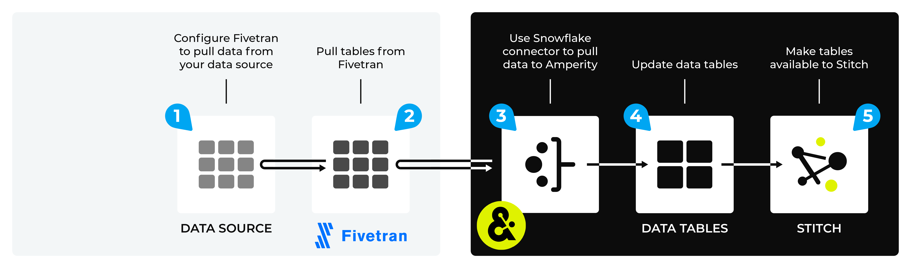

.. https://docs.amperity.com/datagrid/

.. |source-name| replace:: any Fivetran-enabled data source

.. meta::
    :description lang=en:
        Configure Amperity to pull data from Fivetran-enabled data sources.

.. meta::
    :content class=swiftype name=body data-type=text:
        Configure Amperity to pull data from Fivetran-enabled data sources.

.. meta::
    :content class=swiftype name=title data-type=string:
        Pull from Fivetran-enabled data sources

==================================================
Fivetran-enabled data sources
==================================================

.. source-fivetran-start

Fivetran is a third-party application that collects data from a wide variety of sources, and then loads that data to Snowflake tables. This data can be made available to Amperity from those Snowflake tables.

.. source-fivetran-end

.. source-fivetran-why-start

.. admonition:: Why does Amperity use Fivetran?

   Amperity uses Fivetran to enable a wide variety of data sources. This is for many reasons.

   #. Customers may choose to centralize their data on Snowflake, regardless of the built-in sources that Amperity offers.
   #. Customers may require data sources that are not built-in to Amperity, but are availble from Fivetran.
   #. Customers may require the ability to use SQL to query against a Snowflake table before loading data to Amperity. (This is a feature that is built into Snowflake data source in Amperity.)

.. source-fivetran-why-end

.. _source-fivetran-generic-howitworks:

How Fivetran-enabled sources work
==================================================

.. source-fivetran-generic-howitworks-start

Every Fivetran-enabled workflow is different. Some workflows require permission to intstall Fivetran into your application. Some workflows require an SSH tunnel during the configuration process to enable database interactions. Once configured in Fivetran, all Fivetran-enabled sources use an Amperity built-in Snowflake connector.

.. source-fivetran-generic-howitworks-end

.. source-fivetran-generic-howitworks-callouts-start

A Fivetran-enabled data source generally works like this:

#. Fivetran is configured to pull data from a data source. This process will require allowing Fivetran the right level of access to pull that data from your data source to Fivetran.
#. Fivetran pulls that data into one (or more) Snowflake tables.

   .. include:: ../../shared/sources.rst
      :start-after: .. sources-get-details-fivetran-does-not-store-data-start
      :end-before: .. sources-get-details-fivetran-does-not-store-data-end

#. Amperity is configured to pull data to Amperity from those Snowflake tables.
#. Domain tables within Amperity are refreshed.
#. Customer profiles are made available to Stitch. All data is passed to your customer 360 database. The Amperity ID links records across data sources for each unique customer.

.. source-fivetran-generic-howitworks-callouts-end

.. source-fivetran-generic-documented-start

.. tip:: There are a number of Fivetran-enabled data sources that may be configured directly from the Amperity user interface. The following data sources do not require Snowflake *and* do not require using Fivetran:

   * :doc:`Adobe Analytics <source_adobe_analytics>` (pull directly using SFTP)
   * :doc:`Amazon S3 <source_amazon_s3>` (pull any file from cloud-based storage)
   * :doc:`Azure Blob Storage <source_azure_blob_storage>` (pull any file from cloud-based storage)
   * :doc:`Braze <source_braze>` (pull directly using an Amazon S3-based workflow)
   * :doc:`Cordial <source_cordial>` (pull directly using a REST API)
   * :doc:`Google Analytics <source_google_analytics>` (pull directly using a REST API)
   * :doc:`Google Cloud Storage <source_google_cloud_storage>` (pull any file from cloud-based storage)
   * :doc:`Heap <source_heap>` (pull directly using an Amazon S3-based workflow)
   * :doc:`Klaviyo <source_klaviyo>` (pull directly using a REST API)
   * :doc:`Optimizely <source_optimizely>` (pull directly using an Amazon S3-based workflow)
   * :doc:`Sailthru <source_sailthru>` (pull directly using a REST API)
   * :doc:`Salesforce Marketing Cloud <source_salesforce_marketing_cloud>`
   * :doc:`SFTP <source_sftp>` (pull data from any SFTP site)

.. source-fivetran-generic-documented-start

.. _source-fivetran-sources:

Fivetran-enabled sources
==================================================

.. source-fivetran-sources-start

Amperity does not document every Fivetran-enabled data source workflow on its own page, with the following exceptions: :doc:`Adobe Commerce (Magento) <source_adobe_commerce>`, :doc:`HubSpot <source_hubspot>`, :doc:`Kustomer <source_kustomer>`, :doc:`Salesforce Pardot <source_salesforce_pardot>`, and :doc:`Square <source_square>`. This group of topics describes the specific steps that are required for those data sources, including the steps you must do in Fivetran and the steps you must do in Amperity. This group of topics is represenatitive of the typical end-to-end configuration process that is required by many Fivetran-enabled data sources.

.. source-fivetran-sources-end

.. source-fivetran-sources-important-start

.. caution:: The documentation for how to configure each Fivetran-enabled data source is availble from Fivetran. Please use link in the "Fivetran Docs" column in the table below to open that page and to learn more about how to configure that data source for Fivetran.

   All of the configuration requirements and steps for each Fivetran-enabled data source are found on the page for that data source within Fivetran documentation. Use the link in the table below to open that data source's page within the |fivetran_documentation| site.

   All configuration requirements for connecting a data source to Fivetran are specified in Fivetran documentation. Be sure to review those requirements. In a scenario where your Amperity representative will configure Fivetran on your behalf, you will need to provide to your Amperity representative those details.

   Amperity uses a well-documented Snowflake connector (:doc:`Snowflake on AWS <source_snowflake_aws>` or :doc:`Snowflake on Azure <source_snowflake_azure>`) to pull data from Fivetran for all Fivetran-enabled data sources.

.. source-fivetran-sources-important-end

.. source-fivetran-sources-start

The following table is a list of Fivetran-enabled data sources. You must first configure these data sources to make their data available to Fivetran (and load that data successfully to Fivetran) before you can use a Snowflake connector in Amperity to pull that data to Amperity.

.. source-fivetran-sources-end

.. source-fivetran-sources-table-start

.. list-table::
   :widths: 140 220 240
   :header-rows: 1

   * - 
     - Fivetran docs
     - Description
   * - .. image:: ../../amperity_base/source/_static/connector-adjust.svg
          :width: 140 px
          :alt: Adjust
          :align: left
          :class: no-scaled-link
     - |fivetran_adjust|
     - .. include:: ../../shared/terms.rst
          :start-after: .. term-adjust-start
          :end-before: .. term-adjust-end

   * - .. image:: ../../amperity_base/source/_static/connector-adobe.svg
          :width: 140 px
          :alt: Adobe Analytics
          :align: left
          :class: no-scaled-link
     - |fivetran_adobe|
     - .. include:: ../../shared/terms.rst
          :start-after: .. term-adobe-analytics-start
          :end-before: .. term-adobe-analytics-end

   * - .. image:: ../../amperity_base/source/_static/connector-adroll.svg
          :width: 140 px
          :alt: AdRoll
          :align: left
          :class: no-scaled-link
     - |fivetran_adroll|
     - .. include:: ../../shared/terms.rst
          :start-after: .. term-adroll-start
          :end-before: .. term-adroll-end

   * - .. image:: ../../amperity_base/source/_static/connector-airtable.svg
          :width: 140 px
          :alt: Airtable
          :align: left
          :class: no-scaled-link
     - |fivetran_airtable|
     - .. include:: ../../shared/terms.rst
          :start-after: .. term-airtable-start
          :end-before: .. term-airtable-end

   * - .. image:: ../../amperity_base/source/_static/connector-amazon-aws.svg
          :width: 140 px
          :alt: Amazon Ads
          :align: left
          :class: no-scaled-link
     - |fivetran_amazon_ads|
     - .. include:: ../../shared/terms.rst
          :start-after: .. term-amazon-ads-start
          :end-before: .. term-amazon-ads-end

   * - .. image:: ../../amperity_base/source/_static/connector-amazon-aurora.svg
          :width: 140 px
          :alt: Amazon Aurora MySQL
          :align: left
          :class: no-scaled-link
     - |fivetran_amazon_aurora_mysql|

       |fivetran_amazon_aurora_postgresql|
     - .. include:: ../../shared/terms.rst
          :start-after: .. term-amazon-aurora-start
          :end-before: .. term-amazon-aurora-end

   * - .. image:: ../../amperity_base/source/_static/connector-amazon-cloudfront.svg
          :width: 140 px
          :alt: Amazon Cloudfront
          :align: left
          :class: no-scaled-link
     - |fivetran_amazon_cloudfront|
     - .. include:: ../../shared/terms.rst
          :start-after: .. term-amazon-cloudfront-start
          :end-before: .. term-amazon-cloudfront-end

   * - .. image:: ../../amperity_base/source/_static/connector-amazon-dynamodb.svg
          :width: 140 px
          :alt: Amazon DynamoDB
          :align: left
          :class: no-scaled-link
     - |fivetran_amazon_dynamodb|
     - .. include:: ../../shared/terms.rst
          :start-after: .. term-amazon-dynamodb-start
          :end-before: .. term-amazon-dynamodb-end

   * - .. image:: ../../amperity_base/source/_static/connector-amazon-s3.svg
          :width: 140 px
          :alt: Amazon S3
          :align: left
          :class: no-scaled-link
     - |fivetran_amazon_s3|
     - .. include:: ../../shared/terms.rst
          :start-after: .. term-amazon-s3-start
          :end-before: .. term-amazon-s3-end

   * - .. image:: ../../amperity_base/source/_static/connector-amplitude.svg
          :width: 140 px
          :alt: Amplitude
          :align: left
          :class: no-scaled-link
     - |fivetran_amplitude|
     - .. include:: ../../shared/terms.rst
          :start-after: .. term-amplitude-start
          :end-before: .. term-amplitude-end

   * - .. image:: ../../amperity_base/source/_static/connector-apache-kafka.svg
          :width: 140 px
          :alt: Apache Kafka
          :align: left
          :class: no-scaled-link
     - |fivetran_apache_kafka|
     - .. include:: ../../shared/terms.rst
          :start-after: .. term-apache-kafka-start
          :end-before: .. term-apache-kafka-end

   * - .. image:: ../../amperity_base/source/_static/connector-heroku-postgresql.svg
          :width: 140 px
          :alt: Apache Kafka on Heroku
          :align: left
          :class: no-scaled-link
     - |fivetran_apache_kafka_on_heroku|
     - Heroku Kafka is a managed distributed event streaming platform that runs Apache Kafka.

   * - .. image:: ../../amperity_base/source/_static/connector-apple.svg
          :width: 140 px
          :alt: Apple Search Ads
          :align: left
          :class: no-scaled-link
     - |fivetran_apple_search_ads|
     - .. include:: ../../shared/terms.rst
          :start-after: .. term-apple-search-ads-start
          :end-before: .. term-apple-search-ads-end

   * - .. image:: ../../amperity_base/source/_static/connector-appsflyer.svg
          :width: 140 px
          :alt: AppsFlyer
          :align: left
          :class: no-scaled-link
     - |fivetran_appsflyer|
     - .. include:: ../../shared/terms.rst
          :start-after: .. term-appsflyer-start
          :end-before: .. term-appsflyer-end

   * - .. image:: ../../amperity_base/source/_static/connector-jira.svg
          :width: 140 px
          :alt: Atlassian Jira
          :align: left
          :class: no-scaled-link
     - |fivetran_atlassian_jira|
     - Atlassian Jira is an application designed for issues tracking, project management, and follow-through.

   * - .. image:: ../../amperity_base/source/_static/connector-aws-kinesis.svg
          :width: 140 px
          :alt: AWS Kinesis
          :align: left
          :class: no-scaled-link
     - |fivetran_aws_kinesis|
     - .. include:: ../../shared/terms.rst
          :start-after: .. term-amazon-kinesis-data-firehose-start
          :end-before: .. term-amazon-kinesis-data-firehose-end

   * - .. image:: ../../amperity_base/source/_static/connector-aws-lambda.svg
          :width: 140 px
          :alt: AWS Lambda
          :align: left
          :class: no-scaled-link
     - |fivetran_aws_lambda|
     - .. include:: ../../shared/terms.rst
          :start-after: .. term-aws-lambda-start
          :end-before: .. term-aws-lambda-end

   * - .. image:: ../../amperity_base/source/_static/connector-microsoft-azure.svg
          :width: 140 px
          :alt: Azure Cloud Functions
          :align: left
          :class: no-scaled-link
     - |fivetran_azure_cloud_functions|
     - .. include:: ../../shared/terms.rst
          :start-after: .. term-azure-cloud-functions-start
          :end-before: .. term-azure-cloud-functions-end

   * - .. image:: ../../amperity_base/source/_static/connector-bigcommerce.svg
          :width: 140 px
          :alt: BigCommerce
          :align: left
          :class: no-scaled-link
     - |fivetran_bigcommerce|
     - .. include:: ../../shared/terms.rst
          :start-after: .. term-bigcommerce-start
          :end-before: .. term-bigcommerce-end

   * - .. image:: ../../amperity_base/source/_static/connector-box.svg
          :width: 140 px
          :alt: Box
          :align: left
          :class: no-scaled-link
     - |fivetran_box|
     - .. include:: ../../shared/terms.rst
          :start-after: .. term-box-start
          :end-before: .. term-box-end

   * - .. image:: ../../amperity_base/source/_static/connector-braintree.svg
          :width: 140 px
          :alt: Braintree Payments
          :align: left
          :class: no-scaled-link
     - |fivetran_braintree_payments|
     - Braintree -- a payment platform from PayPal -- provides payment systems for brands that use mobile app- and web-based shopping experiences.

   * - .. image:: ../../amperity_base/source/_static/connector-branch.svg
          :width: 140 px
          :alt: Branch
          :align: left
          :class: no-scaled-link
     - |fivetran_branch|
     - .. include:: ../../shared/terms.rst
          :start-after: .. term-branch-start
          :end-before: .. term-branch-end

   * - .. image:: ../../amperity_base/source/_static/connector-braze.png
          :width: 140 px
          :alt: Braze
          :align: left
          :class: no-scaled-link
     - |fivetran_braze|
     - .. include:: ../../shared/terms.rst
          :start-after: .. term-braze-start
          :end-before: .. term-braze-end

   * - .. image:: ../../amperity_base/source/_static/connector-campaign-manager.svg
          :width: 140 px
          :alt: Campaign Manager
          :align: left
          :class: no-scaled-link
     - |fivetran_campaign_manager|
     - .. include:: ../../shared/terms.rst
          :start-after: .. term-google-campaign-manager-start
          :end-before: .. term-google-campaign-manager-end

   * - .. image:: ../../amperity_base/source/_static/connector-coupa.svg
          :width: 140 px
          :alt: Coupa
          :align: left
          :class: no-scaled-link
     - |fivetran_coupa|
     - .. include:: ../../shared/terms.rst
          :start-after: .. term-coupa-start
          :end-before: .. term-coupa-end

   * - .. image:: ../../amperity_base/source/_static/connector-cr1t30.png
          :width: 140 px
          :alt: Criteo
          :align: left
          :class: no-scaled-link
     - |fivetran_criteo|
     - .. include:: ../../shared/terms.rst
          :start-after: .. term-criteo-start
          :end-before: .. term-criteo-end

   * - .. image:: ../../amperity_base/source/_static/connector-delighted.svg
          :width: 140 px
          :alt: Delighted
          :align: left
          :class: no-scaled-link
     - |fivetran_delighted|
     - .. include:: ../../shared/terms.rst
          :start-after: .. term-delighted-start
          :end-before: .. term-delighted-end

   * - .. image:: ../../amperity_base/source/_static/connector-dropbox.svg
          :width: 140 px
          :alt: Dropbox
          :align: left
          :class: no-scaled-link
     - |fivetran_dropbox|
     - .. include:: ../../shared/terms.rst
          :start-after: .. term-dropbox-start
          :end-before: .. term-dropbox-end

   * - .. image:: ../../amperity_base/source/_static/connector-facebook-ads.svg
          :width: 140 px
          :alt: Facebook Ads
          :align: left
          :class: no-scaled-link
     - |fivetran_facebook|
     - .. include:: ../../shared/terms.rst
          :start-after: .. term-facebook-ads-start
          :end-before: .. term-facebook-ads-end

   * - .. image:: ../../amperity_base/source/_static/connector-financial-force.svg
          :width: 140 px
          :alt: FinancialForce
          :align: left
          :class: no-scaled-link
     - |fivetran_financial_force|
     - FinancialForce is a Salesforce-native cloud ERP application that gives you a complete, customer-centric view of your business.

   * - .. image:: ../../amperity_base/source/_static/connector-github.png
          :width: 140 px
          :alt: Github
          :align: left
          :class: no-scaled-link
     - |fivetran_github|
     - GitHub is a platform for developers to build personal projects, support their businesses, and work together on open source technologies.

   * - .. image:: ../../amperity_base/source/_static/connector-gladly.png
          :width: 140 px
          :alt: Gladly
          :align: left
          :class: no-scaled-link
     - |fivetran_gladly|
     - Gladly is a customer service platform that is people-centric, not case-centric. Instead of tickets, Gladly manages a single, lifelong conversation with each of your customers.

   * - .. image:: ../../amperity_base/source/_static/connector-google-ads.svg
          :width: 140 px
          :alt: Google Ads
          :align: left
          :class: no-scaled-link
     - |fivetran_google_ads|
     - .. include:: ../../shared/terms.rst
          :start-after: .. term-google-ads-start
          :end-before: .. term-google-ads-end

   * - .. image:: ../../amperity_base/source/_static/connector-google-analytics.png
          :width: 140 px
          :alt: Google Analytics
          :align: left
          :class: no-scaled-link
     - |fivetran_google_analytics|

       |fivetran_google_analytics_360|

       |fivetran_google_analytics_4|

       |fivetran_google_analytics_4_export|
     - .. include:: ../../shared/terms.rst
          :start-after: .. term-google-analytics-start
          :end-before: .. term-google-analytics-end

   * - .. image:: ../../amperity_base/source/_static/connector-google-cloud.svg
          :width: 140 px
          :alt: Google Cloud Functions
          :align: left
          :class: no-scaled-link
     - |fivetran_google_cloud_functions|
     - .. include:: ../../shared/terms.rst
          :start-after: .. term-google-cloud-functions-start
          :end-before: .. term-google-cloud-functions-end

   * - .. image:: ../../amperity_base/source/_static/connector-google-cloud.svg
          :width: 140 px
          :alt: Google Cloud Storage
          :align: left
          :class: no-scaled-link
     - |fivetran_google_cloud_storage|
     - .. include:: ../../shared/terms.rst
          :start-after: .. term-google-cloud-storage-start
          :end-before: .. term-google-cloud-storage-end

   * - .. image:: ../../amperity_base/source/_static/connector-google-play.svg
          :width: 140 px
          :alt: Google Play
          :align: left
          :class: no-scaled-link
     - |fivetran_google_play|
     - .. include:: ../../shared/terms.rst
          :start-after: .. term-google-play-start
          :end-before: .. term-google-play-end

   * - .. image:: ../../amperity_base/source/_static/connector-google.svg
          :width: 140 px
          :alt: Google Search Console
          :align: left
          :class: no-scaled-link
     - |fivetran_google_search_console|
     - Google Search Console helps you monitor and maintain your site's presence in Google Search results.

   * - .. image:: ../../amperity_base/source/_static/connector-google-sheets.svg
          :width: 140 px
          :alt: Google Sheets
          :align: left
          :class: no-scaled-link
     - |fivetran_google_sheets|
     - Google Sheets lets you create a new spreadsheet and edit it with others at the same time — from your computer, phone or tablet.

   * - .. image:: ../../amperity_base/source/_static/connector-heap.svg
          :width: 140 px
          :alt: Heap
          :align: left
          :class: no-scaled-link
     - |fivetran_heap|
     - .. include:: ../../shared/terms.rst
          :start-after: .. term-heap-start
          :end-before: .. term-heap-end

   * - .. image:: ../../amperity_base/source/_static/connector-height.svg
          :width: 140 px
          :alt: Height
          :align: left
          :class: no-scaled-link
     - |fivetran_height|
     - Height is a collaborative work service that helps to maintain a project workflow.

   * - .. image:: ../../amperity_base/source/_static/connector-helpscout.svg
          :width: 140 px
          :alt: Help Scout
          :align: left
          :class: no-scaled-link
     - |fivetran_help_scout|
     - Help Scout is an all-in-one customer service platform that helps you balance everything your customer needs.

   * - .. image:: ../../amperity_base/source/_static/connector-hubspot.svg
          :width: 140 px
          :alt: Hubspot
          :align: left
          :class: no-scaled-link
     - |fivetran_hubspot|
     - .. include:: ../../shared/terms.rst
          :start-after: .. term-hubspot-start
          :end-before: .. term-hubspot-end

   * - .. image:: ../../amperity_base/source/_static/connector-instagram.svg
          :width: 140 px
          :alt: Instagram Business
          :align: left
          :class: no-scaled-link
     - |fivetran_instagram_business|
     - Instagram Business enables creators and companies to connect with a variety of audiences at scale, and track their social media engagement metrics.

   * - .. image:: ../../amperity_base/source/_static/connector-intercom.svg
          :width: 140 px
          :alt: Intercom
          :align: left
          :class: no-scaled-link
     - |fivetran_intercom|
     - .. include:: ../../shared/terms.rst
          :start-after: .. term-intercom-start
          :end-before: .. term-intercom-end

   * - .. image:: ../../amperity_base/source/_static/connector-iterable.svg
          :width: 140 px
          :alt: Iterable
          :align: left
          :class: no-scaled-link
     - |fivetran_iterable|
     - .. include:: ../../shared/terms.rst
          :start-after: .. term-iterable-start
          :end-before: .. term-iterable-end

   * - .. image:: ../../amperity_base/source/_static/connector-klaviyo.png
          :width: 140 px
          :alt: Klaviyo
          :align: left
          :class: no-scaled-link
     - |fivetran_klaviyo|
     - .. include:: ../../shared/terms.rst
          :start-after: .. term-klaviyo-start
          :end-before: .. term-klaviyo-end

   * - .. image:: ../../amperity_base/source/_static/connector-kustomer.svg
          :width: 140 px
          :alt: Kustomer
          :align: left
          :class: no-scaled-link
     - |fivetran_kustomer|
     - .. include:: ../../shared/terms.rst
          :start-after: .. term-kustomer-start
          :end-before: .. term-kustomer-end

   * - .. image:: ../../amperity_base/source/_static/connector-lightspeed.svg
          :width: 140 px
          :alt: Lightspeed
          :align: left
          :class: no-scaled-link
     - |fivetran_lightspeed|
     - Lightspeed Retail is a cloud-based point of sale (POS) solution that is suitable for retailers.

   * - .. image:: ../../amperity_base/source/_static/connector-linkedin.svg
          :width: 140 px
          :alt: LinkedIn Ads
          :align: left
          :class: no-scaled-link
     - |fivetran_linkedin_ads|

       |fivetran_linkedin_company_pages|
     - LinkedIn is a social media network focused on professional relationship, business listings, and employment opportunities.

   * - .. image:: ../../amperity_base/source/_static/connector-magento.svg
          :width: 140 px
          :alt: Magento via MySQL
          :align: left
          :class: no-scaled-link
     - |fivetran_magento_mysql|

       |fivetran_magento_mysql_amazon_rds|
     - Magento is an ecommerce platform which provides online merchants with a flexible shopping cart system, and customization of their online store. Magento is now Adobe Commerce.

   * - .. image:: ../../amperity_base/source/_static/connector-mailchimp.svg
          :width: 140 px
          :alt: Mailchimp
          :align: left
          :class: no-scaled-link
     - |fivetran_mailchimp|

       |fivetran_mandrill|
     - Mailchimp provides marketing automation and email marketing services for e-commerce businesses.

   * - .. image:: ../../amperity_base/source/_static/connector-mariadb.svg
          :width: 140 px
          :alt: MariaDB
          :align: left
          :class: no-scaled-link
     - |fivetran_mariadb|

       |fivetran_mariadb_amazon_rds|

       |fivetran_mariadb_azure_database|
     - MariaDB offers open source database and database as a service (DBaaS) solutions to support scalability, mission-critical deployments, and more.

   * - .. image:: ../../amperity_base/source/_static/connector-marin-software.svg
          :width: 140 px
          :alt: Marin Software
          :align: left
          :class: no-scaled-link
     - |fivetran_marin_software|
     - Marin Software is an online advertising platform to measure, manage, and optimize ad spending across the web and mobile devices.

   * - .. image:: ../../amperity_base/source/_static/connector-marketo.svg
          :width: 140 px
          :alt: Marketo
          :align: left
          :class: no-scaled-link
     - |fivetran_marketo|
     - Marketo provides inbound marketing, social marketing, CRM, and other related services.

   * - .. image:: ../../amperity_base/source/_static/connector-mavenlink.svg
          :width: 140 px
          :alt: Mavenlink
          :align: left
          :class: no-scaled-link
     - |fivetran_mavenlink|
     - Mavenlink offers online project management with time tracking, resource planning, collaboration, finance etc. functions.

   * - .. image:: ../../amperity_base/source/_static/connector-medallia.svg
          :width: 140 px
          :alt: Medallia
          :align: left
          :class: no-scaled-link
     - |fivetran_medallia|
     - Medallia is a customer feedback management software platform that enables organizations to collect customer feedback and improve the customer experience.

   * - .. image:: ../../amperity_base/source/_static/connector-microsoft.svg
          :width: 140 px
          :alt: Microsoft Advertising
          :align: left
          :class: no-scaled-link
     - |fivetran_microsoft_advertising|
     - .. include:: ../../shared/terms.rst
          :start-after: .. term-microsoft-ads-start
          :end-before: .. term-microsoft-ads-end

   * - .. image:: ../../amperity_base/source/_static/connector-microsoft-azure.svg
          :width: 140 px
          :alt: Microsoft Azure Blob Storage
          :align: left
          :class: no-scaled-link
     - |fivetran_microsoft_azure_blob_storage|
     - .. include:: ../../shared/terms.rst
          :start-after: .. term-azure-blob-storage-start
          :end-before: .. term-azure-blob-storage-end

   * - .. image:: ../../amperity_base/source/_static/connector-microsoft-azure.svg
          :width: 140 px
          :alt: Microsoft Azure SQL Database
          :align: left
          :class: no-scaled-link
     - |fivetran_microsoft_azure_sql_database|
     - Microsoft Azure SQL Database is the intelligent, fully-managed relational cloud database service built for developers.

   * - .. image:: ../../amperity_base/source/_static/connector-microsoft-dynamics.svg
          :width: 140 px
          :alt: Microsoft Dynamics 365
          :align: left
          :class: no-scaled-link
     - |fivetran_microsoft_dynamics_365|

       |fivetran_microsoft_dynamics_ax|

       |fivetran_microsoft_dynamics_crm|

       |fivetran_microsoft_dynamics_gp|

       |fivetran_microsoft_dynamics_nav|
     - Microsoft Dynamics 365 is a suite of products that connects people, products, and data and helps transform the way your company does business. 

   * - .. image:: ../../amperity_base/source/_static/connector-mixpanel.svg
          :width: 140 px
          :alt: Mixpanel
          :align: left
          :class: no-scaled-link
     - |fivetran_mixpanel|
     - Mixpanel provides an advanced analytics platform for tracking user actions on web and mobile.

   * - .. image:: ../../amperity_base/source/_static/connector-mongodb.svg
          :width: 140 px
          :alt: MongoDB
          :align: left
          :class: no-scaled-link
     - |fivetran_mongodb|

       |fivetran_mongodb_sharded|
     - MongoDB is a free and open-source cross-platform document-oriented database program. Classified as a NoSQL database program, MongoDB uses JSON-like documents with schemas.

   * - .. image:: ../../amperity_base/source/_static/connector-mysql.svg
          :width: 140 px
          :alt: MySQL Database
          :align: left
          :class: no-scaled-link
     - |fivetran_mysql_database|

       |fivetran_mysql_azure_database|

       |fivetran_mysql_google_cloud_sql|

       |fivetran_mysql_rds|
     - MySQL is an open-source relational database management system. Its name is a combination of "My", the name of co-founder Michael Widenius's daughter My, and "SQL", the abbreviation for Structured Query Language.

   * - .. image:: ../../amperity_base/source/_static/connector-optimizely.svg
          :width: 140 px
          :alt: Optimizely
          :align: left
          :class: no-scaled-link
     - |fivetran_optimizely|
     - .. include:: ../../shared/terms.rst
          :start-after: .. term-optimizely-start
          :end-before: .. term-optimizely-end

   * - .. image:: ../../amperity_base/source/_static/connector-oracle.svg
          :width: 140 px
          :alt: Oracle
          :align: left
          :class: no-scaled-link
     - |fivetran_oracle|

       |fivetran_oracle_amazon_rds|

       |fivetran_oracle_ebs|

       |fivetran_oracle_eloqua|

       |fivetran_oracle_fusion_cloud_cx|

       |fivetran_oracle_fusion_cloud_erp|

       |fivetran_oracle_fusion_cloud_hcm|

       |fivetran_oracle_fusion_cloud_scm|

       |fivetran_oracle_peoplesoft|

       |fivetran_oracle_rac|

       |fivetran_oracle_siebel_crm|
     - Oracle is an enterprise-scale and priced relational database with a wide variety of business applications and services.

   * - .. image:: ../../amperity_base/source/_static/connector-oracle-netsuite.svg
          :width: 140 px
          :alt: Oracle Netsuite
          :align: left
          :class: no-scaled-link
     - |fivetran_netsuite_suiteanalytics|
     - Oracle Netsuite offers built-in real-time dashboards, reporting, and analysis all integrated right into the ERP, CRM or e-commerce application that you use every day. Previously called Netsuite SuiteAnalytics.

   * - .. image:: ../../amperity_base/source/_static/connector-oscommerce.svg
          :width: 140 px
          :alt: OsCommerce via MySQL
          :align: left
          :class: no-scaled-link
     - |fivetran_oscommerce_mysql|
     - OsCommerce is an e-commerce and online store-management software program. It can be used on any web server that has PHP and MySQL installed.

   * - .. image:: ../../amperity_base/source/_static/connector-outbrain.png
          :width: 140 px
          :alt: Outbrain
          :align: left
          :class: no-scaled-link
     - |fivetran_outbrain|
     - .. include:: ../../shared/terms.rst
          :start-after: .. term-outbrain-start
          :end-before: .. term-outbrain-end

   * - .. image:: ../../amperity_base/source/_static/connector-pendo.svg
          :width: 140 px
          :alt: Pendo
          :align: left
          :class: no-scaled-link
     - |fivetran_pendo|
     - Pendo helps product teams understand and guide users to create product experiences.

   * - .. image:: ../../amperity_base/source/_static/connector-pipedrive.svg
          :width: 140 px
          :alt: Pipedrive
          :align: left
          :class: no-scaled-link
     - |fivetran_pipedrive|
     - Pipedrive is a sales CRM and pipeline management solution that enables businesses to plan their sales activities and monitor deals.

   * - .. image:: ../../amperity_base/source/_static/connector-pinterest.png
          :width: 140 px
          :alt: Pinterest Ads
          :align: left
          :class: no-scaled-link
     - |fivetran_pinterest_ads|
     - Pinterest Ads helps businesses increase brand's visibility and drive conversions.

   * - .. image:: ../../amperity_base/source/_static/connector-postgresql.svg
          :width: 140 px
          :alt: PostgreSQL Database
          :align: left
          :class: no-scaled-link
     - |fivetran_postgresql_database|

       |fivetran_postgresql_azure_database|

       |fivetran_postgresql_google_cloud|

       |fivetran_postgresql_rds|
     - PostgreSQL is one of the world's most popular open source relational databases.

   * - .. image:: ../../amperity_base/source/_static/connector-prestashop.svg
          :width: 140 px
          :alt: PrestaShop
          :align: left
          :class: no-scaled-link
     - |fivetran_prestashop|

       |fivetran_prestashop_mysql|
     - PrestaShop is an ecommerce toolkit that helps you sell your products online.

   * - .. image:: ../../amperity_base/source/_static/connector-qualtrics.svg
          :width: 140 px
          :alt: Qualtrics
          :align: left
          :class: no-scaled-link
     - |fivetran_qualtrics|
     - .. include:: ../../shared/terms.rst
          :start-after: .. term-qualtrics-start
          :end-before: .. term-qualtrics-end

   * - .. image:: ../../amperity_base/source/_static/connector-recharge.svg
          :width: 140 px
          :alt: ReCharge
          :align: left
          :class: no-scaled-link
     - |fivetran_recharge|
     - Recharge is a recurring billing and subscriptions service for ecommerce stores that use Shopify.

   * - .. image:: ../../amperity_base/source/_static/connector-recurly.svg
          :width: 140 px
          :alt: Recurly
          :align: left
          :class: no-scaled-link
     - |fivetran_recurly|
     - Recurly provides a recurring billing and subscriptions solution for e-commerce.

   * - .. image:: ../../amperity_base/source/_static/connector-reddit-ads.svg
          :width: 140 px
          :alt: Reddit Ads
          :align: left
          :class: no-scaled-link
     - |fivetran_reddit_ads|
     - .. include:: ../../shared/terms.rst
          :start-after: .. term-reddit-ads-start
          :end-before: .. term-reddit-ads-end

   * - .. image:: ../../amperity_base/source/_static/connector-sage-intacct.svg
          :width: 140 px
          :alt: Sage Intacct
          :align: left
          :class: no-scaled-link
     - |fivetran_sage_intacct|
     - Sage Intacct provides real-time financial and operational insights, as well as the ability to automate critical processes.

   * - .. image:: ../../amperity_base/source/_static/connector-sailthru.svg
          :width: 140 px
          :alt: Sailthru
          :align: left
          :class: no-scaled-link
     - |fivetran_sailthru|
     - .. include:: ../../shared/terms.rst
          :start-after: .. term-sailthru-start
          :end-before: .. term-sailthru-end

   * - .. image:: ../../amperity_base/source/_static/connector-salesforce.svg
          :width: 140 px
          :alt: Salesforce
          :align: left
          :class: no-scaled-link
     - |fivetran_salesforce|

       |fivetran_salesforce_commerce_cloud|

       |fivetran_salesforce_marketing_cloud|

       |fivetran_salesforce_pardot|
     - Salesforce is a platform that is focused on customer success. Social and mobile cloud technologies -— including flagship sales and CRM applications -— help companies connect with customers in new ways.

   * - .. image:: ../../amperity_base/source/_static/connector-sap.svg
          :width: 140 px
          :alt: SAP
          :align: left
          :class: no-scaled-link
     - |fivetran_sap_business_bydesign|

       |fivetran_sap_concur|

       |fivetran_sap_erp_hana|
     - SAP stands for System Applications and Products in Data Processing. SAP is a market leader in ERP software and helps companies of all sizes.

   * - .. image:: ../../amperity_base/source/_static/connector-segment.svg
          :width: 140 px
          :alt: Segment
          :align: left
          :class: no-scaled-link
     - |fivetran_segment|
     - Segment is a platform that collects customer data across devices and channels, sends it to third-party tools, internal systems, or SQL databases.

   * - .. image:: ../../amperity_base/source/_static/connector-sendgrid.svg
          :width: 140 px
          :alt: Sendgrid
          :align: left
          :class: no-scaled-link
     - |fivetran_sendgrid|
     - SendGrid is a customer communication platform for transaction- and marketing-focused emails.

   * - .. image:: ../../amperity_base/source/_static/connector-servicenow.svg
          :width: 140 px
          :alt: ServiceNow
          :align: left
          :class: no-scaled-link
     - |fivetran_servicenow|
     - ServiceNow is a cloud platform that provides service management software as a service.

   * - .. image:: ../../amperity_base/source/_static/connector-fivetran-sftp.svg
          :width: 140 px
          :alt: SFTP
          :align: left
          :class: no-scaled-link
     - |fivetran_sftp|
     - Secure File Transfer Protocol (SFTP) is a network protocol that provides file access, file transfer, and file management over a reliable data stream. Also available: |fivetran_ftp|, |fivetran_ftps|, |fivetran_csv_browser_upload|, and |fivetran_email_ingestor|.

   * - .. image:: ../../amperity_base/source/_static/connector-shopify.svg
          :width: 140 px
          :alt: Shopify
          :align: left
          :class: no-scaled-link
     - |fivetran_shopify|
     - .. include:: ../../shared/terms.rst
          :start-after: .. term-shopify-start
          :end-before: .. term-shopify-end

   * - .. image:: ../../amperity_base/source/_static/connector-snapchat.png
          :width: 140 px
          :alt: Snapchat Ads
          :align: left
          :class: no-scaled-link
     - |fivetran_snapchat_ads|
     - .. include:: ../../shared/terms.rst
          :start-after: .. term-snapchat-start
          :end-before: .. term-snapchat-end

   * - .. image:: ../../amperity_base/source/_static/connector-snowplow-analytics.svg
          :width: 140 px
          :alt: Snowplow Analytics
          :align: left
          :class: no-scaled-link
     - |fivetran_snowplow_analytics|
     - Snowplow Analytics provides enterprise-level event analytics that is powered by the open source Snowplow platform.

   * - .. image:: ../../amperity_base/source/_static/connector-spree.svg
          :width: 140 px
          :alt: Spree Commerce via MySQL
          :align: left
          :class: no-scaled-link
     - |fivetran_spree_commerce_mysql|
     - Spree Commerce is an API-driven ecommerce framework.

   * - .. image:: ../../amperity_base/source/_static/connector-sql-server.svg
          :width: 140 px
          :alt: SQL Server
          :align: left
          :class: no-scaled-link
     - |fivetran_sql_server|

       |fivetran_sql_server_rds|
     - Microsoft's SQL Server is a powerful enterprise relational database.

   * - .. image:: ../../amperity_base/source/_static/connector-square.svg
          :width: 140 px
          :alt: Square
          :align: left
          :class: no-scaled-link
     - |fivetran_square|
     - .. include:: ../../shared/terms.rst
          :start-after: .. term-square-start
          :end-before: .. term-square-end

   * - .. image:: ../../amperity_base/source/_static/connector-stripe.svg
          :width: 140 px
          :alt: Stripe
          :align: left
          :class: no-scaled-link
     - |fivetran_stripe|
     - Stripe is a software platform for businesses of all sizes. Stripe provides transaction histories for all of your online payments.

   * - .. image:: ../../amperity_base/source/_static/connector-taboola.svg
          :width: 140 px
          :alt: Taboola
          :align: left
          :class: no-scaled-link
     - |fivetran_taboola|
     - Taboola helps people find relevant content online, matching them with news stories, articles, blogs, videos, apps, products and other content they’re likely to want to explore.

   * - .. image:: ../../amperity_base/source/_static/connector-tiktok.png
          :width: 140 px
          :alt: TikTok Ads
          :align: left
          :class: no-scaled-link
     - |fivetran_tiktok_ads|
     - .. include:: ../../shared/terms.rst
          :start-after: .. term-tiktok-ads-start
          :end-before: .. term-tiktok-ads-end

   * - .. image:: ../../amperity_base/source/_static/connector-twilio.svg
          :width: 140 px
          :alt: Twilio
          :align: left
          :class: no-scaled-link
     - |fivetran_twilio|
     - Twilio powers the future of business communications. Enabling phones, VoIP, and messaging to be embedded into web, desktop, and mobile software.

   * - .. image:: ../../amperity_base/source/_static/connector-twitter.svg
          :width: 140 px
          :alt: Twitter Ads
          :align: left
          :class: no-scaled-link
     - |fivetran_twitter_ads|

       |fivetran_twitter_analytics|
     - Twitter is a social media and online news website that allows marketers and brands to advertise on its platform. Capture data about popular content, retweets, social shares and more for advanced analytics.

   * - .. image:: ../../amperity_base/source/_static/connector-typeform.svg
          :width: 140 px
          :alt: Typeform
          :align: left
          :class: no-scaled-link
     - |fivetran_typeform|
     - Typeform is an online survey management solution that lets you create forms, surveys, and quizzes that your customers will enjoy answering.

   * - .. image:: ../../amperity_base/source/_static/connector-uservoice.svg
          :width: 140 px
          :alt: UserVoice
          :align: left
          :class: no-scaled-link
     - |fivetran_uservoice|
     - UserVoice gathers and analyzes customer feedback, and then helps you prioritize feature requests that drive product improvements.

   * - .. image:: ../../amperity_base/source/_static/connector-webhook.png
          :width: 140 px
          :alt: Webhooks
          :align: left
          :class: no-scaled-link
     - |fivetran_webhooks|
     - A webhook is a user-defined HTTP callback that is activated by an event that occurred on your website or within your application.

   * - .. image:: ../../amperity_base/source/_static/connector-woo-commerce.svg
          :width: 140 px
          :alt: WooCommerce
          :align: left
          :class: no-scaled-link
     - |fivetran_woocommerce|

       |fivetran_woocommerce_mysql|
     - WooCommerce is a customizable, open-source e-commerce platform that turns your WordPress into an online store.

   * - .. image:: ../../amperity_base/source/_static/connector-workday.svg
          :width: 140 px
          :alt: Workday
          :align: left
          :class: no-scaled-link
     - |fivetran_workday|

       |fivetran_workday_hcm|
     - Workday offers enterprise-level software solutions for financial management, human resources, and planning.

   * - .. image:: ../../amperity_base/source/_static/connector-xero.svg
          :width: 140 px
          :alt: Xero
          :align: left
          :class: no-scaled-link
     - |fivetran_xero|
     - Xero accounting software helps to manage invoicing, bank reconciliation, bookkeeping, and more.

   * - .. image:: ../../amperity_base/source/_static/connector-yahoo.svg
          :width: 140 px
          :alt: Yahoo Gemini (Verizon Media)
          :align: left
          :class: no-scaled-link
     - |fivetran_yahoo_gemini|
     - Yahoo Gemini drives traffic to your website, raise brand awareness, promote your app, and increase your online sales.

   * - .. image:: ../../amperity_base/source/_static/connector-youtube.svg
          :width: 140 px
          :alt: YouTube Analytics
          :align: left
          :class: no-scaled-link
     - |fivetran_youtube_analytics|
     - YouTube Analytics helps you better understand your video and channel performance by channel or by content owner.

   * - .. image:: ../../amperity_base/source/_static/connector-zendesk.svg
          :width: 140 px
          :alt: Zendesk
          :align: left
          :class: no-scaled-link
     - |fivetran_zendesk|

       |fivetran_zendesk_chat|

       |fivetran_zendesk_gather|

       |fivetran_zendesk_guide|

       |fivetran_zendesk_sell|

       |fivetran_zendesk_sunshine|

       |fivetran_zendesk_talk|
     - Zendesk Support is a cloud-based customer support platform.

.. source-fivetran-sources-table-end
