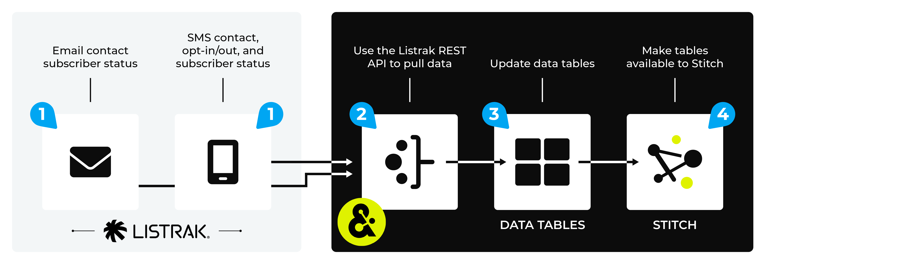

.. https://docs.amperity.com/datagrid/

.. |source-name| replace:: Listrak
.. |plugin-name| replace:: Listrak
.. |feed-name| replace:: Email Contacts *AND / OR* SMS Contacts
.. |domain-table-name| replace:: |source-name|:EmailContacts *AND / OR* |source-name|:SmsContacts
.. |credential-type| replace:: **listrak**
.. |what-pull| replace:: email and/or SMS profiles
.. |credential-fields| replace:: the name of the credential, a description, the |source-name| client ID(s) and client secret(s)
.. |settings-details| replace:: the list name for each integration being used, as defined in |source-name|
.. |box-names| replace:: Email Contacts *AND / OR* SMS Contacts

.. meta::
    :description lang=en:
        Configure Amperity to pull data from Listrak.

.. meta::
    :content class=swiftype name=body data-type=text:
        Configure Amperity to pull data from Listrak.

.. meta::
    :content class=swiftype name=title data-type=string:
        Pull from Listrak

==================================================
Pull from Listrak
==================================================

.. include:: ../../shared/terms.rst
   :start-after: .. term-listrak-start
   :end-before: .. term-listrak-end

.. source-listrak-start

Use the `Listrak Email API <https://api.listrak.com/email>`__ |ext_link| and `Listrak SMS API <https://api.listrak.com/sms>`__ |ext_link| to pull |what-pull| from |source-name| to Amperity.

.. source-listrak-end

.. source-listrak-steps-to-pull-start

.. include:: ../../shared/sources.rst
   :start-after: .. sources-overview-list-intro-start
   :end-before: .. sources-overview-list-intro-end

#. :ref:`Get details <source-listrak-get-details>`
#. :ref:`Add courier <source-listrak-add-courier>`
#. :ref:`Run courier <source-listrak-run-courier>`
#. :ref:`Review feed and domain table <source-listrak-review-data>`
#. :ref:`Add to courier group <source-listrak-add-to-courier-group>`

.. source-listrak-steps-to-pull-end

.. _source-listrak-howitworks:

How this source works
==================================================

.. source-listrak-howitworks-start

Amperity can pull |what-pull| from |source-name|.

.. source-listrak-howitworks-end

.. source-listrak-howitworks-callouts-start

A |source-name| data source works like this:

#. Configure Amperity to pull one (or both) of the following data sources:

   Email subscription status using the `Listrak Email API <https://api.listrak.com/email>`__ |ext_link|.

   SMS profiles, opt-in / opt-out status, and subscription status using the `Listrak SMS API <https://api.listrak.com/sms>`__ |ext_link|.

   .. important:: You may configure one or both of these data sources.

#. Amperity pulls data from |source-name| using REST APIs, and then loads this data to Amperity as a feed that automatically assigns semantic tags to fields that contain customer PII.
#. Domain tables within Amperity are refreshed.
#. Customer profiles are made available to Stitch. All data is passed to your customer 360 database. The Amperity ID links records across data sources for each unique customer.

.. source-listrak-howitworks-callouts-note-end

.. _source-listrak-get-details:

Get details
==================================================

.. source-listrak-get-details-start

|source-name| requires the following configuration details:

#. The client ID(s) and secret(s) for the `Listrak Email API <https://api.listrak.com/email>`__ |ext_link| **and/or** `Listrak SMS API <https://api.listrak.com/sms>`__ |ext_link|. (You must configure at least one of email or SMS and may configure both.)

   .. important:: The Amperity |ext_amperity_allowlist_ip_address| must also be added to the allowlist in |source-name|.

#. The Email list name **and/or** SMS list name. (This depends on which REST APIs are configured.)

.. tip:: Use SnapPass to securely share configuration details for |source-name| between your company and your Amperity representative.

.. source-listrak-get-details-end

.. _source-listrak-add-courier:

Add courier
==================================================

.. include:: ../../shared/terms.rst
   :start-after: .. term-courier-start
   :end-before: .. term-courier-end

.. source-listrak-add-courier-important-start

.. important:: A courier can be configured to pull email *AND / OR* SMS data from |source-name| to Amperity. When pulling email *AND* SMS data both email and SMS client ID and secret fields must be present in the selected credential, additionally both list names must be provided. When pulling just one data source only the corresponding client ID, secret and list name must be provided.

.. source-listrak-add-courier-important-end

**To add a courier**

.. source-listrak-add-courier-start

#. From the **Sources** page, click **Add Courier**. The **Add Source** page opens.
#. Find, and then click the icon for |plugin-name|. The **Add Courier** page opens.

   This automatically selects |credential-type| as the **Credential Type**.
#. Enter the name of the courier. For example: "|source-name|".
#. From the **Credential** field, select an existing credential or select **Create a new credential**.

   To add a credential, enter |credential-fields|. Click **Save**.
   
#. Under **Settings** enter the |settings-details|.
#. Under **Select Data**, enable |box-names|.
#. Click **Create**.

.. source-listrak-add-courier-end

.. _source-listrak-run-courier:

Run courier manually
==================================================

.. include:: ../../shared/sources.rst
   :start-after: .. sources-run-courier-start
   :end-before: .. sources-run-courier-end

**To run the courier manually**

.. include:: ../../shared/sources.rst
   :start-after: .. sources-run-courier-steps-start
   :end-before: .. sources-run-courier-steps-end

.. _source-listrak-review-data:

Review feed and domain table
==================================================

.. source-listrak-review-feed-and-domain-table-start

After running the |source-name| courier a feed is created automatically with a pre-defined list of fields. You may apply semantic tags to these fields and you may make the domain table available to Stitch, depending on your use cases. A domain table named |domain-table-name| will be added.

.. source-listrak-review-feed-and-domain-table-end

.. _source-listrak-review-data-email:

Email
--------------------------------------------------

.. source-listrak-review-data-email-start

The feed and domain table will match the fields defined in the `Listrak Email API <https://api.listrak.com/email>`__ |ext_link|:

* **emailAddress** (assigned the **email** and **ck** semantic tags)
* **subscribeDate**
* **subscribeMethod**
* **unsubscribeDate**
* **unsubscribeMethod**

.. source-listrak-review-data-email-end

.. _source-listrak-review-data-sms:

SMS
--------------------------------------------------

.. source-listrak-review-data-sms-start

The feed and domain table will match the fields defined in the `Listrak SMS API <https://api.listrak.com/sms>`__ |ext_link|:

* **birthday** (assigned the **birthdate** semantic tag)
* **emailAddress** (assigned the **email** and **ck** semantic tags)
* **firstName** (assigned the **given-name** semantic tag)
* **lastName** (assigned the **surname** semantic tag)
* **phoneNumber** (assigned the **phone** and **ck** semantic tags)
* **postalCode** (assigned the **postal** semantic tag)
* **optedOut**
* **subscribeDate**
* **unsubscribeDate**

.. source-listrak-review-data-sms-end

.. _source-listrak-add-to-courier-group:

Add to courier group
==================================================

.. include:: ../../shared/terms.rst
   :start-after: .. term-courier-group-start
   :end-before: .. term-courier-group-end

**To add the courier to a courier group**

.. include:: ../../shared/sources.rst
   :start-after: .. sources-add-to-courier-group-steps-start
   :end-before: .. sources-add-to-courier-group-steps-end
