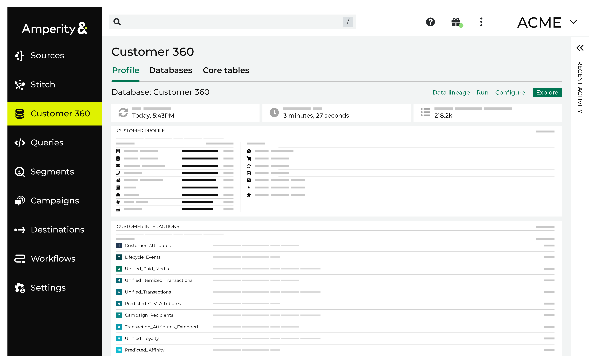

.. 
.. https://docs.amperity.com/datagrid/
.. 

.. meta::
    :description lang=en:
        A landing page for content that describes how to configure Amperity to support your brand's use cases.

.. meta::
    :content class=swiftype name=body data-type=text:
        A landing page for content that describes how to configure Amperity to support your brand's use cases.

.. meta::
    :content class=swiftype name=title data-type=string:
        Start here

==================================================
About the Operators Guide
==================================================

.. start-here-start

Start here to learn how to configure Amperity for all of your use cases. Pull or sync all of your customer data from any source-–online, offline, historical, streaming, Databricks, Snowflake-–without requiring schema planning or ETL. Send results of any size and type to any of your downstream applications and workflows.

.. start-here-end

.. start-here-important-start

.. important:: Amperity is configured by users with administrative privileges. These users may belong to your organization and manage Amperity directly or they may be representatives from Amperity who manage Amperity for you on your behalf. This documentation is written for the administrative users who belong to your organization. Some steps, such as configuring Google Ads and Facebook Ads as destinations, or configuring the SFTP site that is included with Amperity, require additional steps to be done by Amperity representatives and should be initiated by filing a support ticket or by contacting your Amperity representative and asking them to start that process on your behalf.

.. start-here-important-end

.. start-here-about-start

Amperity is a customer data cloud application that runs at scale on your choice of Amazon AWS or Microsoft Azure.

* 100+ integration options to handle any type of data.
* Pull unlimited amounts of structured and semi-structured raw data to Amperity from any source without the need for schema planning or pre-shaping data.
* Use multiple databases, SQL database querying, and the Amperity data explorer to manage your workflows and data transformation options.
* Send data shaped for any destination in any format, such as sending full databases to analytics environments, segments to campaign tools, or attributes to personalization engines.
* Use the sandbox environment to safely make changes with zero downtime to the production environment, including data sources, data models, and workflows.
* Rely on security features, such as SOC2 certification, SSO integration, PII obfuscation, user actions auditing, and more, to keep your data safe.

.. start-here-about-end

.. _start-here-common-workflows:

Common workflows
==================================================

.. start-here-common-workflows-start

The most common workflows for configuring Amperity involve pulling data to Amperity from a customer data source or sending data from Amperity to a downstream workflow. There are five main areas:

* Pulling data to Amperity
* Configuring and running Stitch
* Configuring the customer 360 database, along with any other custom databases and tables your data requires
* Defining queries that interact with databases and tables in the **Customer 360** page, some of which are used for QA purposes, others are used to generate results to be sent to downstream workflows outside of Amperity
* Sending data from Amperity

After configuring Amperity to pull data to and send data from Amperity, use these components to configure more complex and more valuable use cases, such as:

* Consolidate data across brands
* Consolidate historical data
* Enterprise change management
* Manage customer data directly
* Reshape data for downstream workflows

.. start-here-common-workflows-end

.. _start-here-configure:

Configure Amperity
==================================================

.. start-here-configure-start

The following sections provide an overview of configuring Amperity.

.. start-here-configure-end

.. start-here-configure-tip-start

.. tip:: Some information about your configuration must be shared with Amperity, such as a username and passcode required to authenticate and access to various cloud storage services or REST APIs. This information, when it must be shared with an Amperity representative, should be shared using SnapPass.

   .. include:: ../../shared/terms.rst
      :start-after: .. term-snappass-start
      :end-before: .. term-snappass-end

   Open |ext_snappass| to send information to your Amperity representative.

.. start-here-configure-tip-end

.. _start-here-sandboxes:

Sandboxes
--------------------------------------------------

.. include:: ../../shared/terms.rst
   :start-after: .. term-sandbox-start
   :end-before: .. term-sandbox-end

.. include:: ../../shared/terms.rst
   :start-after: .. term-sandbox-administrator-policy-start
   :end-before: .. term-sandbox-administrator-policy-end

.. include:: ../../shared/terms.rst
   :start-after: .. term-sandbox-administrator-policy-assign-start
   :end-before: .. term-sandbox-administrator-policy-assign-end

.. include:: ../../amperity_reference/source/sandboxes.rst
   :start-after: .. sandboxes-policy-allow-sandbox-administration-important-start
   :end-before: .. sandboxes-policy-allow-sandbox-administration-important-end

.. include:: ../../amperity_reference/source/sandboxes.rst
   :start-after: .. sandboxes-best-practice-start
   :end-before: .. sandboxes-best-practice-end

.. _start-here-pull-data-to-amperity:

Pull data to Amperity
--------------------------------------------------

.. datagrid-pull-data-to-amperity-start

Pulling data to Amperity falls into four broad categories:

* Pull data from cloud storage
* Pull data from file transfer
* Pull data from REST API
* Pull data from warehouse

Another option for specific use cases is to use the Streaming Ingest API to pull data to Amperity.

The process of pulling data to Amperity is managed from the **Sources** page in the Amperity user interface.

.. start-here-pull-data-to-amperity-end

.. image:: ../../images/mockup-sources-tab.png
   :width: 600 px
   :alt: The Sources page.
   :align: left
   :class: no-scaled-link

.. start-here-pull-data-to-amperity-components-start

The **Sources** page contains the following components:

* Saved queries reshape data after pulling it to Amperity and before making it available to a feed.
* Feeds define the schema for each individual data source.
* Domain tables represent each data source after it has been processed against a feed.
* Domain transforms use existing domain tables and Spark SQL to add a custom domain table.
* Couriers define how data is pulled to Amperity, along with specifying the location from which it is pulled.
* Courier groups define schedules for pulling data to Amperity.

.. start-here-pull-data-to-amperity-components-end

.. _start-here-configure-and-run-stitch:

Configure and run Stitch
--------------------------------------------------

.. start-here-configure-and-run-stitch-start

Stitch must be configured to run in a way that ensures that all data sources that contain customer records (names, email addresses, physical addresses, and other PII data) are made available to the Stitch process. The outcome of the Stitch process generates an Amperity ID for each unique customer record across all of your data.

Explore the results of the Stitch process against your data directly from the **Stitch** page.

.. start-here-configure-and-run-stitch-end

.. image:: ../../images/mockup-stitch-tab.png
   :width: 600 px
   :alt: The Stitch page.
   :align: left
   :class: no-scaled-link

.. _start-here-build-databases:

Build databases
--------------------------------------------------

.. start-here-build-databases-start

The customer 360 database starts with the output of the Stitch process, which is a collection of database tables from which you can build *your* customer 360.

The tables that the Stitch process outputs include:

* **Transaction Attributes**
* **Unified Transactions**
* **Unified Itemized Transactions**
* **Unified Profiles**
* **Unified Scores**
* **Unified Customer**

In addition to these tables, you must build a **Merged Customers** table that defines certain rollup behaviors for profile data and, if using segments and campaigns, transactions, itemized transactions, and customer profile data.

The databases and tables that may be present in the **Customer 360** page are not limited to only those output by the Stitch process. You can configure domain tables to be directly passed through to the customer 360 database and, using Spark SQL, you can build any custom database or table that you require.

All databases are managed from the **Customer 360** page.

.. start-here-build-databases-end

.. start-here-build-databases-components-start

After you have build your customer 360 database and it is running against a representative collection of your data sources, you can start to look at extending the database for additional workflows and use cases, such as:

#. Blocklisting values from Stitch or from customer 360 data
#. Applying specific labels to data 
#. Adding calculations
#. Extending data to focus on address-based householding, first-party, third-party data
#. Adding CCPA or GDPR privacy rights workflows
#. Extending for customer interactions, such as order-level and item-level transactions data and product catalogs
#. Workflow-specific databases or tables to support PII consolidation or master data management (MDM) use cases
#. Adding support to enable additional Amperity features

.. start-here-build-databases-components-end

.. _start-here-run-queries:

Run queries
--------------------------------------------------

.. start-here-run-queries-start

The **Queries** page uses Presto SQL to interact with any database and table that is present in the **Customer 360** database. You can use a visual SQL editor for simple queries and a SQL editor for more complex queries. Amperity supports nearly all of the functionality of Presto SQL that you would use when building a **SELECT** statement. See the Amperity Presto SQL reference for specific reference, but you may also refer to the Presto SQL documentation for anything not covered in the Amperity reference.

Use the **Queries** page to review the quality of Stitch output, the quality of transactions and itemized transactions data, and to build queries, the results of which can be sent from Amperity any downstream workflow.

.. start-here-run-queries-end

.. image:: ../../images/mockup-queries-tab.png
   :width: 600 px
   :alt: The Queries page.
   :align: left
   :class: no-scaled-link

.. _start-here-send-data-from-amperity:

Send data from Amperity
--------------------------------------------------

.. start-here-send-data-from-amperity-start

Sending data from Amperity falls into similar categories:

* Send data to cloud storage
* Send data to file transfer
* Send data to REST API
* Send data to warehouse

The process of sending data from Amperity is managed from the **Destinations** page in the Amperity user interface.

.. start-here-send-data-from-amperity-end

.. image:: ../../images/mockup-destinations-tab.png
   :width: 600 px
   :alt: The Destinations page.
   :align: left
   :class: no-scaled-link

.. start-here-send-data-from-amperity-components-start

The **Destinations** page contains the following components:

* Destinations, which define how data is sent from Amperity and the location to which it is sent
* Data templates, which map fields in the customer 360 database to the fields that are required by the downstream workflow
* Orchestrations, which define schedules for sending data from Amperity

.. start-here-send-data-from-amperity-components-end

.. _start-here-about:

About this topic collection
==================================================

.. start-here-about-start

The left-side navigation (from top to bottom) in this topic collection uses a verb-based approach to loosely organize around the series of actions that you may do when configuring Amperity.

.. note:: This left-to-right configuration workflow is most common whenever you add new data sources to Amperity.

   This is because that workflow typically requires adding couriers, applying semantic tags, making domain tables available to Stitch, refactoring your customer 360 database (or other databases, as needed), and then making those results available to queries and/or segments, depending on the types of downstream workflows you need to support.

   As you do these steps, you will move from the top toward the bottom of the left-side navigation in Amperity. For example: **Sources** > **Stitch** > **Customer 360**, and so on.

The left-side navigation has sections for the following activities:

#. Using a sandbox to make configuration changes, validating those changes in the sandbox, and then promoting those changes to your production tenant.
#. Managing data sources, including ensuring semantic tags are applied to raw data, and ensuring that data tables that are made available to the Stitch process are in the right shapes for your business requirements.
#. Running Stitch and validating those results.
#. Building your customer 360 database and managing any other databases and tables that are required to support your business requirements.
#. Managing destinations, including configuring them so that data analysts and marketers in your organization can use Amperity to build queries and send data to downstream workflows and/or define audiences and campaigns that can be sent to a variety of marketing channels.
#. Configuring certain end-to-end workflows to run on a defined schedule.

.. start-here-about-end

.. _start-here-tenant-sftp:

Included SFTP site
--------------------------------------------------

.. start-here-tenant-sftp-start

Every Amperity tenant includes an SFTP site with a hostname of ``<tenant>.sftp.amperity.com``. For example, if your company name is **ACME**, then your tenant's SFTP hostname is ``acme.sftp.amperity.com``. (The hostname is always all lowercase.)

.. note:: The SFTP site is provisioned by an Amperity administrator *after* the initial tenant creation. As such, the SFTP site is not immediately available, but this is not a long process. When the SFTP site is ready, Amperity will use SnapPass to send you the connection details. If you wish to use RSA key-based authentication, please provide the public key to your Amperity administrator when requesting SFTP access.

Once this site is provisioned, you may configure the SFTP site as an SFTP source or an SFTP destination to support any desired workflow. External customer processes can be configured to connect to the site using SFTP, after which they can add data to or pick up data from the site to support any external workflow.

.. caution:: The SFTP server has a 30-day limit on data and after 30 days, data may be moved automatically to an archive location. This location is still accessible to Amperity in case it becomes necessary to reuse it.

.. important:: The hostname for the SFTP site is always ``<tenant-name>.sftp.amperity.com``. Some older tenants may still be using the legacy address ``sftp.amperity.com``, if so, please contact your Amperity administrator about migrating.

.. start-here-tenant-sftp-end

.. _start-here-log-in-amperity:

Log in to Amperity
==================================================

.. start-here-log-in-amperity-start

You must provide your credentials to Amperity in order to log in.

.. start-here-log-in-amperity-end

**To log in to Amperity**

.. start-here-log-in-amperity-steps-start

#. Open https://app.amperity.com in your web browser. Google Chrome is recommended.
#. When prompted, provide your Amperity credentials.

   .. note:: Most credentials are configured to use some form of single sign-on (SSO), but may be configured to use usernames and passwords, depending on how user access is configured for your tenant.
#. Click **LOG IN**.

.. start-here-log-in-amperity-steps-end

.. _start-here-tenant-browsers:

Supported browsers
--------------------------------------------------

.. start-here-tenant-browsers-start

Amperity works best with Google Chrome and works fine with Chromium-based browsers, such as Brave.

Amperity is not supported from Firefox, Safari, Internet Explorer, or from mobile/tablet devices.

.. start-here-tenant-browsers-end
