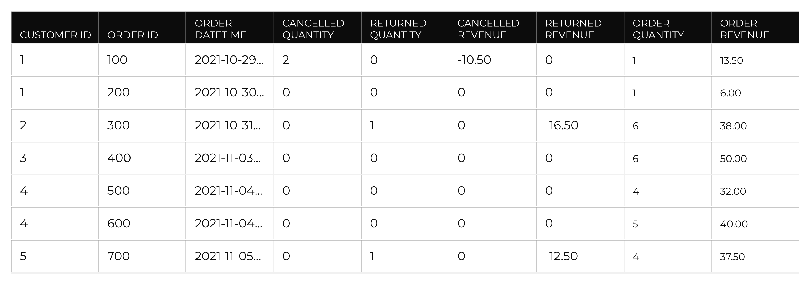

.. 
.. https://docs.amperity.com/datagrid/
.. 

.. meta::
    :description lang=en:
        Configure and manage the Unified Transactions table.

.. meta::
    :content class=swiftype name=body data-type=text:
        Configure and manage the Unified Transactions table.

.. meta::
    :content class=swiftype name=title data-type=string:
        Unified Transactions table

==================================================
Unified Transactions table
==================================================

.. include:: ../../shared/terms.rst
   :start-after: .. term-unified-transactions-table-start
   :end-before: .. term-unified-transactions-table-end

.. include:: ../../amperity_reference/source/data_tables.rst
   :start-after: .. data-tables-unified-transactions-example-start
   :end-before: .. data-tables-unified-transactions-example-end

.. table-unified-transactions-table-group-links-start

.. important:: Database tables for transactions must be configured in the following order:

   #. :doc:`Unified Itemized Transactions <table_unified_itemized_transactions>`
   #. Unified Transactions (this topic)
   #. :doc:`Transaction Attributes Extended <table_transaction_attributes_extended>`
   #. :doc:`Transaction Attributes <table_transaction_attributes>`

   The :doc:`Unified Product Catalog <table_unified_product_catalog>` table is optional and may be configured for use with building queries, database tables, and other non-audience workflows. Your brand's product catalog must be integrated into the **Unified Itemized Transactions** table before you can use product catalog attributes to build audiences, segments, and campaigns.

.. table-unified-transactions-table-group-links-end

.. _table-unified-transactions-add:

Add table
==================================================

.. table-unified-transactions-add-start

The **Unified Transactions** table is a required table for the customer 360 database when transactions and itemized transaction data is available to your tenant. The **Unified Transactions** table is added using a SQL template.

.. table-unified-transactions-add-end

**To add the Unified Transactions table**

.. table-unified-transactions-add-steps-start

#. Open your customer 360 database in edit mode, and then click **Add Table**.
#. Name the table "Unified_Transactions" (with underscores).
#. Set the build mode to **SQL**, and then select "Unified Transactions" from the **Apply template** drop-down.
#. Review the :ref:`list of optional attributes <table-unified-transactions-extend-attributes>` to determine if any of those should be enabled for your tenant.
#. Click **Next** to validate the SQL.
#. Select "Unified Transactions" from the **Table Semantics** drop-down, and then add a description for the table. (The description is available as a tooltip in other locations in Amperity.
#. Click **Save**.

.. table-unified-transactions-add-steps-end

.. _table-unified-transactions-sql-multiple-amperity-ids:

Multiple Amperity ID template
--------------------------------------------------

.. table-unified-transactions-sql-multiple-amperity-ids-start

If orders are associated with more than one Amperity ID, prioritize the IDs using the following template:

.. code-block:: sql

   WITH 
     amp_priority AS (
       SELECT DISTINCT
         ut.order_id
         ,ut.datasource
         ,FIRST_VALUE(uc.amperity_id) OVER (
           PARTITION BY ut.order_id, ut.datasource
           ORDER BY uc.update_dt DESC
         ) AS amperity_id
       FROM (SELECT amperity_id, datasource, update_dt FROM Unified_Coalesced) uc
       JOIN (SELECT amperity_id, datasource, order_id FROM Unified_Transactions) ut 
       ON uc.amperity_id = ut.amperity_id
     )

   SELECT t.* FROM table_name t
   JOIN amp_priority ap ON t.order_id=ap.order_id

.. table-unified-transactions-sql-multiple-amperity-ids-end

.. _table-unified-transactions-extend-attributes:

Optional attributes
==================================================

.. table-unified-transactions-extend-attributes-start

You can extend the set of attributes that are available from the **Unified Transactions** table to include any of the following:

* :ref:`table-unified-transactions-extend-attributes-fiscal-calendars`
* :ref:`table-unified-transactions-extend-attributes-net-order-revenue`
* :ref:`table-unified-transactions-extend-attributes-order-costs`
* :ref:`table-unified-transactions-extend-attributes-order-discount-amounts`

.. note:: These attributes are built into the SQL templates for the **Unified Transactions** table, but are commented out. Some sets of attributes require updates be made to both tables, while others may only require updates be made to one table. The steps for each set will link to a topic section that describes the updates that should be made to the **Transaction Attributes Extended** table.

.. table-unified-transactions-extend-attributes-end

.. _table-unified-transactions-extend-attributes-fiscal-calendars:

Fiscal calendars
--------------------------------------------------

.. include:: ../../shared/terms.rst
   :start-after: .. term-fiscal-calendar-start
   :end-before: .. term-fiscal-calendar-end

.. include:: ../../shared/terms.rst
   :start-after: .. term-454-calendar-start
   :end-before: .. term-454-calendar-end

**To add fiscal calendar attributes**

.. table-unified-transactions-extend-attributes-fiscal-calendars-steps-start

#. Open the **Unified Transactions** table in the SQL editor.
#. Find the **SELECT** statement at the end of the SQL template.
#. Uncomment the following section, which is located around line 45:

   .. code-block:: sql

      ,fc.fiscal_year AS fiscal_year
      ,fc.fiscal_quarter AS fiscal_quarter
      ,fc.fiscal_month AS fiscal_month
      ,fc.fiscal_week_number AS fiscal_week_number
      ,fc.fiscal_week_start AS fiscal_week_start
      ,fc.day_of_week AS fiscal_day_of_week
      ,fc.holiday_sale_name AS holiday_sale_name

#. Uncomment the left join at the end of the **SELECT** statement:

   .. code-block:: sql

      LEFT JOIN fiscal_calendar fc ON fc.calendar_date = DATE(order_datetime)

   where "fiscal_calendar" is the name of the fiscal calendar table in your tenant and "fc" is the alias for that table.

#. Validate the SQL, and then click **Next**, and then click **Save**.

.. table-unified-transactions-extend-attributes-fiscal-calendars-steps-end

.. _table-unified-transactions-extend-attributes-net-order-revenue:

Net order revenue
--------------------------------------------------

.. include:: ../../shared/terms.rst
   :start-after: .. term-net-order-revenue-start
   :end-before: .. term-net-order-revenue-end

**To add the net order revenue attribute**

.. table-unified-transactions-extend-attributes-net-order-revenue-steps-start

#. Open the **Unified Transactions** table in the SQL editor.
#. Find the **SELECT** statement at the end of the SQL template.
#. Uncomment the following section, which is located around line 45:

   .. code-block:: sql

      ,order_revenue
        + order_returned_revenue
        + order_canceled_revenue
        - order_discount_amount
      AS net_order_revenue

#. Validate the SQL, and then click **Next**, and then click **Save**.
#. Optional. :ref:`Extended attributes for net order revenue attributes may be added to the Transaction Attributes Extended table <table-transaction-attributes-extended-extend-attributes-net-order-revenue>`.

.. table-unified-transactions-extend-attributes-net-order-revenue-steps-end

.. _table-unified-transactions-extend-attributes-order-costs:

Order costs
--------------------------------------------------

.. include:: ../../shared/terms.rst
   :start-after: .. term-order-cost-start
   :end-before: .. term-order-cost-end

**To add the order cost attribute**

.. table-unified-transactions-extend-attributes-order-costs-steps-start

#. Ensure that cost information is available from the **Unified Itemized Transactions** table.

   .. important:: If cost information is not available, review the data sources and/or custom domain tables in which **txn-item** semantic tags were applied and apply the **txn-item/item-cost** semantic tag to the appropriate fields.

#. Open the **Unified Transactions** table in the SQL editor.
#. Find the section named "rollup_uit", which rolls-up individual attributes from the **Unified Itemized Transactions** custom domain table.
#. Uncomment the following section, which is located around line 30:

   .. code-block:: sql

      ,SUM(
        IF(
          COALESCE(uit.is_return,FALSE) = FALSE
          AND COALESCE(uit.is_cancellation,FALSE) = FALSE
          ,uit.item_cost
          ,0
        )
      ) AS order_cost

#. Validate the SQL, and then click **Next**.
#. Click **Save**.
#. Optional. :ref:`Extended attributes for calculated order cost attributes may be added to the Transaction Attributes Extended table <table-transaction-attributes-extended-extend-attributes-order-costs>`.

.. table-unified-transactions-extend-attributes-order-costs-steps-end

.. _table-unified-transactions-extend-attributes-order-discount-amounts:

Order discount amounts
--------------------------------------------------

.. table-unified-transactions-extend-attributes-order-discount-amounts-start

An order discount amount represents the total amount for all discounts that were applied to all items in same transaction. You can extend the **Unified Transactions** table to include order discount amounts by rolling up itemized discount amount values from the **Unified Itemized Transactions** table. This is done by uncommenting a line of SQL that exists in the SQL template for the **Unified Transactions** table.

.. table-unified-transactions-extend-attributes-order-discount-amounts-end

.. table-unified-transactions-extend-attributes-order-discount-amounts-list-start

#. Use the **MAX()** function when :ref:`discount amounts are consistent across records <table-unified-transactions-extend-attributes-order-discount-amounts-max>`.
#. Update to use the **SUM()** function when :ref:`discount amounts are prorated across records <table-unified-transactions-extend-attributes-order-discount-amounts-sum>`.

.. table-unified-transactions-extend-attributes-order-discount-amounts-list-end

.. _table-unified-transactions-extend-attributes-order-discount-amounts-max:

Discount amounts are consistent
++++++++++++++++++++++++++++++++++++++++++++++++++

.. table-unified-transactions-extend-attributes-order-discount-amounts-max-start

When itemized discount amount values are consistent across records:

#. Open the **Unified Transactions** table in the SQL editor.
#. Find the section named "rollup_uit", which rolls-up individual attributes from the **Unified Itemized Transactions** table.
#. Uncomment the following section, which is located around line 30:

   .. code-block:: sql

      ,MAX(
        IF(
          COALESCE(uit.is_return,FALSE) = FALSE
          AND COALESCE(uit.is_cancellation,FALSE) = FALSE
          ,uit.order_discount_amount
          ,0
        )
      ) AS order_discount_amount

#. Validate the SQL, and then click **Next**.
#. Click **Save**.

.. table-unified-transactions-extend-attributes-order-discount-amounts-max-end

.. _table-unified-transactions-extend-attributes-order-discount-amounts-sum:

Discount amounts are pro-rated
++++++++++++++++++++++++++++++++++++++++++++++++++

.. table-unified-transactions-extend-attributes-order-discount-amounts-sum-start

When itemized discount amount values are pro-rated across records:

#. Open the **Unified Transactions** table in the SQL editor.
#. Find the section named "rollup_uit", which rolls-up individual attributes from the **Unified Itemized Transactions** table.
#. Uncomment the following section, which is located around line 30, and then change the **MAX()** function to **SUM()**:

   .. code-block:: sql

      ,SUM(
        IF(
          COALESCE(uit.is_return,FALSE) = FALSE
          AND COALESCE(uit.is_cancellation,FALSE) = FALSE
          ,uit.order_discount_amount
          ,0
        )
      ) AS order_discount_amount

#. Validate the SQL, and then click **Next**.
#. Click **Save**.

.. table-unified-transactions-extend-attributes-order-discount-amounts-sum-end

.. _table-unified-transactions-reference:

Column reference
==================================================

.. include:: ../../amperity_reference/source/data_tables.rst
   :start-after: .. data-tables-unified-transactions-table-about-start
   :end-before: .. data-tables-unified-transactions-table-about-end

.. include:: ../../amperity_reference/source/data_tables.rst
   :start-after: .. data-tables-unified-transactions-table-start
   :end-before: .. data-tables-unified-transactions-table-end
