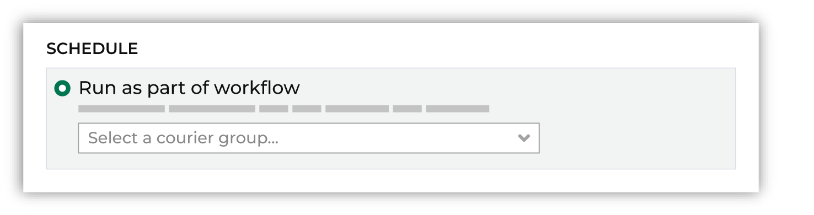

.. https://docs.amperity.com/datagrid/

.. meta::
    :description lang=en:
        Automate end-to-end workflows within Amperity.

.. meta::
    :content class=swiftype name=body data-type=text:
        Automate end-to-end workflows within Amperity.

.. meta::
    :content class=swiftype name=title data-type=string:
        Automate workflows

==================================================
Automate workflows
==================================================

.. include:: ../../shared/terms.rst
   :start-after: .. term-workflow-start
   :end-before: .. term-workflow-end

.. workflows-about-start

For example, many workflows are end-to-end process that:

#. Use a courier to pull data to Amperity.
#. Standardize data using semantic tags and feeds.
#. Add data to domain tables.
#. Build databases.
#. Run queries and segments to return results and audiences for use with downstream workflows.
#. Send results to destinations using orchestrations and campaigns.

An automated workflow is configured to run these steps automatically, and then send workflow alerts when warnings and errors within a workflow are detected.

.. workflows-about-end

.. _workflows-couriers:

Couriers
==================================================

.. include:: ../../shared/terms.rst
   :start-after: .. term-courier-group-start
   :end-before: .. term-courier-group-end

.. note::

   .. include:: ../../amperity_reference/source/courier_groups.rst
      :start-after: .. courier-groups-context-start
      :end-before: .. courier-groups-context-end

.. _workflows-courier-group-duration-thresholds:

Duration thresholds
--------------------------------------------------

.. include:: ../../amperity_reference/source/courier_groups.rst
   :start-after: .. courier-groups-howto-notify-slow-start
   :end-before: .. courier-groups-howto-notify-slow-end

**To configure a workflow alert for a courier group**

.. include:: ../../amperity_reference/source/courier_groups.rst
   :start-after: .. courier-groups-howto-notify-slow-steps-start
   :end-before: .. courier-groups-howto-notify-slow-steps-end

.. _workflows-courier-group-missing-files:

Missing files
--------------------------------------------------

.. workflows-courier-group-missing-files-start

A courier group can be configured to send email and Slack alerts when files are missing, and then:

#. :ref:`Continue processing even if files are missing <workflows-courier-group-missing-files-notify-continue>`
#. :ref:`Stop processing <workflows-courier-group-missing-files-notify-stop>`

.. workflows-courier-group-missing-files-end

.. _workflows-courier-group-missing-files-notify-continue:

Notify and continue
++++++++++++++++++++++++++++++++++++++++++++++++++

.. include:: ../../amperity_reference/source/courier_groups.rst
   :start-after: .. courier-groups-howto-add-courier-alert-start
   :end-before: .. courier-groups-howto-add-courier-alert-end

.. include:: ../../amperity_reference/source/courier_groups.rst
   :start-after: .. courier-groups-howto-add-courier-alert-tip-start
   :end-before: .. courier-groups-howto-add-courier-alert-tip-end

**To send a workflow notification, and then continue the workflow**

.. include:: ../../amperity_reference/source/courier_groups.rst
   :start-after: .. courier-groups-howto-add-courier-alert-steps-start
   :end-before: .. courier-groups-howto-add-courier-alert-steps-end

.. _workflows-courier-group-missing-files-notify-stop:

Notify and stop
++++++++++++++++++++++++++++++++++++++++++++++++++

.. include:: ../../amperity_reference/source/courier_groups.rst
   :start-after: .. courier-groups-howto-add-courier-stop-start
   :end-before: .. courier-groups-howto-add-courier-stop-end

**To send a workflow notification, and then stop the workflow**

.. include:: ../../amperity_reference/source/courier_groups.rst
   :start-after: .. courier-groups-howto-add-courier-stop-steps-start
   :end-before: .. courier-groups-howto-add-courier-stop-steps-end

.. _workflows-courier-group-missing-files-wait:

Wait for missing files
++++++++++++++++++++++++++++++++++++++++++++++++++

.. include:: ../../amperity_reference/source/courier_groups.rst
   :start-after: .. courier-groups-wait-for-missing-files-start
   :end-before: .. courier-groups-wait-for-missing-files-end

.. include:: ../../amperity_reference/source/courier_groups.rst
   :start-after: .. courier-groups-source-courier-alerts-start
   :end-before: .. courier-groups-source-courier-alerts-end

.. _workflows-bridges:

Bridges
==================================================

.. workflows-bridges-start

A bridge may be configured to run as part of a scheduled workflow. Use the **Bridges** tab in the **Scheduled workflows** dialog to add one or more bridges.

.. workflows-bridges-end

.. _workflows-activations:

Activations
==================================================

Activations are orchestrations, campaigns, and Profile API indexes that are configured to be run as part of a scheduled workflow.

.. _workflows-orchestrations:

Orchestrations
--------------------------------------------------

.. TODO: Set this to be an include.

.. orchestrations-run-automatic-start

An orchestration can be configured to run after a courier when the run mode is set to **Automatic** and an active courier group is selected from the drop-down menu.

.. image:: ../../images/mockup-activation-scheduled-orchestration.png
   :width: 420 px
   :alt: Add an orchestration to a scheduled workgroup.
   :align: center
   :class: no-scaled-link

.. orchestrations-run-automatic-start

.. _workflows-profile-api:

Profile API indexes
--------------------------------------------------

.. TODO: Set this to be an include.

.. profile-api-enable-run-as-workflow-start

A Profile API index can be configured to be refreshed as part of a scheduled workflow when the schedule is set to **Run after courier group** and an active courier group is selected from the drop-down menu.

.. image:: ../../images/mockup-activation-scheduled-profile-api.png
   :width: 420 px
   :alt: Refresh a Profile API index as part of a scheduled workgroup.
   :align: center
   :class: no-scaled-link

.. profile-api-enable-run-as-workflow-end

.. _workflows-campaigns:

Recurring campaigns
--------------------------------------------------

.. TODO: Set this to be an include.

.. campaigns-run-as-part-of-workflow-start

A recurring campaign can be configured to run as part of a scheduled workflow when the schedule is set to **Run as part of workflow** and an active courier group is selected from the drop-down menu.

.. campaigns-run-as-part-of-workflow-end
