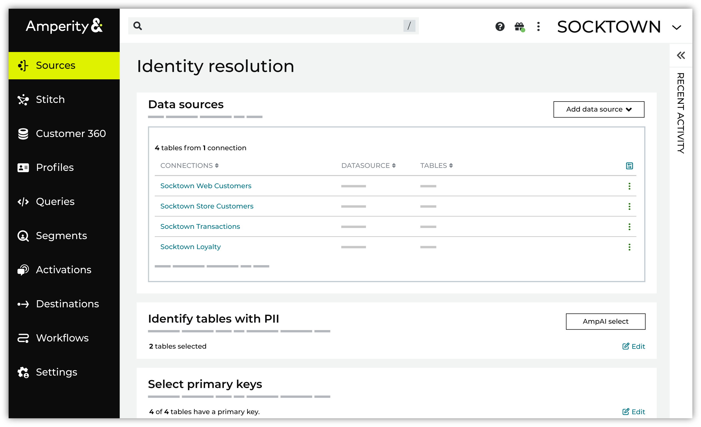

.. https://docs.amperity.com/guides/

.. meta::
    :description lang=en:
        Resolve customer identities and generate a customer identifier that remains stable even when new and conflicting data is collected across online, offline, and anonymous sources.

.. meta::
    :content class=swiftype name=body data-type=text:
        Resolve customer identities and generate a customer identifier that remains stable even when new and conflicting data is collected across online, offline, and anonymous sources.

.. meta::
    :content class=swiftype name=title data-type=string:
        Identity resolution

==================================================
Identity resolution
==================================================

.. guides-identity-resolution-start

Amperity accurately resolves customer identities and generates a customer identifier that remains stable even when new and conflicting data is collected across online, offline, and anonymous sources. Use high-confidence matching for operational use cases or broader probabilistic matching for marketing campaigns.

.. guides-identity-resolution-end

.. guides-identity-resolution-grid-start

.. grid:: 1 1 2 2
   :gutter: 2
   :padding: 0
   :class-row: surface

   .. grid-item-card:: Add data sources
      :link-type: doc
      :link: identity_resolution_sources

   .. grid-item-card:: Identify tables with PII
      :link-type: doc
      :link: identity_resolution_tables_with_pii

   .. grid-item-card:: Select primary keys
      :link-type: doc
      :link: identity_resolution_primary_keys

   .. grid-item-card:: Validate profile semantics
      :link-type: doc
      :link: identity_resolution_semantics

   .. grid-item-card:: Exclude data
      :link-type: doc
      :link: identity_resolution_exclude_data

   .. grid-item-card:: Data sources
      :link-type: doc
      :link: identity_resolution_data_sources

.. guides-identity-resolution-grid-end

.. toctree::
   :caption: Identity resolution
   :hidden:

   Data sources <identity_resolution_data_sources>
   Add data sources <identity_resolution_sources>
   Identify tables with PII <identity_resolution_tables_with_pii>
   Select primary keys <identity_resolution_primary_keys>
   Validate profile semantics <identity_resolution_semantics>
   Exclude data <identity_resolution_exclude_data>
