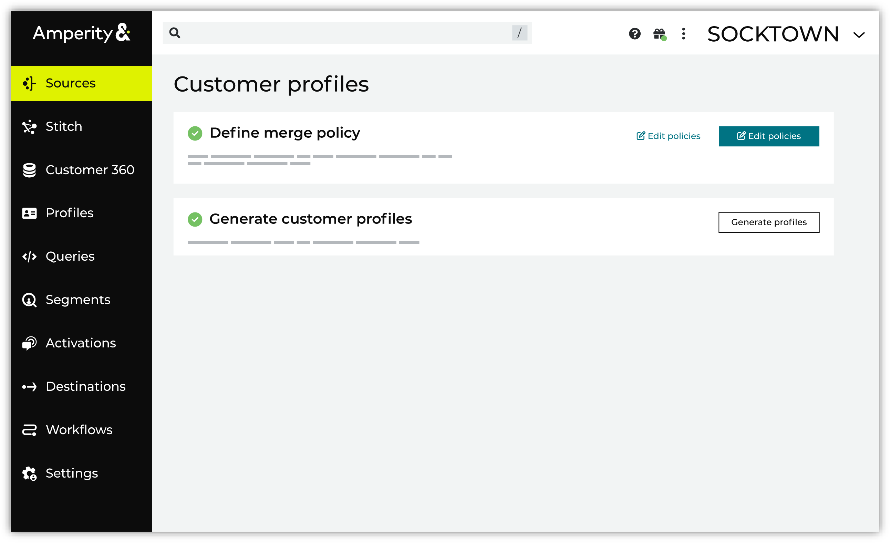

.. https://docs.amperity.com/guides/

.. meta::
    :description lang=en:
        Unified customer profiles help your brand better understand your customers.

.. meta::
    :content class=swiftype name=body data-type=text:
        Unified customer profiles help your brand better understand your customers.

.. meta::
    :content class=swiftype name=title data-type=string:
        Customer profiles

==================================================
Customer profiles
==================================================

.. include:: ../../amperity_reference/source/page_customer_profiles.rst
   :start-after: .. customer-profiles-page-start
   :end-before: .. customer-profiles-page-end

.. guides-customer-profiles-grid-start

.. grid:: 1 1 2 2
   :gutter: 2
   :padding: 0
   :class-row: surface

   .. grid-item-card:: Define merge policy
      :link-type: doc
      :link: profiles_merge_policy

   .. grid-item-card:: Generate customer profiles
      :link-type: doc
      :link: profiles_generate

   .. grid-item-card:: Standard output
      :link-type: doc
      :link: profiles_standard_output

.. guides-customer-profiles-grid-end

.. toctree::
   :caption: Customer profiles
   :maxdepth: 2
   :hidden:

   Define merge policy <profiles_merge_policy>
   Generate customer profiles <profiles_generate>
   Standard output <profiles_standard_output>
