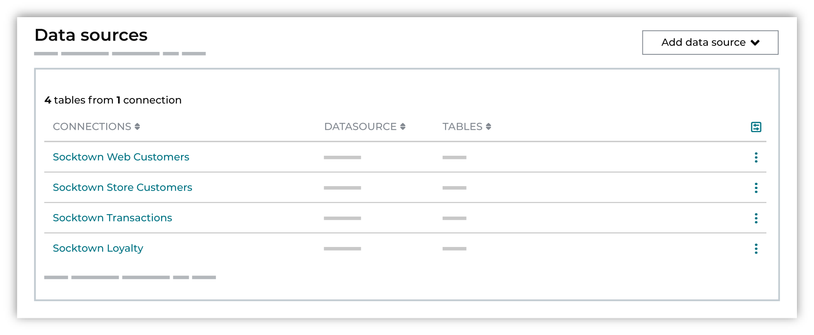

.. https://docs.amperity.com/guides/

.. meta::
    :description lang=en:
        Add connections between Amperity and the locations from which your brand will make data available to Amperity. For example, your Databricks lakehouse, a Snowflake data warehouse, an Amazon S3 bucket, or a standalone SFTP site.

.. meta::
    :content class=swiftype name=body data-type=text:
        Add connections between Amperity and the locations from which your brand will make data available to Amperity. For example, your Databricks lakehouse, a Snowflake data warehouse, an Amazon S3 bucket, or a standalone SFTP site.

.. meta::
    :content class=swiftype name=title data-type=string:
        Add data sources

==================================================
Add data sources
==================================================

.. identity-resolution-data-start

Add connections between Amperity and the locations from which your brand will make data available to Amperity. For example, your Databricks lakehouse, a Snowflake data warehouse, an Amazon S3 bucket, or a standalone SFTP site.

To add data sources open the **Identity resolution** page in **Quick start**, from the **Add data source** dropdown, select Amazon S3, Azure Blob Storage, Databricks, Google BigQuery, SFTP, or Snowflake.

.. identity-resolution-data-end

.. identity-resolution-data-grid-start

.. grid:: 1 1 2 2
   :gutter: 2
   :padding: 0
   :class-row: surface

   .. grid-item-card:: Amazon S3
      :link-type: doc
      :link: identity_resolution_data_from_amazon_s3

.. identity-resolution-data-grid-end

