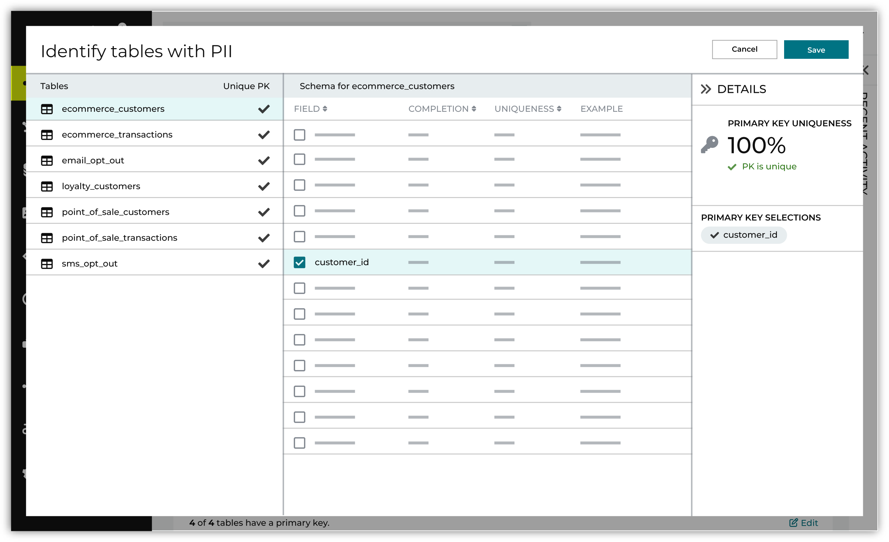

.. https://docs.amperity.com/guides/

.. meta::
    :description lang=en:
        Stable and unique primary keys are crucial for unified customer profiles and for linking rows in source tables to rows in unified customer profiles.

.. meta::
    :content class=swiftype name=body data-type=text:
        Stable and unique primary keys are crucial for unified customer profiles and for linking rows in source tables to rows in unified customer profiles.

.. meta::
    :content class=swiftype name=title data-type=string:
        Select primary keys

==================================================
Select primary keys
==================================================

.. identity-resolution-03-primary-keys-start

Stable and unique primary keys are crucial for unified customer profiles and for linking rows in source tables to rows in unified customer profiles. Stitch depends on well-defined primary keys being defined for each source table in order to keep track of which source rows are linked to each unified customer profile after ID resolution.

When a source row changes, such as when a user adds a secondary phone number or changes their account preferences, and as long as the customer profile remains stable, Stitch will assign the same Amperity ID to that customer profile instead of creating a new Amperity ID.

.. identity-resolution-03-primary-keys-end

.. identity-resolution-03-primary-keys-good-keys-start

.. admonition:: What makes a good primary key?

   Uniqueness and stability are the most important traits of a good primary key. For example:

   * **first_name** is a field with first names for all customers in the table. This field is an example of a bad primary key because it is unlikely to be *unique* among all rows in a table.
   * **updated_at** is a field that records when the data in the row was last updated. This field is another example of a bad primary key because even though it is unique, its value for a given row can *change*, making it unstable.
   * **customer_id** is a field that uniquely identifies customers within your brand's point-of-sale data. This field is an example of a good primary key field because it is likely to identify a single customer and is a reliable value over time.

.. identity-resolution-03-primary-keys-good-keys-end

.. identity-resolution-03-primary-keys-start

To select primary keys open the **Identity resolution** page in **Quick start**. On the **Identity tables** card, do one of the following:

#. Click **AmpAI select** to have the **AmpAI Assistant** determine which tables contain the best data for identity resolution, which fields in each data source are the optimal primary key, and which customer profile semantic tags to apply to fields in each data source.
#. Click **Manually select** on the **Primary keys** card to configure primary keys without using the **AmpAI Assistant**.

Click **Edit** on the **Primary keys** card to review primary keys for all tables.

.. identity-resolution-03-primary-keys-end

.. include:: ../../amperity_reference/source/semantics.rst
   :start-after: .. semantics-key-primary-tip-start
   :end-before: .. semantics-key-primary-tip-end
