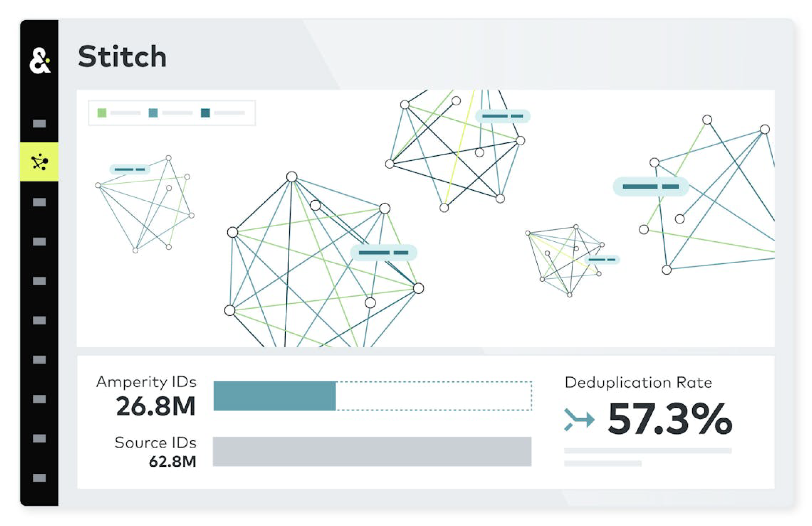

.. https://docs.amperity.com/tutorials/realtime

.. meta::
    :description lang=en:
        Idenitify tables with personally identifiable information (PII). Have AmpAI make the selections for you or make the selections yourself.

.. meta::
    :content class=swiftype name=body data-type=text:
        Idenitify tables with personally identifiable information (PII). Have AmpAI make the selections for you or make the selections yourself.

.. meta::
    :content class=swiftype name=title data-type=string:
        Identify tables with PII

==================================================
Identify tables with PII
==================================================

.. include:: ../../shared/terms.rst
   :start-after: .. term-stitch-start
   :end-before: .. term-stitch-end

.. identity-resolution-02-tables-with-pii-start

To identify tables with personally identifiable information (PII) open the **Identity resolution** page in **Quick start**. On the **Identity tables** card, do one of the following:

#. Click **AmpAI select** to have the **AmpAI Assistant** determine which tables contain the best data for identity resolution, which fields in each data source are the optimal primary key, and which customer profile semantic tags to apply to fields in each data source.
#. Click **Manually select** to make the table selections yourself.

   .. image:: ../../images/mockup-guided-idres-tables-with-pii.png
      :width: 500 px
      :alt: Identify tables with PII.
      :align: left
      :class: no-scaled-link

Click **Edit** on the **Identity tables** card to review tables that are already selected.

.. identity-resolution-02-tables-with-pii-end

.. identity-resolution-02-tables-with-pii-learn-more-start

.. admonition:: Learn more about Stitch

   Learn more about `how Stitch evaluates all of your brand's data <../reference/stitch.html>`__ to discover the hidden connections in your customer records that correctly identify all of your unique customers.

   Open **Learning Lab** to learn more about `how Stitch Works <https://learn.amperity.com/how-stitch-works-1>`__ |ext_link|. Registration is required.

   Read `Entity Matching in the Wild: a Consistent and Versatile
   Framework to Unify Data in Industrial Applications <https://docs.amperity.com/downloads/pdf/fusion-sigmod-2020.pdf>`__ for a detailed explanation of how Amperity maintains a consistent, reliable, and stable customer ID.

   Stitch is built from a `series of patented innovations <https://amperity.com/patents>`__ to ensure that identity resolution against your customer data is accurate and the output of the Stitch process represents a unified view of your customers.

.. identity-resolution-02-tables-with-pii-learn-more-end
