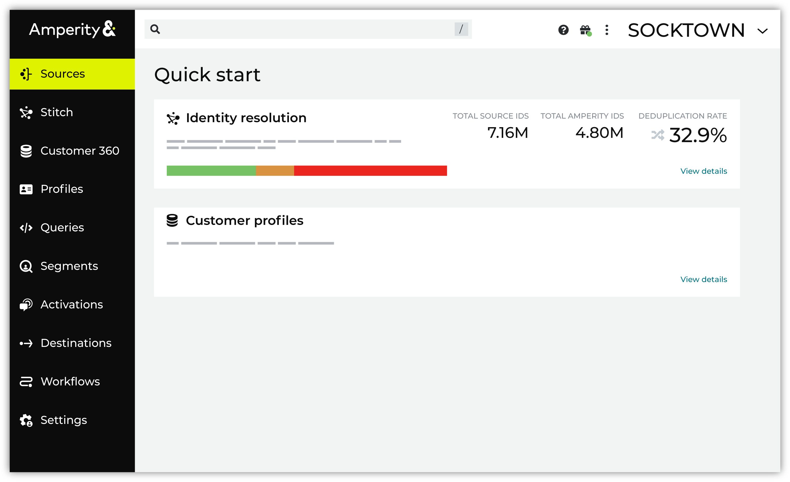

.. https://docs.amperity.com/guides/

.. meta::
    :description lang=en:
        Use AmpAI guided setup to configure customer profiles for your tenant.

.. meta::
    :content class=swiftype name=body data-type=text:
        Use AmpAI guided setup to configure customer profiles for your tenant.

.. meta::
    :content class=swiftype name=title data-type=string:
        Guided setup

==================================================
Guided setup
==================================================

.. setup-about-start

Guided setup is a series of guided workflows for configuring identity resolution and customer profiles. For many steps you can use the AmpAI Assistant to do the initial work, after which you can review the results and make any necessary changes. You can revisit each step in any guided workflow at any time.

.. setup-about-end

.. setup-about-grid-start

.. grid:: 1 1 2 2
   :gutter: 2
   :padding: 0
   :class-row: surface

   .. grid-item-card:: Identity resolution
      :link-type: doc
      :link: grid_identity_resolution

   .. grid-item-card:: Customer profiles
      :link-type: doc
      :link: grid_profiles

.. setup-about-grid-end

.. toctree::
   :caption: Guided setup
   :maxdepth: 2
   :hidden:

   Identity resolution <grid_identity_resolution>
   Customer profiles <grid_profiles>
